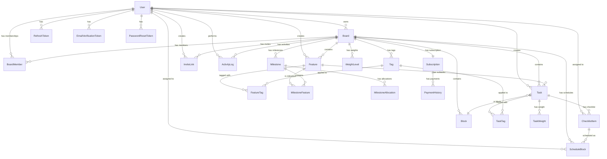

# Database Schema

## ER Diagram

---

## Tables

### User

| Column | Type | Nullable | Default | Description |
|--------|------|:--------:|---------|-------------|
| id | VARCHAR(36) | NO | UUID | PK |
| email | VARCHAR(255) | NO | - | 이메일 (UNIQUE) |
| password_hash | VARCHAR(255) | YES | - | 비밀번호 해시 (소셜 로그인 시 null) |
| name | VARCHAR(100) | NO | - | 이름 |
| profile_image | VARCHAR(500) | YES | - | 프로필 이미지 URL |
| auth_provider | VARCHAR(20) | NO | 'email' | 인증 제공자 (email, GOOGLE) |
| auth_provider_id | VARCHAR(255) | YES | - | OAuth 제공자 ID |
| last_login_at | TIMESTAMP | YES | - | 마지막 로그인 |
| email_verified | BOOLEAN | NO | false | 이메일 인증 여부 |
| email_verified_at | TIMESTAMP | YES | - | 이메일 인증일 |
| theme | VARCHAR(10) | NO | 'dark' | 테마 (dark, light) |
| system_role | VARCHAR(20) | NO | 'TESTER' | 시스템 역할 (USER, TESTER, ADMIN) |
| created_at | TIMESTAMP | NO | now() | 생성일 |
| updated_at | TIMESTAMP | NO | now() | 수정일 |

---

### Board

| Column | Type | Nullable | Default | Description |
|--------|------|:--------:|---------|-------------|
| id | VARCHAR(36) | NO | UUID | PK |
| name | VARCHAR(100) | NO | - | 보드 이름 |
| description | TEXT | YES | - | 설명 |
| owner_id | VARCHAR(36) | NO | - | FK → User (소유자) |
| work_hours_per_day | INT | NO | 8 | 일일 근무시간 |
| work_start_time | TIME | NO | 09:00 | 근무 시작 시간 |
| schedule_display_mode | VARCHAR(10) | NO | 'TIME' | 스케줄 표시 모드 (TIME, BLOCK) |
| selected_milestone_id | VARCHAR(36) | YES | - | 현재 선택된 마일스톤 |
| tier | VARCHAR(20) | NO | 'TRIAL' | 보드 티어 (TRIAL, STANDARD, PREMIUM) |
| trial_ends_at | TIMESTAMP | YES | +7days | Trial 종료일 |
| created_at | TIMESTAMP | NO | now() | 생성일 |
| updated_at | TIMESTAMP | NO | now() | 수정일 |

---

### BoardMember

| Column | Type | Nullable | Default | Description |
|--------|------|:--------:|---------|-------------|
| id | VARCHAR(36) | NO | UUID | PK |
| board_id | VARCHAR(36) | NO | - | FK → Board |
| user_id | VARCHAR(36) | NO | - | FK → User |
| role | VARCHAR(20) | NO | - | 역할 (OWNER, ADMIN, MEMBER, VIEWER) |
| joined_at | TIMESTAMP | NO | now() | 가입일 |
| invited_by_id | VARCHAR(36) | YES | - | FK → User (초대자) |

**UNIQUE**: (board_id, user_id)

---

### Block

| Column | Type | Nullable | Default | Description |
|--------|------|:--------:|---------|-------------|
| id | VARCHAR(36) | NO | UUID | PK |
| board_id | VARCHAR(36) | NO | - | FK → Board |
| name | VARCHAR(50) | NO | - | 블록 이름 |
| type | VARCHAR(20) | NO | - | 블록 타입 (FIXED, CUSTOM) |
| fixed_type | VARCHAR(20) | YES | - | 고정 타입 (FEATURE, TASK, DONE) |
| color | VARCHAR(20) | YES | - | 블록 색상 |
| position | INT | NO | - | 정렬 순서 |
| created_at | TIMESTAMP | NO | now() | 생성일 |
| updated_at | TIMESTAMP | NO | now() | 수정일 |

---

### Feature

| Column | Type | Nullable | Default | Description |
|--------|------|:--------:|---------|-------------|
| id | VARCHAR(36) | NO | UUID | PK |
| board_id | VARCHAR(36) | NO | - | FK → Board |
| title | VARCHAR(200) | NO | - | 제목 |
| description | TEXT | YES | - | 설명 |
| color | VARCHAR(20) | YES | - | 색상 |
| assignee_id | VARCHAR(36) | YES | - | FK → User (담당자) |
| priority | VARCHAR(10) | YES | - | 우선순위 (HIGH, MEDIUM, LOW) |
| due_date | DATE | YES | - | 마감일 |
| status | VARCHAR(20) | NO | 'ACTIVE' | 상태 (ACTIVE, COMPLETED) |
| total_tasks | INT | NO | 0 | 전체 Task 수 |
| completed_tasks | INT | NO | 0 | 완료 Task 수 |
| position | INT | NO | - | 정렬 순서 |
| created_by_id | VARCHAR(36) | NO | - | FK → User (생성자) |
| completed_at | TIMESTAMP | YES | - | 완료일 |
| created_at | TIMESTAMP | NO | now() | 생성일 |
| updated_at | TIMESTAMP | NO | now() | 수정일 |

---

### Task

| Column | Type | Nullable | Default | Description |
|--------|------|:--------:|---------|-------------|
| id | VARCHAR(36) | NO | UUID | PK |
| feature_id | VARCHAR(36) | NO | - | FK → Feature |
| board_id | VARCHAR(36) | NO | - | FK → Board |
| block_id | VARCHAR(36) | NO | - | FK → Block (현재 위치) |
| title | VARCHAR(200) | NO | - | 제목 |
| description | TEXT | YES | - | 설명 |
| start_date | DATE | YES | - | 시작일 |
| due_date | DATE | YES | - | 마감일 |
| estimated_minutes | INT | YES | - | 예상 소요 시간(분) |
| is_completed | BOOLEAN | NO | false | 완료 여부 |
| position | INT | NO | - | 정렬 순서 |
| created_by_id | VARCHAR(36) | NO | - | FK → User (생성자) |
| completed_at | TIMESTAMP | YES | - | 완료일 |
| created_at | TIMESTAMP | NO | now() | 생성일 |
| updated_at | TIMESTAMP | NO | now() | 수정일 |

---

### Tag

| Column | Type | Nullable | Default | Description |
|--------|------|:--------:|---------|-------------|
| id | VARCHAR(36) | NO | UUID | PK |
| board_id | VARCHAR(36) | NO | - | FK → Board |
| name | VARCHAR(50) | NO | - | 태그 이름 |
| color | VARCHAR(20) | YES | - | 태그 색상 |
| created_at | TIMESTAMP | NO | now() | 생성일 |

**UNIQUE**: (board_id, name)

---

### FeatureTag

| Column | Type | Nullable | Default | Description |
|--------|------|:--------:|---------|-------------|
| feature_id | VARCHAR(36) | NO | - | FK → Feature (PK) |
| tag_id | VARCHAR(36) | NO | - | FK → Tag (PK) |

---

### TaskTag

| Column | Type | Nullable | Default | Description |
|--------|------|:--------:|---------|-------------|
| task_id | VARCHAR(36) | NO | - | FK → Task (PK) |
| tag_id | VARCHAR(36) | NO | - | FK → Tag (PK) |

---

### ChecklistItem

| Column | Type | Nullable | Default | Description |
|--------|------|:--------:|---------|-------------|
| id | VARCHAR(36) | NO | UUID | PK |
| task_id | VARCHAR(36) | NO | - | FK → Task |
| title | VARCHAR(200) | NO | - | 항목 제목 |
| is_completed | BOOLEAN | NO | false | 완료 여부 |
| assignee_id | VARCHAR(36) | YES | - | FK → User (담당자) |
| start_date | DATE | YES | - | 시작일 |
| due_date | DATE | YES | - | 마감일 |
| done_date | DATE | YES | - | 완료일 |
| position | INT | NO | - | 정렬 순서 |
| created_at | TIMESTAMP | NO | now() | 생성일 |
| completed_at | TIMESTAMP | YES | - | 완료 타임스탬프 |

---

### Milestone

| Column | Type | Nullable | Default | Description |
|--------|------|:--------:|---------|-------------|
| id | VARCHAR(36) | NO | UUID | PK |
| board_id | VARCHAR(36) | NO | - | FK → Board |
| title | VARCHAR(100) | NO | - | 마일스톤 제목 |
| description | TEXT | YES | - | 설명 |
| start_date | DATE | NO | - | 시작일 |
| end_date | DATE | NO | - | 종료일 |
| created_by_id | VARCHAR(36) | NO | - | FK → User (생성자) |
| default_hours_per_day | DOUBLE | NO | 6.0 | 기본 일일 작업시간 |
| created_at | TIMESTAMP | NO | now() | 생성일 |
| updated_at | TIMESTAMP | NO | now() | 수정일 |

---

### MilestoneFeature

| Column | Type | Nullable | Default | Description |
|--------|------|:--------:|---------|-------------|
| milestone_id | VARCHAR(36) | NO | - | FK → Milestone (PK) |
| feature_id | VARCHAR(36) | NO | - | FK → Feature (PK) |

---

### MilestoneAllocation

| Column | Type | Nullable | Default | Description |
|--------|------|:--------:|---------|-------------|
| id | VARCHAR(36) | NO | UUID | PK |
| milestone_id | VARCHAR(36) | NO | - | FK → Milestone |
| member_id | VARCHAR(36) | NO | - | FK → BoardMember |
| working_days | INT | YES | - | 근무일 수 |
| total_allocated_hours | DOUBLE | YES | - | 총 할당 시간 |
| created_at | TIMESTAMP | NO | now() | 생성일 |
| updated_at | TIMESTAMP | NO | now() | 수정일 |

---

### ScheduleBlock

| Column | Type | Nullable | Default | Description |
|--------|------|:--------:|---------|-------------|
| id | VARCHAR(36) | NO | UUID | PK |
| board_id | VARCHAR(36) | NO | - | FK → Board |
| checklist_item_id | VARCHAR(36) | YES | - | FK → ChecklistItem |
| assignee_id | VARCHAR(36) | NO | - | FK → User (담당자) |
| scheduled_date | DATE | NO | - | 예약 날짜 |
| start_time | TIME | NO | - | 시작 시간 |
| end_time | TIME | NO | - | 종료 시간 |
| created_at | TIMESTAMP | NO | now() | 생성일 |
| updated_at | TIMESTAMP | NO | now() | 수정일 |

---

### InviteLink

| Column | Type | Nullable | Default | Description |
|--------|------|:--------:|---------|-------------|
| id | VARCHAR(36) | NO | UUID | PK |
| board_id | VARCHAR(36) | NO | - | FK → Board |
| code | VARCHAR(12) | NO | auto | 초대 코드 (UNIQUE) |
| role | VARCHAR(20) | NO | 'MEMBER' | 초대 역할 |
| max_uses | INT | YES | - | 최대 사용 횟수 (null=무제한) |
| used_count | INT | NO | 0 | 사용 횟수 |
| expires_at | TIMESTAMP | YES | - | 만료일 |
| is_active | BOOLEAN | NO | true | 활성 여부 |
| created_by_id | VARCHAR(36) | NO | - | FK → User (생성자) |
| created_at | TIMESTAMP | NO | now() | 생성일 |

---

### Subscription

| Column | Type | Nullable | Default | Description |
|--------|------|:--------:|---------|-------------|
| id | VARCHAR(36) | NO | UUID | PK |
| board_id | VARCHAR(36) | NO | - | FK → Board (UNIQUE, 1:1) |
| status | VARCHAR(20) | NO | 'TRIAL' | 구독 상태 (TRIAL, ACTIVE, GRACE, SUSPENDED, CANCELED) |
| plan | VARCHAR(20) | YES | - | 플랜 이름 (PREMIUM) |
| billing_cycle | VARCHAR(20) | YES | - | 결제 주기 (MONTHLY, YEARLY) |
| price | INT | YES | - | 가격 (센트 단위) |
| price_per_seat | INT | YES | - | 시트당 가격 (MONTHLY: 500, YEARLY: 5000) |
| seat_count | INT | YES | - | 유료 시트 수 |
| trial_ends_at | TIMESTAMP | YES | - | Trial 종료일 |
| grace_ends_at | TIMESTAMP | YES | - | Grace 종료일 |
| current_period_start | TIMESTAMP | YES | - | 현재 결제 기간 시작 |
| current_period_end | TIMESTAMP | YES | - | 현재 결제 기간 종료 |
| billable_member_count | INT | YES | - | 과금 대상 멤버 수 |
| payment_method_id | VARCHAR(255) | YES | - | 결제 수단 ID |
| next_payment_at | TIMESTAMP | YES | - | 다음 결제일 |
| created_at | TIMESTAMP | NO | now() | 생성일 |

---

### ActivityLog

| Column | Type | Nullable | Default | Description |
|--------|------|:--------:|---------|-------------|
| id | VARCHAR(36) | NO | UUID | PK |
| board_id | VARCHAR(36) | NO | - | FK → Board |
| user_id | VARCHAR(36) | NO | - | FK → User |
| action | VARCHAR(50) | NO | - | 액션 타입 (CREATE, UPDATE, DELETE, MOVE, COMPLETE 등) |
| target_type | VARCHAR(30) | NO | - | 대상 타입 (BOARD, FEATURE, TASK, BLOCK 등) |
| target_id | VARCHAR(36) | NO | - | 대상 엔티티 ID |
| metadata | JSON | YES | - | 추가 데이터 (JSON) |
| created_at | TIMESTAMP | NO | now() | 생성일 |

---

### WeightLevel

| Column | Type | Nullable | Default | Description |
|--------|------|:--------:|---------|-------------|
| id | VARCHAR(36) | NO | UUID | PK |
| board_id | VARCHAR(36) | NO | - | FK → Board |
| name | VARCHAR(50) | NO | - | 가중치 이름 |
| weight | DOUBLE | NO | - | 가중치 값 |
| color | VARCHAR(20) | YES | - | 색상 |
| position | INT | NO | - | 정렬 순서 |
| is_default | BOOLEAN | NO | false | 기본 가중치 여부 |

---

### TaskWeight

| Column | Type | Nullable | Default | Description |
|--------|------|:--------:|---------|-------------|
| task_id | VARCHAR(36) | NO | - | FK → Task (PK) |
| weight_level_id | VARCHAR(36) | NO | - | FK → WeightLevel (PK) |

---

### RefreshToken

| Column | Type | Nullable | Default | Description |
|--------|------|:--------:|---------|-------------|
| id | VARCHAR(36) | NO | UUID | PK |
| user_id | VARCHAR(36) | NO | - | FK → User |
| token | VARCHAR(500) | NO | - | 리프레시 토큰 (UNIQUE) |
| expires_at | TIMESTAMP | NO | - | 만료일 |
| created_at | TIMESTAMP | NO | now() | 생성일 |

---

### EmailVerificationToken

| Column | Type | Nullable | Default | Description |
|--------|------|:--------:|---------|-------------|
| id | VARCHAR(36) | NO | UUID | PK |
| user_id | VARCHAR(36) | NO | - | FK → User |
| token | VARCHAR(255) | NO | - | 인증 토큰 (UNIQUE) |
| expires_at | TIMESTAMP | NO | - | 만료일 |
| created_at | TIMESTAMP | NO | now() | 생성일 |

---

### PasswordResetToken

| Column | Type | Nullable | Default | Description |
|--------|------|:--------:|---------|-------------|
| id | VARCHAR(36) | NO | UUID | PK |
| user_id | VARCHAR(36) | NO | - | FK → User |
| token | VARCHAR(255) | NO | - | 재설정 토큰 (UNIQUE) |
| expires_at | TIMESTAMP | NO | - | 만료일 |
| used | BOOLEAN | NO | false | 사용 여부 |
| created_at | TIMESTAMP | NO | now() | 생성일 |

---

### PaymentHistory

| Column | Type | Nullable | Default | Description |
|--------|------|:--------:|---------|-------------|
| id | VARCHAR(36) | NO | UUID | PK |
| subscription_id | VARCHAR(36) | NO | - | FK → Subscription |
| amount | INT | NO | - | 결제 금액 |
| status | VARCHAR(20) | NO | - | 결제 상태 |
| created_at | TIMESTAMP | NO | now() | 생성일 |

---

### DailyChecklist

| Column | Type | Nullable | Default | Description |
|--------|------|:--------:|---------|-------------|
| id | VARCHAR(36) | NO | UUID | PK |
| board_id | VARCHAR(36) | NO | - | FK → Board |
| (상세 필드는 코드 분석 기반) | - | - | - | 데일리 체크리스트 항목 |

---

## 주요 관계 요약

| 관계 | 타입 | 설명 |
|------|------|------|
| User → Board | 1:N | 사용자가 여러 보드 소유 |
| Board → BoardMember | 1:N | 보드에 여러 멤버 |
| Board → Block | 1:N | 보드에 여러 블록 |
| Board → Feature | 1:N | 보드에 여러 Feature |
| Feature → Task | 1:N | Feature에 여러 Task |
| Task → Block | N:1 | Task는 하나의 Block에 위치 |
| Task → ChecklistItem | 1:N | Task에 여러 체크리스트 |
| Board → Tag | 1:N | 보드에 여러 태그 |
| Feature ↔ Tag | N:N | FeatureTag 중간 테이블 |
| Task ↔ Tag | N:N | TaskTag 중간 테이블 |
| Board → Milestone | 1:N | 보드에 여러 마일스톤 |
| Milestone ↔ Feature | N:N | MilestoneFeature 중간 테이블 |
| Board ↔ Subscription | 1:1 | 보드당 하나의 구독 |
| ChecklistItem → ScheduleBlock | 1:N | 체크리스트 → 스케줄 블록 |
