# Database Schema

## ER Diagram

```mermaid
erDiagram
    User ||--o{ BoardMember : "has memberships"
    User ||--o{ Feature : "creates"
    User ||--o{ Task : "creates"
    User ||--o{ Board : "owns"
    User ||--o{ ChecklistItem : "assigned to"
    User ||--o{ ScheduleBlock : "assigned to"
    User ||--o{ InviteLink : "creates"
    User ||--o{ ActivityLog : "performs"
    User ||--o{ RefreshToken : "has"
    User ||--o{ EmailVerificationToken : "has"
    User ||--o{ PasswordResetToken : "has"
    User ||--o{ UserBoardStar : "stars"
    User ||--o{ DailyChecklist : "assigned to"
    User ||--o{ MemberSlackWebhook : "configures"
    User ||--o{ Inquiry : "submits"
    User ||--o{ InquiryReply : "writes reply"

    Board ||--o{ Block : "contains"
    Board ||--o{ Feature : "contains"
    Board ||--o{ Task : "contains"
    Board ||--o{ BoardMember : "has members"
    Board ||--o{ Tag : "has tags"
    Board ||--o{ InviteLink : "has invites"
    Board ||--o{ Milestone : "has milestones"
    Board ||--o{ ScheduleBlock : "has schedules"
    Board ||--o{ WeightLevel : "has weights"
    Board ||--o{ ActivityLog : "has activities"
    Board ||--|| Subscription : "has subscription"
    Board ||--o{ UserBoardStar : "starred by"
    Board ||--o{ DailyChecklist : "has daily checklists"
    Board ||--o{ MemberSlackWebhook : "has webhooks"

    Feature ||--o{ Task : "has subtasks"
    Feature ||--o{ FeatureTag : "tagged with"
    Feature ||--o{ MilestoneFeature : "in milestone"

    Task ||--o{ ChecklistItem : "has checklist"
    Task ||--o{ TaskTag : "tagged with"
    Task ||--o{ TaskWeight : "has weight"
    Task }o--|| Block : "in block"

    Tag ||--o{ FeatureTag : "applied to"
    Tag ||--o{ TaskTag : "applied to"

    Milestone ||--o{ MilestoneFeature : "contains"
    Milestone ||--o{ MilestoneAllocation : "has allocations"

    ChecklistItem ||--o{ ScheduleBlock : "scheduled as"
    ChecklistItem ||--o{ DailyChecklist : "linked to"

    Task ||--o{ Comment : "has comments"
    User ||--o{ Comment : "writes"
    Board ||--o{ Comment : "contains"
    Comment ||--o{ CommentAttachment : "has attachments"

    User ||--o{ Notification : "receives"
    Board ||--o{ Notification : "triggers"

    Subscription ||--o{ PaymentHistory : "has payments"
    Subscription }o--o{ PricingPlan : "uses plan"

    Inquiry ||--o{ InquiryAttachment : "has attachments"
    Inquiry ||--o{ InquiryReply : "has replies"
```

---

## Tables

### User

| Column | Type | Nullable | Default | Description |
|--------|------|:--------:|---------|-------------|
| id | VARCHAR(36) | NO | UUID | PK |
| email | VARCHAR(255) | NO | - | 이메일 (UNIQUE) |
| password_hash | VARCHAR(255) | YES | - | 비밀번호 해시 (소셜 로그인 시 null) |
| name | VARCHAR(100) | NO | - | 이름 |
| profile_image | VARCHAR(500) | YES | - | 프로필 이미지 URL |
| auth_provider | VARCHAR(20) | NO | 'email' | 인증 제공자 (email, GOOGLE) |
| auth_provider_id | VARCHAR(255) | YES | - | OAuth 제공자 ID |
| last_login_at | TIMESTAMP | YES | - | 마지막 로그인 |
| last_active_at | TIMESTAMP | YES | - | 마지막 활동 시각 (V10) |
| email_verified | BOOLEAN | NO | false | 이메일 인증 여부 |
| email_verified_at | TIMESTAMP | YES | - | 이메일 인증일 |
| theme | VARCHAR(10) | NO | 'dark' | 테마 (dark, light) |
| system_role | VARCHAR(20) | NO | 'TESTER' | 시스템 역할 (USER, TESTER, ADMIN) |
| created_at | TIMESTAMP | NO | now() | 생성일 |
| updated_at | TIMESTAMP | NO | now() | 수정일 |

---

### Board

| Column | Type | Nullable | Default | Description |
|--------|------|:--------:|---------|-------------|
| id | VARCHAR(36) | NO | UUID | PK |
| name | VARCHAR(100) | NO | - | 보드 이름 |
| description | TEXT | YES | - | 설명 |
| owner_id | VARCHAR(36) | NO | - | FK → User (소유자) |
| work_hours_per_day | INT | NO | 8 | 일일 근무시간 |
| work_start_time | TIME | NO | 09:00 | 근무 시작 시간 |
| schedule_display_mode | VARCHAR(10) | NO | 'TIME' | 스케줄 표시 모드 (TIME, BLOCK) |
| selected_milestone_id | VARCHAR(36) | YES | - | 현재 선택된 마일스톤 |
| tier | VARCHAR(20) | NO | 'TRIAL' | 보드 티어 (TRIAL, STANDARD, PREMIUM) |
| trial_ends_at | TIMESTAMP | YES | +7days | Trial 종료일 |
| created_at | TIMESTAMP | NO | now() | 생성일 |
| updated_at | TIMESTAMP | NO | now() | 수정일 |

---

### BoardMember

| Column | Type | Nullable | Default | Description |
|--------|------|:--------:|---------|-------------|
| id | VARCHAR(36) | NO | UUID | PK |
| board_id | VARCHAR(36) | NO | - | FK → Board |
| user_id | VARCHAR(36) | NO | - | FK → User |
| role | VARCHAR(20) | NO | - | 역할 BoardRole (OWNER, ADMIN, MEMBER, VIEWER) |
| joined_at | TIMESTAMP | NO | now() | 가입일 |
| invited_by_id | VARCHAR(36) | YES | - | FK → User (초대자) |
| assignee_color | VARCHAR(20) | YES | - | 담당자 색상 (indigo, purple, teal, rose, amber, emerald) |

**UNIQUE**: (board_id, user_id)

---

### UserBoardStar

| Column | Type | Nullable | Default | Description |
|--------|------|:--------:|---------|-------------|
| id | VARCHAR(36) | NO | UUID | PK |
| user_id | VARCHAR(36) | NO | - | FK → User |
| board_id | VARCHAR(36) | NO | - | FK → Board |
| created_at | TIMESTAMP | NO | now() | 생성일 |

**UNIQUE**: (user_id, board_id)

---

### Block

| Column | Type | Nullable | Default | Description |
|--------|------|:--------:|---------|-------------|
| id | VARCHAR(36) | NO | UUID | PK |
| board_id | VARCHAR(36) | NO | - | FK → Board |
| name | VARCHAR(50) | NO | - | 블록 이름 |
| type | VARCHAR(20) | NO | - | 블록 타입 (FIXED, CUSTOM) |
| fixed_type | VARCHAR(20) | YES | - | 고정 타입 (FEATURE, TASK, DONE) |
| color | VARCHAR(20) | YES | - | 블록 색상 |
| position | INT | NO | - | 정렬 순서 |
| created_at | TIMESTAMP | NO | now() | 생성일 |
| updated_at | TIMESTAMP | NO | now() | 수정일 |

---

### Feature

| Column | Type | Nullable | Default | Description |
|--------|------|:--------:|---------|-------------|
| id | VARCHAR(36) | NO | UUID | PK |
| board_id | VARCHAR(36) | NO | - | FK → Board |
| title | VARCHAR(200) | NO | - | 제목 |
| description | TEXT | YES | - | 설명 |
| color | VARCHAR(20) | YES | - | 색상 |
| assignee_id | VARCHAR(36) | YES | - | FK → User (담당자) |
| priority | VARCHAR(10) | YES | - | 우선순위 (HIGH, MEDIUM, LOW) |
| due_date | DATE | YES | - | 마감일 |
| status | VARCHAR(20) | NO | 'ACTIVE' | 상태 (ACTIVE, COMPLETED) |
| total_tasks | INT | NO | 0 | 전체 Task 수 |
| completed_tasks | INT | NO | 0 | 완료 Task 수 |
| position | INT | NO | - | 정렬 순서 |
| created_by_id | VARCHAR(36) | YES | - | FK → User (생성자, V9: nullable for user deletion) |
| completed_at | TIMESTAMP | YES | - | 완료일 |
| created_at | TIMESTAMP | NO | now() | 생성일 |
| updated_at | TIMESTAMP | NO | now() | 수정일 |

---

### Task

| Column | Type | Nullable | Default | Description |
|--------|------|:--------:|---------|-------------|
| id | VARCHAR(36) | NO | UUID | PK |
| feature_id | VARCHAR(36) | NO | - | FK → Feature |
| board_id | VARCHAR(36) | NO | - | FK → Board |
| block_id | VARCHAR(36) | NO | - | FK → Block (현재 위치) |
| title | VARCHAR(200) | NO | - | 제목 |
| description | TEXT | YES | - | 설명 |
| start_date | DATE | YES | - | 시작일 |
| due_date | DATE | YES | - | 마감일 |
| estimated_minutes | INT | YES | - | 예상 소요 시간(분) |
| is_completed | BOOLEAN | NO | false | 완료 여부 |
| position | INT | NO | - | 정렬 순서 |
| created_by_id | VARCHAR(36) | YES | - | FK → User (생성자, V9: nullable for user deletion) |
| completed_at | TIMESTAMP | YES | - | 완료일 |
| created_at | TIMESTAMP | NO | now() | 생성일 |
| updated_at | TIMESTAMP | NO | now() | 수정일 |

---

### Tag

| Column | Type | Nullable | Default | Description |
|--------|------|:--------:|---------|-------------|
| id | VARCHAR(36) | NO | UUID | PK |
| board_id | VARCHAR(36) | NO | - | FK → Board |
| name | VARCHAR(50) | NO | - | 태그 이름 |
| color | VARCHAR(20) | YES | - | 태그 색상 |
| created_at | TIMESTAMP | NO | now() | 생성일 |

**UNIQUE**: (board_id, name)

---

### FeatureTag

| Column | Type | Nullable | Default | Description |
|--------|------|:--------:|---------|-------------|
| feature_id | VARCHAR(36) | NO | - | FK → Feature (PK) |
| tag_id | VARCHAR(36) | NO | - | FK → Tag (PK) |

---

### TaskTag

| Column | Type | Nullable | Default | Description |
|--------|------|:--------:|---------|-------------|
| task_id | VARCHAR(36) | NO | - | FK → Task (PK) |
| tag_id | VARCHAR(36) | NO | - | FK → Tag (PK) |

---

### ChecklistItem

| Column | Type | Nullable | Default | Description |
|--------|------|:--------:|---------|-------------|
| id | VARCHAR(36) | NO | UUID | PK |
| task_id | VARCHAR(36) | NO | - | FK → Task |
| title | VARCHAR(200) | NO | - | 항목 제목 |
| is_completed | BOOLEAN | NO | false | 완료 여부 |
| assignee_id | VARCHAR(36) | YES | - | FK → User (담당자) |
| start_date | DATE | YES | - | 시작일 |
| due_date | DATE | YES | - | 마감일 |
| done_date | DATE | YES | - | 완료일 |
| position | INT | NO | - | 정렬 순서 |
| created_at | TIMESTAMP | NO | now() | 생성일 |
| completed_at | TIMESTAMP | YES | - | 완료 타임스탬프 |

---

### Milestone

| Column | Type | Nullable | Default | Description |
|--------|------|:--------:|---------|-------------|
| id | VARCHAR(36) | NO | UUID | PK |
| board_id | VARCHAR(36) | NO | - | FK → Board |
| title | VARCHAR(100) | NO | - | 마일스톤 제목 |
| description | TEXT | YES | - | 설명 |
| start_date | DATE | NO | - | 시작일 |
| end_date | DATE | NO | - | 종료일 |
| created_by_id | VARCHAR(36) | NO | - | FK → User (생성자) |
| default_hours_per_day | DOUBLE | NO | 6.0 | 기본 일일 작업시간 |
| created_at | TIMESTAMP | NO | now() | 생성일 |
| updated_at | TIMESTAMP | NO | now() | 수정일 |

---

### MilestoneFeature

| Column | Type | Nullable | Default | Description |
|--------|------|:--------:|---------|-------------|
| milestone_id | VARCHAR(36) | NO | - | FK → Milestone (PK) |
| feature_id | VARCHAR(36) | NO | - | FK → Feature (PK) |

---

### MilestoneAllocation

| Column | Type | Nullable | Default | Description |
|--------|------|:--------:|---------|-------------|
| id | VARCHAR(36) | NO | UUID | PK |
| milestone_id | VARCHAR(36) | NO | - | FK → Milestone |
| member_id | VARCHAR(36) | NO | - | FK → BoardMember |
| working_days | INT | YES | - | 근무일 수 |
| total_allocated_hours | DOUBLE | YES | - | 총 할당 시간 |
| created_at | TIMESTAMP | NO | now() | 생성일 |
| updated_at | TIMESTAMP | NO | now() | 수정일 |

---

### ScheduleBlock

| Column | Type | Nullable | Default | Description |
|--------|------|:--------:|---------|-------------|
| id | VARCHAR(36) | NO | UUID | PK |
| board_id | VARCHAR(36) | NO | - | FK → Board |
| checklist_item_id | VARCHAR(36) | YES | - | FK → ChecklistItem |
| assignee_id | VARCHAR(36) | NO | - | FK → User (담당자) |
| scheduled_date | DATE | NO | - | 예약 날짜 |
| start_time | TIME | NO | - | 시작 시간 |
| end_time | TIME | NO | - | 종료 시간 |
| created_at | TIMESTAMP | NO | now() | 생성일 |
| updated_at | TIMESTAMP | NO | now() | 수정일 |

---

### InviteLink

| Column | Type | Nullable | Default | Description |
|--------|------|:--------:|---------|-------------|
| id | VARCHAR(36) | NO | UUID | PK |
| board_id | VARCHAR(36) | NO | - | FK → Board |
| code | VARCHAR(12) | NO | auto | 초대 코드 (UNIQUE) |
| role | VARCHAR(20) | NO | 'MEMBER' | 초대 역할 |
| max_uses | INT | YES | - | 최대 사용 횟수 (null=무제한) |
| used_count | INT | NO | 0 | 사용 횟수 |
| expires_at | TIMESTAMP | YES | - | 만료일 |
| is_active | BOOLEAN | NO | true | 활성 여부 |
| created_by_id | VARCHAR(36) | NO | - | FK → User (생성자) |
| created_at | TIMESTAMP | NO | now() | 생성일 |

---

### Subscription

| Column | Type | Nullable | Default | Description |
|--------|------|:--------:|---------|-------------|
| id | VARCHAR(36) | NO | UUID | PK |
| board_id | VARCHAR(36) | NO | - | FK → Board (UNIQUE, 1:1) |
| status | VARCHAR(20) | NO | 'TRIAL' | 구독 상태 (TRIAL, ACTIVE, GRACE, SUSPENDED, CANCELED) |
| plan | VARCHAR(20) | YES | - | 플랜 이름 (PREMIUM) |
| billing_cycle | VARCHAR(20) | YES | - | 결제 주기 (MONTHLY, YEARLY) |
| price | INT | YES | - | 가격 (센트 단위) |
| price_per_seat | INT | YES | - | 시트당 가격 (MONTHLY: 500, YEARLY: 5000) |
| seat_count | INT | YES | - | 유료 시트 수 |
| trial_ends_at | TIMESTAMP | YES | - | Trial 종료일 |
| grace_ends_at | TIMESTAMP | YES | - | Grace 종료일 |
| current_period_start | TIMESTAMP | YES | - | 현재 결제 기간 시작 |
| current_period_end | TIMESTAMP | YES | - | 현재 결제 기간 종료 |
| billable_member_count | INT | YES | - | 과금 대상 멤버 수 |
| payment_method_id | VARCHAR(255) | YES | - | 결제 수단 ID |
| next_payment_at | TIMESTAMP | YES | - | 다음 결제일 |
| created_at | TIMESTAMP | NO | now() | 생성일 |

---

### ActivityLog

| Column | Type | Nullable | Default | Description |
|--------|------|:--------:|---------|-------------|
| id | VARCHAR(36) | NO | UUID | PK |
| board_id | VARCHAR(36) | NO | - | FK → Board |
| user_id | VARCHAR(36) | NO | - | FK → User |
| action | VARCHAR(50) | NO | - | 액션 타입 (CREATE, UPDATE, DELETE, MOVE, COMPLETE 등) |
| target_type | VARCHAR(30) | NO | - | 대상 타입 (BOARD, FEATURE, TASK, BLOCK 등) |
| target_id | VARCHAR(36) | NO | - | 대상 엔티티 ID |
| metadata | JSON | YES | - | 추가 데이터 (JSON) |
| created_at | TIMESTAMP | NO | now() | 생성일 |

---

### WeightLevel

| Column | Type | Nullable | Default | Description |
|--------|------|:--------:|---------|-------------|
| id | VARCHAR(36) | NO | UUID | PK |
| board_id | VARCHAR(36) | NO | - | FK → Board |
| name | VARCHAR(50) | NO | - | 가중치 이름 |
| weight | DOUBLE | NO | - | 가중치 값 |
| color | VARCHAR(20) | YES | - | 색상 |
| position | INT | NO | - | 정렬 순서 |
| is_default | BOOLEAN | NO | false | 기본 가중치 여부 |

---

### TaskWeight

| Column | Type | Nullable | Default | Description |
|--------|------|:--------:|---------|-------------|
| task_id | VARCHAR(36) | NO | - | FK → Task (PK) |
| weight_level_id | VARCHAR(36) | NO | - | FK → WeightLevel (PK) |

---

### RefreshToken

| Column | Type | Nullable | Default | Description |
|--------|------|:--------:|---------|-------------|
| id | VARCHAR(36) | NO | UUID | PK |
| user_id | VARCHAR(36) | NO | - | FK → User |
| token | VARCHAR(500) | NO | - | 리프레시 토큰 (UNIQUE) |
| expires_at | TIMESTAMP | NO | - | 만료일 |
| created_at | TIMESTAMP | NO | now() | 생성일 |

---

### EmailVerificationToken

| Column | Type | Nullable | Default | Description |
|--------|------|:--------:|---------|-------------|
| id | VARCHAR(36) | NO | UUID | PK |
| user_id | VARCHAR(36) | NO | - | FK → User |
| token | VARCHAR(255) | NO | - | 인증 토큰 (UNIQUE) |
| expires_at | TIMESTAMP | NO | - | 만료일 |
| created_at | TIMESTAMP | NO | now() | 생성일 |

---

### PasswordResetToken

| Column | Type | Nullable | Default | Description |
|--------|------|:--------:|---------|-------------|
| id | VARCHAR(36) | NO | UUID | PK |
| user_id | VARCHAR(36) | NO | - | FK → User |
| token | VARCHAR(255) | NO | - | 재설정 토큰 (UNIQUE) |
| expires_at | TIMESTAMP | NO | - | 만료일 |
| used | BOOLEAN | NO | false | 사용 여부 |
| created_at | TIMESTAMP | NO | now() | 생성일 |

---

### PaymentHistory

| Column | Type | Nullable | Default | Description |
|--------|------|:--------:|---------|-------------|
| id | VARCHAR(36) | NO | UUID | PK |
| subscription_id | VARCHAR(36) | NO | - | FK → Subscription |
| amount | INT | NO | - | 결제 금액 |
| status | VARCHAR(20) | NO | - | 결제 상태 |
| created_at | TIMESTAMP | NO | now() | 생성일 |

---

### Comment

| Column | Type | Nullable | Default | Description |
|--------|------|:--------:|---------|-------------|
| id | VARCHAR(36) | NO | UUID | PK |
| task_id | VARCHAR(36) | NO | - | FK → Task |
| board_id | VARCHAR(36) | NO | - | FK → Board |
| author_id | VARCHAR(36) | NO | - | FK → User (작성자) |
| content | TEXT | NO | - | 댓글 내용 |
| mentions | TEXT | YES | - | 멘션된 사용자 ID (쉼표 구분) |
| created_at | TIMESTAMP | NO | now() | 생성일 |
| updated_at | TIMESTAMP | NO | now() | 수정일 |

---

### CommentAttachment

| Column | Type | Nullable | Default | Description |
|--------|------|:--------:|---------|-------------|
| id | VARCHAR(36) | NO | UUID | PK |
| comment_id | VARCHAR(36) | NO | - | FK → Comment |
| original_file_name | VARCHAR(255) | NO | - | 원본 파일명 |
| s3_key | VARCHAR(500) | NO | - | S3 저장 키 |
| url | VARCHAR(500) | NO | - | 파일 URL |
| thumbnail_s3_key | VARCHAR(500) | YES | - | 썸네일 S3 키 |
| thumbnail_url | VARCHAR(500) | YES | - | 썸네일 URL |
| content_type | VARCHAR(100) | NO | - | MIME 타입 |
| file_size | BIGINT | NO | - | 파일 크기 (bytes) |
| created_at | TIMESTAMP | NO | now() | 생성일 |
| updated_at | TIMESTAMP | NO | now() | 수정일 |

**Index**: idx_attachment_comment (comment_id)

---

### Notification

| Column | Type | Nullable | Default | Description |
|--------|------|:--------:|---------|-------------|
| id | VARCHAR(36) | NO | UUID | PK |
| recipient_id | VARCHAR(36) | NO | - | FK → User (수신자) |
| board_id | VARCHAR(36) | NO | - | FK → Board |
| type | VARCHAR(30) | NO | - | 알림 타입 (COMMENT_MENTION) |
| title | VARCHAR(200) | NO | - | 알림 제목 |
| message | TEXT | YES | - | 알림 메시지 |
| task_id | VARCHAR(36) | YES | - | 관련 Task ID |
| comment_id | VARCHAR(36) | YES | - | 관련 Comment ID |
| sender_id | VARCHAR(36) | YES | - | 발신자 ID |
| metadata | JSON | YES | - | 추가 데이터 |
| read_at | TIMESTAMP | YES | - | 읽음 시각 |
| created_at | TIMESTAMP | NO | now() | 생성일 |

**Indexes:**
- `idx_notification_recipient_read` (recipient_id, read_at)
- `idx_notification_recipient_created` (recipient_id, created_at)

---

### PricingPlan

| Column | Type | Nullable | Default | Description |
|--------|------|:--------:|---------|-------------|
| id | VARCHAR(20) | NO | - | PK (예: "FREE", "STANDARD") |
| name | VARCHAR(50) | NO | - | 플랜 이름 |
| min_members | INT | NO | - | 최소 멤버 수 |
| max_members | INT | NO | - | 최대 멤버 수 |
| monthly_price | INT | NO | - | 월간 가격 |
| yearly_price | INT | NO | - | 연간 가격 |
| is_active | BOOLEAN | NO | true | 활성 여부 |

---

### DailyChecklist

| Column | Type | Nullable | Default | Description |
|--------|------|:--------:|---------|-------------|
| id | VARCHAR(36) | NO | UUID | PK |
| board_id | VARCHAR(36) | NO | - | FK → Board |
| checklist_item_id | VARCHAR(36) | YES | - | FK → ChecklistItem (연결 해제 가능) |
| assignee_id | VARCHAR(36) | NO | - | FK → User (담당자) |
| assigned_date | DATE | NO | - | 할당 날짜 |
| position | INT | NO | 0 | 정렬 순서 |
| title | VARCHAR(200) | NO | - | 제목 (원본 백업) |
| created_at | TIMESTAMP | NO | now() | 생성일 |

**UNIQUE**: (board_id, checklist_item_id, assigned_date)

---

### MemberSlackWebhook

| Column | Type | Nullable | Default | Description |
|--------|------|:--------:|---------|-------------|
| id | VARCHAR(36) | NO | UUID | PK |
| board_id | VARCHAR(36) | NO | - | FK → Board |
| user_id | VARCHAR(36) | NO | - | FK → User |
| webhook_url | VARCHAR(500) | NO | - | Slack Webhook URL |
| channel_name | VARCHAR(100) | YES | - | Slack 채널 이름 |
| enabled | BOOLEAN | NO | true | 활성 여부 |
| created_at | TIMESTAMP | NO | now() | 생성일 |
| updated_at | TIMESTAMP | NO | now() | 수정일 |

**UNIQUE**: (board_id, user_id)
**Index**: idx_slack_webhook_board_enabled (board_id, enabled)

---

### Announcement

| Column | Type | Nullable | Default | Description |
|--------|------|:--------:|---------|-------------|
| id | VARCHAR(36) | NO | UUID | PK |
| title | VARCHAR(200) | NO | - | 공지 제목 |
| content | TEXT | YES | - | 공지 내용 |
| type | VARCHAR(20) | YES | 'NOTICE' | 공지 타입 (NOTICE, BANNER, POPUP) |
| is_active | BOOLEAN | NO | true | 활성 여부 |
| start_at | TIMESTAMP | YES | - | 게시 시작일 |
| end_at | TIMESTAMP | YES | - | 게시 종료일 |
| priority | INTEGER | YES | 0 | 우선순위 (높을수록 상위) |
| target_role | VARCHAR(20) | YES | - | 대상 역할 |
| created_at | TIMESTAMP | NO | now() | 생성일 |
| updated_at | TIMESTAMP | NO | now() | 수정일 |

---

### SystemConfig

| Column | Type | Nullable | Default | Description |
|--------|------|:--------:|---------|-------------|
| config_key | VARCHAR(100) | NO | - | PK, 설정 키 |
| config_value | TEXT | YES | - | 설정 값 |
| updated_at | TIMESTAMP | YES | - | 수정일 |

---

### Inquiry

| Column | Type | Nullable | Default | Description |
|--------|------|:--------:|---------|-------------|
| id | VARCHAR(36) | NO | UUID | PK |
| user_id | VARCHAR(36) | NO | - | FK → User (문의 작성자) |
| title | VARCHAR(200) | NO | - | 문의 제목 |
| content | TEXT | NO | - | 문의 내용 |
| status | VARCHAR(20) | NO | 'PENDING' | 상태 (PENDING, IN_PROGRESS, RESOLVED, CLOSED) |
| has_new_reply | BOOLEAN | NO | false | 새 답변 여부 (V13) |
| created_at | TIMESTAMP | NO | now() | 생성일 |
| updated_at | TIMESTAMP | NO | now() | 수정일 |

**Indexes:**
- `idx_inquiry_user` (user_id)
- `idx_inquiry_status` (status)
- `idx_inquiry_user_new_reply` (user_id, has_new_reply)

---

### InquiryAttachment

| Column | Type | Nullable | Default | Description |
|--------|------|:--------:|---------|-------------|
| id | VARCHAR(36) | NO | UUID | PK |
| inquiry_id | VARCHAR(36) | NO | - | FK → Inquiry |
| original_file_name | VARCHAR(255) | NO | - | 원본 파일명 |
| s3_key | VARCHAR(500) | NO | - | S3 저장 키 |
| url | VARCHAR(500) | NO | - | 파일 URL |
| thumbnail_s3_key | VARCHAR(500) | YES | - | 썸네일 S3 키 |
| thumbnail_url | VARCHAR(500) | YES | - | 썸네일 URL |
| content_type | VARCHAR(100) | NO | - | MIME 타입 |
| file_size | BIGINT | NO | - | 파일 크기 (bytes) |
| created_at | TIMESTAMP | NO | now() | 생성일 |
| updated_at | TIMESTAMP | NO | now() | 수정일 |

**Index**: idx_inquiry_attachment (inquiry_id)

---

### InquiryReply

| Column | Type | Nullable | Default | Description |
|--------|------|:--------:|---------|-------------|
| id | VARCHAR(36) | NO | UUID | PK |
| inquiry_id | VARCHAR(36) | NO | - | FK → Inquiry |
| admin_id | VARCHAR(36) | YES | - | FK → User (관리자, V12: nullable) |
| user_id | VARCHAR(36) | YES | - | FK → User (사용자, V12 추가) |
| content | TEXT | NO | - | 답변 내용 |
| reply_type | VARCHAR(10) | NO | 'ADMIN' | 답변 타입 (ADMIN, USER) (V12) |
| created_at | TIMESTAMP | NO | now() | 생성일 |
| updated_at | TIMESTAMP | NO | now() | 수정일 |

**Indexes:**
- `idx_inquiry_reply` (inquiry_id)
- `idx_inquiry_reply_user` (user_id)

---

## 주요 관계 요약

| 관계 | 타입 | 설명 |
|------|------|------|
| User → Board | 1:N | 사용자가 여러 보드 소유 |
| Board → BoardMember | 1:N | 보드에 여러 멤버 |
| Board → Block | 1:N | 보드에 여러 블록 |
| Board → Feature | 1:N | 보드에 여러 Feature |
| Feature → Task | 1:N | Feature에 여러 Task |
| Task → Block | N:1 | Task는 하나의 Block에 위치 |
| Task → ChecklistItem | 1:N | Task에 여러 체크리스트 |
| Task → Comment | 1:N | Task에 여러 댓글 |
| Comment → CommentAttachment | 1:N | 댓글에 여러 첨부파일 |
| User → Comment | 1:N | 사용자가 여러 댓글 작성 |
| User → Notification | 1:N | 사용자가 여러 알림 수신 |
| Board → Tag | 1:N | 보드에 여러 태그 |
| Feature ↔ Tag | N:N | FeatureTag 중간 테이블 |
| Task ↔ Tag | N:N | TaskTag 중간 테이블 |
| Board → Milestone | 1:N | 보드에 여러 마일스톤 |
| Milestone ↔ Feature | N:N | MilestoneFeature 중간 테이블 |
| Board ↔ Subscription | 1:1 | 보드당 하나의 구독 |
| ChecklistItem → ScheduleBlock | 1:N | 체크리스트 → 스케줄 블록 |
| User ↔ Board (Star) | N:N | UserBoardStar 중간 테이블 |
| Board → DailyChecklist | 1:N | 보드에 여러 데일리 체크리스트 |
| User → MemberSlackWebhook | 1:N | 사용자가 여러 Slack Webhook 설정 |
| Board → MemberSlackWebhook | 1:N | 보드에 여러 Slack Webhook |
| User → Inquiry | 1:N | 사용자가 여러 문의 작성 |
| Inquiry → InquiryAttachment | 1:N | 문의에 여러 첨부파일 |
| Inquiry → InquiryReply | 1:N | 문의에 여러 답변 |
| User → InquiryReply | 1:N | 사용자가 여러 답변 작성 |

---

## v1.3.0 변경 이력

### 새 테이블 (6개)

| 테이블 | Migration | 설명 |
|--------|-----------|------|
| MemberSlackWebhook | V14 | 유저별/보드별 Slack Webhook 연동 |
| Announcement | V7 | 시스템 공지사항 관리 |
| SystemConfig | V8 | 시스템 설정 키-값 저장소 |
| Inquiry | V11, V13 | 사용자 문의 관리 |
| InquiryAttachment | V11 | 문의 첨부파일 |
| InquiryReply | V11, V12 | 문의 답변 (관리자/사용자) |

### 수정된 테이블

| 테이블 | Migration | 변경 내용 |
|--------|-----------|-----------|
| User | V10 | `last_active_at` 컬럼 추가 |
| Feature | V9 | `created_by_id` nullable로 변경 (유저 삭제 대응) |
| Task | V9 | `created_by_id` nullable로 변경 (유저 삭제 대응) |

### Migration 이력 (V7-V14)

| Version | 설명 |
|---------|------|
| V7 | announcements 테이블 생성 |
| V8 | system_config 테이블 생성 |
| V9 | Feature/Task의 created_by_id nullable 처리 |
| V10 | users 테이블에 last_active_at 추가 |
| V11 | inquiries + inquiry_attachments + inquiry_replies 테이블 생성 |
| V12 | inquiry_replies에 user_id, reply_type 추가 |
| V13 | inquiries에 has_new_reply 추가 |
| V14 | member_slack_webhooks 테이블 생성 |
