# Database Schema

## ER Diagram

```mermaid
erDiagram
    User ||--o{ BoardMember : "has memberships"
    User ||--o{ Feature : "creates"
    User ||--o{ Task : "creates"
    User ||--o{ Board : "owns"
    User ||--o{ ChecklistItem : "assigned to"
    User ||--o{ ScheduleBlock : "assigned to"
    User ||--o{ InviteLink : "creates"
    User ||--o{ ActivityLog : "performs"
    User ||--o{ RefreshToken : "has"
    User ||--o{ EmailVerificationToken : "has"
    User ||--o{ PasswordResetToken : "has"
    User ||--o{ UserBoardStar : "stars"
    User ||--o{ DailyChecklist : "assigned to"
    User ||--o{ MemberSlackWebhook : "configures"
    User ||--o{ Inquiry : "submits"
    User ||--o{ InquiryReply : "writes reply"
    User ||--o{ WeeklyReport : "generates"
    User ||--o{ Meeting : "creates"
    User ||--o{ Note : "creates"
    User ||--o{ CommentReaction : "reacts"

    Board ||--o{ Block : "contains"
    Board ||--o{ Feature : "contains"
    Board ||--o{ Task : "contains"
    Board ||--o{ BoardMember : "has members"
    Board ||--o{ Tag : "has tags"
    Board ||--o{ InviteLink : "has invites"
    Board ||--o{ Milestone : "has milestones"
    Board ||--o{ ScheduleBlock : "has schedules"
    Board ||--o{ WeightLevel : "has weights"
    Board ||--o{ ActivityLog : "has activities"
    Board ||--|| Subscription : "has subscription"
    Board ||--o{ UserBoardStar : "starred by"
    Board ||--o{ DailyChecklist : "has daily checklists"
    Board ||--o{ MemberSlackWebhook : "has webhooks"
    Board ||--o{ WeeklyReport : "has reports"
    Board ||--o| DailyStandupConfig : "has standup config"
    Board ||--o{ Meeting : "has meetings"
    Board ||--o{ Note : "has notes"
    Board ||--o{ NoteTag : "has note tags"
    Board ||--o{ BoardCustomEmoji : "has custom emojis"

    Feature ||--o{ Task : "has subtasks"
    Feature ||--o{ FeatureTag : "tagged with"
    Feature ||--o{ MilestoneFeature : "in milestone"

    Task ||--o{ ChecklistItem : "has checklist"
    Task ||--o{ TaskTag : "tagged with"
    Task ||--o{ TaskWeight : "has weight"
    Task }o--|| Block : "in block"

    Tag ||--o{ FeatureTag : "applied to"
    Tag ||--o{ TaskTag : "applied to"

    Milestone ||--o{ MilestoneFeature : "contains"
    Milestone ||--o{ MilestoneAllocation : "has allocations"

    ChecklistItem ||--o{ ScheduleBlock : "scheduled as"
    ChecklistItem ||--o{ DailyChecklist : "linked to"

    Task ||--o{ Comment : "has comments"
    User ||--o{ Comment : "writes"
    Board ||--o{ Comment : "contains"
    Comment ||--o{ CommentAttachment : "has attachments"
    Comment ||--o{ CommentReaction : "has reactions"

    User ||--o{ Notification : "receives"
    Board ||--o{ Notification : "triggers"

    Subscription ||--o{ PaymentHistory : "has payments"
    Subscription }o--o{ PricingPlan : "uses plan"

    Inquiry ||--o{ InquiryAttachment : "has attachments"
    Inquiry ||--o{ InquiryReply : "has replies"

    User ||--o{ NotificationPreference : "has preferences"
    Board ||--o{ NotificationPreference : "has preferences"

    Meeting ||--o{ ScheduleBlock : "scheduled in"

    Note ||--o{ Note : "has children"
    Note ||--o{ NoteTagMapping : "tagged with"
    Note ||--o{ NoteVersion : "has versions"
    NoteTag ||--o{ NoteTagMapping : "applied to"
```

---

## Tables

### User

| Column | Type | Nullable | Default | Description |
|--------|------|:--------:|---------|-------------|
| id | VARCHAR(36) | NO | UUID | PK |
| email | VARCHAR(255) | NO | - | 이메일 (UNIQUE) |
| password_hash | VARCHAR(255) | YES | - | 비밀번호 해시 (소셜 로그인 시 null) |
| name | VARCHAR(100) | NO | - | 이름 |
| profile_image | VARCHAR(500) | YES | - | 프로필 이미지 URL |
| auth_provider | VARCHAR(20) | NO | 'email' | 인증 제공자 (email, GOOGLE) |
| auth_provider_id | VARCHAR(255) | YES | - | OAuth 제공자 ID |
| last_login_at | TIMESTAMP | YES | - | 마지막 로그인 |
| last_active_at | TIMESTAMP | YES | - | 마지막 활동 시각 (V10) |
| email_verified | BOOLEAN | NO | false | 이메일 인증 여부 |
| email_verified_at | TIMESTAMP | YES | - | 이메일 인증일 |
| theme | VARCHAR(10) | NO | 'dark' | 테마 (dark, light) |
| system_role | VARCHAR(20) | NO | 'TESTER' | 시스템 역할 (USER, TESTER, ADMIN) |
| created_at | TIMESTAMP | NO | now() | 생성일 |
| updated_at | TIMESTAMP | NO | now() | 수정일 |

---

### Board

| Column | Type | Nullable | Default | Description |
|--------|------|:--------:|---------|-------------|
| id | VARCHAR(36) | NO | UUID | PK |
| name | VARCHAR(100) | NO | - | 보드 이름 |
| description | TEXT | YES | - | 설명 |
| owner_id | VARCHAR(36) | NO | - | FK → User (소유자) |
| work_hours_per_day | INT | NO | 8 | 일일 근무시간 |
| work_start_time | TIME | NO | 09:00 | 근무 시작 시간 |
| schedule_display_mode | VARCHAR(10) | NO | 'TIME' | 스케줄 표시 모드 (TIME, BLOCK) |
| selected_milestone_id | VARCHAR(36) | YES | - | 현재 선택된 마일스톤 |
| tier | VARCHAR(20) | NO | 'TRIAL' | 보드 티어 (TRIAL, STANDARD, PREMIUM) |
| trial_ends_at | TIMESTAMP | YES | +7days | Trial 종료일 |
| created_at | TIMESTAMP | NO | now() | 생성일 |
| updated_at | TIMESTAMP | NO | now() | 수정일 |

---

### BoardMember

| Column | Type | Nullable | Default | Description |
|--------|------|:--------:|---------|-------------|
| id | VARCHAR(36) | NO | UUID | PK |
| board_id | VARCHAR(36) | NO | - | FK → Board |
| user_id | VARCHAR(36) | NO | - | FK → User |
| role | VARCHAR(20) | NO | - | 역할 BoardRole (OWNER, ADMIN, MEMBER, VIEWER) |
| joined_at | TIMESTAMP | NO | now() | 가입일 |
| invited_by_id | VARCHAR(36) | YES | - | FK → User (초대자) |
| assignee_color | VARCHAR(20) | YES | - | 담당자 색상 (indigo, purple, teal, rose, amber, emerald) |
| display_order | INTEGER | YES | - | 표시 순서 (V28) |

**UNIQUE**: (board_id, user_id)

---

### UserBoardStar

| Column | Type | Nullable | Default | Description |
|--------|------|:--------:|---------|-------------|
| id | VARCHAR(36) | NO | UUID | PK |
| user_id | VARCHAR(36) | NO | - | FK → User |
| board_id | VARCHAR(36) | NO | - | FK → Board |
| created_at | TIMESTAMP | NO | now() | 생성일 |

**UNIQUE**: (user_id, board_id)

---

### Block

| Column | Type | Nullable | Default | Description |
|--------|------|:--------:|---------|-------------|
| id | VARCHAR(36) | NO | UUID | PK |
| board_id | VARCHAR(36) | NO | - | FK → Board |
| name | VARCHAR(50) | NO | - | 블록 이름 |
| type | VARCHAR(20) | NO | - | 블록 타입 (FIXED, CUSTOM) |
| fixed_type | VARCHAR(20) | YES | - | 고정 타입 (FEATURE, TASK, DONE) |
| color | VARCHAR(20) | YES | - | 블록 색상 |
| position | INT | NO | - | 정렬 순서 |
| created_at | TIMESTAMP | NO | now() | 생성일 |
| updated_at | TIMESTAMP | NO | now() | 수정일 |

---

### Feature

| Column | Type | Nullable | Default | Description |
|--------|------|:--------:|---------|-------------|
| id | VARCHAR(36) | NO | UUID | PK |
| board_id | VARCHAR(36) | NO | - | FK → Board |
| title | VARCHAR(200) | NO | - | 제목 |
| description | TEXT | YES | - | 설명 |
| color | VARCHAR(20) | YES | - | 색상 |
| assignee_id | VARCHAR(36) | YES | - | FK → User (담당자) |
| due_date | DATE | YES | - | 마감일 |
| status | VARCHAR(20) | NO | 'ACTIVE' | 상태 (ACTIVE, COMPLETED) |
| total_tasks | INT | NO | 0 | 전체 Task 수 |
| completed_tasks | INT | NO | 0 | 완료 Task 수 |
| position | INT | NO | - | 정렬 순서 |
| created_by_id | VARCHAR(36) | YES | - | FK → User (생성자, V9: nullable for user deletion) |
| completed_at | TIMESTAMP | YES | - | 완료일 |
| created_at | TIMESTAMP | NO | now() | 생성일 |
| updated_at | TIMESTAMP | NO | now() | 수정일 |

---

### Task

| Column | Type | Nullable | Default | Description |
|--------|------|:--------:|---------|-------------|
| id | VARCHAR(36) | NO | UUID | PK |
| feature_id | VARCHAR(36) | NO | - | FK → Feature |
| board_id | VARCHAR(36) | NO | - | FK → Board |
| block_id | VARCHAR(36) | NO | - | FK → Block (현재 위치) |
| title | VARCHAR(200) | NO | - | 제목 |
| description | TEXT | YES | - | 설명 |
| start_date | DATE | YES | - | 시작일 |
| due_date | DATE | YES | - | 마감일 |
| baseline_start_date | DATE | YES | - | 베이스라인 시작일 (V21, Gantt 비교용) |
| baseline_due_date | DATE | YES | - | 베이스라인 마감일 (V21, Gantt 비교용) |
| estimated_minutes | INT | YES | - | 예상 소요 시간(분) |
| is_completed | BOOLEAN | NO | false | 완료 여부 |
| position | INT | NO | - | 정렬 순서 |
| created_by_id | VARCHAR(36) | YES | - | FK → User (생성자, V9: nullable for user deletion) |
| completed_at | TIMESTAMP | YES | - | 완료일 |
| created_at | TIMESTAMP | NO | now() | 생성일 |
| updated_at | TIMESTAMP | NO | now() | 수정일 |

---

### Tag

| Column | Type | Nullable | Default | Description |
|--------|------|:--------:|---------|-------------|
| id | VARCHAR(36) | NO | UUID | PK |
| board_id | VARCHAR(36) | NO | - | FK → Board |
| name | VARCHAR(50) | NO | - | 태그 이름 |
| color | VARCHAR(20) | YES | - | 태그 색상 |
| created_at | TIMESTAMP | NO | now() | 생성일 |

**UNIQUE**: (board_id, name)

---

### FeatureTag

| Column | Type | Nullable | Default | Description |
|--------|------|:--------:|---------|-------------|
| feature_id | VARCHAR(36) | NO | - | FK → Feature (PK) |
| tag_id | VARCHAR(36) | NO | - | FK → Tag (PK) |

---

### TaskTag

| Column | Type | Nullable | Default | Description |
|--------|------|:--------:|---------|-------------|
| task_id | VARCHAR(36) | NO | - | FK → Task (PK) |
| tag_id | VARCHAR(36) | NO | - | FK → Tag (PK) |

---

### ChecklistItem

| Column | Type | Nullable | Default | Description |
|--------|------|:--------:|---------|-------------|
| id | VARCHAR(36) | NO | UUID | PK |
| task_id | VARCHAR(36) | NO | - | FK → Task |
| title | VARCHAR(200) | NO | - | 항목 제목 |
| is_completed | BOOLEAN | NO | false | 완료 여부 |
| assignee_id | VARCHAR(36) | YES | - | FK → User (담당자) |
| start_date | DATE | YES | - | 시작일 |
| due_date | DATE | YES | - | 마감일 |
| done_date | DATE | YES | - | 완료일 |
| position | INT | NO | - | 정렬 순서 |
| created_at | TIMESTAMP | NO | now() | 생성일 |
| completed_at | TIMESTAMP | YES | - | 완료 타임스탬프 |

---

### Milestone

| Column | Type | Nullable | Default | Description |
|--------|------|:--------:|---------|-------------|
| id | VARCHAR(36) | NO | UUID | PK |
| board_id | VARCHAR(36) | NO | - | FK → Board |
| title | VARCHAR(100) | NO | - | 마일스톤 제목 |
| description | TEXT | YES | - | 설명 |
| start_date | DATE | NO | - | 시작일 |
| end_date | DATE | NO | - | 종료일 |
| created_by_id | VARCHAR(36) | NO | - | FK → User (생성자) |
| default_hours_per_day | DOUBLE | NO | 6.0 | 기본 일일 작업시간 |
| created_at | TIMESTAMP | NO | now() | 생성일 |
| updated_at | TIMESTAMP | NO | now() | 수정일 |

---

### MilestoneFeature

| Column | Type | Nullable | Default | Description |
|--------|------|:--------:|---------|-------------|
| milestone_id | VARCHAR(36) | NO | - | FK → Milestone (PK) |
| feature_id | VARCHAR(36) | NO | - | FK → Feature (PK) |

---

### MilestoneAllocation

| Column | Type | Nullable | Default | Description |
|--------|------|:--------:|---------|-------------|
| id | VARCHAR(36) | NO | UUID | PK |
| milestone_id | VARCHAR(36) | NO | - | FK → Milestone |
| member_id | VARCHAR(36) | NO | - | FK → BoardMember |
| working_days | INT | YES | - | 근무일 수 |
| total_allocated_hours | DOUBLE | YES | - | 총 할당 시간 |
| created_at | TIMESTAMP | NO | now() | 생성일 |
| updated_at | TIMESTAMP | NO | now() | 수정일 |

---

### ScheduleBlock

| Column | Type | Nullable | Default | Description |
|--------|------|:--------:|---------|-------------|
| id | VARCHAR(36) | NO | UUID | PK |
| board_id | VARCHAR(36) | NO | - | FK → Board |
| checklist_item_id | VARCHAR(36) | YES | - | FK → ChecklistItem |
| meeting_id | VARCHAR(36) | YES | - | FK → Meeting (V19, ON DELETE SET NULL) |
| assignee_id | VARCHAR(36) | NO | - | FK → User (담당자) |
| scheduled_date | DATE | NO | - | 예약 날짜 |
| start_time | TIME | NO | - | 시작 시간 |
| end_time | TIME | NO | - | 종료 시간 |
| created_at | TIMESTAMP | NO | now() | 생성일 |
| updated_at | TIMESTAMP | NO | now() | 수정일 |

**Index**: idx_schedule_meeting (meeting_id)

---

### Meeting

| Column | Type | Nullable | Default | Description |
|--------|------|:--------:|---------|-------------|
| id | VARCHAR(36) | NO | UUID | PK |
| board_id | VARCHAR(36) | NO | - | FK → Board |
| title | VARCHAR(200) | NO | - | 미팅 제목 |
| meeting_date | DATE | NO | - | 미팅 날짜 |
| start_time | TIME | YES | - | 시작 시간 |
| end_time | TIME | YES | - | 종료 시간 |
| memo | TEXT | YES | - | 메모 |
| transcript | TEXT | YES | - | 전사 텍스트 (V22, STT 결과) |
| ai_suggestions | TEXT | YES | - | AI 요약/제안 |
| color | VARCHAR(7) | YES | '#8B5CF6' | 미팅 색상 |
| recurrence_rule | VARCHAR(20) | YES | - | 반복 규칙 (V29, 예: DAILY, WEEKLY, MONTHLY) |
| recurrence_group_id | VARCHAR(36) | YES | - | 반복 그룹 ID (V29, 같은 반복 미팅 그룹화) |
| recurrence_end_date | DATE | YES | - | 반복 종료일 (V29) |
| created_by | VARCHAR(36) | NO | - | FK → User (생성자) |
| created_at | TIMESTAMP | NO | - | 생성일 |
| updated_at | TIMESTAMP | YES | - | 수정일 |

**Indexes:**
- `idx_meeting_board_date` (board_id, meeting_date)
- `idx_meeting_recurrence_group` (recurrence_group_id) (V29)
- `idx_meeting_board_date_range` (board_id, meeting_date) (V29)

---

### Note

| Column | Type | Nullable | Default | Description |
|--------|------|:--------:|---------|-------------|
| id | VARCHAR(36) | NO | UUID | PK |
| board_id | VARCHAR(36) | NO | - | FK → Board (ON DELETE CASCADE) |
| parent_id | VARCHAR(36) | YES | - | FK → Note (자기 참조, ON DELETE CASCADE) |
| type | VARCHAR(20) | NO | - | 노트 타입 (FOLDER, DOCUMENT) |
| title | VARCHAR(200) | NO | - | 제목 |
| content | TEXT | YES | - | 본문 내용 |
| position | INT | NO | 0 | 정렬 순서 |
| depth | INT | NO | 0 | 트리 깊이 (0~4) |
| created_by | VARCHAR(36) | NO | - | FK → User (생성자) |
| updated_by | VARCHAR(36) | NO | - | FK → User (수정자) |
| is_deleted | BOOLEAN | NO | false | 삭제 여부 (soft delete) |
| created_at | TIMESTAMP | NO | - | 생성일 |
| updated_at | TIMESTAMP | NO | - | 수정일 |

**Indexes:**
- `idx_notes_board_id` (board_id)
- `idx_notes_parent_id` (parent_id)
- `idx_notes_board_not_deleted` (board_id, is_deleted)

**Constraints:**
- `chk_notes_type` CHECK (type IN ('FOLDER', 'DOCUMENT'))
- `chk_notes_depth` CHECK (depth >= 0 AND depth <= 4)

---

### NoteTag

| Column | Type | Nullable | Default | Description |
|--------|------|:--------:|---------|-------------|
| id | VARCHAR(36) | NO | UUID | PK |
| board_id | VARCHAR(36) | NO | - | FK → Board (ON DELETE CASCADE) |
| name | VARCHAR(50) | NO | - | 태그 이름 |
| color | VARCHAR(20) | NO | - | 태그 색상 |
| created_at | TIMESTAMP | NO | - | 생성일 |

**UNIQUE**: (board_id, name)
**Index**: idx_note_tags_board_id (board_id)

---

### NoteTagMapping

| Column | Type | Nullable | Default | Description |
|--------|------|:--------:|---------|-------------|
| note_id | VARCHAR(36) | NO | - | FK → Note (PK, ON DELETE CASCADE) |
| tag_id | VARCHAR(36) | NO | - | FK → NoteTag (PK, ON DELETE CASCADE) |

---

### NoteVersion

| Column | Type | Nullable | Default | Description |
|--------|------|:--------:|---------|-------------|
| id | VARCHAR(36) | NO | UUID | PK |
| note_id | VARCHAR(36) | NO | - | FK → Note (ON DELETE CASCADE) |
| title | VARCHAR(200) | NO | - | 제목 스냅샷 |
| content | TEXT | YES | - | 본문 스냅샷 |
| version_number | INT | NO | - | 버전 번호 |
| created_by | VARCHAR(36) | NO | - | FK → User |
| created_at | TIMESTAMP | NO | - | 생성일 |

**Index**: idx_note_versions_note_id (note_id)

---

### CommentReaction

| Column | Type | Nullable | Default | Description |
|--------|------|:--------:|---------|-------------|
| id | VARCHAR(36) | NO | UUID | PK |
| comment_id | VARCHAR(36) | NO | - | FK → Comment (ON DELETE CASCADE) |
| user_id | VARCHAR(36) | NO | - | FK → User (ON DELETE CASCADE) |
| emoji | VARCHAR(50) | NO | - | 이모지 (일반 또는 custom:{uuid} 형식, V27 확장) |
| created_at | TIMESTAMP | YES | now() | 생성일 |
| updated_at | TIMESTAMP | YES | now() | 수정일 |

**UNIQUE**: (comment_id, user_id, emoji)
**Index**: idx_reaction_comment (comment_id)

---

### BoardCustomEmoji

| Column | Type | Nullable | Default | Description |
|--------|------|:--------:|---------|-------------|
| id | VARCHAR(36) | NO | UUID | PK |
| board_id | VARCHAR(36) | NO | - | FK → Board (ON DELETE CASCADE) |
| name | VARCHAR(50) | NO | - | 이모지 이름 |
| image_url | VARCHAR(500) | NO | - | 이미지 URL |
| s3_key | VARCHAR(500) | NO | - | S3 저장 키 |
| content_type | VARCHAR(50) | NO | - | MIME 타입 |
| file_size | BIGINT | NO | - | 파일 크기 (bytes) |
| uploaded_by | VARCHAR(36) | YES | - | FK → User (ON DELETE SET NULL) |
| created_at | TIMESTAMP | YES | now() | 생성일 |
| updated_at | TIMESTAMP | YES | now() | 수정일 |

**Index**: idx_custom_emoji_board (board_id)

---

### ApiMetricSnapshot

| Column | Type | Nullable | Default | Description |
|--------|------|:--------:|---------|-------------|
| id | VARCHAR(36) | NO | UUID | PK |
| endpoint | VARCHAR(255) | NO | - | API 엔드포인트 경로 |
| http_method | VARCHAR(10) | NO | - | HTTP 메서드 (GET, POST, PUT, DELETE 등) |
| snapshot_time | TIMESTAMP | NO | - | 스냅샷 시각 |
| request_count | INTEGER | NO | 0 | 요청 수 |
| avg_response_ms | DOUBLE | NO | 0 | 평균 응답 시간 (ms) |
| max_response_ms | DOUBLE | NO | 0 | 최대 응답 시간 (ms) |
| p95_response_ms | DOUBLE | NO | 0 | P95 응답 시간 (ms) |
| p99_response_ms | DOUBLE | NO | 0 | P99 응답 시간 (ms) |
| error_count | INTEGER | NO | 0 | 에러 수 |
| error_rate | DOUBLE | NO | 0 | 에러율 (0.0~1.0) |
| created_at | TIMESTAMP | NO | now() | 생성일 |

**Indexes:**
- `idx_api_metric_snapshots_time` (snapshot_time)
- `idx_api_metric_snapshots_endpoint` (endpoint, snapshot_time)

---

### MonitoringConfig

| Column | Type | Nullable | Default | Description |
|--------|------|:--------:|---------|-------------|
| id | VARCHAR(36) | NO | UUID | PK |
| config_key | VARCHAR(100) | NO | - | 설정 키 (UNIQUE) |
| config_value | TEXT | YES | - | 설정 값 |
| description | VARCHAR(500) | YES | - | 설정 설명 |
| updated_at | TIMESTAMP | NO | now() | 수정일 |

---

### InviteLink

| Column | Type | Nullable | Default | Description |
|--------|------|:--------:|---------|-------------|
| id | VARCHAR(36) | NO | UUID | PK |
| board_id | VARCHAR(36) | NO | - | FK → Board |
| code | VARCHAR(12) | NO | auto | 초대 코드 (UNIQUE) |
| role | VARCHAR(20) | NO | 'MEMBER' | 초대 역할 |
| max_uses | INT | YES | - | 최대 사용 횟수 (null=무제한) |
| used_count | INT | NO | 0 | 사용 횟수 |
| expires_at | TIMESTAMP | YES | - | 만료일 |
| is_active | BOOLEAN | NO | true | 활성 여부 |
| created_by_id | VARCHAR(36) | NO | - | FK → User (생성자) |
| created_at | TIMESTAMP | NO | now() | 생성일 |

---

### Subscription

| Column | Type | Nullable | Default | Description |
|--------|------|:--------:|---------|-------------|
| id | VARCHAR(36) | NO | UUID | PK |
| board_id | VARCHAR(36) | NO | - | FK → Board (UNIQUE, 1:1) |
| status | VARCHAR(20) | NO | 'TRIAL' | 구독 상태 (TRIAL, ACTIVE, GRACE, SUSPENDED, CANCELED) |
| plan | VARCHAR(20) | YES | - | 플랜 이름 (PREMIUM) |
| billing_cycle | VARCHAR(20) | YES | - | 결제 주기 (MONTHLY, YEARLY) |
| price | INT | YES | - | 가격 (센트 단위) |
| price_per_seat | INT | YES | - | 시트당 가격 (MONTHLY: 500, YEARLY: 5000) |
| seat_count | INT | YES | - | 유료 시트 수 |
| trial_ends_at | TIMESTAMP | YES | - | Trial 종료일 |
| grace_ends_at | TIMESTAMP | YES | - | Grace 종료일 |
| current_period_start | TIMESTAMP | YES | - | 현재 결제 기간 시작 |
| current_period_end | TIMESTAMP | YES | - | 현재 결제 기간 종료 |
| billable_member_count | INT | YES | - | 과금 대상 멤버 수 |
| payment_method_id | VARCHAR(255) | YES | - | 결제 수단 ID |
| next_payment_at | TIMESTAMP | YES | - | 다음 결제일 |
| created_at | TIMESTAMP | NO | now() | 생성일 |

---

### ActivityLog

| Column | Type | Nullable | Default | Description |
|--------|------|:--------:|---------|-------------|
| id | VARCHAR(36) | NO | UUID | PK |
| board_id | VARCHAR(36) | NO | - | FK → Board |
| user_id | VARCHAR(36) | NO | - | FK → User |
| action | VARCHAR(50) | NO | - | 액션 타입 (CREATE, UPDATE, DELETE, MOVE, COMPLETE 등) |
| target_type | VARCHAR(30) | NO | - | 대상 타입 (BOARD, FEATURE, TASK, BLOCK, CHECKLIST 등) |
| target_id | VARCHAR(36) | NO | - | 대상 엔티티 ID |
| metadata | JSON | YES | - | 추가 데이터 (JSON) |
| created_at | TIMESTAMP | NO | now() | 생성일 |

---

### WeightLevel

| Column | Type | Nullable | Default | Description |
|--------|------|:--------:|---------|-------------|
| id | VARCHAR(36) | NO | UUID | PK |
| board_id | VARCHAR(36) | NO | - | FK → Board |
| name | VARCHAR(50) | NO | - | 가중치 이름 |
| weight | DOUBLE | NO | - | 가중치 값 |
| color | VARCHAR(20) | YES | - | 색상 |
| position | INT | NO | - | 정렬 순서 |
| is_default | BOOLEAN | NO | false | 기본 가중치 여부 |

---

### TaskWeight

| Column | Type | Nullable | Default | Description |
|--------|------|:--------:|---------|-------------|
| task_id | VARCHAR(36) | NO | - | FK → Task (PK) |
| weight_level_id | VARCHAR(36) | NO | - | FK → WeightLevel (PK) |

---

### RefreshToken

| Column | Type | Nullable | Default | Description |
|--------|------|:--------:|---------|-------------|
| id | VARCHAR(36) | NO | UUID | PK |
| user_id | VARCHAR(36) | NO | - | FK → User |
| token | VARCHAR(500) | NO | - | 리프레시 토큰 (UNIQUE) |
| expires_at | TIMESTAMP | NO | - | 만료일 |
| created_at | TIMESTAMP | NO | now() | 생성일 |

---

### EmailVerificationToken

| Column | Type | Nullable | Default | Description |
|--------|------|:--------:|---------|-------------|
| id | VARCHAR(36) | NO | UUID | PK |
| user_id | VARCHAR(36) | NO | - | FK → User |
| token | VARCHAR(255) | NO | - | 인증 토큰 (UNIQUE) |
| expires_at | TIMESTAMP | NO | - | 만료일 |
| created_at | TIMESTAMP | NO | now() | 생성일 |

---

### PasswordResetToken

| Column | Type | Nullable | Default | Description |
|--------|------|:--------:|---------|-------------|
| id | VARCHAR(36) | NO | UUID | PK |
| user_id | VARCHAR(36) | NO | - | FK → User |
| token | VARCHAR(255) | NO | - | 재설정 토큰 (UNIQUE) |
| expires_at | TIMESTAMP | NO | - | 만료일 |
| used | BOOLEAN | NO | false | 사용 여부 |
| created_at | TIMESTAMP | NO | now() | 생성일 |

---

### PaymentHistory

| Column | Type | Nullable | Default | Description |
|--------|------|:--------:|---------|-------------|
| id | VARCHAR(36) | NO | UUID | PK |
| subscription_id | VARCHAR(36) | NO | - | FK → Subscription |
| amount | INT | NO | - | 결제 금액 |
| status | VARCHAR(20) | NO | - | 결제 상태 |
| created_at | TIMESTAMP | NO | now() | 생성일 |

---

### Comment

| Column | Type | Nullable | Default | Description |
|--------|------|:--------:|---------|-------------|
| id | VARCHAR(36) | NO | UUID | PK |
| task_id | VARCHAR(36) | NO | - | FK → Task |
| board_id | VARCHAR(36) | NO | - | FK → Board |
| author_id | VARCHAR(36) | NO | - | FK → User (작성자) |
| content | TEXT | NO | - | 댓글 내용 |
| mentions | TEXT | YES | - | 멘션된 사용자 ID (쉼표 구분) |
| created_at | TIMESTAMP | NO | now() | 생성일 |
| updated_at | TIMESTAMP | NO | now() | 수정일 |

---

### CommentAttachment

| Column | Type | Nullable | Default | Description |
|--------|------|:--------:|---------|-------------|
| id | VARCHAR(36) | NO | UUID | PK |
| comment_id | VARCHAR(36) | NO | - | FK → Comment |
| original_file_name | VARCHAR(255) | NO | - | 원본 파일명 |
| s3_key | VARCHAR(500) | NO | - | S3 저장 키 |
| url | VARCHAR(500) | NO | - | 파일 URL |
| thumbnail_s3_key | VARCHAR(500) | YES | - | 썸네일 S3 키 |
| thumbnail_url | VARCHAR(500) | YES | - | 썸네일 URL |
| content_type | VARCHAR(100) | NO | - | MIME 타입 |
| file_size | BIGINT | NO | - | 파일 크기 (bytes) |
| created_at | TIMESTAMP | NO | now() | 생성일 |
| updated_at | TIMESTAMP | NO | now() | 수정일 |

**Index**: idx_attachment_comment (comment_id)

---

### Notification

| Column | Type | Nullable | Default | Description |
|--------|------|:--------:|---------|-------------|
| id | VARCHAR(36) | NO | UUID | PK |
| recipient_id | VARCHAR(36) | NO | - | FK → User (수신자) |
| board_id | VARCHAR(36) | NO | - | FK → Board |
| type | VARCHAR(30) | NO | - | 알림 타입 (COMMENT_MENTION, CHECKLIST_ASSIGNED, TASK_COMMENT, MEETING_MEMO_SHARED) |
| title | VARCHAR(200) | NO | - | 알림 제목 |
| message | TEXT | YES | - | 알림 메시지 |
| task_id | VARCHAR(36) | YES | - | 관련 Task ID |
| comment_id | VARCHAR(36) | YES | - | 관련 Comment ID |
| sender_id | VARCHAR(36) | YES | - | 발신자 ID |
| metadata | JSON | YES | - | 추가 데이터 |
| read_at | TIMESTAMP | YES | - | 읽음 시각 |
| created_at | TIMESTAMP | NO | now() | 생성일 |

**Indexes:**
- `idx_notification_recipient_read` (recipient_id, read_at)
- `idx_notification_recipient_created` (recipient_id, created_at)

---

### PricingPlan

| Column | Type | Nullable | Default | Description |
|--------|------|:--------:|---------|-------------|
| id | VARCHAR(20) | NO | - | PK (예: "FREE", "STANDARD") |
| name | VARCHAR(50) | NO | - | 플랜 이름 |
| min_members | INT | NO | - | 최소 멤버 수 |
| max_members | INT | NO | - | 최대 멤버 수 |
| monthly_price | INT | NO | - | 월간 가격 |
| yearly_price | INT | NO | - | 연간 가격 |
| is_active | BOOLEAN | NO | true | 활성 여부 |

---

### DailyChecklist

| Column | Type | Nullable | Default | Description |
|--------|------|:--------:|---------|-------------|
| id | VARCHAR(36) | NO | UUID | PK |
| board_id | VARCHAR(36) | NO | - | FK → Board |
| checklist_item_id | VARCHAR(36) | YES | - | FK → ChecklistItem (연결 해제 가능) |
| assignee_id | VARCHAR(36) | NO | - | FK → User (담당자) |
| assigned_date | DATE | NO | - | 할당 날짜 |
| position | INT | NO | 0 | 정렬 순서 |
| title | VARCHAR(200) | NO | - | 제목 (원본 백업) |
| created_at | TIMESTAMP | NO | now() | 생성일 |

**UNIQUE**: (board_id, checklist_item_id, assigned_date)

---

### MemberSlackWebhook

| Column | Type | Nullable | Default | Description |
|--------|------|:--------:|---------|-------------|
| id | VARCHAR(36) | NO | UUID | PK |
| board_id | VARCHAR(36) | NO | - | FK → Board |
| user_id | VARCHAR(36) | NO | - | FK → User |
| webhook_url | VARCHAR(500) | NO | - | Slack Webhook URL |
| channel_name | VARCHAR(100) | YES | - | Slack 채널 이름 |
| enabled | BOOLEAN | NO | true | 활성 여부 |
| created_at | TIMESTAMP | NO | now() | 생성일 |
| updated_at | TIMESTAMP | NO | now() | 수정일 |

**UNIQUE**: (board_id, user_id)
**Index**: idx_slack_webhook_board_enabled (board_id, enabled)

---

### Announcement

| Column | Type | Nullable | Default | Description |
|--------|------|:--------:|---------|-------------|
| id | VARCHAR(36) | NO | UUID | PK |
| title | VARCHAR(200) | NO | - | 공지 제목 |
| content | TEXT | YES | - | 공지 내용 |
| type | VARCHAR(20) | YES | 'NOTICE' | 공지 타입 (NOTICE, BANNER, POPUP) |
| is_active | BOOLEAN | NO | true | 활성 여부 |
| start_at | TIMESTAMP | YES | - | 게시 시작일 |
| end_at | TIMESTAMP | YES | - | 게시 종료일 |
| priority | INTEGER | YES | 0 | 우선순위 (높을수록 상위) |
| target_role | VARCHAR(20) | YES | - | 대상 역할 |
| created_at | TIMESTAMP | NO | now() | 생성일 |
| updated_at | TIMESTAMP | NO | now() | 수정일 |

---

### SystemConfig

| Column | Type | Nullable | Default | Description |
|--------|------|:--------:|---------|-------------|
| config_key | VARCHAR(100) | NO | - | PK, 설정 키 |
| config_value | TEXT | YES | - | 설정 값 |
| updated_at | TIMESTAMP | YES | - | 수정일 |

---

### Inquiry

| Column | Type | Nullable | Default | Description |
|--------|------|:--------:|---------|-------------|
| id | VARCHAR(36) | NO | UUID | PK |
| user_id | VARCHAR(36) | NO | - | FK → User (문의 작성자) |
| title | VARCHAR(200) | NO | - | 문의 제목 |
| content | TEXT | NO | - | 문의 내용 |
| status | VARCHAR(20) | NO | 'PENDING' | 상태 (PENDING, IN_PROGRESS, RESOLVED, CLOSED) |
| has_new_reply | BOOLEAN | NO | false | 새 답변 여부 (V13) |
| created_at | TIMESTAMP | NO | now() | 생성일 |
| updated_at | TIMESTAMP | NO | now() | 수정일 |

**Indexes:**
- `idx_inquiry_user` (user_id)
- `idx_inquiry_status` (status)
- `idx_inquiry_user_new_reply` (user_id, has_new_reply)

---

### InquiryAttachment

| Column | Type | Nullable | Default | Description |
|--------|------|:--------:|---------|-------------|
| id | VARCHAR(36) | NO | UUID | PK |
| inquiry_id | VARCHAR(36) | NO | - | FK → Inquiry |
| original_file_name | VARCHAR(255) | NO | - | 원본 파일명 |
| s3_key | VARCHAR(500) | NO | - | S3 저장 키 |
| url | VARCHAR(500) | NO | - | 파일 URL |
| thumbnail_s3_key | VARCHAR(500) | YES | - | 썸네일 S3 키 |
| thumbnail_url | VARCHAR(500) | YES | - | 썸네일 URL |
| content_type | VARCHAR(100) | NO | - | MIME 타입 |
| file_size | BIGINT | NO | - | 파일 크기 (bytes) |
| created_at | TIMESTAMP | NO | now() | 생성일 |
| updated_at | TIMESTAMP | NO | now() | 수정일 |

**Index**: idx_inquiry_attachment (inquiry_id)

---

### InquiryReply

| Column | Type | Nullable | Default | Description |
|--------|------|:--------:|---------|-------------|
| id | VARCHAR(36) | NO | UUID | PK |
| inquiry_id | VARCHAR(36) | NO | - | FK → Inquiry |
| admin_id | VARCHAR(36) | YES | - | FK → User (관리자, V12: nullable) |
| user_id | VARCHAR(36) | YES | - | FK → User (사용자, V12 추가) |
| content | TEXT | NO | - | 답변 내용 |
| reply_type | VARCHAR(10) | NO | 'ADMIN' | 답변 타입 (ADMIN, USER) (V12) |
| created_at | TIMESTAMP | NO | now() | 생성일 |
| updated_at | TIMESTAMP | NO | now() | 수정일 |

**Indexes:**
- `idx_inquiry_reply` (inquiry_id)
- `idx_inquiry_reply_user` (user_id)

---

### NotificationPreference

| Column | Type | Nullable | Default | Description |
|--------|------|:--------:|---------|-------------|
| id | VARCHAR(36) | NO | UUID | PK |
| board_id | VARCHAR(36) | NO | - | FK → Board |
| user_id | VARCHAR(36) | NO | - | FK → User |
| comment_mention_enabled | BOOLEAN | NO | true | 댓글 멘션 인앱 알림 |
| checklist_assigned_enabled | BOOLEAN | NO | true | 체크리스트 배정 인앱 알림 |
| task_comment_enabled | BOOLEAN | NO | true | 태스크 댓글 인앱 알림 |
| meeting_memo_shared_enabled | BOOLEAN | NO | true | 미팅 메모 공유 인앱 알림 (V20) |
| slack_comment_mention_enabled | BOOLEAN | NO | true | 댓글 멘션 Slack 알림 |
| slack_checklist_assigned_enabled | BOOLEAN | NO | true | 체크리스트 배정 Slack 알림 |
| slack_task_comment_enabled | BOOLEAN | NO | true | 태스크 댓글 Slack 알림 |
| slack_meeting_memo_shared_enabled | BOOLEAN | NO | true | 미팅 메모 공유 Slack 알림 (V20) |
| created_at | TIMESTAMP | NO | now() | 생성일 |
| updated_at | TIMESTAMP | NO | now() | 수정일 |

**UNIQUE**: (board_id, user_id)
**Index**: idx_notif_pref_board_user (board_id, user_id)

---

### WeeklyReport

| Column | Type | Nullable | Default | Description |
|--------|------|:--------:|---------|-------------|
| id | VARCHAR(36) | NO | UUID | PK |
| board_id | VARCHAR(36) | NO | - | FK → Board (ON DELETE CASCADE) |
| generated_by | VARCHAR(36) | NO | - | FK → User (리포트 생성자) |
| report_type | VARCHAR(20) | NO | - | 리포트 타입 (TEAM, PERSONAL) |
| target_user_id | VARCHAR(36) | YES | - | 대상 사용자 ID (PERSONAL 리포트 시) |
| target_user_name | VARCHAR(100) | YES | - | 대상 사용자 이름 (스냅샷) |
| period_start | DATE | NO | - | 기간 시작일 |
| period_end | DATE | NO | - | 기간 종료일 |
| content | TEXT | NO | - | 리포트 본문 (AI 생성) |
| data_snapshot | TEXT | YES | - | 리포트 생성 시점 데이터 스냅샷 |
| last_regenerated_by | VARCHAR(36) | YES | - | FK → User (마지막 재생성자) |
| created_at | TIMESTAMP | NO | now() | 생성일 |
| updated_at | TIMESTAMP | NO | now() | 수정일 |

**Indexes:**
- `idx_weekly_reports_board_type` (board_id, report_type)
- `idx_weekly_reports_board_user` (board_id, target_user_id)
- `idx_weekly_reports_period` (board_id, period_start, period_end)

---

### DailyStandupConfig

| Column | Type | Nullable | Default | Description |
|--------|------|:--------:|---------|-------------|
| id | VARCHAR(36) | NO | UUID | PK |
| board_id | VARCHAR(36) | NO | - | FK → Board (UNIQUE, 1:1) |
| enabled | BOOLEAN | NO | false | 스탠드업 활성 여부 |
| send_hour_utc | INT | NO | 0 | 발송 시 (UTC) |
| send_minute_utc | INT | NO | 0 | 발송 분 (UTC) |
| timezone | VARCHAR(50) | NO | 'UTC' | 설정 표시용 타임존 |
| language | VARCHAR(10) | NO | 'ko' | 스탠드업 언어 |
| last_sent_at | TIMESTAMP | YES | - | 마지막 발송 시각 |
| created_at | TIMESTAMP | NO | now() | 생성일 |
| updated_at | TIMESTAMP | NO | now() | 수정일 |

**Index**: idx_standup_config_enabled (enabled, send_hour_utc, send_minute_utc)

---

## 주요 관계 요약

| 관계 | 타입 | 설명 |
|------|------|------|
| User → Board | 1:N | 사용자가 여러 보드 소유 |
| Board → BoardMember | 1:N | 보드에 여러 멤버 |
| Board → Block | 1:N | 보드에 여러 블록 |
| Board → Feature | 1:N | 보드에 여러 Feature |
| Feature → Task | 1:N | Feature에 여러 Task |
| Task → Block | N:1 | Task는 하나의 Block에 위치 |
| Task → ChecklistItem | 1:N | Task에 여러 체크리스트 |
| Task → Comment | 1:N | Task에 여러 댓글 |
| Comment → CommentAttachment | 1:N | 댓글에 여러 첨부파일 |
| Comment → CommentReaction | 1:N | 댓글에 여러 이모지 리액션 |
| User → Comment | 1:N | 사용자가 여러 댓글 작성 |
| User → Notification | 1:N | 사용자가 여러 알림 수신 |
| Board → Tag | 1:N | 보드에 여러 태그 |
| Feature <-> Tag | N:N | FeatureTag 중간 테이블 |
| Task <-> Tag | N:N | TaskTag 중간 테이블 |
| Board → Milestone | 1:N | 보드에 여러 마일스톤 |
| Milestone <-> Feature | N:N | MilestoneFeature 중간 테이블 |
| Board <-> Subscription | 1:1 | 보드당 하나의 구독 |
| ChecklistItem → ScheduleBlock | 1:N | 체크리스트 → 스케줄 블록 |
| User <-> Board (Star) | N:N | UserBoardStar 중간 테이블 |
| Board → DailyChecklist | 1:N | 보드에 여러 데일리 체크리스트 |
| User → MemberSlackWebhook | 1:N | 사용자가 여러 Slack Webhook 설정 |
| Board → MemberSlackWebhook | 1:N | 보드에 여러 Slack Webhook |
| User → Inquiry | 1:N | 사용자가 여러 문의 작성 |
| Inquiry → InquiryAttachment | 1:N | 문의에 여러 첨부파일 |
| Inquiry → InquiryReply | 1:N | 문의에 여러 답변 |
| User → InquiryReply | 1:N | 사용자가 여러 답변 작성 |
| User → NotificationPreference | 1:N | 사용자별 알림 설정 |
| Board → NotificationPreference | 1:N | 보드별 알림 설정 |
| Board → WeeklyReport | 1:N | 보드에 여러 주간 리포트 |
| User → WeeklyReport | 1:N | 사용자가 여러 리포트 생성 |
| Board <-> DailyStandupConfig | 1:1 | 보드당 하나의 스탠드업 설정 |
| Board → Meeting | 1:N | 보드에 여러 미팅 |
| User → Meeting | 1:N | 사용자가 여러 미팅 생성 |
| Meeting → ScheduleBlock | 1:N | 미팅이 여러 스케줄 블록에 연결 |
| Meeting (recurrence_group) | Grouping | 같은 recurrence_group_id로 반복 미팅 그룹화 |
| Board → Note | 1:N | 보드에 여러 노트 |
| Note → Note | 1:N | 노트의 트리 구조 (부모-자식) |
| Note <-> NoteTag | N:N | NoteTagMapping 중간 테이블 |
| Note → NoteVersion | 1:N | 노트의 버전 이력 |
| Board → BoardCustomEmoji | 1:N | 보드에 여러 커스텀 이모지 |

---

## v1.6.0 변경 이력

### 새 테이블 (2개)

| 테이블 | Migration | 설명 |
|--------|-----------|------|
| ApiMetricSnapshot | V30 | API 메트릭 시간별 스냅샷 (7일 보관, 엔드포인트별 응답시간/에러율) |
| MonitoringConfig | V30 | 모니터링 시스템 설정 (Slack webhook URL 등, 키-값 저장소) |

### 수정된 테이블

| 테이블 | Migration | 변경 내용 |
|--------|-----------|-----------|
| Meeting | V29 | `recurrence_rule` (VARCHAR 20), `recurrence_group_id` (VARCHAR 36), `recurrence_end_date` (DATE) 컬럼 추가. `idx_meeting_recurrence_group`, `idx_meeting_board_date_range` 인덱스 추가 |

### Migration 이력 (V29-V30)

| Version | 설명 |
|---------|------|
| V29 | meetings 테이블에 반복 미팅 필드 추가 (recurrence_rule, recurrence_group_id, recurrence_end_date) |
| V30 | api_metric_snapshots + monitoring_config 테이블 생성 (모니터링 시스템) |

---

## v1.5.0 변경 이력

### 새 테이블 (2개)

| 테이블 | Migration | 설명 |
|--------|-----------|------|
| WeeklyReport | V16 | AI 주간 리포트 (팀/개인별, 기간별 저장 및 재생성) |
| DailyStandupConfig | V16 | 보드별 데일리 스탠드업 발송 설정 (1:1) |

### 수정된 테이블

| 테이블 | Migration | 변경 내용 |
|--------|-----------|-----------|
| Feature | V15 | `priority` 컬럼 삭제 (기존: VARCHAR(10), enum: HIGH, MEDIUM, LOW) |

### Migration 이력 (V15-V16)

| Version | 설명 |
|---------|------|
| V15 | features 테이블에서 priority 컬럼 삭제 (drop_priority_from_features) |
| V16 | weekly_reports + daily_standup_configs 테이블 생성 (create_weekly_reports) |

---

## v1.4.0 변경 이력

### 새 테이블 (1개)

| 테이블 | Migration | 설명 |
|--------|-----------|------|
| NotificationPreference | JPA auto-create | 유저별/보드별 알림 설정 (인앱+Slack, 타입별 토글) |

### 수정된 테이블

| 테이블 | 변경 내용 |
|--------|-----------|
| Notification | `type` enum 확장: COMMENT_MENTION → +CHECKLIST_ASSIGNED, +TASK_COMMENT |

---

## v1.3.0 변경 이력

### 새 테이블 (6개)

| 테이블 | Migration | 설명 |
|--------|-----------|------|
| MemberSlackWebhook | V14 | 유저별/보드별 Slack Webhook 연동 |
| Announcement | V7 | 시스템 공지사항 관리 |
| SystemConfig | V8 | 시스템 설정 키-값 저장소 |
| Inquiry | V11, V13 | 사용자 문의 관리 |
| InquiryAttachment | V11 | 문의 첨부파일 |
| InquiryReply | V11, V12 | 문의 답변 (관리자/사용자) |

### 수정된 테이블

| 테이블 | Migration | 변경 내용 |
|--------|-----------|-----------|
| User | V10 | `last_active_at` 컬럼 추가 |
| Feature | V9 | `created_by_id` nullable로 변경 (유저 삭제 대응) |
| Task | V9 | `created_by_id` nullable로 변경 (유저 삭제 대응) |

### Migration 이력 (V7-V14)

| Version | 설명 |
|---------|------|
| V7 | announcements 테이블 생성 |
| V8 | system_config 테이블 생성 |
| V9 | Feature/Task의 created_by_id nullable 처리 |
| V10 | users 테이블에 last_active_at 추가 |
| V11 | inquiries + inquiry_attachments + inquiry_replies 테이블 생성 |
| V12 | inquiry_replies에 user_id, reply_type 추가 |
| V13 | inquiries에 has_new_reply 추가 |
| V14 | member_slack_webhooks 테이블 생성 |

---

## 전체 Migration 이력 (V5-V30)

| Version | 설명 |
|---------|------|
| V5 | comment_attachments 테이블 생성 |
| V6 | board_members에 assignee_color 추가 |
| V7 | announcements 테이블 생성 |
| V8 | system_config 테이블 생성 |
| V9 | Feature/Task의 created_by_id nullable 처리 |
| V10 | users 테이블에 last_active_at 추가 |
| V11 | inquiries + inquiry_attachments + inquiry_replies 테이블 생성 |
| V12 | inquiry_replies에 user_id, reply_type 추가 |
| V13 | inquiries에 has_new_reply 추가 |
| V14 | member_slack_webhooks 테이블 생성 |
| V15 | features 테이블에서 priority 컬럼 삭제 |
| V16 | weekly_reports + daily_standup_configs 테이블 생성 |
| V17 | system_role 일괄 업데이트 (cookapps.com → TESTER, 나머지 → USER) |
| V18 | notifications type CHECK 제약조건에 TASK_COMMENT 추가 |
| V19 | meetings 테이블 생성 + schedule_blocks에 meeting_id FK 추가 |
| V20 | notifications type에 MEETING_MEMO_SHARED 추가 + notification_preferences에 미팅 알림 필드 추가 |
| V21 | tasks 테이블에 baseline_start_date, baseline_due_date 추가 (Gantt 비교) |
| V22 | meetings 테이블에 transcript 컬럼 추가 (STT 전사) |
| V23 | activity_log action/target_type CHECK 제약조건 업데이트 (CHECKLIST_CREATED, CHECKLIST_CHECKED 추가) |
| V24 | activity_log action CHECK 제약조건에 CHECKLIST_MOVED 추가 |
| V25 | notes + note_tags + note_tag_mappings + note_versions 테이블 생성 |
| V26 | comment_reactions 테이블 생성 |
| V27 | board_custom_emojis 테이블 생성 + comment_reactions.emoji 컬럼 VARCHAR(50)으로 확장 |
| V28 | board_members에 display_order 컬럼 추가 |
| V29 | meetings 테이블에 반복 미팅 필드 추가 (recurrence_rule, recurrence_group_id, recurrence_end_date) |
| V30 | api_metric_snapshots + monitoring_config 테이블 생성 |
