# BRIDGE Database Schema - 전체 분석 보고서

> **90개 엔티티 · 77개 마이그레이션 · 200+ FK 관계 · 150+ 인덱스**

---

## 목차

1. [ER Diagram (Mermaid)](#1-er-diagram)
2. [도메인별 테이블 정의](#2-도메인별-테이블-정의)
   - 2.1 사용자 & 인증
   - 2.2 보드 & 칸반
   - 2.3 피처 & 태스크
   - 2.4 체크리스트 & 일일체크리스트
   - 2.5 댓글 & 리액션
   - 2.6 노트 & 실시간 협업
   - 2.7 일정 & 미팅
   - 2.8 알림 & 디바이스
   - 2.9 개인 스페이스
   - 2.10 다이어리
   - 2.11 구독 & 결제
   - 2.12 조직 관리 (HR)
   - 2.13 모니터링 & 시스템
   - 2.14 기타
3. [관계 요약](#3-관계-요약)
4. [취약점 & 보안 점검](#4-취약점--보안-점검)
5. [성능 & 확장성 이슈](#5-성능--확장성-이슈)
6. [개선 권고사항](#6-개선-권고사항)

---

## 1. ER Diagram

```mermaid
erDiagram
    %% ===== USER & AUTH =====
    users ||--o{ board_members : "has memberships"
    users ||--o{ boards : "owns"
    users ||--o{ refresh_tokens : "has tokens"
    users ||--o{ email_verification_tokens : "verifies"
    users ||--o{ password_reset_tokens : "resets"
    users ||--o{ device_tokens : "registers devices"
    users ||--o{ notifications : "receives"
    users ||--o{ notification_preferences : "configures"
    users ||--o{ diary_entries : "writes diary"
    users ||--o| diary_voice_settings : "voice config"
    users ||--o{ personal_tasks : "personal todos"
    users ||--o{ personal_habits : "tracks habits"
    users ||--o{ personal_events : "calendar"
    users ||--o{ personal_tags : "tags"
    users ||--o{ inquiries : "submits"
    users ||--o{ organization_members : "belongs to orgs"

    %% ===== BOARD & KANBAN =====
    boards ||--o{ blocks : "contains columns"
    boards ||--o{ features : "contains features"
    boards ||--o{ tasks : "contains tasks"
    boards ||--o{ board_members : "has members"
    boards ||--o{ tags : "has tags"
    boards ||--o{ weight_levels : "has weights"
    boards ||--o{ invite_links : "has invites"
    boards ||--o{ milestones : "has milestones"
    boards ||--o{ schedule_blocks : "has schedules"
    boards ||--o{ activity_log : "has activities"
    boards ||--|| subscriptions : "has subscription"
    boards ||--o{ user_board_stars : "starred by"
    boards ||--o{ daily_checklists : "daily items"
    boards ||--o{ member_slack_webhooks : "slack hooks"
    boards ||--o{ weekly_reports : "reports"
    boards ||--o| daily_standup_configs : "standup"
    boards ||--o{ meetings : "meetings"
    boards ||--o{ notes : "documents"
    boards ||--o{ note_tags : "note tags"
    boards ||--o{ board_custom_emojis : "emojis"
    boards ||--o{ comments : "comments"
    boards ||--o{ task_dependencies : "dependencies"
    boards }o--o| organizations : "belongs to org"

    %% ===== FEATURE & TASK =====
    features ||--o{ tasks : "subtasks"
    features ||--o{ feature_tags : "tagged"
    features ||--o{ milestone_features : "in milestone"
    tasks ||--o{ checklist_items : "checklist"
    tasks ||--o{ task_tags : "tagged"
    tasks ||--o{ task_weights : "weighted"
    tasks ||--o{ comments : "commented"
    tasks }o--|| blocks : "in column"
    tasks ||--o{ task_dependencies : "depends on"
    tags ||--o{ feature_tags : "applied"
    tags ||--o{ task_tags : "applied"

    %% ===== CHECKLIST & SCHEDULE =====
    checklist_items ||--o{ schedule_blocks : "scheduled"
    checklist_items ||--o{ daily_checklists : "daily"
    meetings ||--o{ schedule_blocks : "meeting blocks"
    milestones ||--o{ milestone_features : "features"
    milestones ||--o{ milestone_allocations : "allocations"

    %% ===== COMMENTS =====
    comments ||--o{ comment_attachments : "files"
    comments ||--o{ comment_reactions : "reactions"

    %% ===== NOTES =====
    notes ||--o{ notes : "children (tree)"
    notes ||--o{ note_comments : "inline comments"
    notes ||--o{ note_versions : "versions"
    notes ||--o| note_collab_states : "yjs state"
    notes ||--o{ note_tag_mappings : "tagged"
    note_tags ||--o{ note_tag_mappings : "mapped"
    note_comments ||--o{ note_comments : "replies (tree)"
    note_comments ||--o{ note_comment_reactions : "reactions"

    %% ===== SUBSCRIPTION =====
    subscriptions ||--o{ payment_history : "payments"
    subscriptions }o--o{ pricing_plans : "plan"

    %% ===== INQUIRY =====
    inquiries ||--o{ inquiry_attachments : "files"
    inquiries ||--o{ inquiry_replies : "replies"

    %% ===== PERSONAL SPACE =====
    personal_tasks ||--o{ personal_task_tags : "tagged"
    personal_tags ||--o{ personal_task_tags : "applied"
    personal_habits ||--o{ personal_habit_logs : "logs"

    %% ===== DIARY =====
    diary_entries ||--o{ diary_messages : "messages"

    %% ===== ORGANIZATION =====
    organizations ||--o{ organization_members : "members"
    organizations ||--o{ organization_departments : "departments"
    organizations ||--o{ organization_job_groups : "job groups"
    organizations ||--o{ organization_positions : "positions"
    organizations ||--o{ organization_titles : "titles"
    organizations ||--o{ organization_grades : "grades"
    organizations ||--o{ organization_invite_links : "invites"
    organizations ||--o{ org_announcements : "announcements"
    organizations ||--o{ org_activities : "activity feed"
    organizations ||--o| org_anniversary_settings : "anniversary config"
    organizations ||--o{ org_celebration_messages : "celebrations"
    organizations ||--o| org_attendance_policies : "attendance policy"
    organizations ||--o{ org_attendance_records : "attendance"
    organizations ||--o{ leave_policies : "leave types"
    organizations ||--o{ leave_balances : "leave balances"
    organizations ||--o{ leave_requests : "leave requests"
    organizations ||--o{ org_onboarding_templates : "onboarding"
    organizations ||--o{ org_onboarding_instances : "onboarding active"
    organizations ||--o{ org_one_on_ones : "1:1 schedules"
    organizations ||--o{ organization_member_histories : "HR history"
    organization_departments ||--o{ organization_departments : "hierarchy"
    organization_members ||--o{ organization_members : "reports to"
    organization_members ||--o{ organization_member_concurrent_depts : "겸직"
    org_one_on_ones ||--o{ org_one_on_one_meetings : "sessions"
    org_one_on_one_meetings ||--o{ org_one_on_one_action_items : "actions"
    org_onboarding_templates ||--o{ org_onboarding_template_items : "tasks"
    org_onboarding_instances ||--o{ org_onboarding_instance_items : "progress"
```



---

## 2. 도메인별 테이블 정의

### 2.1 사용자 & 인증

#### `users`
| Column | Type | Nullable | Default | Description |
|--------|------|----------|---------|-------------|
| id | VARCHAR(36) PK | NO | UUID | 사용자 ID |
| email | VARCHAR(255) UNIQUE | NO | | 이메일 (로그인) |
| password_hash | VARCHAR(255) | YES | | 비밀번호 해시 (OAuth 시 null) |
| name | VARCHAR(100) | NO | | 표시 이름 |
| profile_image | VARCHAR(500) | YES | | 프로필 이미지 URL |
| auth_provider | VARCHAR(20) | NO | 'email' | 인증 방식 (email/GOOGLE) |
| auth_provider_id | VARCHAR(255) | YES | | OAuth 제공자 ID |
| last_login_at | TIMESTAMP | YES | | 마지막 로그인 |
| last_active_at | TIMESTAMP | YES | | 마지막 활동 |
| email_verified | BOOLEAN | NO | false | 이메일 인증 여부 |
| email_verified_at | TIMESTAMP | YES | | 이메일 인증 시각 |
| theme | VARCHAR(10) | YES | 'dark' | UI 테마 |
| system_role | VARCHAR(20) | NO | 'USER' | 시스템 역할 (USER/ADMIN) |
| is_active | BOOLEAN | NO | true | 활성 상태 |
| deactivated_at | TIMESTAMP | YES | | 비활성화 시각 |
| deactivated_reason | VARCHAR(500) | YES | | 비활성화 사유 |
| personal_space_enabled | BOOLEAN | NO | false | 개인 스페이스 활성화 |
| personal_ai_credits | INTEGER | NO | 30 | 개인 월간 AI 크레딧 |
| personal_credits_used | INTEGER | NO | 0 | 사용한 크레딧 |
| personal_purchased_credits | INTEGER | NO | 0 | 구매 크레딧 |
| personal_credits_reset_date | TIMESTAMP | YES | | 크레딧 리셋일 |
| created_at | TIMESTAMP | NO | NOW() | 생성일 |
| updated_at | TIMESTAMP | NO | NOW() | 수정일 |

#### `refresh_tokens`
| Column | Type | Nullable | Default | Description |
|--------|------|----------|---------|-------------|
| id | VARCHAR(36) PK | NO | UUID | |
| user_id | VARCHAR(36) FK | NO | | → users.id |
| token | VARCHAR(512) UNIQUE | NO | | 리프레시 토큰 |
| expires_at | TIMESTAMP | NO | | 만료 시각 |
| created_at | TIMESTAMP | NO | NOW() | |

#### `email_verification_tokens`
| Column | Type | Nullable | Default | Description |
|--------|------|----------|---------|-------------|
| id | VARCHAR(36) PK | NO | UUID | |
| user_id | VARCHAR(36) FK | NO | | → users.id |
| token | VARCHAR(255) UNIQUE | NO | | 인증 토큰 |
| expires_at | TIMESTAMP | NO | | 만료 시각 |
| used_at | TIMESTAMP | YES | | 사용 시각 |
| created_at | TIMESTAMP | NO | NOW() | |

#### `password_reset_tokens`
| Column | Type | Nullable | Default | Description |
|--------|------|----------|---------|-------------|
| id | VARCHAR(36) PK | NO | UUID | |
| user_id | VARCHAR(36) FK | NO | | → users.id |
| token | VARCHAR(255) UNIQUE | NO | | 리셋 토큰 |
| expires_at | TIMESTAMP | NO | | 만료 시각 |
| used_at | TIMESTAMP | YES | | 사용 시각 |
| created_at | TIMESTAMP | NO | NOW() | |

---

### 2.2 보드 & 칸반

#### `boards`
| Column | Type | Nullable | Default | Description |
|--------|------|----------|---------|-------------|
| id | VARCHAR(36) PK | NO | UUID | |
| name | VARCHAR(100) | NO | | 보드 이름 |
| description | TEXT | YES | | 설명 |
| owner_id | VARCHAR(36) FK | NO | | → users.id |
| organization_id | VARCHAR(36) FK | YES | | → organizations.id |
| board_type | VARCHAR(20) | NO | 'TEAM' | TEAM / PERSONAL |
| work_hours_per_day | DOUBLE | YES | 8.0 | 일일 근무시간 |
| work_start_time | TIME | YES | | 근무 시작 |
| schedule_display_mode | VARCHAR(20) | YES | | 일정 표시 모드 |
| tier | VARCHAR(20) | NO | 'TRIAL' | TRIAL/STANDARD/PREMIUM |
| trial_ends_at | TIMESTAMP | YES | | 체험판 종료 |
| background_gradient | VARCHAR(255) | YES | | 배경 그라디언트 |
| deleted_at | TIMESTAMP | YES | | 소프트 삭제 |
| created_at | TIMESTAMP | NO | NOW() | |
| updated_at | TIMESTAMP | NO | NOW() | |

**Indexes:** `idx_board_org`, `idx_boards_deleted_at` (partial)
**Unique:** `uk_boards_owner_personal` (owner_id WHERE board_type='PERSONAL')

#### `board_members`
| Column | Type | Nullable | Default | Description |
|--------|------|----------|---------|-------------|
| id | VARCHAR(36) PK | NO | UUID | |
| board_id | VARCHAR(36) FK | NO | | → boards.id |
| user_id | VARCHAR(36) FK | NO | | → users.id |
| role | VARCHAR(20) | NO | 'MEMBER' | OWNER/ADMIN/MEMBER/VIEWER |
| assignee_color | VARCHAR(20) | YES | | 담당자 색상 |
| display_order | INTEGER | YES | | 표시 순서 |
| invited_by | VARCHAR(36) FK | YES | | → users.id |
| joined_at | TIMESTAMP | NO | NOW() | |

**Unique:** (board_id, user_id)

#### `blocks`
| Column | Type | Nullable | Default | Description |
|--------|------|----------|---------|-------------|
| id | VARCHAR(36) PK | NO | UUID | |
| board_id | VARCHAR(36) FK | NO | | → boards.id |
| name | VARCHAR(100) | NO | | 블록(컬럼) 이름 |
| type | VARCHAR(20) | NO | | FIXED / CUSTOM |
| fixed_type | VARCHAR(20) | YES | | FEATURE / TASK / DONE |
| color | VARCHAR(7) | YES | | 블록 색상 |
| position | INTEGER | NO | | 순서 |

**Indexes:** `idx_blocks_board_id`

#### `board_custom_emojis`
| Column | Type | Nullable | Default | Description |
|--------|------|----------|---------|-------------|
| id | VARCHAR(36) PK | NO | UUID | |
| board_id | VARCHAR(36) FK | NO | | → boards.id (CASCADE) |
| name | VARCHAR(50) | NO | | 이모지 이름 |
| image_url | VARCHAR(500) | NO | | 이미지 URL |
| s3_key | VARCHAR(255) | NO | | S3 키 |
| content_type | VARCHAR(50) | NO | | MIME 타입 |
| file_size | BIGINT | NO | | 파일 크기 |
| uploaded_by | VARCHAR(36) FK | YES | | → users.id (SET NULL) |
| created_at | TIMESTAMP | NO | NOW() | |
| updated_at | TIMESTAMP | NO | NOW() | |

#### `user_board_stars`
| Column | Type | Nullable | Default | Description |
|--------|------|----------|---------|-------------|
| id | VARCHAR(36) PK | NO | UUID | |
| user_id | VARCHAR(36) FK | NO | | → users.id |
| board_id | VARCHAR(36) FK | NO | | → boards.id |
| created_at | TIMESTAMP | NO | NOW() | |

**Unique:** (user_id, board_id)

---

### 2.3 피처 & 태스크

#### `features`
| Column | Type | Nullable | Default | Description |
|--------|------|----------|---------|-------------|
| id | VARCHAR(36) PK | NO | UUID | |
| board_id | VARCHAR(36) FK | NO | | → boards.id |
| title | VARCHAR(200) | NO | | 피처 제목 |
| description | TEXT | YES | | 설명 |
| color | VARCHAR(7) | YES | | 피처 색상 |
| status | VARCHAR(20) | NO | 'ACTIVE' | ACTIVE / COMPLETED |
| start_date | DATE | YES | | 시작일 |
| due_date | DATE | YES | | 마감일 |
| total_tasks | INTEGER | NO | 0 | 전체 태스크 수 |
| completed_tasks | INTEGER | NO | 0 | 완료 태스크 수 |
| position | INTEGER | NO | | 순서 |
| assignee_id | VARCHAR(36) FK | YES | | → users.id |
| created_by | VARCHAR(36) FK | YES | | → users.id |
| completed_at | TIMESTAMP | YES | | 완료 시각 |
| created_at | TIMESTAMP | NO | NOW() | |
| updated_at | TIMESTAMP | NO | NOW() | |

**Indexes:** `idx_features_board_id`, `idx_features_status`, `idx_features_board_position`

#### `tasks`
| Column | Type | Nullable | Default | Description |
|--------|------|----------|---------|-------------|
| id | VARCHAR(36) PK | NO | UUID | |
| feature_id | VARCHAR(36) FK | YES | | → features.id |
| board_id | VARCHAR(36) FK | NO | | → boards.id |
| block_id | VARCHAR(36) FK | YES | | → blocks.id |
| title | VARCHAR(200) | NO | | 태스크 제목 |
| description | TEXT | YES | | 설명 |
| start_date | DATE | YES | | 시작일 |
| due_date | DATE | YES | | 마감일 |
| baseline_start_date | DATE | YES | | 기준 시작일 (간트) |
| baseline_due_date | DATE | YES | | 기준 마감일 (간트) |
| estimated_minutes | INTEGER | YES | | 예상 소요시간 |
| is_completed | BOOLEAN | NO | false | 완료 여부 |
| position | INTEGER | NO | | 순서 |
| created_by | VARCHAR(36) FK | YES | | → users.id |
| completed_at | TIMESTAMP | YES | | 완료 시각 |
| created_at | TIMESTAMP | NO | NOW() | |
| updated_at | TIMESTAMP | NO | NOW() | |

**Indexes:** `idx_tasks_board_id`, `idx_tasks_feature_id`, `idx_tasks_block_id`, `idx_tasks_board_completed`, `idx_tasks_board_position`

#### `task_dependencies`
| Column | Type | Nullable | Default | Description |
|--------|------|----------|---------|-------------|
| id | VARCHAR(36) PK | NO | UUID | |
| board_id | VARCHAR(36) FK | NO | | → boards.id |
| predecessor_id | VARCHAR(36) FK | NO | | → tasks.id (CASCADE) |
| successor_id | VARCHAR(36) FK | NO | | → tasks.id (CASCADE) |
| dependency_type | VARCHAR(10) | NO | 'FS' | FS/FF/SS/SF |
| created_at | TIMESTAMP | NO | NOW() | |

**Unique:** (predecessor_id, successor_id)
**Check:** predecessor_id ≠ successor_id

#### `tags`
| Column | Type | Nullable | Default | Description |
|--------|------|----------|---------|-------------|
| id | VARCHAR(36) PK | NO | UUID | |
| board_id | VARCHAR(36) FK | NO | | → boards.id |
| name | VARCHAR(50) | NO | | 태그 이름 |
| color | VARCHAR(7) | YES | | 색상 |

**Unique:** (board_id, name)

#### `task_tags` / `feature_tags`
| Column | Type | Nullable | Description |
|--------|------|----------|-------------|
| id | VARCHAR(36) PK | NO | |
| task_id / feature_id | VARCHAR(36) FK | NO | 대상 |
| tag_id | VARCHAR(36) FK | NO | → tags.id |

**Unique:** (task_id/feature_id, tag_id)

#### `task_weights`
| Column | Type | Nullable | Description |
|--------|------|----------|-------------|
| id | VARCHAR(36) PK | NO | |
| task_id | VARCHAR(36) FK | NO | → tasks.id |
| weight_level_id | VARCHAR(36) FK | NO | → weight_levels.id |

#### `weight_levels`
| Column | Type | Nullable | Default | Description |
|--------|------|----------|---------|-------------|
| id | VARCHAR(36) PK | NO | UUID | |
| board_id | VARCHAR(36) FK | NO | | → boards.id |
| name | VARCHAR(50) | NO | | 레벨 이름 |
| weight | DOUBLE | NO | | 가중치 |
| color | VARCHAR(7) | YES | | 색상 |
| position | INTEGER | NO | | 순서 |
| is_default | BOOLEAN | NO | false | 기본값 여부 |
| created_at | TIMESTAMP | NO | NOW() | |
| updated_at | TIMESTAMP | NO | NOW() | |

---

### 2.4 체크리스트 & 일일체크리스트

#### `checklist_items`
| Column | Type | Nullable | Default | Description |
|--------|------|----------|---------|-------------|
| id | VARCHAR(36) PK | NO | UUID | |
| task_id | VARCHAR(36) FK | NO | | → tasks.id |
| title | VARCHAR(200) | NO | | 항목 제목 |
| is_completed | BOOLEAN | NO | false | 완료 여부 |
| start_date | DATE | YES | | 시작일 |
| due_date | DATE | YES | | 마감일 |
| done_date | DATE | YES | | 완료일 |
| position | INTEGER | NO | | 순서 |
| assignee_id | VARCHAR(36) FK | YES | | → users.id |
| completed_at | TIMESTAMP | YES | | 완료 시각 |
| created_at | TIMESTAMP | NO | NOW() | |
| updated_at | TIMESTAMP | NO | NOW() | |

**Indexes:** `idx_checklist_task_id`, `idx_checklist_assignee_id`, `idx_checklist_task_position`

#### `daily_checklists`
| Column | Type | Nullable | Default | Description |
|--------|------|----------|---------|-------------|
| id | VARCHAR(36) PK | NO | UUID | |
| board_id | VARCHAR(36) FK | NO | | → boards.id |
| checklist_item_id | VARCHAR(36) FK | NO | | → checklist_items.id |
| assignee_id | VARCHAR(36) FK | NO | | → users.id |
| assigned_date | DATE | NO | | 배정 날짜 |
| position | INTEGER | YES | | 순서 |
| title | VARCHAR(200) | YES | | 제목 |
| created_at | TIMESTAMP | NO | NOW() | |

**Unique:** (board_id, checklist_item_id, assigned_date)

---

### 2.5 댓글 & 리액션

#### `comments`
| Column | Type | Nullable | Default | Description |
|--------|------|----------|---------|-------------|
| id | VARCHAR(36) PK | NO | UUID | |
| task_id | VARCHAR(36) FK | NO | | → tasks.id |
| board_id | VARCHAR(36) FK | NO | | → boards.id |
| author_id | VARCHAR(36) FK | YES | | → users.id |
| content | TEXT | NO | | 댓글 내용 |
| mentions | TEXT | YES | | 멘션 사용자 IDs (comma-separated) |
| created_at | TIMESTAMP | NO | NOW() | |
| updated_at | TIMESTAMP | NO | NOW() | |

**Indexes:** `idx_comments_task_id`, `idx_comments_board_id`, `idx_comments_board_created`

#### `comment_attachments`
| Column | Type | Nullable | Description |
|--------|------|----------|-------------|
| id | VARCHAR(36) PK | NO | |
| comment_id | VARCHAR(36) FK | NO | → comments.id (CASCADE) |
| original_file_name | VARCHAR(255) | NO | 원본 파일명 |
| s3_key | VARCHAR(255) | NO | S3 키 |
| url | VARCHAR(500) | NO | 다운로드 URL |
| thumbnail_s3_key | VARCHAR(255) | YES | 썸네일 S3 키 |
| thumbnail_url | VARCHAR(500) | YES | 썸네일 URL |
| content_type | VARCHAR(100) | NO | MIME 타입 |
| file_size | BIGINT | NO | 파일 크기 |
| created_at | TIMESTAMP | NO | |
| updated_at | TIMESTAMP | NO | |

#### `comment_reactions`
| Column | Type | Nullable | Description |
|--------|------|----------|-------------|
| id | VARCHAR(36) PK | NO | |
| comment_id | VARCHAR(36) FK | NO | → comments.id (CASCADE) |
| user_id | VARCHAR(36) FK | NO | → users.id (CASCADE) |
| emoji | VARCHAR(50) | NO | 이모지 (custom:{uuid} 포함) |
| created_at | TIMESTAMP | NO | |
| updated_at | TIMESTAMP | NO | |

**Unique:** (comment_id, user_id, emoji)

---

### 2.6 노트 & 실시간 협업

#### `notes`
| Column | Type | Nullable | Default | Description |
|--------|------|----------|---------|-------------|
| id | VARCHAR(36) PK | NO | UUID | |
| board_id | VARCHAR(36) FK | NO | | → boards.id (CASCADE) |
| parent_id | VARCHAR(36) FK | YES | | → notes.id (CASCADE, 트리 구조) |
| type | VARCHAR(20) | NO | | FOLDER / DOCUMENT |
| title | VARCHAR(200) | NO | | 노트 제목 |
| content | TEXT | YES | | BlockNote JSON |
| position | INTEGER | NO | 0 | 순서 |
| depth | INTEGER | NO | 0 | 트리 깊이 (max 4) |
| is_shared | BOOLEAN | NO | false | 공유 활성화 |
| share_token | VARCHAR(36) UNIQUE | YES | | 공유 토큰 |
| ai_suggestions | TEXT | YES | | AI 제안 |
| created_by | VARCHAR(36) FK | YES | | → users.id |
| updated_by | VARCHAR(36) FK | YES | | → users.id |
| is_deleted | BOOLEAN | NO | false | 소프트 삭제 |
| created_at | TIMESTAMP | NO | NOW() | |
| updated_at | TIMESTAMP | NO | NOW() | |

**Indexes:** `idx_notes_board_id`, `idx_notes_parent_id`, `idx_notes_board_not_deleted`, `idx_notes_share_token`
**Check:** depth BETWEEN 0 AND 4

#### `note_collab_states`
| Column | Type | Nullable | Description |
|--------|------|----------|-------------|
| note_id | VARCHAR(36) PK FK | NO | → notes.id (CASCADE) |
| yjs_state | BYTEA | YES | Yjs 문서 바이너리 상태 |
| updated_at | TIMESTAMP | NO | |

#### `note_versions`
| Column | Type | Nullable | Description |
|--------|------|----------|-------------|
| id | VARCHAR(36) PK | NO | |
| note_id | VARCHAR(36) FK | NO | → notes.id |
| title | VARCHAR(200) | NO | 버전 제목 |
| content | TEXT | YES | 버전 내용 |
| version_number | INTEGER | NO | 버전 번호 |
| created_by | VARCHAR(36) FK | YES | → users.id |
| created_at | TIMESTAMP | NO | |

#### `note_comments`
| Column | Type | Nullable | Default | Description |
|--------|------|----------|---------|-------------|
| id | VARCHAR(36) PK | NO | UUID | |
| note_id | VARCHAR(36) FK | NO | | → notes.id (CASCADE) |
| board_id | VARCHAR(36) FK | NO | | → boards.id (CASCADE) |
| block_id | VARCHAR(100) | YES | | BlockNote 블록 ID |
| parent_id | VARCHAR(36) FK | YES | | → note_comments.id (CASCADE) |
| author_id | VARCHAR(36) FK | YES | | → users.id (SET NULL) |
| content | TEXT | NO | | 댓글 내용 |
| mentions | TEXT | YES | | 멘션 목록 |
| is_resolved | BOOLEAN | NO | false | 해결 여부 |
| resolved_by | VARCHAR(36) FK | YES | | → users.id |
| resolved_at | TIMESTAMP | YES | | 해결 시각 |
| created_at | TIMESTAMP | NO | NOW() | |
| updated_at | TIMESTAMP | NO | NOW() | |

**Indexes:** `idx_note_comment_note_id`, `idx_note_comment_board_id`, `idx_note_comment_parent_id`, `idx_note_comment_block_id`

#### `note_comment_reactions`
| Column | Type | Nullable | Description |
|--------|------|----------|-------------|
| id | VARCHAR(36) PK | NO | |
| note_comment_id | VARCHAR(36) FK | NO | → note_comments.id |
| user_id | VARCHAR(36) FK | NO | → users.id |
| emoji | VARCHAR(50) | NO | 이모지 |
| created_at | TIMESTAMP | NO | |

**Unique:** (note_comment_id, user_id, emoji)

#### `note_tags` / `note_tag_mappings`
| Table | Column | Type | Description |
|-------|--------|------|-------------|
| note_tags | id PK | VARCHAR(36) | |
| note_tags | board_id FK | VARCHAR(36) | → boards.id |
| note_tags | name | VARCHAR(50) | 태그 이름 |
| note_tags | color | VARCHAR(7) | 색상 |
| note_tag_mappings | note_id PK FK | VARCHAR(36) | → notes.id (CASCADE) |
| note_tag_mappings | tag_id PK FK | VARCHAR(36) | → note_tags.id (CASCADE) |

---

### 2.7 일정 & 미팅

#### `schedule_blocks`
| Column | Type | Nullable | Default | Description |
|--------|------|----------|---------|-------------|
| id | VARCHAR(36) PK | NO | UUID | |
| board_id | VARCHAR(36) FK | NO | | → boards.id |
| checklist_item_id | VARCHAR(36) FK | YES | | → checklist_items.id |
| meeting_id | VARCHAR(36) FK | YES | | → meetings.id (SET NULL) |
| assignee_id | VARCHAR(36) FK | YES | | → users.id |
| block_type | VARCHAR(20) | YES | | MEETING/CHECKLIST/TASK |
| title | VARCHAR(100) | YES | | 블록 제목 |
| color | VARCHAR(7) | YES | | 색상 |
| scheduled_date | DATE | NO | | 날짜 |
| start_time | TIME | NO | | 시작 시간 |
| end_time | TIME | NO | | 종료 시간 |
| created_at | TIMESTAMP | NO | NOW() | |
| updated_at | TIMESTAMP | NO | NOW() | |

**Indexes:** `idx_schedule_board_date`, `idx_schedule_assignee`, `idx_schedule_board_date_assignee`, `idx_schedule_meeting`

#### `meetings`
| Column | Type | Nullable | Default | Description |
|--------|------|----------|---------|-------------|
| id | VARCHAR(36) PK | NO | UUID | |
| board_id | VARCHAR(36) FK | NO | | → boards.id |
| title | VARCHAR(200) | NO | | 미팅 제목 |
| meeting_date | DATE | NO | | 미팅 날짜 |
| start_time | TIME | YES | | 시작 시간 |
| end_time | TIME | YES | | 종료 시간 |
| memo | TEXT | YES | | 메모 |
| transcript | TEXT | YES | | STT 전사 텍스트 |
| ai_suggestions | TEXT | YES | | AI 요약 |
| diarized_transcript | TEXT | YES | | 화자 분리 전사 |
| speaker_mapping | TEXT | YES | | 화자 매핑 JSON |
| color | VARCHAR(7) | YES | '#8B5CF6' | 색상 |
| recurrence_rule | VARCHAR(20) | YES | | 반복 규칙 |
| recurrence_group_id | VARCHAR(36) | YES | | 반복 그룹 ID |
| recurrence_end_date | DATE | YES | | 반복 종료일 |
| recurrence_days_of_week | VARCHAR(20) | YES | | 반복 요일 |
| recurrence_week_of_month | INTEGER | YES | | 반복 주차 |
| created_by | VARCHAR(36) FK | YES | | → users.id |
| created_at | TIMESTAMP | NO | NOW() | |
| updated_at | TIMESTAMP | NO | NOW() | |

**Indexes:** `idx_meeting_board_date`, `idx_meeting_recurrence_group`, `idx_meeting_board_date_range`

#### `daily_standup_configs`
| Column | Type | Nullable | Default | Description |
|--------|------|----------|---------|-------------|
| id | VARCHAR(36) PK | NO | UUID | |
| board_id | VARCHAR(36) FK UNIQUE | NO | | → boards.id |
| enabled | BOOLEAN | NO | false | 활성화 |
| send_hour_utc | INTEGER | NO | 0 | 전송 시 (UTC) |
| send_minute_utc | INTEGER | NO | 0 | 전송 분 (UTC) |
| timezone | VARCHAR(50) | YES | | 사용자 타임존 |
| language | VARCHAR(10) | YES | | 언어 |
| last_sent_at | TIMESTAMP | YES | | 마지막 전송 |
| created_at | TIMESTAMP | NO | NOW() | |
| updated_at | TIMESTAMP | NO | NOW() | |

**Indexes:** `idx_standup_enabled_time`

---

### 2.8 알림 & 디바이스

#### `notifications`
| Column | Type | Nullable | Default | Description |
|--------|------|----------|---------|-------------|
| id | VARCHAR(36) PK | NO | UUID | |
| recipient_id | VARCHAR(36) FK | NO | | → users.id |
| board_id | VARCHAR(36) FK | YES | | → boards.id (org 알림은 null) |
| type | VARCHAR(30) | NO | | COMMENT_MENTION / CHECKLIST_ASSIGNED / TASK_COMMENT / MEETING_MEMO_SHARED / NOTE_COMMENT_MENTION / ANNIVERSARY |
| title | VARCHAR(200) | NO | | 알림 제목 |
| message | TEXT | NO | | 알림 내용 |
| task_id | VARCHAR(36) | YES | | 관련 태스크 |
| note_id | VARCHAR(36) | YES | | 관련 노트 |
| comment_id | VARCHAR(36) | YES | | 관련 댓글 |
| sender_id | VARCHAR(36) | YES | | 발신자 |
| metadata | TEXT | YES | | JSON 메타데이터 |
| read_at | TIMESTAMP | YES | | 읽은 시각 |
| created_at | TIMESTAMP | NO | NOW() | |

**Indexes:** `idx_notifications_recipient_read`, `idx_notifications_recipient_created`

#### `notification_preferences`
| Column | Type | Nullable | Default | Description |
|--------|------|----------|---------|-------------|
| id | VARCHAR(36) PK | NO | UUID | |
| board_id | VARCHAR(36) FK | NO | | → boards.id |
| user_id | VARCHAR(36) FK | NO | | → users.id |
| comment_mention_enabled | BOOLEAN | NO | true | 댓글 멘션 |
| checklist_assigned_enabled | BOOLEAN | NO | true | 체크리스트 배정 |
| task_comment_enabled | BOOLEAN | NO | true | 태스크 댓글 |
| meeting_memo_shared_enabled | BOOLEAN | NO | true | 미팅 메모 |
| note_comment_mention_enabled | BOOLEAN | NO | true | 노트 댓글 |
| slack_comment_mention_enabled | BOOLEAN | NO | true | Slack 멘션 |
| slack_checklist_assigned_enabled | BOOLEAN | NO | true | Slack 배정 |
| slack_task_comment_enabled | BOOLEAN | NO | true | Slack 댓글 |
| slack_meeting_memo_shared_enabled | BOOLEAN | NO | true | Slack 미팅 |
| slack_note_comment_mention_enabled | BOOLEAN | NO | true | Slack 노트 |

**Unique:** (board_id, user_id)

#### `device_tokens`
| Column | Type | Nullable | Default | Description |
|--------|------|----------|---------|-------------|
| id | VARCHAR(36) PK | NO | UUID | |
| user_id | VARCHAR(36) FK | NO | | → users.id |
| token | VARCHAR(512) UNIQUE | NO | | FCM 토큰 |
| platform | VARCHAR(10) | NO | | IOS/ANDROID/WEB |
| device_info | VARCHAR(200) | YES | | 디바이스 정보 |
| created_at | TIMESTAMP | NO | NOW() | |
| updated_at | TIMESTAMP | NO | NOW() | |

**Indexes:** `idx_device_tokens_user`

---

### 2.9 개인 스페이스

#### `personal_tasks`
| Column | Type | Nullable | Default | Description |
|--------|------|----------|---------|-------------|
| id | VARCHAR(36) PK | NO | UUID | |
| user_id | VARCHAR(36) FK | NO | | → users.id |
| title | VARCHAR(200) | NO | | 제목 |
| description | TEXT | YES | | 설명 |
| status | VARCHAR(20) | NO | 'TODO' | TODO/IN_PROGRESS/DONE |
| priority | VARCHAR(10) | NO | 'NONE' | NONE/LOW/MEDIUM/HIGH/URGENT |
| due_date | DATE | YES | | 마감일 |
| category | VARCHAR(50) | YES | | 카테고리 |
| color | VARCHAR(7) | YES | | 색상 |
| position | INTEGER | NO | 0 | 순서 |
| completed_at | TIMESTAMP | YES | | 완료 시각 |
| created_at | TIMESTAMP | NO | NOW() | |
| updated_at | TIMESTAMP | NO | NOW() | |

**Indexes:** `idx_personal_task_user_status`, `idx_personal_task_user_position`, `idx_personal_task_user_due`

#### `personal_habits`
| Column | Type | Nullable | Default | Description |
|--------|------|----------|---------|-------------|
| id | VARCHAR(36) PK | NO | UUID | |
| user_id | VARCHAR(36) FK | NO | | → users.id |
| title | VARCHAR(100) | NO | | 습관 이름 |
| description | TEXT | YES | | 설명 |
| icon | VARCHAR(50) | YES | | 아이콘 |
| color | VARCHAR(7) | YES | | 색상 |
| frequency_type | VARCHAR(20) | NO | 'DAILY' | DAILY/WEEKDAY/WEEKEND/CUSTOM |
| frequency_days | VARCHAR(20) | YES | | 커스텀 요일 |
| target_count | INTEGER | NO | 1 | 목표 횟수 |
| unit | VARCHAR(20) | YES | | 단위 |
| current_streak | INTEGER | NO | 0 | 현재 연속 |
| best_streak | INTEGER | NO | 0 | 최고 연속 |
| importance | VARCHAR(10) | NO | 'MEDIUM' | LOW/MEDIUM/HIGH |
| position | INTEGER | NO | 0 | 순서 |
| is_active | BOOLEAN | NO | true | 활성 |
| created_at | TIMESTAMP | NO | NOW() | |
| updated_at | TIMESTAMP | NO | NOW() | |

**Indexes:** `idx_personal_habit_user_active`, `idx_personal_habit_user_position`

#### `personal_habit_logs`
| Column | Type | Nullable | Default | Description |
|--------|------|----------|---------|-------------|
| id | VARCHAR(36) PK | NO | UUID | |
| habit_id | VARCHAR(36) FK | NO | | → personal_habits.id (CASCADE) |
| log_date | DATE | NO | | 기록 날짜 |
| completed_count | INTEGER | NO | 0 | 완료 횟수 |
| is_completed | BOOLEAN | NO | false | 완료 여부 |
| note | TEXT | YES | | 메모 |
| created_at | TIMESTAMP | NO | NOW() | |
| updated_at | TIMESTAMP | NO | NOW() | |

**Unique:** (habit_id, log_date)

#### `personal_events`
| Column | Type | Nullable | Default | Description |
|--------|------|----------|---------|-------------|
| id | VARCHAR(36) PK | NO | UUID | |
| user_id | VARCHAR(36) FK | NO | | → users.id |
| title | VARCHAR(200) | NO | | 이벤트 제목 |
| description | TEXT | YES | | 설명 |
| event_date | DATE | NO | | 이벤트 날짜 |
| end_date | DATE | YES | | 종료일 |
| start_time | TIME | YES | | 시작 시간 |
| end_time | TIME | YES | | 종료 시간 |
| color | VARCHAR(7) | YES | | 색상 |
| all_day | BOOLEAN | NO | false | 종일 |
| event_type | VARCHAR(20) | NO | 'SCHEDULE' | SCHEDULE/HOLIDAY |
| recurrence_rule | VARCHAR(20) | YES | | 반복 규칙 |
| recurrence_group_id | VARCHAR(36) | YES | | 반복 그룹 |
| recurrence_end_date | DATE | YES | | 반복 종료 |
| recurrence_days_of_week | VARCHAR(20) | YES | | 반복 요일 |
| created_at | TIMESTAMP | NO | NOW() | |
| updated_at | TIMESTAMP | NO | NOW() | |

**Indexes:** `idx_personal_event_user_date`, `idx_personal_event_recurrence_group`

#### `personal_tags` / `personal_task_tags`
(구조: tags, task_tags와 동일, user_id 스코프)

---

### 2.10 다이어리

#### `diary_entries`
| Column | Type | Nullable | Default | Description |
|--------|------|----------|---------|-------------|
| id | VARCHAR(36) PK | NO | UUID | |
| user_id | VARCHAR(36) FK | NO | | → users.id |
| diary_date | DATE | NO | | 다이어리 날짜 |
| title | VARCHAR(200) | YES | | 제목 |
| content | TEXT | YES | | 내용 |
| mood | VARCHAR(20) | YES | | 기분 |
| status | VARCHAR(20) | NO | 'CHATTING' | CHATTING/COMPLETED |
| created_at | TIMESTAMP | NO | NOW() | |
| updated_at | TIMESTAMP | NO | NOW() | |

**Unique:** (user_id, diary_date)

#### `diary_messages`
| Column | Type | Nullable | Default | Description |
|--------|------|----------|---------|-------------|
| id | VARCHAR(36) PK | NO | UUID | |
| diary_id | VARCHAR(36) FK | NO | | → diary_entries.id (CASCADE) |
| role | VARCHAR(10) | NO | | USER / AI |
| content | TEXT | NO | | 메시지 내용 |
| message_order | INTEGER | NO | | 순서 |
| audio_url | VARCHAR(500) | YES | | 음성 URL |
| audio_duration_seconds | INTEGER | YES | | 음성 길이 |
| created_at | TIMESTAMP | NO | NOW() | |
| updated_at | TIMESTAMP | NO | NOW() | |

**Indexes:** `idx_diary_message_order`

#### `diary_voice_settings`
| Column | Type | Nullable | Default | Description |
|--------|------|----------|---------|-------------|
| id | VARCHAR(36) PK | NO | UUID | |
| user_id | VARCHAR(36) FK UNIQUE | NO | | → users.id |
| voice_type | VARCHAR(20) | NO | 'nova' | OpenAI 음성 |
| auto_play | BOOLEAN | NO | true | 자동 재생 |
| speed | DECIMAL(3,2) | NO | 1.00 | 재생 속도 |
| created_at | TIMESTAMP | NO | NOW() | |
| updated_at | TIMESTAMP | NO | NOW() | |

---

### 2.11 구독 & 결제

#### `subscriptions`
| Column | Type | Nullable | Default | Description |
|--------|------|----------|---------|-------------|
| id | VARCHAR(36) PK | NO | UUID | |
| board_id | VARCHAR(36) FK UNIQUE | NO | | → boards.id |
| status | VARCHAR(20) | NO | 'TRIAL' | TRIAL/ACTIVE/SUSPENDED/CANCELED |
| plan | VARCHAR(20) | YES | | 요금제 이름 |
| billing_cycle | VARCHAR(20) | YES | | MONTHLY / YEARLY |
| price | DECIMAL | YES | | 가격 |
| price_per_seat | DECIMAL | YES | | 좌석당 가격 |
| seat_count | INTEGER | YES | | 좌석 수 |
| trial_ends_at | TIMESTAMP | YES | | 체험 종료 |
| current_period_start | TIMESTAMP | YES | | 현재 기간 시작 |
| current_period_end | TIMESTAMP | YES | | 현재 기간 종료 |
| billable_member_count | INTEGER | YES | | 과금 멤버 수 |
| payment_method_id | VARCHAR(100) | YES | | 결제 수단 |
| next_payment_at | TIMESTAMP | YES | | 다음 결제 |
| monthly_ai_credits | INTEGER | NO | 0 | 월간 AI 크레딧 |
| monthly_credits_used | INTEGER | NO | 0 | 사용 크레딧 |
| purchased_credits | INTEGER | NO | 0 | 구매 크레딧 |
| credits_reset_date | TIMESTAMP | YES | | 크레딧 리셋일 |
| created_at | TIMESTAMP | NO | NOW() | |
| updated_at | TIMESTAMP | NO | NOW() | |

#### `payment_history`
| Column | Type | Nullable | Description |
|--------|------|----------|-------------|
| id | VARCHAR(36) PK | NO | |
| subscription_id | VARCHAR(36) FK | NO | → subscriptions.id |
| amount | DECIMAL | NO | 결제 금액 |
| billing_cycle | VARCHAR(20) | YES | 결제 주기 |
| status | VARCHAR(20) | NO | PENDING/PAID/FAILED |
| pg_provider | VARCHAR(50) | YES | PG사 |
| pg_transaction_id | VARCHAR(100) | YES | 거래 ID |
| period_start / period_end | DATE | YES | 결제 기간 |
| member_count | INTEGER | YES | 결제 멤버 수 |
| paid_at | TIMESTAMP | YES | 결제 시각 |
| created_at | TIMESTAMP | NO | |

#### `ai_credit_purchases`
| Column | Type | Nullable | Default | Description |
|--------|------|----------|---------|-------------|
| id | VARCHAR(36) PK | NO | UUID | |
| board_id | VARCHAR(36) FK | YES | | → boards.id (개인 구매 시 null) |
| user_id | VARCHAR(36) FK | NO | | → users.id |
| credit_amount | INTEGER | NO | | 구매 크레딧 |
| unit_price | INTEGER | NO | 1000 | 단가 |
| total_amount | INTEGER | NO | | 총액 |
| payment_key | VARCHAR(200) | YES | | Toss 결제 키 |
| order_id | VARCHAR(100) | YES | | 주문 ID |
| status | VARCHAR(20) | NO | 'COMPLETED' | 상태 |
| created_at | TIMESTAMP | NO | NOW() | |

#### `pricing_plans`
| Column | Type | Nullable | Description |
|--------|------|----------|-------------|
| plan_id | VARCHAR(20) PK | NO | 요금제 ID |
| name | VARCHAR(50) | NO | 요금제 이름 |
| min_members | INTEGER | NO | 최소 멤버 |
| max_members | INTEGER | YES | 최대 멤버 |
| monthly_price | DECIMAL | NO | 월 가격 |
| yearly_price | DECIMAL | NO | 연 가격 |
| is_active | BOOLEAN | NO | 활성 |

---

### 2.12 조직 관리 (HR)

#### `organizations`
| Column | Type | Nullable | Default | Description |
|--------|------|----------|---------|-------------|
| id | VARCHAR(36) PK | NO | UUID | |
| name | VARCHAR(100) | NO | | 조직 이름 |
| description | TEXT | YES | | 설명 |
| logo_url | VARCHAR(500) | YES | | 로고 URL |
| owner_id | VARCHAR(36) FK | NO | | → users.id |
| deleted_at | TIMESTAMP | YES | | 소프트 삭제 |
| created_at | TIMESTAMP | NO | NOW() | |
| updated_at | TIMESTAMP | NO | NOW() | |

#### `organization_members`
| Column | Type | Nullable | Default | Description |
|--------|------|----------|---------|-------------|
| id | VARCHAR(36) PK | NO | UUID | |
| organization_id | VARCHAR(36) FK | NO | | → organizations.id |
| user_id | VARCHAR(36) FK | NO | | → users.id |
| role | VARCHAR(20) | NO | 'MEMBER' | OWNER/ADMIN/MANAGER/MEMBER |
| department_id | VARCHAR(36) FK | YES | | → organization_departments.id |
| job_group_id | VARCHAR(36) FK | YES | | → organization_job_groups.id |
| position_id | VARCHAR(36) FK | YES | | → organization_positions.id |
| title_id | VARCHAR(36) FK | YES | | → organization_titles.id |
| grade_id | VARCHAR(36) FK | YES | | → organization_grades.id |
| manager_id | VARCHAR(36) FK | YES | | → organization_members.id (SET NULL) |
| job_title | VARCHAR(100) | YES | | 직무명 |
| contract_type | VARCHAR(20) | NO | 'FULL_TIME' | FULL_TIME/PART_TIME/CONTRACT/INTERN |
| work_status | VARCHAR(20) | NO | 'ACTIVE' | ACTIVE/ON_LEAVE/RESIGNED |
| employee_id | VARCHAR(50) | YES | | 사번 |
| phone | VARCHAR(20) | YES | | 전화번호 |
| birth_date | DATE | YES | | 생년월일 |
| hire_date | DATE | YES | | 입사일 |
| timezone | VARCHAR(50) | YES | 'Asia/Seoul' | 타임존 |
| bio | TEXT | YES | | 소개 |
| invited_by | VARCHAR(36) FK | YES | | → users.id |
| joined_at | TIMESTAMP | NO | NOW() | |
| display_order | INTEGER | YES | | 표시 순서 |
| created_at | TIMESTAMP | NO | NOW() | |
| updated_at | TIMESTAMP | NO | NOW() | |

**Unique:** (organization_id, user_id)
**Indexes:** 다수 (org, user, dept, status, position, title, grade, manager)

#### `organization_departments`
| Column | Type | Nullable | Description |
|--------|------|----------|-------------|
| id | VARCHAR(36) PK | NO | |
| organization_id | VARCHAR(36) FK | NO | → organizations.id (CASCADE) |
| parent_department_id | VARCHAR(36) FK | YES | → 자기참조 (부서 계층) |
| leader_id | VARCHAR(36) FK | YES | → organization_members.id |
| name | VARCHAR(100) | NO | 부서명 |
| description | TEXT | YES | 설명 |
| display_order | INTEGER | YES | 순서 |
| created_at | TIMESTAMP | NO | |
| updated_at | TIMESTAMP | NO | |

**Unique:** (organization_id, name)

#### `organization_positions` / `organization_titles` / `organization_grades` / `organization_job_groups`
(모두 동일 구조: id, organization_id FK, name UNIQUE(org+name), display_order, timestamps)

#### `organization_member_concurrent_depts`
| Column | Type | Nullable | Description |
|--------|------|----------|-------------|
| id | VARCHAR(36) PK | NO | |
| organization_id | VARCHAR(36) FK | NO | → organizations.id |
| member_id | VARCHAR(36) FK | NO | → organization_members.id |
| department_id | VARCHAR(36) FK | NO | → organization_departments.id |
| position_id | VARCHAR(36) FK | YES | → organization_positions.id |
| display_order | INTEGER | YES | |
| created_at | TIMESTAMP | NO | |

**Unique:** (member_id, department_id)

#### `organization_member_histories`
| Column | Type | Nullable | Default | Description |
|--------|------|----------|---------|-------------|
| id | VARCHAR(36) PK | NO | UUID | |
| organization_id | VARCHAR(36) FK | NO | | |
| member_id | VARCHAR(36) FK | NO | | |
| department_id / name | VARCHAR | YES | | 스냅샷 |
| position_id / name | VARCHAR | YES | | 스냅샷 |
| title_id / name | VARCHAR | YES | | 스냅샷 |
| grade_id / name | VARCHAR | YES | | 스냅샷 |
| job_group_id / name | VARCHAR | YES | | 스냅샷 |
| job_title | VARCHAR(100) | YES | | |
| effective_start_date | DATE | YES | | 유효 시작일 |
| effective_end_date | DATE | YES | | 유효 종료일 |
| description | TEXT | YES | | 변경 사유 |
| created_by_id | VARCHAR(36) FK | YES | | |
| source | VARCHAR(20) | NO | 'AUTO' | AUTO / MANUAL |
| created_at | TIMESTAMP | NO | NOW() | |
| updated_at | TIMESTAMP | NO | NOW() | |

#### 근태 관련 (`org_attendance_policies`, `org_attendance_records`, `leave_policies`, `leave_balances`, `leave_requests`)
(위 마이그레이션 섹션 V61, V72 참조 - 근태정책, 출퇴근 기록, 휴가 정책/잔여/신청)

#### 1:1 미팅 (`org_one_on_ones`, `org_one_on_one_meetings`, `org_one_on_one_action_items`)
(V70-V71 참조 - 1:1 일정, 세션, 액션 아이템)

#### 온보딩 (`org_onboarding_templates`, `org_onboarding_template_items`, `org_onboarding_instances`, `org_onboarding_instance_items`)
(V68-V69 참조 - 템플릿, 인스턴스)

#### 기념일 & 축하 (`org_anniversary_settings`, `org_celebration_messages`)
(V65 참조)

#### 조직 공지 & 활동 (`org_announcements`, `org_activities`)
(V63 참조)

#### 조직 초대 (`organization_invite_links`)
(V60 참조)

---

### 2.13 모니터링 & 시스템

#### `ai_usage_logs`
| Column | Type | Nullable | Default | Description |
|--------|------|----------|---------|-------------|
| id | VARCHAR(36) PK | NO | UUID | |
| board_id | VARCHAR(36) FK | YES | | → boards.id |
| user_id | VARCHAR(36) FK | YES | | → users.id |
| feature_type | VARCHAR(20) | NO | | AI 기능 유형 |
| provider | VARCHAR(20) | NO | | OPENAI / CLAUDE |
| model | VARCHAR(50) | NO | | 모델명 |
| input_tokens | INTEGER | NO | | 입력 토큰 |
| output_tokens | INTEGER | NO | | 출력 토큰 |
| estimated_cost_usd | DECIMAL | YES | | 추정 비용 |
| credit_source | VARCHAR(20) | YES | | MONTHLY / PURCHASED / MIXED |
| credits_used | INTEGER | NO | 1 | 소비 크레딧 |
| created_at | TIMESTAMP | NO | NOW() | |

#### `api_metric_snapshots`
| Column | Type | Nullable | Description |
|--------|------|----------|-------------|
| id | VARCHAR(36) PK | NO | |
| endpoint | VARCHAR(255) | NO | API 엔드포인트 |
| http_method | VARCHAR(10) | NO | HTTP 메서드 |
| snapshot_time | TIMESTAMP | NO | 스냅샷 시각 |
| request_count | BIGINT | NO | 요청 수 |
| avg_response_ms | DOUBLE | YES | 평균 응답시간 |
| max_response_ms | DOUBLE | YES | 최대 응답시간 |
| p95_response_ms | DOUBLE | YES | P95 |
| p99_response_ms | DOUBLE | YES | P99 |
| error_count | BIGINT | NO | 에러 수 |
| error_rate | DOUBLE | YES | 에러율 |
| created_at | TIMESTAMP | NO | |

#### `system_config`
| Column | Type | Nullable | Description |
|--------|------|----------|-------------|
| config_key | VARCHAR(100) PK | NO | 설정 키 |
| config_value | TEXT | YES | 설정 값 |
| updated_at | TIMESTAMP | NO | |

---

### 2.14 기타

#### `activity_log`
| Column | Type | Nullable | Description |
|--------|------|----------|-------------|
| id | VARCHAR(36) PK | NO | |
| board_id | VARCHAR(36) FK | NO | → boards.id |
| user_id | VARCHAR(36) FK | YES | → users.id |
| action | VARCHAR(30) | NO | 액션 유형 (ENUM) |
| target_type | VARCHAR(20) | NO | 대상 유형 |
| target_id | VARCHAR(36) | YES | 대상 ID |
| metadata | TEXT | YES | JSON 메타데이터 |
| created_at | TIMESTAMP | NO | |

#### `milestones` / `milestone_features` / `milestone_allocations`
(보드 마일스톤 + 피처 할당 + 멤버 워크로드)

#### `invite_links`
(보드 초대 코드, 역할, 사용 횟수, 만료)

#### `member_slack_webhooks`
(보드-멤버별 Slack 웹훅 설정)

#### `weekly_reports`
(AI 생성 주간 리포트, BOARD/PERSONAL 유형)

#### `announcements`
(시스템 공지)

#### `inquiries` / `inquiry_attachments` / `inquiry_replies`
(고객 문의 시스템)

---

## 3. 관계 요약

### 핵심 관계 패턴

| 패턴 | 테이블 예시 | 유형 |
|------|------------|------|
| **1:N (소유)** | users → boards, boards → features → tasks | Parent-Child |
| **1:1** | boards ↔ subscriptions, boards ↔ daily_standup_configs | OneToOne |
| **N:N (중간 테이블)** | tasks ↔ tags (via task_tags), notes ↔ note_tags (via note_tag_mappings) | ManyToMany |
| **자기참조 (트리)** | notes.parent_id → notes.id, organization_departments.parent_department_id | Hierarchy |
| **자기참조 (매니저)** | organization_members.manager_id → organization_members.id | Reporting Line |
| **다형성 참조** | notifications (task_id, note_id, comment_id 중 택1) | Polymorphic |
| **소프트 삭제** | boards.deleted_at, organizations.deleted_at, notes.is_deleted | Soft Delete |
| **스냅샷** | organization_member_histories (ID + name 동시 저장) | Snapshot |

### FK Cascade 정책

| 정책 | 적용 테이블 |
|------|------------|
| **CASCADE** | comment_attachments, comment_reactions, note→children, note_tag_mappings, task_dependencies |
| **SET NULL** | meetings→schedule_blocks, users→board_custom_emojis.uploaded_by, manager_id |
| **RESTRICT (default)** | 대부분의 FK (boards.owner_id, tasks.board_id 등) |

---

## 4. 취약점 & 보안 점검

### 4.1 HIGH - 즉시 조치 필요

#### H1. mentions 필드의 Comma-Separated 저장
- **위치:** `comments.mentions`, `note_comments.mentions`
- **문제:** 멘션 대상을 comma-separated string으로 저장 → 정규화 위반, 쿼리 비효율, injection 위험
- **영향:** `WHERE mentions LIKE '%userId%'` → 부분 일치 오탐, 인덱스 미사용
- **권고:** `comment_mentions` 중간 테이블 분리 (`comment_id`, `user_id`)

#### H2. JSON/TEXT 필드의 비구조화 데이터
- **위치:** `notifications.metadata`, `activity_log.metadata`, `meetings.speaker_mapping`
- **문제:** TEXT 타입에 JSON 저장 → DB 레벨 검증 없음, 쿼리 불가
- **권고:** PostgreSQL `JSONB` 타입 사용 또는 별도 테이블 분리

#### H3. Soft Delete 일관성 부재
- **현황:**
  - `boards` → `deleted_at` (TIMESTAMP)
  - `notes` → `is_deleted` (BOOLEAN)
  - `organizations` → `deleted_at` (TIMESTAMP)
  - `org_one_on_ones`, `org_attendance_records` → `deleted_at`
  - `tasks`, `features`, `comments` → **소프트 삭제 없음** (물리 삭제)
- **위험:** 데이터 복구 불가, 감사 추적 단절
- **권고:** 통일된 소프트 삭제 전략 수립 (전체 `deleted_at` 또는 아카이브 테이블)

#### H4. 파일 업로드 보안
- **위치:** `comment_attachments`, `inquiry_attachments`, `board_custom_emojis`
- **문제:** DB에 `content_type` 저장하지만 서버 사이드 파일 검증이 DB 스키마 레벨에선 확인 불가
- **권고:** `file_size` 상한 CHECK 제약조건, `content_type` ENUM 제한 검토

### 4.2 MEDIUM - 계획적 개선

#### M1. UUID PK 성능
- **현황:** 모든 테이블이 `VARCHAR(36)` UUID PK 사용
- **문제:** B-Tree 인덱스에서 UUID v4는 랜덤 → 페이지 분할(page split) 빈번, 인덱스 팽창
- **영향:** 대규모 데이터 시 INSERT/SELECT 성능 저하
- **권고:**
  - UUID v7 (시간순 정렬) 전환 검토
  - 또는 `BIGINT` auto-increment PK + UUID unique 컬럼 분리
  - PostgreSQL `uuid` 네이티브 타입 사용 (VARCHAR 대비 50% 저장공간 절약)

#### M2. 인덱스 누락 의심 지점
| 테이블 | 누락 의심 인덱스 | 사유 |
|--------|-----------------|------|
| `features` | `(board_id, assignee_id)` | 담당자별 피처 조회 |
| `tasks` | `(board_id, due_date)` | 마감일 기반 조회 |
| `checklist_items` | `(assignee_id, is_completed)` | 담당자별 미완료 조회 |
| `notifications` | `(recipient_id, type)` | 유형별 알림 조회 |
| `personal_events` | `(user_id, event_type)` | 이벤트 유형 필터 |
| `leave_requests` | `(requester_id, status)` | 내 휴가 상태 조회 |
| `org_attendance_records` | `(member_id, record_date)` | 개인 출퇴근 조회 |

#### M3. 토큰 테이블 정리 미비
- **위치:** `refresh_tokens`, `email_verification_tokens`, `password_reset_tokens`
- **문제:** 만료된 토큰 자동 정리 스케줄러는 있으나, `expires_at` 인덱스 없이 전체 스캔
- **권고:** `expires_at` 컬럼에 인덱스 추가

#### M4. N+1 위험 관계
- **위치:** Feature → Tasks → ChecklistItems → ScheduleBlocks (4단계 깊이)
- **문제:** Lazy loading 시 N+1 쿼리 폭발
- **권고:** `@BatchSize(100)` 설정 확인 (application.yml에 존재), EntityGraph 활용 검토

### 4.3 LOW - 장기 개선

#### L1. CHECK 제약조건 불일치
- `notifications.type` CHECK가 여러 마이그레이션에서 교체 → 최종 상태 검증 필요
- `personal_tasks.status`에 ARCHIVED가 마이그레이션엔 있으나 엔티티엔 없음

#### L2. 중복 데이터 패턴
- `features.total_tasks` / `completed_tasks` → tasks 테이블에서 계산 가능 (비정규화)
- `org_onboarding_instances.total_items` / `completed_items` → items에서 계산 가능
- **트레이드오프:** 읽기 성능 vs 데이터 정합성. 현재 비정규화는 합리적이나 동기화 버그 주의

---

## 5. 성능 & 확장성 이슈

### 5.1 데이터 증가 병목점

#### 예상 핫 테이블 (쓰기 빈도 높음)

| 테이블 | 예상 증가율 | 병목 원인 |
|--------|-----------|----------|
| `notifications` | 매우 높음 | 모든 활동이 알림 생성 |
| `activity_log` | 매우 높음 | 모든 CRUD → 로그 |
| `org_attendance_records` | 높음 (조직 규모 비례) | 매일 출퇴근 기록 |
| `personal_habit_logs` | 높음 (유저 수 × 습관 수) | 매일 기록 |
| `schedule_blocks` | 높음 | 시간 블록 매일 생성 |
| `comments` | 중간 | 태스크 활동량 비례 |
| `note_collab_states` | 중간 (바이너리 크기 주의) | Yjs 상태 누적 |
| `api_metric_snapshots` | 높음 | 7일 보존이지만 정리 확인 필요 |

#### 파티셔닝 후보
- `notifications` → `created_at` 기준 Range Partition (월별)
- `activity_log` → `created_at` 기준 Range Partition
- `org_attendance_records` → `record_date` 기준 Range Partition
- `api_metric_snapshots` → `snapshot_time` 기준 (7일 보존 + 자동 정리)

### 5.2 쿼리 확장성

#### 느린 쿼리 후보

```sql
-- 1. 보드 전체 로딩 (Feature + Task + Checklist 3단 JOIN)
SELECT * FROM features f
JOIN tasks t ON t.feature_id = f.id
JOIN checklist_items ci ON ci.task_id = t.id
WHERE f.board_id = ?;
-- 개선: 단계별 로딩 또는 뷰 생성

-- 2. 알림 미읽음 카운트 (매 요청마다)
SELECT COUNT(*) FROM notifications
WHERE recipient_id = ? AND read_at IS NULL;
-- 개선: Redis 캐시 (이미 Redis 사용 중이므로 활용)

-- 3. 조직 멤버 + 부서 + 직급 + 등급 다중 JOIN
SELECT * FROM organization_members om
JOIN organization_departments od ON om.department_id = od.id
JOIN organization_positions op ON om.position_id = op.id
JOIN organization_titles ot ON om.title_id = ot.id
JOIN organization_grades og ON om.grade_id = og.id
WHERE om.organization_id = ?;
-- 개선: 복합 인덱스 이미 존재하나, 큰 조직에서 JOIN 비용 증가
```

### 5.3 멀티테넌시 확장

#### 현재 구조
- **Board-scoped:** tasks, features, comments, schedule_blocks 등
- **Organization-scoped:** members, departments, attendance 등
- **User-scoped:** personal_tasks, habits, diary, events 등

#### 확장성 고려사항
1. **Board → Organization 마이그레이션:** `boards.organization_id` 도입으로 조직-보드 연결 완료
2. **Cross-Board 검색:** 현재 board_id 단위 쿼리 → 조직 전체 검색 시 UNION 또는 organization_id 인덱스 필요
3. **데이터 격리:** 조직 간 데이터 격리는 application 레벨 (WHERE 절) 의존 → Row-Level Security (RLS) 검토

### 5.4 Yjs Collaboration 확장성

- `note_collab_states.yjs_state` (BYTEA) → 문서 크기 증가 시 수 MB 가능
- **위험:** 긴 편집 히스토리 → Yjs 문서 비대화
- **권고:** 주기적 Yjs 상태 압축(garbage collection), 최대 크기 제한

---

## 6. 개선 권고사항

### 6.1 단기 (1-2주)

| # | 항목 | 우선순위 | 예상 영향 |
|---|------|---------|----------|
| 1 | `mentions` 필드 → 별도 테이블 분리 | HIGH | 검색 정확도, 인덱스 활용 |
| 2 | 만료 토큰 테이블에 `expires_at` 인덱스 추가 | HIGH | 정리 스케줄러 성능 |
| 3 | 누락 의심 인덱스 추가 (M2 참조) | MEDIUM | 조회 성능 |
| 4 | `notifications.metadata` → JSONB 변환 | MEDIUM | 쿼리 가능성 확보 |

### 6.2 중기 (1-2개월)

| # | 항목 | 우선순위 | 예상 영향 |
|---|------|---------|----------|
| 5 | Soft Delete 전략 통일 (deleted_at 표준화) | MEDIUM | 데이터 일관성 |
| 6 | UUID v4 → v7 전환 (신규 레코드부터) | MEDIUM | INSERT 성능 |
| 7 | VARCHAR(36) → PostgreSQL uuid 타입 마이그레이션 | MEDIUM | 저장공간 50% 절감 |
| 8 | notifications 파티셔닝 (created_at 기준) | MEDIUM | 대규모 알림 조회 성능 |
| 9 | 알림 미읽음 카운트 Redis 캐시 | LOW | 반복 쿼리 제거 |

### 6.3 장기 (3개월+)

| # | 항목 | 우선순위 | 예상 영향 |
|---|------|---------|----------|
| 10 | Row-Level Security (RLS) 도입 | LOW | 데이터 격리 강화 |
| 11 | activity_log 아카이빙 전략 (Cold Storage) | LOW | 스토리지 비용 |
| 12 | Read Replica 도입 (Aurora) | LOW | 읽기 확장성 |
| 13 | CQRS 패턴 도입 (보드 전체 로딩 최적화) | LOW | 복잡 조회 성능 |
| 14 | Yjs 상태 압축 스케줄러 | LOW | 노트 스토리지 |

### 6.4 스키마 버전 통계

| 항목 | 수치 |
|------|------|
| 총 테이블 수 | ~90 |
| Flyway 마이그레이션 수 | 77 (V5~V77) |
| FK 관계 수 | 200+ |
| 유니크 제약조건 | 40+ |
| 인덱스 수 | 150+ |
| CHECK 제약조건 | 15+ |
| 소프트 삭제 테이블 | 5 (boards, organizations, notes, org_one_on_ones, org_attendance_records) |
| 자기참조 테이블 | 3 (notes, organization_departments, organization_members) |

---

## 변경 이력

| 버전 | 날짜 | 변경 내용 |
|------|------|----------|
| v1.7.0 | 2026-02-26 | 전체 분석 보고서 (90 엔티티, 취약점/성능/확장성 점검) |
| v1.6.0 | 2026-02-13 | Organization HR 확장 반영 |
| v1.5.0 | 2026-02-08 | 개인 스페이스, 다이어리 추가 |
| v1.0.0 | 2026-02-02 | 초기 ERD 문서 |
