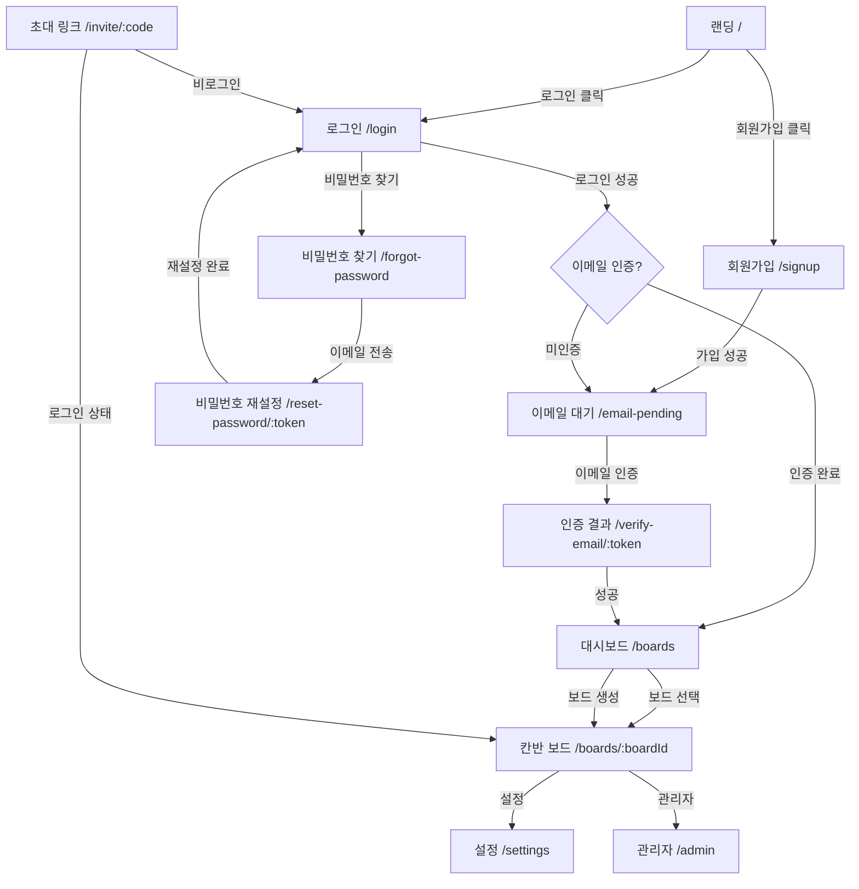
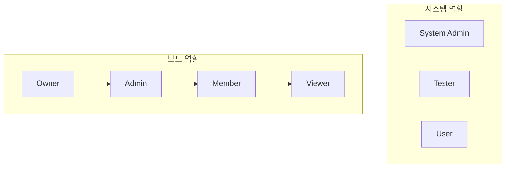

# Information Architecture

## 프로젝트 전체 구조

```
KanbanProject/
├── frontend/                   # React 프론트엔드
│   ├── src/
│   │   ├── main.tsx            # 엔트리포인트
│   │   ├── styles/             # 전역 CSS/Tailwind
│   │   │   ├── index.css
│   │   │   ├── theme.css       # BRIDGE 디자인 시스템 색상
│   │   │   ├── tailwind.css
│   │   │   └── fonts.css
│   │   └── app/
│   │       ├── App.tsx          # 메인 라우터
│   │       ├── types/           # TypeScript 타입 정의
│   │       ├── contexts/        # React Context (Auth, Theme, Drag)
│   │       ├── components/      # UI 컴포넌트 (126개 파일)
│   │       │   ├── ui/          # Shadcn/Radix 기본 컴포넌트 (50+)
│   │       │   ├── landing/     # 랜딩 페이지 컴포넌트
│   │       │   ├── dashboard/   # 대시보드/보드 목록
│   │       │   ├── admin/       # 관리자 대시보드
│   │       │   └── figma/       # Figma 임포트 유틸
│   │       ├── pages/           # 페이지 컴포넌트
│   │       ├── utils/           # API 클라이언트, 서비스 레이어
│   │       ├── lib/             # 유틸리티 헬퍼
│   │       └── constants/       # 상수 (색상 등)
│   ├── package.json
│   └── vite.config.ts
│
├── backend/                     # Spring Boot 백엔드
│   ├── src/main/java/com/kanban/
│   │   ├── domain/              # 도메인별 패키지 (18개)
│   │   │   ├── auth/            # 인증/인가
│   │   │   ├── user/            # 사용자 관리
│   │   │   ├── board/           # 보드 관리
│   │   │   ├── block/           # 칸반 블록
│   │   │   ├── feature/         # 피쳐 카드
│   │   │   ├── task/            # 태스크 카드
│   │   │   ├── member/          # 보드 멤버십
│   │   │   ├── invite/          # 초대 링크
│   │   │   ├── tag/             # 태그 시스템
│   │   │   ├── checklist/       # 체크리스트
│   │   │   ├── daily_checklist/ # 데일리 체크리스트
│   │   │   ├── schedule/        # 스케줄 블록
│   │   │   ├── milestone/       # 마일스톤 & 할당
│   │   │   ├── activity/        # 활동 로그
│   │   │   ├── weight/          # 태스크 가중치
│   │   │   ├── subscription/    # 구독/결제
│   │   │   ├── statistics/      # 통계/분석
│   │   │   ├── admin/           # 관리자 기능
│   │   │   ├── test/            # 테스트 데이터
│   │   │   └── common/          # 공통 베이스 클래스
│   │   └── global/              # 전역 설정
│   │       ├── config/          # Spring 설정
│   │       ├── exception/       # 에러 처리
│   │       ├── security/        # JWT & 보안
│   │       ├── email/           # 이메일 서비스
│   │       └── controller/      # 헬스체크
│   ├── src/main/resources/
│   │   └── application.yml
│   ├── build.gradle
│   └── Dockerfile
│
├── infrastructure/              # Terraform IaC
│   └── terraform/
│       ├── modules/             # 재사용 모듈
│       │   ├── elastic-beanstalk/
│       │   ├── s3-cloudfront/
│       │   ├── acm-certificate/
│       │   └── route53/
│       └── environments/        # 환경별 설정
│           ├── dev/
│           └── prod/
│
├── dashboard/                   # 대시보드 (별도)
├── docs/                        # 프로젝트 문서
│   ├── IA/                      # Information Architecture
│   ├── Wireframe/               # 화면 구조
│   ├── Design/                  # 디자인 시스템
│   ├── ERD/                     # DB 스키마
│   ├── API/                     # API 명세
│   └── Tech/                    # 기술 스택
├── .github/                     # GitHub Actions CI/CD
└── docker-compose.yml           # 로컬 개발 환경
```

---

## 모듈 구성

### Frontend 모듈

| 모듈 | 경로 | 설명 |
|------|------|------|
| Auth | `contexts/AuthContext.tsx` | 인증 상태 관리 (JWT, Google OAuth) |
| Theme | `contexts/ThemeContext.tsx` | 다크/라이트 테마 관리 |
| DnD | `contexts/DragContext.tsx` | 드래그 앤 드롭 상태 관리 |
| API Client | `utils/api.ts` | HTTP 클라이언트 (1,300+ lines) |
| Services | `utils/services.ts` | 서비스 레이어 (2,000+ lines) |
| Types | `types/index.ts` | TypeScript 타입 정의 (1,170+ lines) |
| UI Kit | `components/ui/` | Shadcn/Radix 기반 50+ 컴포넌트 |

### Backend 모듈 (도메인 주도 설계)

| 모듈 | 경로 | 설명 |
|------|------|------|
| Auth | `domain/auth/` | 회원가입, 로그인, OAuth, 토큰 관리 |
| User | `domain/user/` | 사용자 프로필 CRUD |
| Board | `domain/board/` | 보드 CRUD, 멤버 관리, 티어 |
| Block | `domain/block/` | 고정/커스텀 블록 관리 |
| Feature | `domain/feature/` | 피쳐 카드 CRUD, 진행률 |
| Task | `domain/task/` | 태스크 CRUD, 블록 이동, 완료 |
| Member | `domain/member/` | 멤버 초대, 역할 변경 |
| Invite | `domain/invite/` | 초대 링크 생성/관리 |
| Tag | `domain/tag/` | 태그 CRUD |
| Checklist | `domain/checklist/` | 체크리스트 항목 관리 |
| Schedule | `domain/schedule/` | 타임블록 스케줄 관리 |
| Milestone | `domain/milestone/` | 마일스톤 CRUD, 피쳐 연결 |
| Activity | `domain/activity/` | 활동 로그 기록/조회 |
| Weight | `domain/weight/` | 태스크 가중치 레벨 |
| Subscription | `domain/subscription/` | 구독/결제 관리 |
| Statistics | `domain/statistics/` | 통계/분석 데이터 |
| Admin | `domain/admin/` | 시스템 관리자 기능 |

---

## 페이지 구조 (라우트)

| 페이지 | 라우트 | 인증 | 설명 |
|--------|--------|:----:|------|
| 랜딩 | `/` | X | 서비스 소개 페이지 |
| 로그인 | `/login` | X | 이메일/Google 로그인 |
| 회원가입 | `/signup` | X | 회원가입 |
| 이메일 인증 | `/verify-email/:token` | X | 이메일 인증 결과 |
| 이메일 대기 | `/email-pending` | O | 이메일 인증 대기 |
| 비밀번호 찾기 | `/forgot-password` | X | 비밀번호 재설정 요청 |
| 비밀번호 재설정 | `/reset-password/:token` | X | 토큰으로 비밀번호 재설정 |
| 이용약관 | `/terms` | X | 서비스 이용약관 |
| 개인정보처리방침 | `/privacy` | X | 개인정보처리방침 |
| 설정 | `/settings` | O | 사용자 설정 |
| 대시보드 | `/boards` | O | 보드 목록 |
| 칸반 보드 | `/boards/:boardId` | O | 칸반 보드 상세 |
| 초대 링크 | `/invite/:code` | △ | 초대 링크 랜딩 |
| 관리자 | `/admin/*` | O (Admin) | 시스템 관리자 대시보드 |

---

## 네비게이션 흐름



---

## 칸반 보드 내부 뷰 구조

```mermaid
flowchart LR
    subgraph KanbanBoardPage
        direction TB
        HEADER[헤더: 보드명, 멤버, 필터]
        TABS[탭: 칸반 | 위클리 | 데일리 | 통계 | 관리]

        KANBAN[칸반 뷰]
        WEEKLY[위클리 스케줄 뷰]
        DAILY[데일리 스케줄 뷰]
        STATS[통계 뷰]
        MGMT[관리 뷰]
    end

    TABS --> KANBAN
    TABS --> WEEKLY
    TABS --> DAILY
    TABS --> STATS
    TABS --> MGMT

    KANBAN -->|카드 클릭| FM[Feature 상세 모달]
    KANBAN -->|태스크 클릭| TM[Task 상세 모달]
    KANBAN -->|+ Feature| AFM[Feature 추가 모달]
    KANBAN -->|+ Block| ABM[Block 추가 모달]
```

---

## 권한 체계



| 계층 | 역할 | 과금 | 핵심 권한 |
|------|------|:----:|----------|
| 보드 | Owner | O | 보드 삭제, 결제 관리 |
| 보드 | Admin | O | 멤버/블록/설정 관리 |
| 보드 | Member | O | Feature/Task 생성/수정 |
| 보드 | Viewer | X | 읽기 전용 |
| 시스템 | Admin | - | 전체 시스템 관리 |
| 시스템 | Tester | - | 결제 UI 숨김 |
| 시스템 | User | - | 일반 사용자 |
