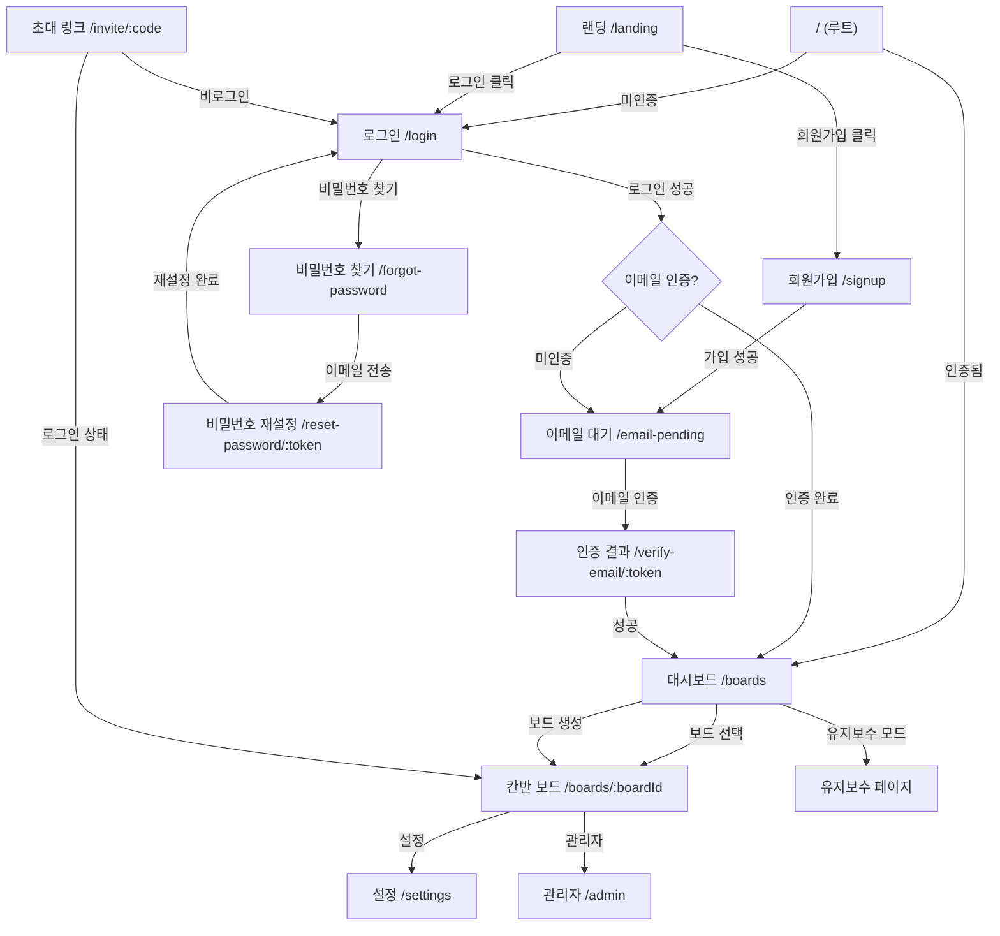
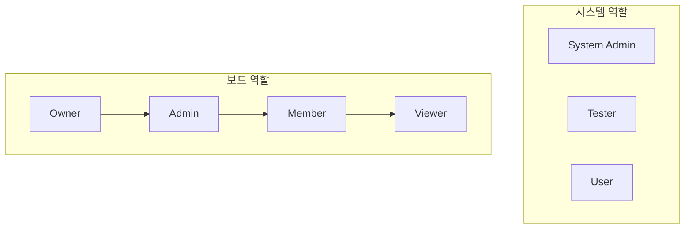
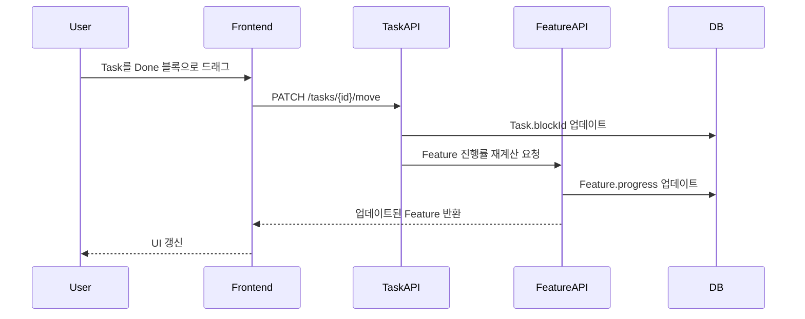
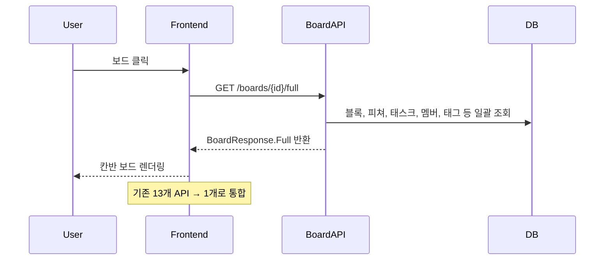
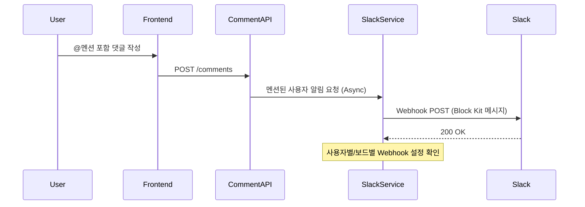
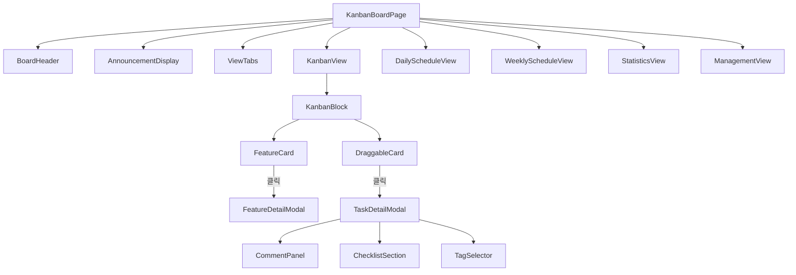
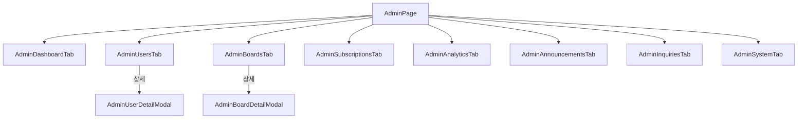

# Information Architecture

## 프로젝트 전체 구조

```
KanbanProject/
├── frontend/                   # React 프론트엔드
│   ├── src/
│   │   ├── main.tsx            # 엔트리포인트
│   │   ├── styles/             # 전역 CSS/Tailwind
│   │   │   ├── index.css
│   │   │   ├── theme.css       # BRIDGE 디자인 시스템 색상
│   │   │   ├── tailwind.css
│   │   │   └── fonts.css
│   │   └── app/
│   │       ├── App.tsx          # 메인 라우터
│   │       ├── types/           # TypeScript 타입 정의
│   │       ├── contexts/        # React Context (Auth, Theme, Drag)
│   │       ├── components/      # UI 컴포넌트
│   │       │   ├── ui/          # Shadcn/Radix 기본 컴포넌트 (50+)
│   │       │   ├── landing/     # 랜딩 페이지 컴포넌트
│   │       │   ├── dashboard/   # 대시보드/보드 목록
│   │       │   ├── admin/       # 관리자 대시보드 (10개 파일, NEW)
│   │       │   └── figma/       # Figma 임포트 유틸
│   │       ├── pages/           # 페이지 컴포넌트
│   │       ├── utils/           # API 클라이언트, 서비스 레이어 (5개 파일)
│   │       │   ├── api.ts       # HTTP 클라이언트
│   │       │   ├── services.ts  # 서비스 레이어
│   │       │   ├── assigneeColor.ts  # Assignee 색상 관리
│   │       │   ├── dateUtils.ts # 타임존/날짜 유틸리티 (NEW)
│   │       │   └── mockData.ts  # 목 데이터
│   │       ├── lib/             # 유틸리티 헬퍼
│   │       └── constants/       # 상수 (색상 등)
│   ├── package.json
│   └── vite.config.ts
│
├── backend/                     # Spring Boot 백엔드
│   ├── src/main/java/com/kanban/
│   │   ├── domain/              # 도메인별 패키지 (24개)
│   │   │   ├── auth/            # 인증/인가
│   │   │   ├── user/            # 사용자 관리
│   │   │   ├── board/           # 보드 관리
│   │   │   ├── block/           # 칸반 블록
│   │   │   ├── feature/         # 피쳐 카드
│   │   │   ├── task/            # 태스크 카드
│   │   │   ├── member/          # 보드 멤버십
│   │   │   ├── invite/          # 초대 링크
│   │   │   ├── tag/             # 태그 시스템
│   │   │   ├── checklist/       # 체크리스트
│   │   │   ├── dailychecklist/  # 데일리 체크리스트
│   │   │   ├── comment/         # 태스크 댓글
│   │   │   ├── notification/    # 알림 시스템
│   │   │   ├── schedule/        # 스케줄 블록 + ScheduleFacadeService (NEW)
│   │   │   ├── milestone/       # 마일스톤 & 할당
│   │   │   ├── activity/        # 활동 로그
│   │   │   ├── weight/          # 태스크 가중치
│   │   │   ├── subscription/    # 구독/결제 + PricingPlan
│   │   │   ├── statistics/      # 통계/분석
│   │   │   ├── admin/           # 관리자 기능
│   │   │   ├── test/            # 테스트 데이터
│   │   │   ├── common/          # 공통 베이스 클래스
│   │   │   ├── integration/     # 외부 연동 (NEW)
│   │   │   │   └── slack/       # Slack Webhook 연동 (7개 파일, NEW)
│   │   │   ├── announcement/    # 공지사항 시스템 (3개 파일, NEW)
│   │   │   ├── inquiry/         # 문의하기 시스템 (15개 파일, NEW)
│   │   │   └── system/          # 시스템 설정/유지보수 (3개 파일, NEW)
│   │   └── global/              # 전역 설정 (26개 파일)
│   │       ├── config/          # Spring 설정 (7개 파일)
│   │       ├── exception/       # 에러 처리 (3개 파일)
│   │       ├── security/        # JWT & 보안 (4개 파일)
│   │       ├── controller/      # 헬스체크 (2개 파일)
│   │       ├── service/         # 파일 업로드 (3개 파일)
│   │       ├── scheduler/       # 스케줄러 (2개 파일)
│   │       │   ├── TempFileCleanupScheduler.java
│   │       │   └── ActivityLogCleanupScheduler.java (NEW)
│   │       ├── filter/          # 필터 (2개 파일, NEW)
│   │       │   ├── ActivityTrackingFilter.java (NEW)
│   │       │   └── MaintenanceFilter.java (NEW)
│   │       ├── email/           # 이메일 서비스 (1개 파일)
│   │       └── util/            # 유틸리티 (1개 파일)
│   ├── src/main/resources/
│   │   ├── application.yml
│   │   └── db/migration/        # Flyway 마이그레이션 (V1~V14)
│   ├── build.gradle
│   └── Dockerfile
│
├── infrastructure/              # Terraform IaC
│   └── terraform/
│       ├── modules/             # 재사용 모듈 (9개)
│       │   ├── vpc/
│       │   ├── security-groups/
│       │   ├── elastic-beanstalk/
│       │   ├── rds/
│       │   ├── rds-simple/
│       │   ├── elasticache/
│       │   ├── s3-cloudfront/
│       │   ├── acm-certificate/
│       │   └── route53/
│       └── environments/        # 환경별 설정
│           ├── dev/
│           └── prod/
│
├── dashboard/                   # 대시보드 (별도)
├── docs/                        # 프로젝트 문서
│   ├── IA/                      # Information Architecture
│   ├── Wireframe/               # 화면 구조
│   ├── Design/                  # 디자인 시스템
│   ├── ERD/                     # DB 스키마
│   ├── API/                     # API 명세
│   └── Tech/                    # 기술 스택
├── .github/                     # GitHub Actions CI/CD
└── docker-compose.yml           # 로컬 개발 환경
```

---

## 모듈 구성

### Frontend 모듈

| 모듈 | 경로 | 설명 |
|------|------|------|
| Auth | `contexts/AuthContext.tsx` | 인증 상태 관리 (JWT, Google OAuth) |
| Theme | `contexts/ThemeContext.tsx` | 다크/라이트 테마 관리 |
| DnD | `contexts/DragContext.tsx` | 드래그 앤 드롭 상태 관리 |
| Analytics | `contexts/AnalyticsContext.tsx` | Firebase Analytics 이벤트 추적 (NEW) |
| API Client | `utils/api.ts` | HTTP 클라이언트 (Slack/Inquiry/System API 포함) |
| Services | `utils/services.ts` | 서비스 레이어 (2,000+ lines) |
| Assignee Colors | `utils/assigneeColor.ts` | Assignee 색상 유틸리티 |
| Date Utils | `utils/dateUtils.ts` | 타임존/날짜 처리 (UTC→로컬, 다국어) (NEW) |
| Types | `types/index.ts` | TypeScript 타입 정의 (1,250+ lines) |
| UI Kit | `components/ui/` | Shadcn/Radix 기반 50+ 컴포넌트 |
| Admin Suite | `components/admin/` | 관리자 대시보드 10개 탭 컴포넌트 (NEW) |

### Backend 모듈 (도메인 주도 설계)

| 모듈 | 경로 | 설명 |
|------|------|------|
| Auth | `domain/auth/` | 회원가입, 로그인, OAuth, 토큰 관리 |
| User | `domain/user/` | 사용자 프로필 CRUD |
| Board | `domain/board/` | 보드 CRUD, 멤버 관리, 티어, Full API |
| Block | `domain/block/` | 고정/커스텀 블록 관리 |
| Feature | `domain/feature/` | 피쳐 카드 CRUD, 진행률 |
| Task | `domain/task/` | 태스크 CRUD, 블록 이동, 완료 |
| Member | `domain/member/` | 멤버 초대, 역할 변경 |
| Invite | `domain/invite/` | 초대 링크 생성/관리 |
| Tag | `domain/tag/` | 태그 CRUD |
| Checklist | `domain/checklist/` | 체크리스트 항목 관리 |
| DailyChecklist | `domain/dailychecklist/` | 데일리 체크리스트 관리 |
| Schedule | `domain/schedule/` | 타임블록 스케줄 + FacadeService (통합 API) |
| Milestone | `domain/milestone/` | 마일스톤 CRUD, 피쳐 연결 |
| Activity | `domain/activity/` | 활동 로그 기록/조회 (통일된 액션명) |
| Comment | `domain/comment/` | 태스크 댓글 CRUD, 멘션, 보드별 조회 |
| Notification | `domain/notification/` | 알림 생성/조회, 읽음 처리 |
| Weight | `domain/weight/` | 태스크 가중치 레벨 |
| Subscription | `domain/subscription/` | 구독/결제 관리, PricingPlan |
| Statistics | `domain/statistics/` | 통계/분석 데이터 |
| Admin | `domain/admin/` | 시스템 관리자 기능 (24개 API) |
| Integration/Slack | `domain/integration/slack/` | Slack Webhook 연동 (멘션 알림) (NEW) |
| Announcement | `domain/announcement/` | 시스템 공지사항 관리 (NEW) |
| Inquiry | `domain/inquiry/` | 사용자 문의/지원 시스템 (NEW) |
| System | `domain/system/` | 시스템 설정, 유지보수 모드 (NEW) |

---

## 페이지 구조 (라우트)

| 페이지 | 라우트 | 인증 | 설명 |
|--------|--------|:----:|------|
| 루트 | `/` | △ | 인증 시 `/boards`, 미인증 시 `/login` 리다이렉트 |
| 랜딩 | `/landing` | X | 서비스 소개 페이지 |
| 로그인 | `/login` | X | 이메일/Google 로그인 |
| 회원가입 | `/signup` | X | 회원가입 |
| 이메일 인증 | `/verify-email/:token` | X | 이메일 인증 결과 |
| 이메일 대기 | `/email-pending` | O | 이메일 인증 대기 |
| 비밀번호 찾기 | `/forgot-password` | X | 비밀번호 재설정 요청 |
| 비밀번호 재설정 | `/reset-password/:token` | X | 토큰으로 비밀번호 재설정 |
| 이용약관 | `/terms` | X | 서비스 이용약관 |
| 개인정보처리방침 | `/privacy` | X | 개인정보처리방침 |
| 설정 | `/settings` | O | 사용자 설정 |
| 대시보드 | `/boards` | O | 보드 목록 |
| 칸반 보드 | `/boards/:boardId` | O | 칸반 보드 상세 |
| 초대 링크 | `/invite/:code` | △ | 초대 링크 랜딩 |
| 관리자 | `/admin/*` | O (Admin) | 시스템 관리자 대시보드 |
| 공지사항 | `/announcements` | O | 공지사항 목록 (NEW) |

---

## 네비게이션 흐름



---

## 칸반 보드 내부 뷰 구조

```mermaid
flowchart LR
    subgraph KanbanBoardPage
        direction TB
        HEADER[헤더: 보드명, 멤버, 필터, 공지배너]
        TABS[탭: 칸반 | 데일리 | 간트차트 | 마일스톤* | 관리*]

        KANBAN[칸반 뷰]
        DAILY[데일리 스케줄 뷰]
        WEEKLY[간트차트 뷰]
        STATS["마일스톤 뷰 (Admin+)"]
        MGMT["관리 뷰 (Admin+)"]
    end

    TABS --> KANBAN
    TABS --> WEEKLY
    TABS --> DAILY
    TABS --> STATS
    TABS --> MGMT

    KANBAN -->|카드 클릭| FM[Feature 상세 모달]
    KANBAN -->|태스크 클릭| TM[Task 상세 모달]
    KANBAN -->|+ Feature| AFM[Feature 추가 모달]
    KANBAN -->|+ Block| ABM[Block 추가 모달]
```

---

## 권한 체계



| 계층 | 역할 | 과금 | 핵심 권한 |
|------|------|:----:|----------|
| 보드 | Owner | O | 보드 삭제, 결제 관리 |
| 보드 | Admin | O | 멤버/블록/설정 관리 |
| 보드 | Member | O | Feature/Task 생성/수정, Slack 설정 |
| 보드 | Viewer | X | 읽기 전용 |
| 시스템 | Admin | - | 전체 시스템 관리, 공지/문의 관리 |
| 시스템 | Tester | - | 결제 UI 숨김 |
| 시스템 | User | - | 일반 사용자 |

---

## 핵심 데이터 흐름

### 1. Feature → Task 진행률 연동



### 2. 보드 진입 통합 API (NEW)



### 3. Slack 멘션 알림 (NEW)



---

## 주요 컴포넌트 계층 구조

### 칸반 보드 페이지



### 관리자 대시보드 (NEW)



---

## 데이터베이스 스키마 (핵심 테이블)

| 테이블 | 설명 | 주요 컬럼 |
|--------|------|-----------|
| users | 사용자 | id, email, name, system_role, last_active_at |
| boards | 보드 | id, name, owner_id, tier, status |
| board_members | 보드 멤버십 | board_id, user_id, role, assignee_color |
| blocks | 칸반 블록 | id, board_id, name, position, is_fixed |
| features | 피쳐 카드 | id, board_id, title, description, progress |
| tasks | 태스크 카드 | id, feature_id, block_id, title, assignee_id |
| tags | 태그 | id, board_id, name, color |
| checklists | 체크리스트 | id, task_id, content, is_checked |
| comments | 댓글 | id, task_id, user_id, content |
| notifications | 알림 | id, user_id, type, content, is_read |
| invite_links | 초대 링크 | id, board_id, code, role, expires_at |
| subscriptions | 구독 | id, board_id, tier, status, expires_at |
| member_slack_webhooks | Slack 웹훅 | id, board_id, user_id, webhook_url (NEW) |
| announcements | 공지사항 | id, title, type, is_active (NEW) |
| inquiries | 문의 | id, user_id, title, status (NEW) |
| inquiry_replies | 문의 답변 | id, inquiry_id, content, reply_type (NEW) |
| inquiry_attachments | 문의 첨부 | id, inquiry_id, url (NEW) |
| system_config | 시스템 설정 | config_key, config_value (NEW) |

---

## API 엔드포인트 (주요)

### 인증
- `POST /auth/signup` - 회원가입
- `POST /auth/login` - 로그인
- `POST /auth/logout` - 로그아웃
- `POST /auth/refresh` - Access Token 갱신

### 보드
- `GET /boards` - 보드 목록
- `POST /boards` - 보드 생성
- `GET /boards/{id}` - 보드 상세
- `GET /boards/{id}/full` - 보드 통합 조회 (NEW)
- `PUT /boards/{id}` - 보드 수정
- `DELETE /boards/{id}` - 보드 삭제

### 스케줄 (통합 API)
- `GET /boards/{id}/schedules/weekly` - 주간 통합 조회 (NEW)
- `GET /boards/{id}/schedules/daily-full` - 데일리 통합 조회 (NEW)

### Slack Webhook (NEW)
- `GET /boards/{id}/slack-webhook/me` - 내 Webhook 조회
- `PUT /boards/{id}/slack-webhook/me` - Webhook 등록/수정
- `DELETE /boards/{id}/slack-webhook/me` - Webhook 삭제
- `POST /boards/{id}/slack-webhook/me/test` - 테스트

### 문의하기 (NEW)
- `POST /inquiries` - 문의 작성
- `GET /inquiries` - 내 문의 목록
- `GET /inquiries/{id}` - 문의 상세
- `POST /inquiries/{id}/replies` - 답변 작성

### 시스템 (NEW)
- `GET /system/status` - 시스템 상태
- `GET /system/announcements/active` - 활성 공지사항

---

## 인프라 구성 (AWS)

### Terraform 모듈

| 모듈 | 리소스 | 설명 |
|------|--------|------|
| vpc | VPC, Subnet, IGW, NAT | 네트워크 인프라 |
| security-groups | Security Groups | 보안 그룹 설정 |
| elastic-beanstalk | EB Environment, ASG | Backend 배포 환경 |
| rds | RDS Aurora Serverless v2 | Production DB |
| rds-simple | RDS PostgreSQL Standard | Development DB |
| elasticache | ElastiCache Redis | Production 캐시 |
| s3-cloudfront | S3, CloudFront | Frontend 정적 파일 |
| acm-certificate | ACM Certificate | SSL 인증서 |
| route53 | Route53 Hosted Zone | DNS 관리 |

### 환경별 구성

| 환경 | Backend | DB | Cache | CDN |
|------|---------|----|----|-----|
| Local | Spring Boot | H2 | - | - |
| Dev | Elastic Beanstalk | RDS Standard | - | CloudFront |
| Prod | Elastic Beanstalk | Aurora Serverless v2 | ElastiCache Redis | CloudFront |

---

## 변경 이력 (v1.4.0)

### Frontend
- **추가**: `contexts/AnalyticsContext.tsx` - Firebase Analytics 이벤트 추적 Context
- **추가**: `components/NotificationPreferencesPanel.tsx` - 알림 설정 패널

### Backend
- **추가**: `NotificationPreference` 엔티티 + `notification_preferences` 테이블
- **추가**: `NotificationPreferenceController` - 알림 설정 API (2개 엔드포인트)
- **추가**: `NotificationPreferenceService` - 알림 설정 서비스
- **변경**: `NotificationType` enum 확장 (COMMENT_MENTION → +CHECKLIST_ASSIGNED, +TASK_COMMENT)

---

## 변경 이력 (v1.3.0)

### Frontend
- **추가**: `utils/dateUtils.ts` - 타임존/날짜 유틸리티 (UTC→로컬, 다국어)
- **추가**: `components/admin/` - 관리자 대시보드 10개 탭 컴포넌트
- **추가**: `components/SlackSettingsPanel.tsx` - Slack Webhook 설정 UI
- **추가**: `components/AnnouncementDisplay.tsx` - 공지사항 배너/팝업
- **추가**: `components/InquiryModal.tsx` - 문의하기 모달
- **추가**: `components/MaintenancePage.tsx` - 유지보수 페이지
- **추가**: `components/MilestoneOnboardingModal.tsx` - 마일스톤 온보딩
- **추가**: `components/AdminRoute.tsx` - 관리자 라우트 보호
- **추가**: `pages/AdminPage.tsx`, `pages/AnnouncementsPage.tsx`

### Backend
- **추가**: `domain/integration/slack/` - Slack Webhook 연동 (7개 파일)
- **추가**: `domain/announcement/` - 공지사항 시스템 (3개 파일)
- **추가**: `domain/inquiry/` - 문의하기 시스템 (15개 파일)
- **추가**: `domain/system/` - 시스템 설정/유지보수 (3개 파일)
- **추가**: `domain/schedule/service/ScheduleFacadeService.java` - 스케줄 통합 서비스
- **추가**: `global/filter/ActivityTrackingFilter.java` - 활동 추적 필터
- **추가**: `global/filter/MaintenanceFilter.java` - 유지보수 모드 필터
- **추가**: `global/scheduler/ActivityLogCleanupScheduler.java` - 로그 정리
- **변경**: 도메인 패키지 20개 → 24개
- **변경**: Flyway 마이그레이션 V6 → V14 (8개 추가)
- **변경**: API 통합: 보드 진입 13개→1개, 주간 스케줄 7개→1개
