# Information Architecture

## 프로젝트 전체 구조

```
KanbanProject/
├── frontend/                   # React 프론트엔드
│   ├── src/
│   │   ├── main.tsx            # 엔트리포인트
│   │   ├── styles/             # 전역 CSS/Tailwind
│   │   │   ├── index.css
│   │   │   ├── theme.css       # BRIDGE 디자인 시스템 색상
│   │   │   ├── tailwind.css
│   │   │   ├── fonts.css
│   │   │   └── blocknote-dark.css  # BlockNote 다크테마 (NEW v1.6)
│   │   └── app/
│   │       ├── App.tsx          # 메인 라우터
│   │       ├── types/           # TypeScript 타입 정의
│   │       ├── contexts/        # React Context (Auth, Theme, Drag)
│   │       ├── components/      # UI 컴포넌트
│   │       │   ├── ui/          # Shadcn/Radix 기본 컴포넌트 (50+)
│   │       │   ├── landing/     # 랜딩 페이지 컴포넌트
│   │       │   ├── dashboard/   # 대시보드/보드 목록
│   │       │   ├── admin/       # 관리자 대시보드 (12개 파일, v1.6 MonitoringTab 추가)
│   │       │   ├── notes/       # 노트 에디터 컴포넌트
│   │       │   │   ├── NoteEditor.tsx        # BlockNote 에디터 (v1.6 마이그레이션)
│   │       │   │   └── blocks/               # BlockNote 커스텀 블록 (7개, NEW v1.6)
│   │       │   │       ├── CalloutBlock.tsx
│   │       │   │       ├── ToggleBlock.tsx
│   │       │   │       ├── DividerBlock.tsx
│   │       │   │       ├── ColumnLayoutBlock.tsx
│   │       │   │       ├── EmbedBlock.tsx
│   │       │   │       ├── MentionBlock.tsx
│   │       │   │       └── TableOfContentsBlock.tsx
│   │       │   └── figma/       # Figma 임포트 유틸
│   │       ├── pages/           # 페이지 컴포넌트
│   │       ├── hooks/           # 커스텀 훅
│   │       │   ├── useAnalytics.ts
│   │       │   ├── useVideoThumbnail.ts
│   │       │   └── useBoardWebSocket.ts  # WebSocket 실시간 동기화 (NEW v1.6)
│   │       ├── utils/           # API 클라이언트, 서비스 레이어 (6개 파일)
│   │       │   ├── api.ts       # HTTP 클라이언트
│   │       │   ├── services.ts  # 서비스 레이어 (monitoringService 추가)
│   │       │   ├── websocket.ts # WebSocket 매니저 (NEW v1.6)
│   │       │   ├── assigneeColor.ts  # Assignee 색상 관리
│   │       │   ├── dateUtils.ts # 타임존/날짜 유틸리티
│   │       │   └── mockData.ts  # 목 데이터
│   │       ├── i18n/            # 다국어 지원 (10개 언어)
│   │       │   ├── index.ts     # i18next 설정
│   │       │   └── locales/     # 언어 파일 (ko, en, ja, zh, zh-TW, hi, vi, es, pt-BR, th)
│   │       ├── lib/             # 유틸리티 헬퍼
│   │       └── constants/       # 상수 (색상 등)
│   ├── package.json
│   └── vite.config.ts
│
├── backend/                     # Spring Boot 백엔드
│   ├── src/main/java/com/kanban/
│   │   ├── domain/              # 도메인별 패키지 (27개)
│   │   │   ├── auth/            # 인증/인가
│   │   │   ├── user/            # 사용자 관리
│   │   │   ├── board/           # 보드 관리
│   │   │   ├── block/           # 칸반 블록
│   │   │   ├── feature/         # 피쳐 카드
│   │   │   ├── task/            # 태스크 카드
│   │   │   ├── member/          # 보드 멤버십
│   │   │   ├── invite/          # 초대 링크
│   │   │   ├── tag/             # 태그 시스템
│   │   │   ├── checklist/       # 체크리스트
│   │   │   ├── dailychecklist/  # 데일리 체크리스트
│   │   │   ├── comment/         # 태스크 댓글
│   │   │   ├── notification/    # 알림 시스템
│   │   │   ├── schedule/        # 스케줄 블록 + ScheduleFacadeService
│   │   │   ├── meeting/         # 미팅 (반복 일정 지원, v1.6 확장)
│   │   │   ├── milestone/       # 마일스톤 & 할당
│   │   │   ├── activity/        # 활동 로그
│   │   │   ├── weight/          # 태스크 가중치
│   │   │   ├── subscription/    # 구독/결제 + PricingPlan
│   │   │   ├── statistics/      # 통계/분석
│   │   │   ├── admin/           # 관리자 기능
│   │   │   ├── test/            # 테스트 데이터
│   │   │   ├── common/          # 공통 베이스 클래스
│   │   │   ├── integration/     # 외부 연동
│   │   │   │   └── slack/       # Slack Webhook 연동 (7개 파일)
│   │   │   ├── announcement/    # 공지사항 시스템
│   │   │   ├── inquiry/         # 문의하기 시스템 (15개 파일)
│   │   │   ├── system/          # 시스템 설정/유지보수
│   │   │   ├── report/          # AI 리포트 생성/관리
│   │   │   ├── standup/         # 데일리 스탠드업 자동 발송
│   │   │   ├── note/            # 노트 (폴더/문서, 버전관리)
│   │   │   └── monitoring/      # 서버 모니터링 (NEW v1.6)
│   │   │       ├── controller/  # MonitoringController (6 endpoints)
│   │   │       ├── service/     # MonitoringService, MonitoringAlertService
│   │   │       ├── entity/      # ApiMetricSnapshot
│   │   │       ├── repository/  # ApiMetricSnapshotRepository
│   │   │       └── dto/         # MonitoringResponse (Dashboard, AlertConfig 등)
│   │   └── global/              # 전역 설정 (30+ 파일)
│   │       ├── config/          # Spring 설정 (11개 파일)
│   │       │   ├── SecurityConfig.java
│   │       │   ├── WebConfig.java
│   │       │   ├── JacksonConfig.java
│   │       │   ├── AsyncConfig.java
│   │       │   ├── S3Config.java
│   │       │   ├── CacheConfig.java
│   │       │   ├── FirebaseConfig.java
│   │       │   ├── AIConfig.java
│   │       │   ├── WebSocketConfig.java      # STOMP WebSocket 설정 (NEW v1.6)
│   │       │   ├── WebMvcConfig.java          # API 메트릭 인터셉터 등록 (NEW v1.6)
│   │       │   └── CloudWatchConfig.java      # AWS CloudWatch 클라이언트 (NEW v1.6)
│   │       ├── exception/       # 에러 처리 (3개 파일)
│   │       ├── security/        # JWT & 보안 (5개 파일)
│   │       │   └── WebSocketAuthInterceptor.java  # WebSocket JWT 인증 (NEW v1.6)
│   │       ├── controller/      # 헬스체크 (2개 파일)
│   │       ├── service/         # 파일 업로드 (3개 파일)
│   │       ├── scheduler/       # 스케줄러 (3개 파일)
│   │       │   ├── TempFileCleanupScheduler.java
│   │       │   ├── ActivityLogCleanupScheduler.java
│   │       │   └── MonitoringScheduler.java   # 모니터링 스케줄러 (NEW v1.6)
│   │       ├── interceptor/     # 인터셉터 (NEW v1.6)
│   │       │   └── ApiMetricsInterceptor.java # API 성능 메트릭 수집
│   │       ├── websocket/       # WebSocket 이벤트 시스템 (NEW v1.6)
│   │       │   ├── BoardEventType.java        # 27개 이벤트 타입 enum
│   │       │   ├── WebSocketEvent.java        # 이벤트 record
│   │       │   └── WebSocketEventService.java # 이벤트 브로드캐스트 서비스
│   │       ├── filter/          # 필터 (2개 파일)
│   │       │   ├── ActivityTrackingFilter.java
│   │       │   └── MaintenanceFilter.java
│   │       ├── email/           # 이메일 서비스 (1개 파일)
│   │       └── util/            # 유틸리티 (1개 파일)
│   ├── src/main/resources/
│   │   ├── application.yml      # 모니터링/WebSocket 설정 추가 (v1.6)
│   │   └── db/migration/        # Flyway 마이그레이션 (V1~V30)
│   │       ├── V29__add_meeting_recurrence.sql  # 회의 반복 일정 (NEW v1.6)
│   │       └── V30__create_monitoring_tables.sql # 모니터링 테이블 (NEW v1.6)
│   ├── build.gradle
│   └── Dockerfile
│
├── infrastructure/              # Terraform IaC
│   └── terraform/
│       ├── modules/             # 재사용 모듈 (9개)
│       │   ├── vpc/
│       │   ├── security-groups/
│       │   ├── elastic-beanstalk/
│       │   ├── rds/
│       │   ├── rds-simple/
│       │   ├── elasticache/
│       │   ├── s3-cloudfront/
│       │   ├── acm-certificate/
│       │   └── route53/
│       └── environments/        # 환경별 설정
│           ├── dev/
│           └── prod/
│
├── dashboard/                   # 대시보드 (별도)
├── docs/                        # 프로젝트 문서
│   ├── IA/                      # Information Architecture
│   ├── Wireframe/               # 화면 구조
│   ├── Design/                  # 디자인 시스템
│   ├── ERD/                     # DB 스키마
│   ├── API/                     # API 명세
│   └── Tech/                    # 기술 스택
├── .github/                     # GitHub Actions CI/CD
└── docker-compose.yml           # 로컬 개발 환경
```

---

## 모듈 구성

### Frontend 모듈

| 모듈 | 경로 | 설명 |
|------|------|------|
| Auth | `contexts/AuthContext.tsx` | 인증 상태 관리 (JWT, Google OAuth) |
| Theme | `contexts/ThemeContext.tsx` | 다크/라이트 테마 관리 |
| DnD | `contexts/DragContext.tsx` | 드래그 앤 드롭 상태 관리 |
| Analytics | `contexts/AnalyticsContext.tsx` | Firebase Analytics 이벤트 추적 |
| API Client | `utils/api.ts` | HTTP 클라이언트 (meetingAPI, monitoringAPI 포함) |
| Services | `utils/services.ts` | 서비스 레이어 (monitoringService 추가, 2,300+ lines) |
| WebSocket | `utils/websocket.ts` | WebSocketManager 싱글턴 (STOMP/SockJS) (NEW v1.6) |
| WebSocket Hook | `hooks/useBoardWebSocket.ts` | 보드별 실시간 동기화 훅 (NEW v1.6) |
| Assignee Colors | `utils/assigneeColor.ts` | Assignee 색상 유틸리티 |
| Date Utils | `utils/dateUtils.ts` | 타임존/날짜 처리 (UTC→로컬, 다국어) |
| Types | `types/index.ts` | TypeScript 타입 정의 (1,600+ lines, WebSocket/Monitoring 타입 추가) |
| UI Kit | `components/ui/` | Shadcn/Radix 기반 50+ 컴포넌트 |
| Admin Suite | `components/admin/` | 관리자 대시보드 12개 파일 (MonitoringTab/Charts 추가) |
| Notes | `components/notes/` | 노트 에디터 (BlockNote + 7 커스텀 블록, v1.6 마이그레이션) |
| i18n | `i18n/` | 다국어 지원 10개 언어 |
| Landing | `components/landing/` | 랜딩 페이지 + ComparisonPage |

### Backend 모듈 (도메인 주도 설계)

| 모듈 | 경로 | 설명 |
|------|------|------|
| Auth | `domain/auth/` | 회원가입, 로그인, OAuth, 토큰 관리 |
| User | `domain/user/` | 사용자 프로필 CRUD |
| Board | `domain/board/` | 보드 CRUD, 멤버 관리, 티어, Full API |
| Block | `domain/block/` | 고정/커스텀 블록 관리 |
| Feature | `domain/feature/` | 피쳐 카드 CRUD, 진행률 |
| Task | `domain/task/` | 태스크 CRUD, 블록 이동, 완료 |
| Member | `domain/member/` | 멤버 초대, 역할 변경 |
| Invite | `domain/invite/` | 초대 링크 생성/관리 |
| Tag | `domain/tag/` | 태그 CRUD |
| Checklist | `domain/checklist/` | 체크리스트 항목 관리 |
| DailyChecklist | `domain/dailychecklist/` | 데일리 체크리스트 관리 |
| Schedule | `domain/schedule/` | 타임블록 스케줄 + FacadeService (통합 API) |
| Meeting | `domain/meeting/` | 미팅 관리 (반복 일정 WEEKLY/BIWEEKLY 지원, AI 전사/요약) (v1.6 확장) |
| Milestone | `domain/milestone/` | 마일스톤 CRUD, 피쳐 연결 |
| Activity | `domain/activity/` | 활동 로그 기록/조회 |
| Comment | `domain/comment/` | 태스크 댓글 CRUD, 멘션, 리액션, 보드별 조회 |
| Notification | `domain/notification/` | 알림 생성/조회, 읽음 처리, WebSocket 실시간 전송 (v1.6) |
| Weight | `domain/weight/` | 태스크 가중치 레벨 |
| Note | `domain/note/` | 노트 (폴더/문서, 태그, 버전관리, AI) |
| Subscription | `domain/subscription/` | 구독/결제 관리, PricingPlan |
| Statistics | `domain/statistics/` | 통계/분석 데이터 |
| Admin | `domain/admin/` | 시스템 관리자 기능 (24개 API) |
| Integration/Slack | `domain/integration/slack/` | Slack Webhook 연동 (멘션 알림) |
| Announcement | `domain/announcement/` | 시스템 공지사항 관리 |
| Inquiry | `domain/inquiry/` | 사용자 문의/지원 시스템 |
| System | `domain/system/` | 시스템 설정, 유지보수 모드 |
| Report | `domain/report/` | AI 리포트 생성/관리 |
| Standup | `domain/standup/` | 데일리 스탠드업 자동 발송 |
| Monitoring | `domain/monitoring/` | 서버 모니터링 (JVM, HikariCP, API 메트릭, CloudWatch, Slack 알림) (NEW v1.6) |

### Backend Global 설정

| 파일 | 경로 | 설명 |
|------|------|------|
| SecurityConfig | `global/config/SecurityConfig.java` | Spring Security 설정 (WebSocket 경로 추가) |
| WebConfig | `global/config/WebConfig.java` | CORS, WebMvc 설정 |
| JacksonConfig | `global/config/JacksonConfig.java` | JSON 직렬화 설정 |
| AsyncConfig | `global/config/AsyncConfig.java` | 비동기 처리 설정 |
| S3Config | `global/config/S3Config.java` | AWS S3 설정 |
| CacheConfig | `global/config/CacheConfig.java` | 캐시 설정 |
| FirebaseConfig | `global/config/FirebaseConfig.java` | Firebase 설정 |
| AIConfig | `global/config/AIConfig.java` | Claude AI RestTemplate 설정 |
| WebSocketConfig | `global/config/WebSocketConfig.java` | STOMP WebSocket 브로커 설정 (NEW v1.6) |
| WebMvcConfig | `global/config/WebMvcConfig.java` | API 메트릭 인터셉터 등록 (NEW v1.6) |
| CloudWatchConfig | `global/config/CloudWatchConfig.java` | AWS CloudWatch 클라이언트 (NEW v1.6) |

---

## 페이지 구조 (라우트)

| 페이지 | 라우트 | 인증 | 설명 |
|--------|--------|:----:|------|
| 루트 | `/` | △ | 인증 시 `/boards`, 미인증 시 `/login` 리다이렉트 |
| 랜딩 | `/landing` | X | 서비스 소개 페이지 |
| 경쟁사 비교 | `/compare` | X | 경쟁사 비교 페이지 |
| 로그인 | `/login` | X | 이메일/Google 로그인 |
| 회원가입 | `/signup` | X | 회원가입 |
| 이메일 인증 | `/verify-email/:token` | X | 이메일 인증 결과 |
| 이메일 대기 | `/email-pending` | O | 이메일 인증 대기 |
| 비밀번호 찾기 | `/forgot-password` | X | 비밀번호 재설정 요청 |
| 비밀번호 재설정 | `/reset-password/:token` | X | 토큰으로 비밀번호 재설정 |
| 이용약관 | `/terms` | X | 서비스 이용약관 |
| 개인정보처리방침 | `/privacy` | X | 개인정보처리방침 |
| 설정 | `/settings` | O | 사용자 설정 |
| 대시보드 | `/boards` | O | 보드 목록 |
| 칸반 보드 | `/boards/:boardId` | O | 칸반 보드 상세 |
| 초대 링크 | `/invite/:code` | △ | 초대 링크 랜딩 |
| 관리자 | `/admin/*` | O (Admin) | 시스템 관리자 대시보드 (Monitoring 탭 추가, v1.6) |
| 공지사항 | `/announcements` | O | 공지사항 목록 |

---

## 네비게이션 흐름

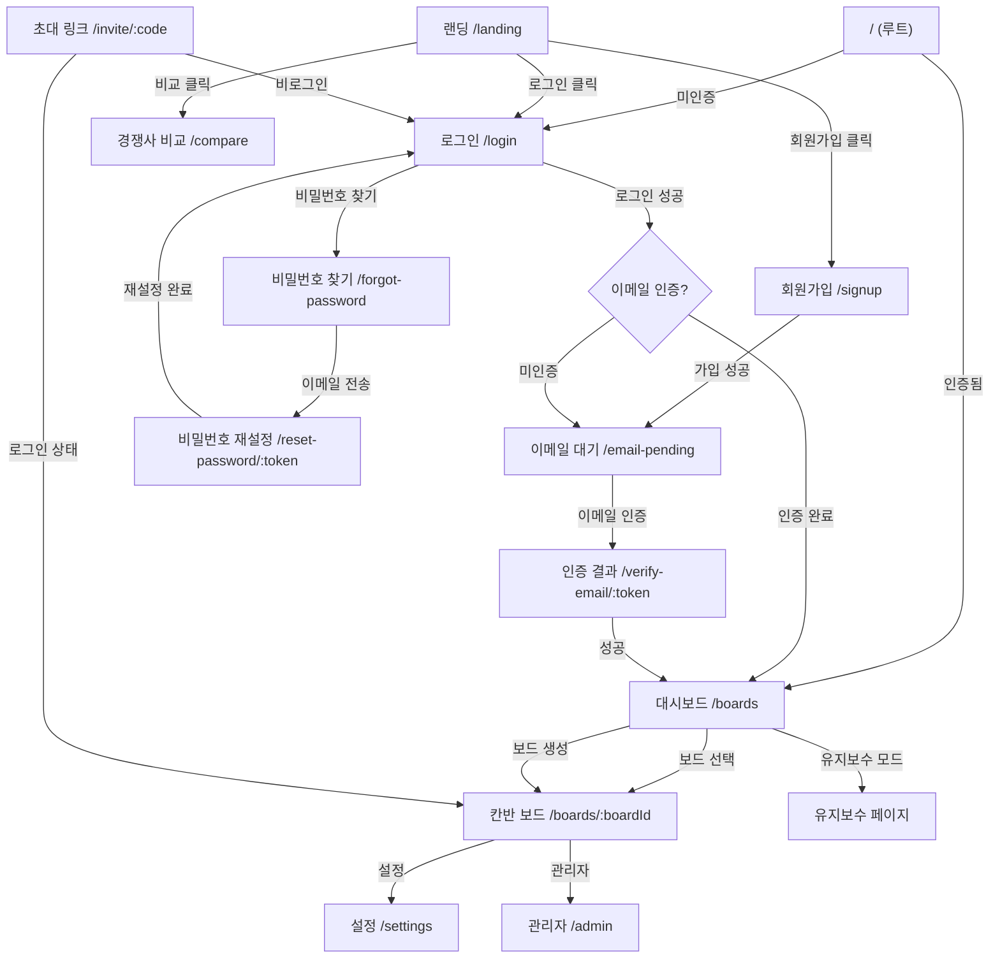

---

## 칸반 보드 내부 뷰 구조

```mermaid
flowchart LR
    subgraph KanbanBoardPage
        direction TB
        HEADER[헤더: 보드명, 멤버, 필터, 공지배너]
        TABS[탭: 칸반 | 데일리 | 간트차트 | 마일스톤* | 관리*]
        WS[WebSocket 실시간 동기화 v1.6]

        KANBAN[칸반 뷰]
        DAILY[데일리 스케줄 뷰]
        WEEKLY[간트차트 뷰]
        STATS["마일스톤 뷰 (Admin+)"]
        MGMT["관리 뷰 (Admin+)"]
    end

    TABS --> KANBAN
    TABS --> WEEKLY
    TABS --> DAILY
    TABS --> STATS
    TABS --> MGMT

    KANBAN -->|카드 클릭| FM[Feature 상세 모달]
    KANBAN -->|태스크 클릭| TM[Task 상세 모달]
    KANBAN -->|+ Feature| AFM[Feature 추가 모달]
    KANBAN -->|+ Block| ABM[Block 추가 모달]
```

---

## 권한 체계

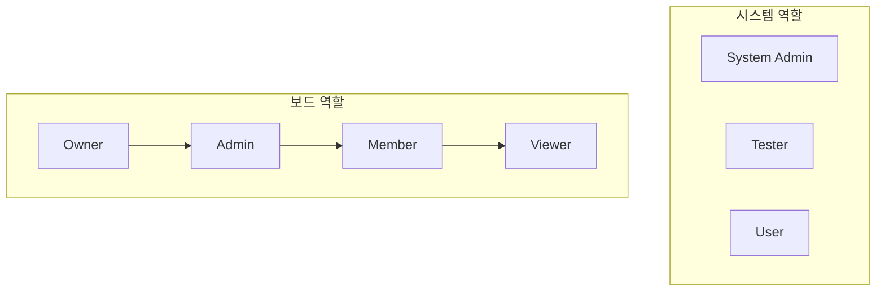

| 계층 | 역할 | 과금 | 핵심 권한 |
|------|------|:----:|----------|
| 보드 | Owner | O | 보드 삭제, 결제 관리 |
| 보드 | Admin | O | 멤버/블록/설정 관리 |
| 보드 | Member | O | Feature/Task 생성/수정, Slack 설정 |
| 보드 | Viewer | X | 읽기 전용 |
| 시스템 | Admin | - | 전체 시스템 관리, 공지/문의 관리, 모니터링 (v1.6) |
| 시스템 | Tester | - | 결제 UI 숨김 |
| 시스템 | User | - | 일반 사용자 |

---

## 핵심 데이터 흐름

### 1. Feature → Task 진행률 연동

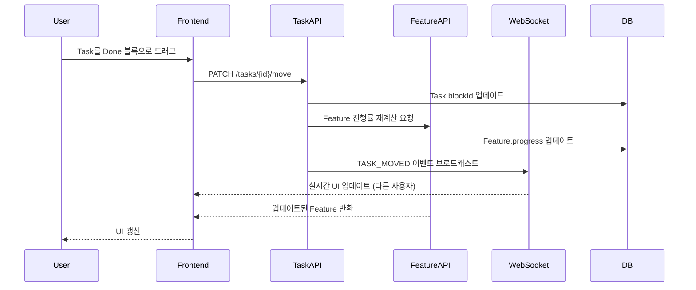

### 2. WebSocket 실시간 동기화 (NEW v1.6)

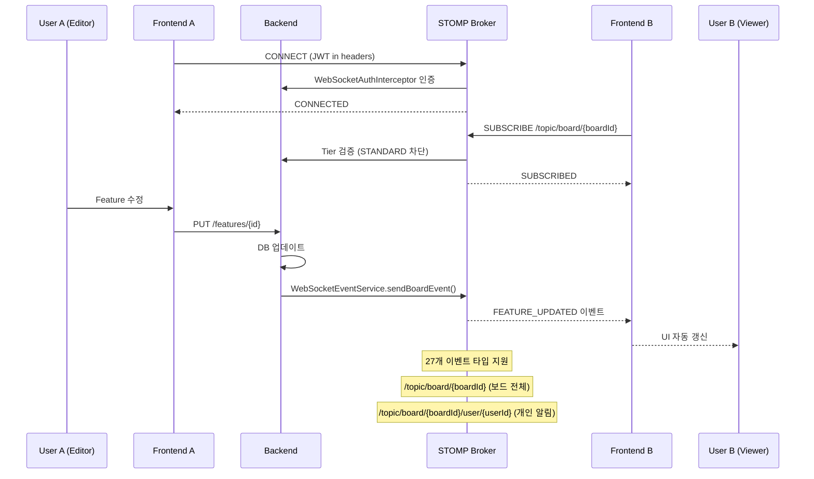

### 3. 보드 진입 통합 API

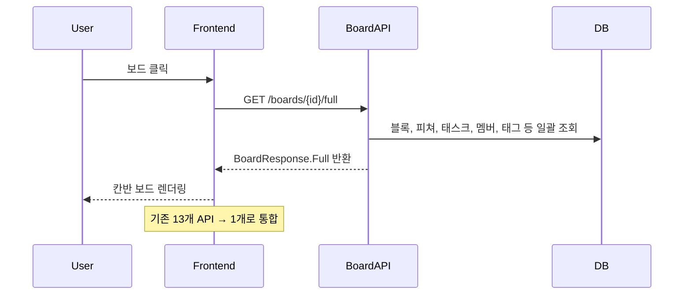

### 4. Slack 멘션 알림

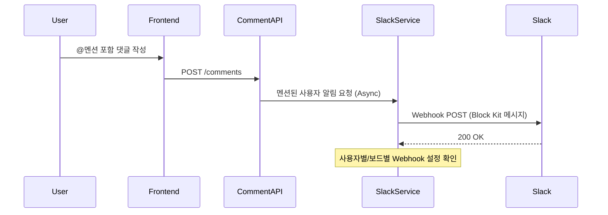

### 5. 서버 모니터링 & 알림 (NEW v1.6)

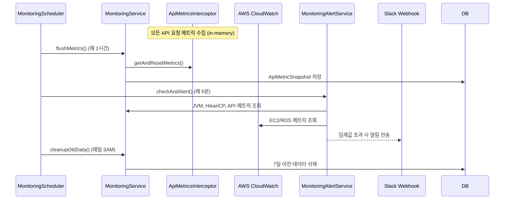

---

## 주요 컴포넌트 계층 구조

### 칸반 보드 페이지

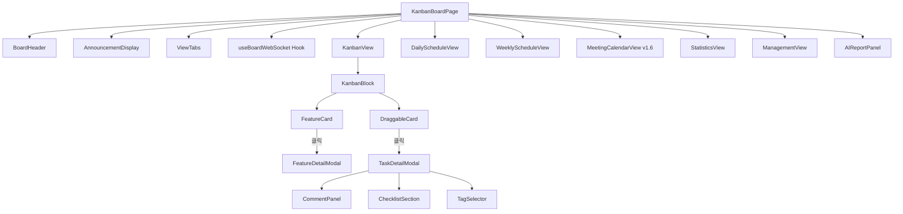

### 관리자 대시보드

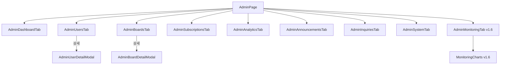

### 노트 에디터 (v1.6 BlockNote 마이그레이션)

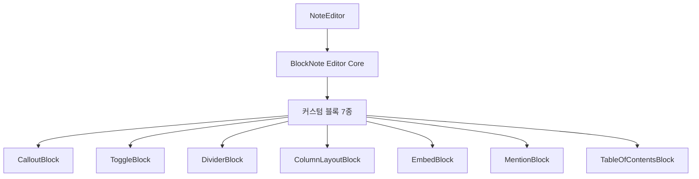

### 랜딩 페이지 컴포넌트

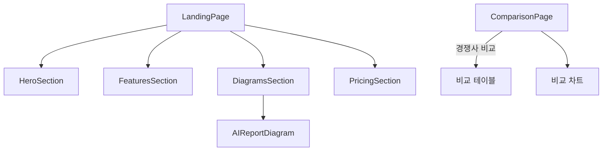

---

## 데이터베이스 스키마 (핵심 테이블)

| 테이블 | 설명 | 주요 컬럼 |
|--------|------|-----------|
| users | 사용자 | id, email, name, system_role, last_active_at |
| boards | 보드 | id, name, owner_id, tier, status |
| board_members | 보드 멤버십 | board_id, user_id, role, assignee_color, display_order |
| blocks | 칸반 블록 | id, board_id, name, position, is_fixed |
| features | 피쳐 카드 | id, board_id, title, description, progress |
| tasks | 태스크 카드 | id, feature_id, block_id, title, assignee_id |
| tags | 태그 | id, board_id, name, color |
| checklists | 체크리스트 | id, task_id, content, is_checked |
| comments | 댓글 | id, task_id, user_id, content |
| comment_reactions | 댓글 리액션 | id, comment_id, user_id, emoji |
| notifications | 알림 | id, user_id, type, content, is_read |
| invite_links | 초대 링크 | id, board_id, code, role, expires_at |
| subscriptions | 구독 | id, board_id, tier, status, expires_at |
| meetings | 미팅 | id, board_id, title, meeting_date, recurrence_rule, recurrence_group_id (v1.6) |
| member_slack_webhooks | Slack 웹훅 | id, board_id, user_id, webhook_url |
| announcements | 공지사항 | id, title, type, is_active |
| inquiries | 문의 | id, user_id, title, status |
| weekly_reports | AI 주간 리포트 | id, board_id, report_type, content |
| notes | 노트 | id, board_id, title, type, content |
| board_custom_emojis | 커스텀 이모지 | id, board_id, name, url |
| api_metric_snapshots | API 메트릭 스냅샷 | id, endpoint, snapshot_time, avg_response_ms (NEW v1.6) |
| monitoring_config | 모니터링 설정 | config_key, config_value (NEW v1.6) |

---

## API 엔드포인트 (주요)

### 인증
- `POST /auth/signup` - 회원가입
- `POST /auth/login` - 로그인
- `POST /auth/logout` - 로그아웃
- `POST /auth/refresh` - Access Token 갱신

### 보드
- `GET /boards` - 보드 목록
- `POST /boards` - 보드 생성
- `GET /boards/{id}` - 보드 상세
- `GET /boards/{id}/full` - 보드 통합 조회

### 미팅 (v1.6 확장)
- `POST /boards/{id}/meetings` - 미팅 생성 (반복 일정 포함)
- `GET /boards/{id}/meetings/range` - 날짜 범위 미팅 조회
- `PUT /boards/{id}/meetings/{meetingId}?scope=THIS_ONLY|THIS_AND_FUTURE` - 미팅 수정
- `DELETE /boards/{id}/meetings/{meetingId}?scope=THIS_ONLY|THIS_AND_FUTURE` - 미팅 삭제

### 모니터링 (NEW v1.6)
- `GET /admin/monitoring/dashboard` - 통합 모니터링 대시보드
- `GET /admin/monitoring/api-metrics/history` - API 메트릭 이력
- `GET /admin/monitoring/cloudwatch` - CloudWatch 메트릭
- `GET /admin/monitoring/alert-config` - 알림 설정 조회
- `PUT /admin/monitoring/alert-config` - 알림 설정 수정
- `POST /admin/monitoring/alert-test` - 테스트 알림 전송

### WebSocket (NEW v1.6)
- `CONNECT /ws` - STOMP WebSocket 연결 (SockJS fallback)
- `SUBSCRIBE /topic/board/{boardId}` - 보드 실시간 이벤트 구독
- `SUBSCRIBE /topic/board/{boardId}/user/{userId}` - 개인 알림 구독

### 스케줄 (통합 API)
- `GET /boards/{id}/schedules/weekly` - 주간 통합 조회
- `GET /boards/{id}/schedules/daily-full` - 데일리 통합 조회

### AI 리포트
- `POST /boards/{id}/reports` - AI 리포트 생성
- `GET /boards/{id}/reports` - 리포트 목록
- `POST /boards/{id}/reports/{reportId}/regenerate` - 리포트 재생성

---

## 인프라 구성 (AWS)

### Terraform 모듈

| 모듈 | 리소스 | 설명 |
|------|--------|------|
| vpc | VPC, Subnet, IGW, NAT | 네트워크 인프라 |
| security-groups | Security Groups | 보안 그룹 설정 |
| elastic-beanstalk | EB Environment, ASG | Backend 배포 환경 |
| rds | RDS Aurora Serverless v2 | Production DB |
| rds-simple | RDS PostgreSQL Standard | Development DB |
| elasticache | ElastiCache Redis | Production 캐시 |
| s3-cloudfront | S3, CloudFront | Frontend 정적 파일 |
| acm-certificate | ACM Certificate | SSL 인증서 |
| route53 | Route53 Hosted Zone | DNS 관리 |

### 환경별 구성

| 환경 | Backend | DB | Cache | CDN |
|------|---------|----|----|-----|
| Local | Spring Boot | H2 | - | - |
| Dev | Elastic Beanstalk | RDS Standard | - | CloudFront |
| Prod | Elastic Beanstalk | Aurora Serverless v2 | ElastiCache Redis | CloudFront |

---

## 변경 이력 (v1.6.0)

### Frontend
- **추가**: `hooks/useBoardWebSocket.ts` - 보드별 WebSocket 실시간 동기화 훅
- **추가**: `utils/websocket.ts` - WebSocketManager 싱글턴 (STOMP/SockJS)
- **추가**: `components/notes/blocks/` - BlockNote 커스텀 블록 7종 (Callout, Toggle, Divider, ColumnLayout, Embed, Mention, TableOfContents)
- **추가**: `components/MeetingCalendarView.tsx` - 월간 미팅 캘린더 뷰
- **추가**: `components/admin/AdminMonitoringTab.tsx` - 관리자 모니터링 대시보드
- **추가**: `components/admin/MonitoringCharts.tsx` - 모니터링 차트
- **추가**: `styles/blocknote-dark.css` - BlockNote 다크테마 스타일
- **변경**: `components/notes/NoteEditor.tsx` - Tiptap → BlockNote 에디터 마이그레이션
- **변경**: `utils/services.ts` - monitoringService 추가
- **변경**: `types/index.ts` - WebSocket, Monitoring, Meeting recurrence 타입 추가
- **변경**: `pages/AdminPage.tsx` - Monitoring 탭 추가
- **변경**: `pages/KanbanBoardPage.tsx` - WebSocket 통합
- **변경**: `components/MeetingView.tsx` - 반복 일정 UI
- **삭제**: `components/notes/NoteEditorToolbar.tsx` - Tiptap 전용 (BlockNote 마이그레이션)
- **삭제**: `components/notes/TableBubbleMenu.tsx` - Tiptap 전용
- **삭제**: `components/notes/extensions/CustomTableCell.ts` - Tiptap 전용
- **삭제**: `components/notes/extensions/CustomTableHeader.ts` - Tiptap 전용
- **삭제**: `styles/tiptap.css` - Tiptap 전용 스타일

### Backend
- **추가**: `domain/monitoring/` - 서버 모니터링 도메인 (Controller, Service, AlertService, Entity, Repository, DTOs)
- **추가**: `global/config/WebSocketConfig.java` - STOMP WebSocket 설정
- **추가**: `global/config/WebMvcConfig.java` - API 메트릭 인터셉터 등록
- **추가**: `global/config/CloudWatchConfig.java` - AWS CloudWatch 클라이언트
- **추가**: `global/websocket/` - WebSocket 이벤트 시스템 (BoardEventType, WebSocketEvent, WebSocketEventService)
- **추가**: `global/interceptor/ApiMetricsInterceptor.java` - API 성능 메트릭 수집
- **추가**: `global/security/WebSocketAuthInterceptor.java` - WebSocket JWT 인증
- **추가**: `global/scheduler/MonitoringScheduler.java` - 모니터링 스케줄러 (3 tasks)
- **변경**: `domain/meeting/` - 반복 일정 지원 (recurrence_rule, recurrence_group_id, recurrence_end_date)
- **변경**: `domain/notification/service/NotificationService.java` - WebSocket 실시간 알림 전송
- **변경**: `global/config/SecurityConfig.java` - WebSocket 경로 허용
- **변경**: 도메인 패키지 26개 → 27개 (monitoring 추가)
- **변경**: Flyway 마이그레이션 V16 → V30 (V17~V30 추가)

---

## 변경 이력 (v1.5.0)

### Frontend
- **추가**: `components/landing/ComparisonPage.tsx` - 경쟁사 비교 페이지
- **추가**: `components/AIReportPanel.tsx` - AI 리포트 패널
- **추가**: `/compare` 라우트 (Public)
- **변경**: i18n 지원 언어 2개(ko, en) → 10개

### Backend
- **추가**: `domain/report/` - AI 리포트 도메인
- **추가**: `domain/standup/` - 데일리 스탠드업 도메인
- **추가**: `global/config/AIConfig.java` - Claude AI RestTemplate 설정
- **변경**: Feature 엔티티에서 priority 필드 완전 제거
- **변경**: Flyway 마이그레이션 V14 → V16
- **변경**: Trial 기간 7일 → 3일
