# Information Architecture

## 프로젝트 전체 구조

```
KanbanProject/
├── frontend/                   # React 프론트엔드
│   ├── src/
│   │   ├── main.tsx            # 엔트리포인트
│   │   ├── styles/             # 전역 CSS/Tailwind
│   │   │   ├── index.css
│   │   │   ├── theme.css       # BRIDGE 디자인 시스템 색상
│   │   │   ├── tailwind.css
│   │   │   ├── fonts.css
│   │   │   ├── blocknote-dark.css  # BlockNote 다크테마
│   │   │   └── excalidraw-bridge.css  # Excalidraw 테마 (NEW v1.7)
│   │   └── app/
│   │       ├── App.tsx          # 메인 라우터
│   │       ├── types/           # TypeScript 타입 정의
│   │       ├── contexts/        # React Context (5개)
│   │       │   ├── AuthContext.tsx       # 인증/사용자 상태
│   │       │   ├── ThemeContext.tsx      # 다크/라이트 테마
│   │       │   ├── DragContext.tsx       # 드래그 앤 드롭 상태
│   │       │   ├── AnalyticsContext.tsx  # Firebase Analytics
│   │       │   └── OrgDataContext.tsx    # 조직 데이터 캐싱 (NEW v1.7)
│   │       ├── components/      # UI 컴포넌트 (312개 TSX/TS 파일)
│   │       │   ├── ui/          # Shadcn/Radix 기반 컴포넌트 (58개)
│   │       │   ├── landing/     # 랜딩 페이지 컴포넌트 (9개)
│   │       │   ├── dashboard/   # 대시보드/보드 목록 (10개)
│   │       │   ├── admin/       # 관리자 대시보드 (16개)
│   │       │   ├── notes/       # 노트 에디터/협업 (15개 + 블록 7개)
│   │       │   │   ├── NoteEditor.tsx         # BlockNote 에디터
│   │       │   │   ├── ExcalidrawEditor.tsx   # 화이트보드 에디터 (NEW v1.7)
│   │       │   │   ├── NoteAIInlineSection.tsx  # AI 인라인 제안 (NEW v1.7)
│   │       │   │   ├── NoteBottomComments.tsx   # 하단 댓글 (NEW v1.7)
│   │       │   │   ├── CollabPresence.tsx     # 실시간 협업 커서
│   │       │   │   └── blocks/                # BlockNote 커스텀 블록 (7개)
│   │       │   │       ├── Callout.tsx
│   │       │   │       ├── Toggle.tsx
│   │       │   │       ├── Divider.tsx
│   │       │   │       ├── ColumnLayout.tsx
│   │       │   │       ├── Embed.tsx
│   │       │   │       ├── Mention.tsx
│   │       │   │       └── TableOfContents.tsx
│   │       │   ├── organization/ # 조직 관리 (73개 파일, NEW v1.7)
│   │       │   │   ├── tabs/    # 조직 탭 뷰 (11개 탭 + insights/ 7개)
│   │       │   │   │   ├── OrgDashboardTab.tsx
│   │       │   │   │   ├── OrgMembersTab.tsx
│   │       │   │   │   ├── OrgChartTab.tsx
│   │       │   │   │   ├── OrgBoardsTab.tsx
│   │       │   │   │   ├── OrgInsightsTab.tsx
│   │       │   │   │   ├── OrgOkrTab.tsx
│   │       │   │   │   ├── OrgPhotoGalleryTab.tsx
│   │       │   │   │   ├── OrgAttendanceTab.tsx
│   │       │   │   │   ├── OrgLeaveTab.tsx
│   │       │   │   │   ├── OrgDocumentsTab.tsx
│   │       │   │   │   ├── OrgSettingsTab.tsx
│   │       │   │   │   └── insights/
│   │       │   │   │       ├── BoardsResourceView.tsx
│   │       │   │   │       ├── InsightsPeriodFilter.tsx
│   │       │   │   │       ├── InsightsSummaryCards.tsx
│   │       │   │   │       ├── insightsUtils.ts
│   │       │   │   │       ├── MemberContributionDetailDrawer.tsx
│   │       │   │   │       ├── MembersContributionView.tsx
│   │       │   │   │       └── ResourceDistributionChart.tsx
│   │       │   │   ├── okr/     # OKR 관리 (13개)
│   │       │   │   │   ├── OkrCheckInModal.tsx
│   │       │   │   │   ├── OkrChildrenRow.tsx
│   │       │   │   │   ├── OkrConfidenceBadge.tsx
│   │       │   │   │   ├── OkrCreateModal.tsx
│   │       │   │   │   ├── OkrCycleSelector.tsx
│   │       │   │   │   ├── OkrDashboardWidget.tsx
│   │       │   │   │   ├── OkrKeyResultRow.tsx
│   │       │   │   │   ├── OkrListView.tsx
│   │       │   │   │   ├── OkrObjectiveModal.tsx
│   │       │   │   │   ├── OkrObjectiveNode.tsx
│   │       │   │   │   ├── OkrProgressBar.tsx
│   │       │   │   │   ├── OkrSummaryCard.tsx
│   │       │   │   │   └── OkrTreeView.tsx
│   │       │   │   ├── photo/   # 사진 앨범 (7개)
│   │       │   │   │   ├── AlbumCreateModal.tsx
│   │       │   │   │   ├── AlbumShareButton.tsx
│   │       │   │   │   ├── AlbumShareManagerModal.tsx
│   │       │   │   │   ├── PhotoAlbumBar.tsx
│   │       │   │   │   ├── PhotoGrid.tsx
│   │       │   │   │   ├── PhotoLightbox.tsx
│   │       │   │   │   └── PhotoUploadModal.tsx
│   │       │   │   ├── member/  # 멤버 상세 (8개)
│   │       │   │   │   ├── MemberActivityTab.tsx
│   │       │   │   │   ├── MemberBoardsTab.tsx
│   │       │   │   │   ├── MemberHistoryTab.tsx
│   │       │   │   │   ├── MemberOneOnOneTab.tsx
│   │       │   │   │   ├── MemberProfileHeader.tsx
│   │       │   │   │   ├── MemberProfileTab.tsx
│   │       │   │   │   ├── MemberSettingsTab.tsx
│   │       │   │   │   └── MemberSidebar.tsx
│   │       │   │   ├── settings/ # 조직 설정 (9개)
│   │       │   │   │   ├── OrgAnniversarySettingsSection.tsx
│   │       │   │   │   ├── OrgAttendancePolicySection.tsx
│   │       │   │   │   ├── OrgDangerZoneSection.tsx
│   │       │   │   │   ├── OrgInviteLinksSection.tsx
│   │       │   │   │   ├── OrgLeavePoliciesSection.tsx
│   │       │   │   │   ├── OrgSettingsAttendanceSubTab.tsx
│   │       │   │   │   ├── OrgSettingsGeneralSubTab.tsx
│   │       │   │   │   ├── OrgSettingsOnboardingSubTab.tsx
│   │       │   │   │   └── OrgSettingsStructureSubTab.tsx
│   │       │   │   ├── subscription/ # 조직 구독 (4개)
│   │       │   │   │   ├── OrgBillingSection.tsx
│   │       │   │   │   ├── OrgMigrationWizard.tsx
│   │       │   │   │   ├── OrgPlanSelector.tsx
│   │       │   │   │   └── OrgSubscriptionBadge.tsx
│   │       │   │   ├── AnniversaryWidget.tsx
│   │       │   │   ├── AttendanceMembersModal.tsx
│   │       │   │   ├── AttendanceWidget.tsx
│   │       │   │   ├── CelebrationModal.tsx
│   │       │   │   ├── MemberDetailModal.tsx
│   │       │   │   ├── OnboardingDetailModal.tsx
│   │       │   │   ├── OnboardingTemplatesSection.tsx
│   │       │   │   ├── OnboardingWidget.tsx
│   │       │   │   ├── OneOnOneMeetingModal.tsx
│   │       │   │   ├── OrgActivitySection.tsx
│   │       │   │   ├── OrgAnnouncementListModal.tsx
│   │       │   │   ├── OrgAnnouncementModal.tsx
│   │       │   │   ├── OrgAnnouncementSection.tsx
│   │       │   │   └── OrgFeedSection.tsx
│   │       │   ├── schedule/    # 일정 서브뷰 (4개, NEW v1.7)
│   │       │   │   ├── ScheduleCalendarView.tsx   # 월 캘린더
│   │       │   │   ├── ScheduleResourceView.tsx   # 리소스 간트
│   │       │   │   ├── ChecklistItemPanel.tsx     # 체크리스트 패널
│   │       │   │   └── ChecklistDragItem.tsx      # 드래그 카드
│   │       │   ├── slack/       # Slack 연동 (2개, NEW v1.7)
│   │       │   │   ├── SlackIntegrationPanel.tsx
│   │       │   │   └── SlackOAuthCallback.tsx
│   │       │   ├── personal/    # 개인 스페이스 (11개)
│   │       │   ├── bible/       # 성경 읽기 (4개)
│   │       │   ├── roulette/    # 룰렛 (4개)
│   │       │   ├── customicon/  # 커스텀 아이콘 (5개)
│   │       │   ├── figma/       # Figma 임포트 유틸
│   │       │   ├── BoardViewSwitcher.tsx     # 보드 서브뷰 전환 (NEW v1.7)
│   │       │   ├── BoardListView.tsx         # 리스트 뷰 (NEW v1.7)
│   │       │   ├── BoardResourceAddModal.tsx # 리소스 추가 모달 (NEW v1.7)
│   │       │   ├── DiscordSettingsPanel.tsx  # Discord 설정 (NEW v1.7)
│   │       │   ├── JoinRequestBanner.tsx     # 참가 요청 배너 (NEW v1.7)
│   │       │   ├── JoinRequestsPanel.tsx     # 참가 요청 관리 (NEW v1.7)
│   │       │   └── MentionGroupModal.tsx     # 멘션 그룹 모달 (NEW v1.7)
│   │       ├── pages/           # 페이지 컴포넌트 (17개)
│   │       │   ├── KanbanBoardPage.tsx
│   │       │   ├── AdminPage.tsx
│   │       │   ├── PersonalBoardPage.tsx
│   │       │   ├── OrganizationPage.tsx          # 조직 목록 (NEW v1.7)
│   │       │   ├── OrganizationDetailPage.tsx    # 조직 상세 (NEW v1.7)
│   │       │   ├── OrgInviteAcceptPage.tsx       # 조직 초대 (NEW v1.7)
│   │       │   ├── SharedNotePage.tsx
│   │       │   ├── SharedAlbumPage.tsx           # 공유 앨범 (NEW v1.7)
│   │       │   ├── SharedGalleryPage.tsx         # 공유 갤러리 (NEW v1.7)
│   │       │   ├── GalleryUploadPage.tsx         # 갤러리 업로드 (NEW v1.7)
│   │       │   ├── PublicUploadPage.tsx
│   │       │   ├── AnnouncementsPage.tsx
│   │       │   ├── BibleTranscriptionPage.tsx
│   │       │   ├── CustomIconPage.tsx
│   │       │   ├── RoulettePage.tsx
│   │       │   ├── PaymentSuccessPage.tsx
│   │       │   └── PaymentFailPage.tsx
│   │       ├── hooks/           # 커스텀 훅 (14개)
│   │       │   ├── useAnalytics.ts
│   │       │   ├── useAudioRecorder.ts
│   │       │   ├── useBoardDataLoader.ts
│   │       │   ├── useBoardFilters.ts
│   │       │   ├── useBoardPermissions.ts
│   │       │   ├── useBoardWebSocket.ts
│   │       │   ├── useCollaboration.ts
│   │       │   ├── useEscClose.ts
│   │       │   ├── useHolidays.ts              # 공휴일 데이터 (NEW v1.7)
│   │       │   ├── useKeyboardShortcuts.ts
│   │       │   ├── useNotificationManager.ts
│   │       │   ├── useReducedMotion.ts
│   │       │   ├── useVideoThumbnail.ts
│   │       │   └── useVisualViewport.ts        # 가상 키보드 대응 (NEW v1.7)
│   │       ├── utils/           # 유틸리티 (17개 파일)
│   │       │   ├── api.ts              # HTTP 클라이언트
│   │       │   ├── services.ts         # 서비스 레이어
│   │       │   ├── websocket.ts        # WebSocket 매니저 (STOMP/SockJS)
│   │       │   ├── assigneeColor.ts    # Assignee 색상 관리
│   │       │   ├── dateUtils.ts        # 타임존/날짜 유틸리티
│   │       │   ├── boardUtils.ts       # 보드 유틸리티 (NEW v1.7)
│   │       │   ├── collabProvider.ts   # Yjs 협업 프로바이더 (NEW v1.7)
│   │       │   ├── deepLinks.ts        # 딥링크 처리 (NEW v1.7)
│   │       │   ├── domain.ts           # 도메인 유틸리티 (NEW v1.7)
│   │       │   ├── jobGroupColor.ts    # 직군 색상 (NEW v1.7)
│   │       │   ├── lazyWithRetry.ts    # 지연 로딩 재시도 (NEW v1.7)
│   │       │   ├── mockData.ts         # 목 데이터
│   │       │   ├── nativeAuth.ts       # 네이티브 인증 (NEW v1.7)
│   │       │   ├── nativeCalendar.ts   # 네이티브 캘린더 (NEW v1.7)
│   │       │   ├── nativeDownload.ts   # 네이티브 다운로드 (NEW v1.7)
│   │       │   ├── platform.ts         # 플랫폼 감지 (NEW v1.7)
│   │       │   └── pushNotifications.ts # 푸시 알림 (NEW v1.7)
│   │       ├── i18n/            # 다국어 지원 (10개 언어)
│   │       │   ├── index.ts     # i18next 설정
│   │       │   └── locales/     # 언어 파일 (ko, en, ja, zh, zh-TW, hi, vi, es, pt-BR, th)
│   │       ├── lib/             # 유틸리티 헬퍼
│   │       └── constants/       # 상수 (색상 등)
│   ├── package.json
│   └── vite.config.ts
│
├── backend/                     # Spring Boot 백엔드
│   ├── src/main/java/com/kanban/
│   │   ├── domain/              # 도메인별 패키지 (38개, 606개 Java 파일)
│   │   │   ├── auth/            # 인증/인가
│   │   │   ├── user/            # 사용자 관리
│   │   │   ├── board/           # 보드 관리
│   │   │   ├── block/           # 칸반 블록
│   │   │   ├── feature/         # 피쳐 카드
│   │   │   ├── task/            # 태스크 카드
│   │   │   ├── member/          # 보드 멤버십
│   │   │   ├── invite/          # 초대 링크
│   │   │   ├── tag/             # 태그 시스템
│   │   │   ├── checklist/       # 체크리스트
│   │   │   ├── dailychecklist/  # 데일리 체크리스트
│   │   │   ├── comment/         # 태스크 댓글
│   │   │   ├── notification/    # 알림 시스템
│   │   │   ├── schedule/        # 스케줄 블록 + ScheduleFacadeService
│   │   │   ├── meeting/         # 미팅 (반복, AI 전사/요약, 화자분리)
│   │   │   ├── milestone/       # 마일스톤 & 할당
│   │   │   ├── activity/        # 활동 로그
│   │   │   ├── weight/          # 태스크 가중치
│   │   │   ├── subscription/    # 구독/결제 + PricingPlan + AI 크레딧
│   │   │   ├── statistics/      # 통계/분석
│   │   │   ├── admin/           # 관리자 기능
│   │   │   ├── test/            # 테스트 데이터
│   │   │   ├── common/          # 공통 베이스 클래스
│   │   │   ├── integration/     # 외부 연동 (NEW v1.7 구조 개편)
│   │   │   │   ├── BrandResolver.java           # 공유 브랜드 해석기
│   │   │   │   ├── FrontendOriginResolver.java  # 프론트엔드 오리진 해석
│   │   │   │   ├── slack/       # Slack 연동
│   │   │   │   └── discord/     # Discord 연동 (NEW v1.7)
│   │   │   ├── announcement/    # 공지사항 시스템
│   │   │   ├── inquiry/         # 문의하기 시스템
│   │   │   ├── system/          # 시스템 설정/유지보수
│   │   │   ├── report/          # AI 리포트 생성/관리
│   │   │   ├── standup/         # 데일리 스탠드업
│   │   │   ├── note/            # 노트 (폴더/문서/화이트보드, 협업, 공유)
│   │   │   ├── monitoring/      # 서버 모니터링
│   │   │   ├── personal/        # 개인 스페이스 (38개 파일, 6개 컨트롤러)
│   │   │   ├── diary/           # 다이어리 (AI, 음성)
│   │   │   ├── customicon/      # 커스텀 아이콘 (AI 이미지)
│   │   │   ├── organization/    # 조직 관리 (145개 파일, 14개 컨트롤러, NEW v1.7)
│   │   │   ├── okr/             # OKR (20개 파일, NEW v1.7)
│   │   │   ├── photo/           # 사진 앨범 (9개 파일, NEW v1.7)
│   │   │   └── mentiongroup/    # 멘션 그룹 (7개 파일, NEW v1.7)
│   │   └── global/              # 전역 설정 (60개 파일)
│   │       ├── config/          # Spring 설정 (22개 파일)
│   │       │   ├── SecurityConfig.java
│   │       │   ├── WebConfig.java
│   │       │   ├── JacksonConfig.java
│   │       │   ├── JpaConfig.java
│   │       │   ├── AsyncConfig.java
│   │       │   ├── S3Config.java
│   │       │   ├── CacheConfig.java
│   │       │   ├── FirebaseConfig.java
│   │       │   ├── AIConfig.java
│   │       │   ├── AIProvider.java
│   │       │   ├── AIResponse.java
│   │       │   ├── ClaudeAIProvider.java
│   │       │   ├── OpenAIProvider.java
│   │       │   ├── WebSocketConfig.java
│   │       │   ├── WebMvcConfig.java
│   │       │   ├── CloudWatchConfig.java
│   │       │   ├── FlywayRepairConfig.java         # Flyway 복구 (NEW v1.7)
│   │       │   ├── SchemaMigrationConfig.java      # 스키마 마이그레이션 (NEW v1.7)
│   │       │   ├── SchemaMigrationInitializer.java # 레거시 패치 (NEW v1.7)
│   │       │   ├── NoteCollabWebSocketConfig.java  # 노트 협업 WS (NEW v1.7)
│   │       │   ├── RedisWebSocketConfig.java       # Redis WS 브릿지 (NEW v1.7)
│   │       │   ├── LocalUploadConfig.java          # 로컬 업로드 (NEW v1.7)
│   │       │   ├── RestTemplateConfig.java         # RestTemplate (NEW v1.7)
│   │       │   └── DataInitializer.java
│   │       ├── exception/       # 에러 처리 (3개 파일)
│   │       ├── security/        # JWT & 보안 (5개 파일)
│   │       │   ├── JwtAuthenticationFilter.java
│   │       │   ├── JwtProvider.java
│   │       │   ├── RateLimitingFilter.java
│   │       │   ├── UserPrincipal.java
│   │       │   └── WebSocketAuthInterceptor.java
│   │       ├── controller/      # 헬스체크 (2개 파일)
│   │       ├── service/         # 파일 업로드 (3개 파일)
│   │       ├── scheduler/       # 스케줄러 (9개 파일)
│   │       │   ├── TempFileCleanupScheduler.java
│   │       │   ├── ActivityLogCleanupScheduler.java
│   │       │   ├── MonitoringScheduler.java
│   │       │   ├── BoardCleanupScheduler.java
│   │       │   ├── DailyStandupScheduler.java
│   │       │   ├── ExpiredTokenCleanupScheduler.java
│   │       │   ├── PersonalTaskCleanupScheduler.java
│   │       │   ├── SubscriptionScheduler.java
│   │       │   └── AnniversaryNotificationScheduler.java  # 기념일 알림 (NEW v1.7)
│   │       ├── interceptor/     # 인터셉터
│   │       │   └── ApiMetricsInterceptor.java
│   │       ├── websocket/       # WebSocket 이벤트 시스템
│   │       │   ├── dto/
│   │       │   │   ├── BoardEventType.java
│   │       │   │   ├── WebSocketEvent.java
│   │       │   │   └── RedisWsMessage.java
│   │       │   ├── WebSocketEventService.java
│   │       │   ├── WebSocketSubscriptionListener.java
│   │       │   ├── NoteCollabHandler.java          # 노트 협업 핸들러 (NEW v1.7)
│   │       │   ├── RedisWebSocketBridge.java       # Redis WS 브릿지 (NEW v1.7)
│   │       │   └── InstanceIdHolder.java           # 인스턴스 ID (NEW v1.7)
│   │       ├── filter/          # 필터 (2개 파일)
│   │       │   ├── ActivityTrackingFilter.java
│   │       │   └── MaintenanceFilter.java
│   │       ├── email/           # 이메일 서비스 (1개 파일)
│   │       └── util/            # 유틸리티 (1개 파일)
│   ├── src/main/resources/
│   │   ├── application.yml
│   │   └── db/migration/        # Flyway 마이그레이션 (V5~V94 + 16개 타임스탬프, 총 105개)
│   │       ├── V5__...sql ~ V94__...sql   # 레거시 순차 번호
│   │       └── V2026MMDD_*__...sql        # 타임스탬프 기반 (16개, NEW v1.7)
│   ├── build.gradle
│   └── Dockerfile
│
├── infrastructure/              # Terraform IaC
│   └── terraform/
│       ├── modules/             # 재사용 모듈 (9개)
│       │   ├── vpc/
│       │   ├── security-groups/
│       │   ├── elastic-beanstalk/
│       │   ├── rds/
│       │   ├── rds-simple/
│       │   ├── elasticache/
│       │   ├── s3-cloudfront/
│       │   ├── acm-certificate/
│       │   └── route53/
│       └── environments/        # 환경별 설정
│           ├── dev/
│           └── prod/
│
├── dashboard/                   # 대시보드 (별도)
├── docs/                        # 프로젝트 문서
│   ├── IA/                      # Information Architecture
│   ├── Wireframe/               # 화면 구조
│   ├── Design/                  # 디자인 시스템
│   ├── ERD/                     # DB 스키마
│   ├── API/                     # API 명세
│   └── Tech/                    # 기술 스택
├── .github/                     # GitHub Actions CI/CD
└── docker-compose.yml           # 로컬 개발 환경
```

---

## 모듈 구성

### Frontend 모듈

| 모듈 | 경로 | 설명 |
|------|------|------|
| Auth | `contexts/AuthContext.tsx` | 인증 상태 관리 (JWT, Google OAuth) |
| Theme | `contexts/ThemeContext.tsx` | 다크/라이트 테마 관리 |
| DnD | `contexts/DragContext.tsx` | 드래그 앤 드롭 상태 관리 |
| Analytics | `contexts/AnalyticsContext.tsx` | Firebase Analytics 이벤트 추적 |
| OrgData | `contexts/OrgDataContext.tsx` | 조직 데이터 캐싱 (NEW v1.7) |
| API Client | `utils/api.ts` | HTTP 클라이언트 (모든 도메인 API 포함) |
| Services | `utils/services.ts` | 서비스 레이어 (monitoringService, orgService 등) |
| WebSocket | `utils/websocket.ts` | WebSocketManager 싱글턴 (STOMP/SockJS) |
| WebSocket Hook | `hooks/useBoardWebSocket.ts` | 보드별 실시간 동기화 훅 |
| Board Data | `hooks/useBoardDataLoader.ts` | 보드 데이터 로딩/패칭 |
| Board Filters | `hooks/useBoardFilters.ts` | 필터 상태 관리 |
| Board Permissions | `hooks/useBoardPermissions.ts` | 역할 기반 권한 체크 |
| Collaboration | `hooks/useCollaboration.ts` | 실시간 협업 (Yjs) |
| Notification | `hooks/useNotificationManager.ts` | 알림 처리 |
| Audio Recorder | `hooks/useAudioRecorder.ts` | 미팅 녹음 |
| Holidays | `hooks/useHolidays.ts` | 공휴일 데이터 (NEW v1.7) |
| Visual Viewport | `hooks/useVisualViewport.ts` | 가상 키보드 대응 (NEW v1.7) |
| Reduced Motion | `hooks/useReducedMotion.ts` | 모션 축소 감지 |
| Assignee Colors | `utils/assigneeColor.ts` | Assignee 색상 유틸리티 |
| Date Utils | `utils/dateUtils.ts` | 타임존/날짜 처리 (UTC→로컬, 다국어) |
| Board Utils | `utils/boardUtils.ts` | 보드 유틸리티 (NEW v1.7) |
| Collab Provider | `utils/collabProvider.ts` | Yjs 협업 프로바이더 (NEW v1.7) |
| Platform | `utils/platform.ts` | 플랫폼 감지 (Web/iOS/Android, NEW v1.7) |
| Deep Links | `utils/deepLinks.ts` | 딥링크 처리 (NEW v1.7) |
| Native Auth | `utils/nativeAuth.ts` | 네이티브 인증 (NEW v1.7) |
| Native Calendar | `utils/nativeCalendar.ts` | 네이티브 캘린더 연동 (NEW v1.7) |
| Native Download | `utils/nativeDownload.ts` | 네이티브 다운로드 (NEW v1.7) |
| Push Notifications | `utils/pushNotifications.ts` | 푸시 알림 (NEW v1.7) |
| Lazy With Retry | `utils/lazyWithRetry.ts` | 지연 로딩 재시도 (NEW v1.7) |
| Domain | `utils/domain.ts` | 도메인 유틸리티 (NEW v1.7) |
| Job Group Color | `utils/jobGroupColor.ts` | 직군 색상 매핑 (NEW v1.7) |
| Types | `types/index.ts` | TypeScript 타입 정의 |
| UI Kit | `components/ui/` | Shadcn/Radix 기반 58개 컴포넌트 |
| Admin Suite | `components/admin/` | 관리자 대시보드 16개 파일 |
| Notes | `components/notes/` | 노트 에디터 (BlockNote + Excalidraw + 7 커스텀 블록) |
| Organization | `components/organization/` | 조직 관리 73개 파일 (NEW v1.7) |
| Schedule | `components/schedule/` | 일정 서브뷰 4개 파일 (NEW v1.7) |
| Slack | `components/slack/` | Slack 연동 2개 파일 (NEW v1.7) |
| Personal | `components/personal/` | 개인 스페이스 11개 파일 |
| i18n | `i18n/` | 다국어 지원 10개 언어 |
| Landing | `components/landing/` | 랜딩 페이지 + 3D 씬 + ComparisonPage |

### Backend 모듈 (도메인 주도 설계)

| 모듈 | 경로 | 설명 |
|------|------|------|
| Auth | `domain/auth/` | 회원가입, 로그인, OAuth, 토큰 관리 |
| User | `domain/user/` | 사용자 프로필 CRUD, 사용자 태스크 |
| Board | `domain/board/` | 보드 CRUD, 멤버 관리, 티어, Full API, Today, 커스텀 이모지 |
| Block | `domain/block/` | 고정/커스텀 블록 관리, 마일스톤별 블록 |
| Feature | `domain/feature/` | 피쳐 카드 CRUD, 진행률, AI 분해 |
| Task | `domain/task/` | 태스크 CRUD, 블록 이동, 완료, 의존성, 크로스보드 |
| Member | `domain/member/` | 멤버 초대, 역할 변경 |
| Invite | `domain/invite/` | 초대 링크 생성/관리 |
| Tag | `domain/tag/` | 태그 CRUD |
| Checklist | `domain/checklist/` | 체크리스트 항목 관리, AI 생성 |
| DailyChecklist | `domain/dailychecklist/` | 데일리 체크리스트 관리 |
| Schedule | `domain/schedule/` | 타임블록 스케줄 + FacadeService (통합 API) |
| Meeting | `domain/meeting/` | 미팅 관리 (반복 일정, AI 전사/요약, 화자분리) |
| Milestone | `domain/milestone/` | 마일스톤 CRUD, 피쳐 연결 |
| Activity | `domain/activity/` | 활동 로그 기록/조회 |
| Comment | `domain/comment/` | 태스크 댓글 CRUD, 멘션, 리액션, AI |
| Notification | `domain/notification/` | 알림 생성/조회, 읽음 처리, FCM 푸시, WebSocket 실시간 |
| Weight | `domain/weight/` | 태스크 가중치 레벨 |
| Note | `domain/note/` | 노트 (폴더/문서/화이트보드, 태그, 버전관리, AI, 실시간 협업, 공유, 댓글) |
| Subscription | `domain/subscription/` | 구독/결제 관리, AI 크레딧, PricingPlan |
| Statistics | `domain/statistics/` | 통계/분석 데이터 |
| Admin | `domain/admin/` | 시스템 관리자 기능 |
| Integration/Slack | `domain/integration/slack/` | Slack Webhook/OAuth 연동 |
| Integration/Discord | `domain/integration/discord/` | Discord Webhook/Bot 연동 (NEW v1.7) |
| Announcement | `domain/announcement/` | 시스템 공지사항 관리 |
| Inquiry | `domain/inquiry/` | 사용자 문의/지원 시스템 |
| System | `domain/system/` | 시스템 설정, 유지보수 모드 |
| Report | `domain/report/` | AI 리포트 생성/관리 |
| Standup | `domain/standup/` | 데일리 스탠드업 자동 발송 |
| Monitoring | `domain/monitoring/` | 서버 모니터링 (JVM, HikariCP, API 메트릭, CloudWatch, 알림) |
| Personal | `domain/personal/` | 개인 스페이스 (대시보드, 이벤트, 습관, 태스크, 캘린더, 38개 파일, 6개 컨트롤러) |
| Diary | `domain/diary/` | 다이어리 (AI 분석, 음성) |
| CustomIcon | `domain/customicon/` | 커스텀 아이콘 (OpenAI 이미지 생성) |
| Organization | `domain/organization/` | 조직 관리 (145개 파일, 14개 컨트롤러, NEW v1.7) |
| OKR | `domain/okr/` | OKR 목표/핵심 결과 관리 (20개 파일, NEW v1.7) |
| Photo | `domain/photo/` | 조직 사진 앨범 (9개 파일, 2개 컨트롤러, NEW v1.7) |
| MentionGroup | `domain/mentiongroup/` | 멘션 그룹 관리 (7개 파일, NEW v1.7) |

### Backend Global 설정

| 파일 | 경로 | 설명 |
|------|------|------|
| SecurityConfig | `global/config/SecurityConfig.java` | Spring Security 설정 (WebSocket 경로 포함) |
| WebConfig | `global/config/WebConfig.java` | CORS, WebMvc 설정 |
| JacksonConfig | `global/config/JacksonConfig.java` | JSON 직렬화 설정 (SNAKE_CASE) |
| JpaConfig | `global/config/JpaConfig.java` | JPA 설정 |
| AsyncConfig | `global/config/AsyncConfig.java` | 비동기 처리 설정 |
| S3Config | `global/config/S3Config.java` | AWS S3 설정 |
| CacheConfig | `global/config/CacheConfig.java` | 캐시 설정 |
| FirebaseConfig | `global/config/FirebaseConfig.java` | Firebase 설정 |
| AIConfig | `global/config/AIConfig.java` | AI 프로바이더 설정 (Claude/OpenAI) |
| WebSocketConfig | `global/config/WebSocketConfig.java` | STOMP WebSocket 브로커 설정 |
| WebMvcConfig | `global/config/WebMvcConfig.java` | API 메트릭 인터셉터 등록 |
| CloudWatchConfig | `global/config/CloudWatchConfig.java` | AWS CloudWatch 클라이언트 |
| FlywayRepairConfig | `global/config/FlywayRepairConfig.java` | Flyway 복구 설정 (NEW v1.7) |
| SchemaMigrationConfig | `global/config/SchemaMigrationConfig.java` | 스키마 마이그레이션 설정 (NEW v1.7) |
| SchemaMigrationInitializer | `global/config/SchemaMigrationInitializer.java` | 레거시 패치 (멱등) (NEW v1.7) |
| NoteCollabWebSocketConfig | `global/config/NoteCollabWebSocketConfig.java` | 노트 실시간 협업 WS (NEW v1.7) |
| RedisWebSocketConfig | `global/config/RedisWebSocketConfig.java` | Redis WebSocket 브릿지 (NEW v1.7) |
| LocalUploadConfig | `global/config/LocalUploadConfig.java` | 로컬 파일 업로드 (NEW v1.7) |
| RestTemplateConfig | `global/config/RestTemplateConfig.java` | RestTemplate 빈 (NEW v1.7) |
| DataInitializer | `global/config/DataInitializer.java` | 데이터 초기화 |

---

## 페이지 구조 (라우트)

| 페이지 | 라우트 | 인증 | 설명 |
|--------|--------|:----:|------|
| 루트 | `/` | △ | 인증 시 `/boards`, 미인증 시 `/login` 리다이렉트 |
| 랜딩 | `/landing` | X | 서비스 소개 페이지 |
| 경쟁사 비교 | `/compare` | X | 경쟁사 비교 페이지 |
| 로그인 | `/login` | X | 이메일/Google 로그인 |
| 회원가입 | `/signup` | X | 회원가입 |
| 이메일 인증 | `/verify-email/:token` | X | 이메일 인증 결과 |
| 이메일 대기 | `/email-pending` | O | 이메일 인증 대기 |
| 비밀번호 찾기 | `/forgot-password` | X | 비밀번호 재설정 요청 |
| 비밀번호 재설정 | `/reset-password/:token` | X | 토큰으로 비밀번호 재설정 |
| 이용약관 | `/terms` | X | 서비스 이용약관 |
| 개인정보처리방침 | `/privacy` | X | 개인정보처리방침 |
| 설정 | `/settings` | O | 사용자 설정 |
| 대시보드 | `/boards` | O | 보드 목록 |
| 칸반 보드 | `/boards/:boardId` | O | 칸반 보드 상세 (5개 서브뷰) |
| 마이스페이스 | `/my-board` | O | 개인 스페이스 (다이어리, 습관, 일정, 태스크) |
| 조직 목록 | `/organizations` | O | 조직 목록 (NEW v1.7) |
| 조직 상세 | `/organizations/:orgId` | O | 조직 상세 (12개 탭) (NEW v1.7) |
| 조직 초대 | `/org-invite/:code` | △ | 조직 초대 링크 (NEW v1.7) |
| 초대 링크 | `/invite/:code` | △ | 보드 초대 링크 랜딩 |
| 관리자 | `/admin/*` | O (Admin) | 시스템 관리자 대시보드 |
| 공지사항 | `/announcements` | O | 공지사항 목록 |
| 공유 노트 | `/shared/note/:shareToken` | X | 공유 노트/화이트보드 |
| 공유 앨범 | `/shared/album/:shareToken` | X | 공유 앨범 (NEW v1.7) |
| 공유 갤러리 | `/shared/gallery/:shareToken` | X | 공유 갤러리 (멀티앨범) (NEW v1.7) |
| 공개 업로드 | `/shared/upload/:uploadToken` | X | 파일 업로드 |
| 갤러리 업로드 | `/shared/gallery-upload/:uploadToken` | X | 갤러리 사진 업로드 (NEW v1.7) |
| 커스텀 아이콘 | `/customicon` | O | AI 아이콘 생성기 |
| 성경 읽기 | `/bible` | X | 성경 전사본 |
| 룰렛 | `/roulette` | X | 커피 룰렛 |
| 결제 성공 | `/payment/success` | O | 결제 결과 |
| 결제 실패 | `/payment/fail` | O | 결제 에러 |
| Slack 콜백 | `/auth/slack/callback` | O | Slack OAuth 콜백 (NEW v1.7) |

---

## 네비게이션 흐름

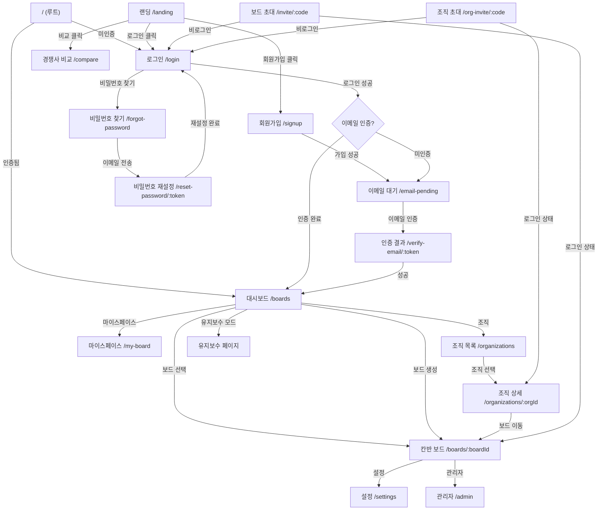

---

## 칸반 보드 내부 뷰 구조

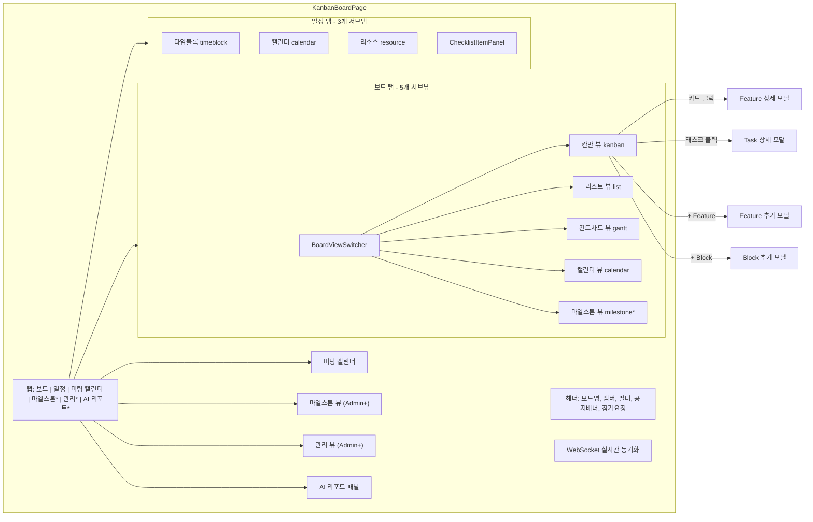

---

## 조직 상세 내부 뷰 구조 (NEW v1.7)

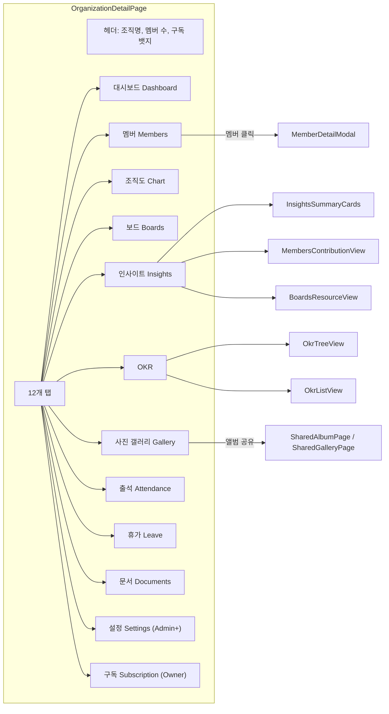

---

## 권한 체계

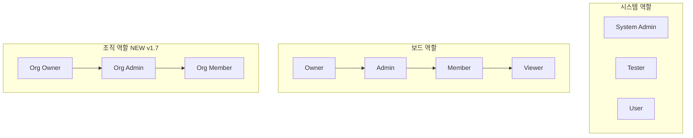

| 계층 | 역할 | 과금 | 핵심 권한 |
|------|------|:----:|----------|
| 보드 | Owner | O | 보드 삭제, 결제 관리 |
| 보드 | Admin | O | 멤버/블록/설정 관리 |
| 보드 | Member | O | Feature/Task 생성/수정, Slack/Discord 설정 |
| 보드 | Viewer | X | 읽기 전용 |
| 조직 | Owner | O | 조직 삭제, 구독 관리, 모든 설정 (NEW v1.7) |
| 조직 | Admin | O | 멤버 관리, 출석/휴가, 설정 (NEW v1.7) |
| 조직 | Member | O | 기본 조회, OKR 작성, 사진 업로드 (NEW v1.7) |
| 시스템 | Admin | - | 전체 시스템 관리, 공지/문의 관리, 모니터링 |
| 시스템 | Tester | - | 결제 UI 숨김 |
| 시스템 | User | - | 일반 사용자 |

---

## 핵심 데이터 흐름

### 1. Feature → Task 진행률 연동

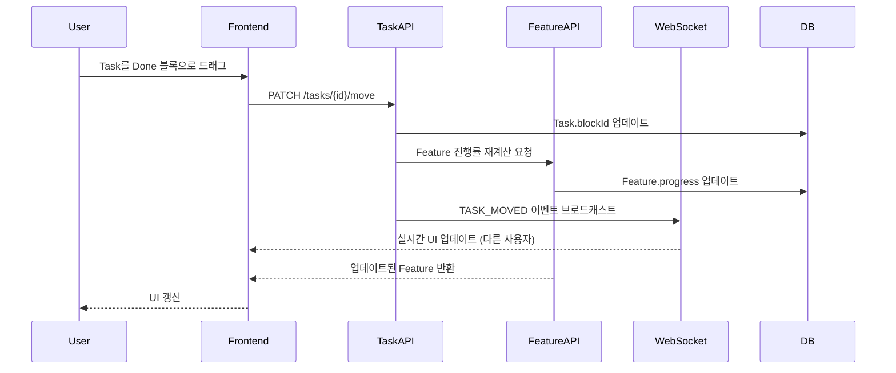

### 2. WebSocket 실시간 동기화

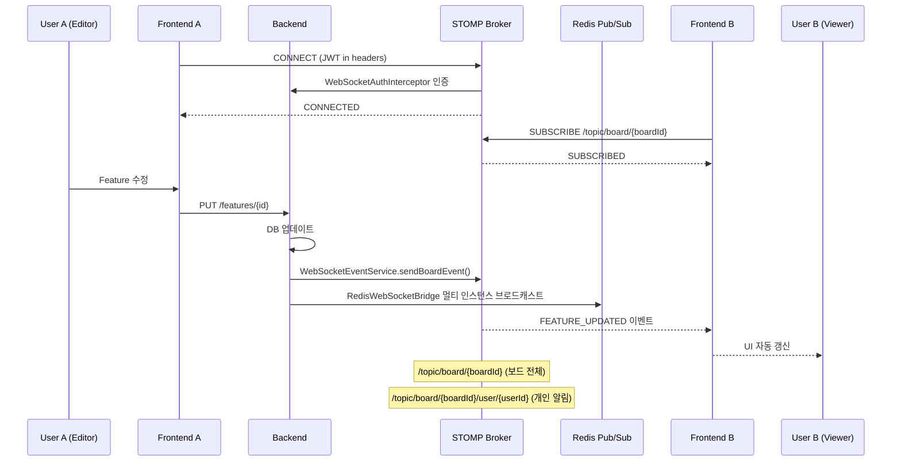

### 3. 노트 실시간 협업 (Yjs)

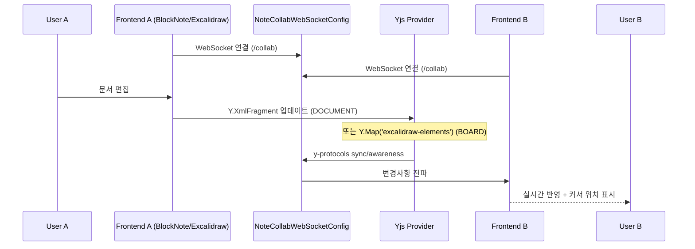

### 4. 보드 진입 통합 API

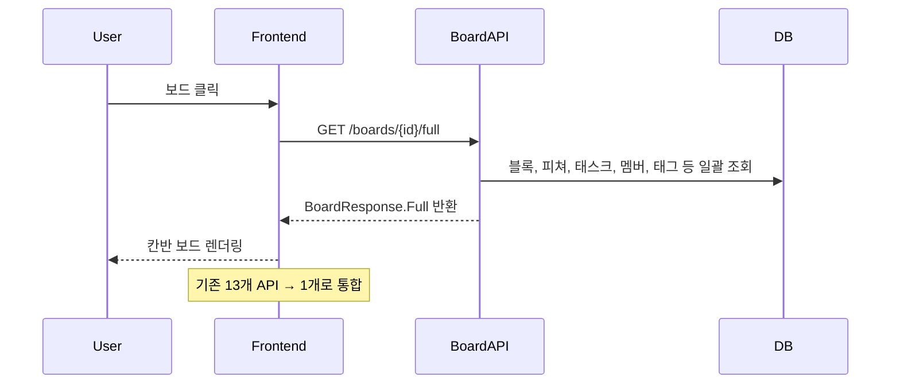

### 5. Slack/Discord 멘션 알림

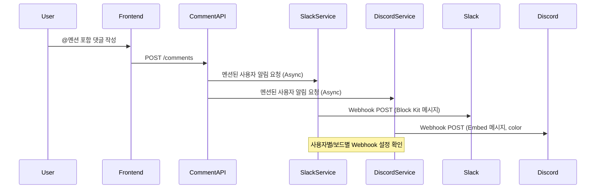

### 6. 서버 모니터링 & 알림

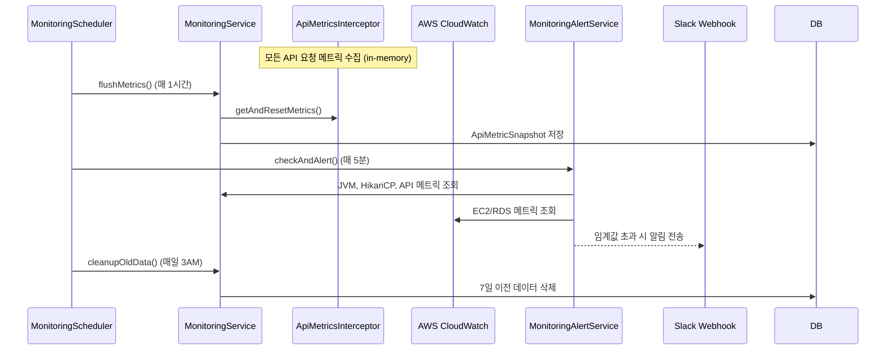

### 7. AI 크레딧 소비 흐름

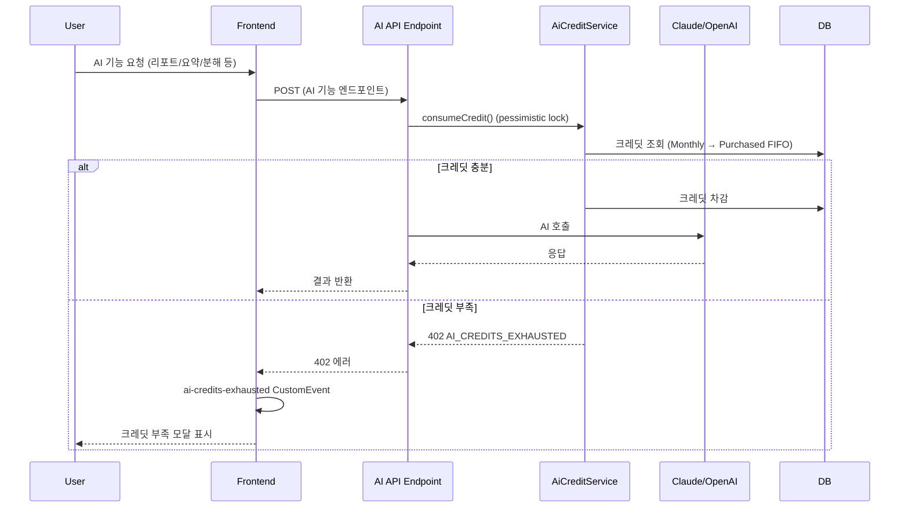

---

## 주요 컴포넌트 계층 구조

### 칸반 보드 페이지

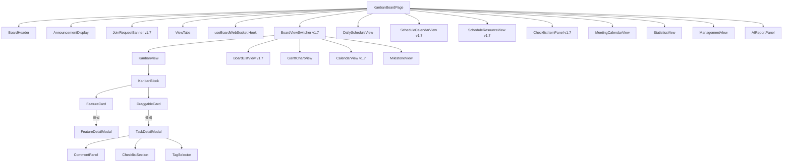

### 관리자 대시보드

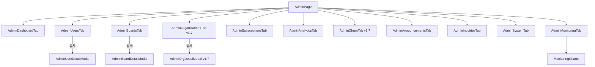

### 노트 에디터

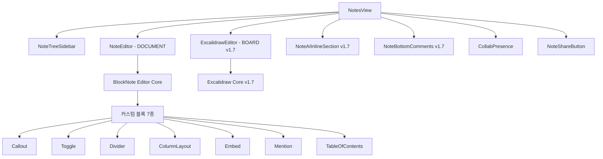

### 조직 상세 페이지 (NEW v1.7)

```mermaid
graph TD
    ODP[OrganizationDetailPage] --> DASH[OrgDashboardTab]
    ODP --> MEMB[OrgMembersTab]
    ODP --> CHART[OrgChartTab]
    ODP --> BOARDS[OrgBoardsTab]
    ODP --> INSIGHTS[OrgInsightsTab]
    ODP --> OKRT[OrgOkrTab]
    ODP --> GALLERY[OrgPhotoGalleryTab]
    ODP --> ATTEND[OrgAttendanceTab]
    ODP --> LEAVET[OrgLeaveTab]
    ODP --> DOCS[OrgDocumentsTab]
    ODP --> SETTINGS[OrgSettingsTab]

    DASH --> AW[AnniversaryWidget]
    DASH --> ATW[AttendanceWidget]
    DASH --> OBW[OnboardingWidget]
    DASH --> OKR_W[OkrDashboardWidget]
    DASH --> OAS[OrgAnnouncementSection]
    DASH --> OFS[OrgFeedSection]

    MEMB -->|클릭| MDM[MemberDetailModal]
    MDM --> MSB[MemberSidebar]
    MDM --> MPH[MemberProfileHeader]
    MDM --> MPT[MemberProfileTab]
    MDM --> MAT[MemberActivityTab]
    MDM --> MBT[MemberBoardsTab]
    MDM --> MHT[MemberHistoryTab]
    MDM --> MOT[MemberOneOnOneTab]
    MDM --> MST[MemberSettingsTab]

    OKRT --> OTV[OkrTreeView]
    OKRT --> OLV[OkrListView]
    OKRT --> OCS[OkrCycleSelector]
    OTV --> OON[OkrObjectiveNode]
    OON --> OKR[OkrKeyResultRow]
    OKR --> OCR[OkrChildrenRow]
    OKR --> OPB[OkrProgressBar]
    OKR --> OCB[OkrConfidenceBadge]
    OON -->|클릭| OOM[OkrObjectiveModal]
    OKR -->|체크인| OCIM[OkrCheckInModal]

    GALLERY --> PAB[PhotoAlbumBar]
    GALLERY --> PG[PhotoGrid]
    GALLERY --> PL[PhotoLightbox]
    GALLERY -->|업로드| PUM[PhotoUploadModal]
    GALLERY -->|앨범 생성| ACM[AlbumCreateModal]
    GALLERY -->|공유| ASB[AlbumShareButton]
    GALLERY -->|공유 관리| ASMM[AlbumShareManagerModal]

    INSIGHTS --> ISC[InsightsSummaryCards]
    INSIGHTS --> IPF[InsightsPeriodFilter]
    INSIGHTS --> MCV2[MembersContributionView]
    INSIGHTS --> BRV[BoardsResourceView]
    INSIGHTS --> RDC[ResourceDistributionChart]

    SETTINGS --> SGST[OrgSettingsGeneralSubTab]
    SETTINGS --> SSST[OrgSettingsStructureSubTab]
    SETTINGS --> SAST[OrgSettingsAttendanceSubTab]
    SETTINGS --> SOST[OrgSettingsOnboardingSubTab]
```

### 개인 스페이스

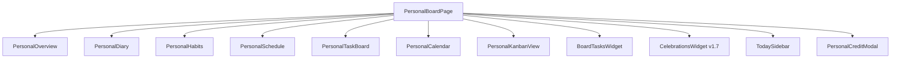

### 랜딩 페이지 컴포넌트

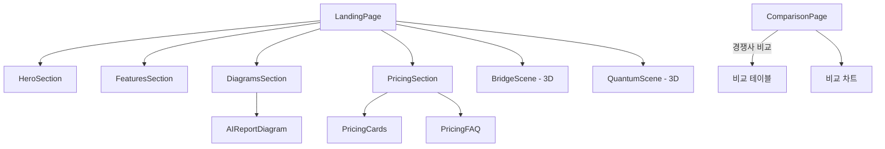

---

## 데이터베이스 스키마 (핵심 테이블)

| 테이블 | 설명 | 주요 컬럼 |
|--------|------|-----------|
| users | 사용자 | id, email, name, system_role, last_active_at |
| boards | 보드 | id, name, owner_id, tier, status, deleted_at, background_gradient |
| board_members | 보드 멤버십 | board_id, user_id, role, assignee_color, display_order |
| blocks | 칸반 블록 | id, board_id, name, position, is_fixed |
| features | 피쳐 카드 | id, board_id, title, description, progress, start_date |
| tasks | 태스크 카드 | id, feature_id, block_id, title, assignee_id, baseline_start, baseline_end |
| task_dependencies | 태스크 의존성 | id, task_id, depends_on_task_id |
| tags | 태그 | id, board_id, name, color |
| checklists | 체크리스트 | id, task_id, content, is_checked |
| comments | 댓글 | id, task_id, user_id, content |
| comment_attachments | 댓글 첨부파일 | id, comment_id, file_url |
| comment_reactions | 댓글 리액션 | id, comment_id, user_id, emoji |
| notifications | 알림 | id, user_id, type, content, is_read |
| invite_links | 초대 링크 | id, board_id, code, role, expires_at |
| subscriptions | 구독 | id, board_id, tier, status, expires_at, monthly_ai_credits, purchased_credits |
| meetings | 미팅 | id, board_id, title, meeting_date, recurrence_rule, recurrence_group_id, diarized_transcript |
| member_slack_webhooks | Slack 웹훅 | id, board_id, user_id, webhook_url |
| member_discord_webhooks | Discord 웹훅 | id, board_id, user_id, webhook_url (NEW v1.7) |
| discord_bot_configs | Discord Bot 설정 | id, board_id, guild_id, channel_id (NEW v1.7) |
| discord_user_links | Discord 사용자 링크 | id, user_id, discord_user_id (NEW v1.7) |
| slack_installations | Slack 앱 설치 | id, board_id, team_id (NEW v1.7) |
| slack_user_links | Slack 사용자 링크 | id, user_id, slack_user_id (NEW v1.7) |
| slack_event_logs | Slack 이벤트 로그 | id, event_type, created_at (NEW v1.7) |
| announcements | 공지사항 | id, title, type, is_active |
| inquiries | 문의 | id, user_id, title, status |
| weekly_reports | AI 주간 리포트 | id, board_id, report_type, content |
| notes | 노트 | id, board_id, title, type (FOLDER/DOCUMENT/BOARD), content |
| note_comments | 노트 댓글 | id, note_id, user_id, content |
| note_collab_states | 노트 협업 상태 | id, note_id, state |
| note_sharing | 노트 공유 | id, note_id, share_token |
| board_custom_emojis | 커스텀 이모지 | id, board_id, name, url |
| board_join_requests | 보드 참가 요청 | id, board_id, user_id, status (NEW v1.7) |
| board_resources | 보드 리소스 | id, board_id, name, type (NEW v1.7) |
| mention_groups | 멘션 그룹 | id, board_id, name, member_ids (NEW v1.7) |
| api_metric_snapshots | API 메트릭 스냅샷 | id, endpoint, snapshot_time, avg_response_ms |
| monitoring_config | 모니터링 설정 | config_key, config_value |
| device_tokens | FCM 디바이스 토큰 | id, user_id, token, platform |
| personal_events | 개인 이벤트 | id, user_id, title, event_type, recurrence |
| personal_tasks | 개인 태스크 | id, user_id, title, priority |
| personal_habits | 개인 습관 | id, user_id, title, importance |
| diaries | 다이어리 | id, user_id, content, voice_url |
| organizations | 조직 | id, name, owner_id, hr_system_enabled (NEW v1.7) |
| org_members | 조직 멤버 | id, org_id, user_id, role, department_id (NEW v1.7) |
| org_departments | 조직 부서 | id, org_id, name, parent_id (NEW v1.7) |
| org_department_boards | 부서-보드 연결 | org_id, department_id, board_id (NEW v1.7) |
| org_announcements | 조직 공지 | id, org_id, title, content (NEW v1.7) |
| org_announcement_comments | 조직 공지 댓글 | id, announcement_id, user_id (NEW v1.7) |
| org_photo_tabs | 조직 사진 탭 | id, org_id, name, share_token (NEW v1.7) |
| org_photos | 조직 사진 | id, tab_id, file_url (NEW v1.7) |
| okr_cycles | OKR 주기 | id, org_id, name, start_date, end_date (NEW v1.7) |
| okr_objectives | OKR 목표 | id, cycle_id, title, owner_id (NEW v1.7) |
| okr_key_results | OKR 핵심 결과 | id, objective_id, title, progress (NEW v1.7) |
| okr_check_ins | OKR 체크인 | id, key_result_id, value, note (NEW v1.7) |
| org_subscriptions | 조직 구독 | id, org_id, plan, status (NEW v1.7) |
| leave_balance_adjustments | 휴가 잔여 조정 | id, member_id, type, amount (NEW v1.7) |
| member_histories | 멤버 이력 | id, member_id, event_type, details (NEW v1.7) |

---

## API 엔드포인트 (주요)

### 인증
- `POST /auth/signup` - 회원가입
- `POST /auth/login` - 로그인
- `POST /auth/logout` - 로그아웃
- `POST /auth/refresh` - Access Token 갱신
- `POST /auth/google` - Google OAuth2 로그인

### 보드
- `GET /boards` - 보드 목록
- `POST /boards` - 보드 생성
- `GET /boards/{id}` - 보드 상세
- `GET /boards/{id}/full` - 보드 통합 조회
- `PUT /boards/{id}` - 보드 수정
- `DELETE /boards/{id}` - 보드 삭제 (Owner)

### 블록
- `GET /boards/{id}/blocks` - 블록 목록
- `POST /boards/{id}/blocks` - 커스텀 블록 생성
- `PUT /boards/{id}/blocks/{blockId}` - 블록 수정
- `DELETE /boards/{id}/blocks/{blockId}` - 블록 삭제

### 미팅
- `POST /boards/{id}/meetings` - 미팅 생성 (반복 일정 포함)
- `GET /boards/{id}/meetings/range` - 날짜 범위 미팅 조회
- `PUT /boards/{id}/meetings/{meetingId}?scope=THIS_ONLY|THIS_AND_FUTURE` - 미팅 수정
- `DELETE /boards/{id}/meetings/{meetingId}?scope=THIS_ONLY|THIS_AND_FUTURE` - 미팅 삭제

### 스케줄 (통합 API)
- `GET /boards/{id}/schedules/weekly` - 주간 통합 조회
- `GET /boards/{id}/schedules/daily-full` - 데일리 통합 조회
- `GET /boards/{id}/checklist-items/by-assignee` - 담당자별 체크리스트 (NEW v1.7)

### AI 리포트
- `POST /boards/{id}/reports` - AI 리포트 생성
- `GET /boards/{id}/reports` - 리포트 목록
- `POST /boards/{id}/reports/{reportId}/regenerate` - 리포트 재생성

### AI 크레딧
- `GET /boards/{id}/ai-credits` - AI 크레딧 조회
- `POST /boards/{id}/ai-credits/purchase` - 크레딧 구매
- `GET /boards/{id}/ai-credits/purchases` - 구매 이력

### 모니터링
- `GET /admin/monitoring/dashboard` - 통합 모니터링 대시보드
- `GET /admin/monitoring/api-metrics/history` - API 메트릭 이력
- `GET /admin/monitoring/cloudwatch` - CloudWatch 메트릭
- `GET /admin/monitoring/alert-config` - 알림 설정 조회
- `PUT /admin/monitoring/alert-config` - 알림 설정 수정
- `POST /admin/monitoring/alert-test` - 테스트 알림 전송

### Slack 연동
- `POST /boards/{id}/slack-webhook` - Slack 웹훅 등록
- `GET /boards/{id}/slack-webhook/status` - 상태 조회
- `GET /auth/slack/install` - Slack 앱 설치 (NEW v1.7)
- `GET /auth/slack/callback` - Slack OAuth 콜백 (NEW v1.7)

### Discord 연동 (NEW v1.7)
- `POST /boards/{id}/discord-webhook` - Discord 웹훅 등록
- `GET /boards/{id}/discord-webhook/status` - 상태 조회
- `PUT /boards/{id}/discord-webhook/{webhookId}` - 웹훅 수정
- `DELETE /boards/{id}/discord-webhook/{webhookId}` - 웹훅 삭제
- `POST /boards/{id}/discord-webhook/test` - 테스트 알림

### 조직 (NEW v1.7)
- `GET /organizations` - 조직 목록
- `POST /organizations` - 조직 생성
- `GET /organizations/{orgId}` - 조직 상세
- `PUT /organizations/{orgId}` - 조직 수정
- `DELETE /organizations/{orgId}` - 조직 삭제
- `GET /organizations/{orgId}/members` - 멤버 목록
- `POST /organizations/{orgId}/members/invite` - 멤버 초대
- `GET /organizations/{orgId}/chart` - 조직도
- `GET /organizations/{orgId}/boards` - 연결 보드 목록
- `GET /organizations/{orgId}/insights` - 인사이트 데이터
- `GET /organizations/{orgId}/announcements` - 조직 공지사항
- `GET /organizations/{orgId}/attendance` - 출석 현황
- `GET /organizations/{orgId}/leave` - 휴가 관리
- `GET /organizations/{orgId}/activities` - 활동 로그
- `GET /organizations/{orgId}/onboarding` - 온보딩 관리

### OKR (NEW v1.7)
- `GET /organizations/{orgId}/okr/cycles` - OKR 주기 목록
- `POST /organizations/{orgId}/okr/cycles` - OKR 주기 생성
- `GET /organizations/{orgId}/okr/objectives` - 목표 목록
- `POST /organizations/{orgId}/okr/objectives` - 목표 생성
- `POST /organizations/{orgId}/okr/key-results` - 핵심 결과 생성
- `POST /organizations/{orgId}/okr/check-ins` - 체크인 기록

### 사진 앨범 (NEW v1.7)
- `GET /organizations/{orgId}/photos/tabs` - 앨범 탭 목록
- `POST /organizations/{orgId}/photos/tabs` - 앨범 탭 생성
- `POST /organizations/{orgId}/photos/upload` - 사진 업로드
- `GET /shared/album/{shareToken}` - 공유 앨범 조회 (Public)
- `GET /shared/gallery/{shareToken}` - 공유 갤러리 조회 (Public)

### 멘션 그룹 (NEW v1.7)
- `GET /boards/{id}/mention-groups` - 멘션 그룹 목록
- `POST /boards/{id}/mention-groups` - 멘션 그룹 생성
- `PUT /boards/{id}/mention-groups/{groupId}` - 멘션 그룹 수정
- `DELETE /boards/{id}/mention-groups/{groupId}` - 멘션 그룹 삭제

### 노트
- `GET /boards/{id}/notes` - 노트 목록 (DOCUMENT + BOARD)
- `POST /boards/{id}/notes` - 노트 생성 (type: FOLDER/DOCUMENT/BOARD)
- `PUT /boards/{id}/notes/{noteId}` - 노트 수정
- `POST /boards/{id}/notes/{noteId}/share` - 노트 공유 링크 생성
- `GET /shared/note/{shareToken}` - 공유 노트 조회 (Public)

### WebSocket
- `CONNECT /ws` - STOMP WebSocket 연결 (SockJS fallback)
- `SUBSCRIBE /topic/board/{boardId}` - 보드 실시간 이벤트 구독
- `SUBSCRIBE /topic/board/{boardId}/user/{userId}` - 개인 알림 구독
- `CONNECT /collab` - 노트 협업 WebSocket (Yjs) (NEW v1.7)

---

## 인프라 구성 (AWS)

### Terraform 모듈

| 모듈 | 리소스 | 설명 |
|------|--------|------|
| vpc | VPC, Subnet, IGW, NAT | 네트워크 인프라 |
| security-groups | Security Groups | 보안 그룹 설정 |
| elastic-beanstalk | EB Environment, ASG | Backend 배포 환경 |
| rds | RDS Aurora Serverless v2 | Production DB |
| rds-simple | RDS PostgreSQL Standard | Development DB |
| elasticache | ElastiCache Redis | Production 캐시 + WebSocket Pub/Sub |
| s3-cloudfront | S3, CloudFront | Frontend 정적 파일 + 파일 업로드 |
| acm-certificate | ACM Certificate | SSL 인증서 |
| route53 | Route53 Hosted Zone | DNS 관리 |

### 환경별 구성

| 환경 | Backend | DB | Cache | CDN |
|------|---------|----|----|-----|
| Local | Spring Boot | H2 | Simple | - |
| Dev | Elastic Beanstalk | RDS Standard | Redis | CloudFront |
| Prod | Elastic Beanstalk | Aurora Serverless v2 | ElastiCache Redis | CloudFront |

### CI/CD 파이프라인

| 워크플로우 | 트리거 | 역할 |
|-----------|--------|------|
| ci.yml | PR/push to develop | 백엔드 빌드+테스트 (PostgreSQL+Redis), 프론트 타입체크 |
| deploy-dev.yml | CI 성공 on develop | EB 배포 + S3 동기화 (dev+prod) + CloudFront 무효화 |
| deploy-mobile.yml | 수동 | Capacitor 빌드 → iOS (TestFlight) / Android (Play Store) |
| terraform.yml | PR on terraform paths | Terraform plan/apply (dev, prod) |

---

## 변경 이력 (v1.7.0)

### Frontend
- **추가**: `contexts/OrgDataContext.tsx` - 조직 데이터 캐싱 Context
- **추가**: `components/organization/` - 조직 관리 컴포넌트 (73개 파일)
  - `tabs/` - 11개 탭 (Dashboard, Members, Chart, Boards, Insights, OKR, PhotoGallery, Attendance, Leave, Documents, Settings)
  - `tabs/insights/` - 인사이트 서브뷰 (7개: BoardsResourceView, InsightsPeriodFilter, InsightsSummaryCards, insightsUtils, MemberContributionDetailDrawer, MembersContributionView, ResourceDistributionChart)
  - `okr/` - OKR 컴포넌트 (13개: OkrCheckInModal, OkrChildrenRow, OkrConfidenceBadge, OkrCreateModal, OkrCycleSelector, OkrDashboardWidget, OkrKeyResultRow, OkrListView, OkrObjectiveModal, OkrObjectiveNode, OkrProgressBar, OkrSummaryCard, OkrTreeView)
  - `photo/` - 사진 앨범 (7개: AlbumCreateModal, AlbumShareButton, AlbumShareManagerModal, PhotoAlbumBar, PhotoGrid, PhotoLightbox, PhotoUploadModal)
  - `member/` - 멤버 상세 (8개: MemberActivityTab, MemberBoardsTab, MemberHistoryTab, MemberOneOnOneTab, MemberProfileHeader, MemberProfileTab, MemberSettingsTab, MemberSidebar)
  - `settings/` - 조직 설정 (9개)
  - `subscription/` - 구독 관리 (4개)
  - 루트 위젯 (14개: AnniversaryWidget, AttendanceWidget, OnboardingWidget 등)
- **추가**: `components/schedule/` - 일정 서브뷰 (4개: ScheduleCalendarView, ScheduleResourceView, ChecklistItemPanel, ChecklistDragItem)
- **추가**: `components/slack/` - Slack 연동 (2개: SlackIntegrationPanel, SlackOAuthCallback)
- **추가**: `components/BoardViewSwitcher.tsx` - 보드 5개 서브뷰 전환 바
- **추가**: `components/BoardListView.tsx` - 테이블 기반 리스트 뷰
- **추가**: `components/BoardResourceAddModal.tsx` - 리소스 추가 모달
- **추가**: `components/DiscordSettingsPanel.tsx` - Discord 웹훅 설정 패널
- **추가**: `components/JoinRequestBanner.tsx` - 참가 요청 배너
- **추가**: `components/JoinRequestsPanel.tsx` - 참가 요청 관리 패널
- **추가**: `components/MentionGroupModal.tsx` - 멘션 그룹 관리 모달
- **추가**: `components/notes/ExcalidrawEditor.tsx` - Excalidraw 화이트보드 에디터
- **추가**: `components/notes/NoteAIInlineSection.tsx` - AI 인라인 제안
- **추가**: `components/notes/NoteBottomComments.tsx` - 하단 댓글 영역
- **추가**: `components/ui/` - 신규 UI 컴포넌트 (IconButton, MotionModal, MobileBottomNav, ColorPickerPopover, GradientPickerPopover, AmbientBackground, TaskCardSkeleton, TimePicker)
- **추가**: `pages/OrganizationPage.tsx` - 조직 목록 페이지
- **추가**: `pages/OrganizationDetailPage.tsx` - 조직 상세 페이지
- **추가**: `pages/OrgInviteAcceptPage.tsx` - 조직 초대 수락 페이지
- **추가**: `pages/SharedAlbumPage.tsx` - 공유 앨범 페이지
- **추가**: `pages/SharedGalleryPage.tsx` - 공유 갤러리 페이지
- **추가**: `pages/GalleryUploadPage.tsx` - 갤러리 업로드 페이지
- **추가**: `components/admin/AdminOrganizationsTab.tsx` - 관리자 조직 관리 탭
- **추가**: `components/admin/AdminOrgDetailModal.tsx` - 관리자 조직 상세 모달
- **추가**: `components/admin/AdminChurnTab.tsx` - 관리자 이탈 분석 탭
- **추가**: `components/admin/AdminConfirmModal.tsx` - 관리자 확인 모달
- **추가**: `hooks/useHolidays.ts` - 공휴일 데이터 훅
- **추가**: `hooks/useVisualViewport.ts` - 가상 키보드 대응 훅
- **추가**: `utils/` - 11개 신규 유틸리티 (boardUtils, collabProvider, deepLinks, domain, jobGroupColor, lazyWithRetry, nativeAuth, nativeCalendar, nativeDownload, platform, pushNotifications)
- **추가**: `styles/excalidraw-bridge.css` - Excalidraw 테마 스타일
- **추가**: `components/dashboard/MySpaceSummaryStrip.tsx` - 마이스페이스 요약 스트립
- **추가**: `components/dashboard/OrgSummaryStrip.tsx` - 조직 요약 스트립
- **추가**: `components/dashboard/MyTasksWidget.tsx` - 내 태스크 위젯
- **추가**: `components/personal/CelebrationsWidget.tsx` - 기념일 위젯
- **추가**: `components/personal/BoardTasksWidget.tsx` - 보드 태스크 위젯
- **변경**: 컴포넌트 총 312개 TSX/TS 파일 (v1.6: 207개)
- **변경**: UI 컴포넌트 50개 → 58개
- **변경**: 훅 11개 → 14개
- **변경**: 유틸리티 6개 → 17개
- **변경**: 페이지 10개 → 17개
- **변경**: 보드 뷰 구조: 탭 기반에서 서브뷰 방식으로 개편 (kanban|list|gantt|calendar|milestone)
- **변경**: 일정 탭: 3개 서브탭 추가 (timeblock|calendar|resource)
- **변경**: 노트 NoteType에 BOARD (화이트보드) 추가

### Backend
- **추가**: `domain/organization/` - 조직 관리 도메인 (145개 파일, 14개 컨트롤러)
  - OrganizationController, OrgMemberController, OrgChartController, OrgBoardController, OrgInviteController, OrgInsightsController, OrgAttendanceController, OrgAnnouncementController, OrgAnniversaryController, OrgOnboardingController, OrgOneOnOneController, OrgMemberHistoryController, OrgActivityController, LeaveController
- **추가**: `domain/okr/` - OKR 도메인 (20개 파일, OkrController)
  - OkrCycle, OkrObjective, OkrKeyResult, OkrCheckIn 엔티티
- **추가**: `domain/photo/` - 사진 앨범 도메인 (9개 파일)
  - OrgPhotoController, PublicAlbumController
- **추가**: `domain/integration/discord/` - Discord 연동 (DiscordController, DiscordService, DiscordNotificationService, DiscordBotService, DiscordBotConfig, DiscordUserLink)
- **추가**: `domain/mentiongroup/` - 멘션 그룹 도메인 (7개 파일)
- **추가**: `domain/integration/BrandResolver.java` - 공유 브랜드 해석기 (slack에서 이동)
- **추가**: `domain/integration/FrontendOriginResolver.java` - 프론트엔드 오리진 해석
- **추가**: `global/config/FlywayRepairConfig.java` - Flyway 복구 설정
- **추가**: `global/config/SchemaMigrationConfig.java` - 스키마 마이그레이션 설정
- **추가**: `global/config/SchemaMigrationInitializer.java` - 레거시 패치 (멱등)
- **추가**: `global/config/NoteCollabWebSocketConfig.java` - 노트 실시간 협업 WebSocket
- **추가**: `global/config/RedisWebSocketConfig.java` - Redis WebSocket 브릿지
- **추가**: `global/config/LocalUploadConfig.java` - 로컬 파일 업로드 설정
- **추가**: `global/config/RestTemplateConfig.java` - RestTemplate 빈 설정
- **추가**: `global/scheduler/AnniversaryNotificationScheduler.java` - 기념일 알림 스케줄러
- **추가**: `global/scheduler/BoardCleanupScheduler.java` - 삭제 보드 정리
- **추가**: `global/scheduler/DailyStandupScheduler.java` - 스탠드업 알림
- **추가**: `global/scheduler/ExpiredTokenCleanupScheduler.java` - 만료 토큰 정리
- **추가**: `global/scheduler/PersonalTaskCleanupScheduler.java` - 개인 태스크 정리
- **추가**: `global/scheduler/SubscriptionScheduler.java` - 구독 상태 관리
- **추가**: `global/websocket/NoteCollabHandler.java` - 노트 협업 핸들러
- **추가**: `global/websocket/RedisWebSocketBridge.java` - Redis WS 브릿지
- **추가**: `global/websocket/WebSocketSubscriptionListener.java` - WS 구독 리스너
- **추가**: `global/websocket/InstanceIdHolder.java` - 멀티 인스턴스 ID
- **변경**: 도메인 패키지 27개 → 38개
- **변경**: 총 Java 파일 409개 → 606개
- **변경**: 컨트롤러 51개 → 78개
- **변경**: 전역 설정 파일 30개 → 60개 (config 22개, scheduler 9개, websocket 6개)
- **변경**: Flyway 마이그레이션 V30 → V94 + 16개 타임스탬프 기반 (총 105개)
  - V31~V94: AI 크레딧, 노트 협업/공유/댓글, 태스크 의존성, 개인 스페이스, 다이어리, 디바이스 토큰, OKR, 조직, 사진 앨범 등
  - 타임스탬프 기반 16개: Discord 연동, 사진 갤러리, Slack OAuth, 보드 참가 요청, 노트 화이트보드, 보드 리소스, 멘션 그룹, 마일스톤 블록 관리 등
- **변경**: `domain/personal/` 확장 (38개 파일, 6개 컨트롤러: PersonalSpaceController, PersonalDashboardController, PersonalEventController, PersonalHabitController, PersonalTaskController, PersonalCalendarController)
- **변경**: `domain/note/` NoteType에 BOARD 추가 (화이트보드)

---

## 변경 이력 (v1.6.0)

### Frontend
- **추가**: `hooks/useBoardWebSocket.ts` - 보드별 WebSocket 실시간 동기화 훅
- **추가**: `utils/websocket.ts` - WebSocketManager 싱글턴 (STOMP/SockJS)
- **추가**: `components/notes/blocks/` - BlockNote 커스텀 블록 7종 (Callout, Toggle, Divider, ColumnLayout, Embed, Mention, TableOfContents)
- **추가**: `components/MeetingCalendarView.tsx` - 월간 미팅 캘린더 뷰
- **추가**: `components/admin/AdminMonitoringTab.tsx` - 관리자 모니터링 대시보드
- **추가**: `components/admin/MonitoringCharts.tsx` - 모니터링 차트
- **추가**: `styles/blocknote-dark.css` - BlockNote 다크테마 스타일
- **변경**: `components/notes/NoteEditor.tsx` - Tiptap → BlockNote 에디터 마이그레이션
- **변경**: `utils/services.ts` - monitoringService 추가
- **변경**: `types/index.ts` - WebSocket, Monitoring, Meeting recurrence 타입 추가
- **변경**: `pages/AdminPage.tsx` - Monitoring 탭 추가
- **변경**: `pages/KanbanBoardPage.tsx` - WebSocket 통합
- **변경**: `components/MeetingView.tsx` - 반복 일정 UI
- **삭제**: `components/notes/NoteEditorToolbar.tsx` - Tiptap 전용 (BlockNote 마이그레이션)
- **삭제**: `components/notes/TableBubbleMenu.tsx` - Tiptap 전용
- **삭제**: `components/notes/extensions/CustomTableCell.ts` - Tiptap 전용
- **삭제**: `components/notes/extensions/CustomTableHeader.ts` - Tiptap 전용
- **삭제**: `styles/tiptap.css` - Tiptap 전용 스타일

### Backend
- **추가**: `domain/monitoring/` - 서버 모니터링 도메인 (Controller, Service, AlertService, Entity, Repository, DTOs)
- **추가**: `global/config/WebSocketConfig.java` - STOMP WebSocket 설정
- **추가**: `global/config/WebMvcConfig.java` - API 메트릭 인터셉터 등록
- **추가**: `global/config/CloudWatchConfig.java` - AWS CloudWatch 클라이언트
- **추가**: `global/websocket/` - WebSocket 이벤트 시스템 (BoardEventType, WebSocketEvent, WebSocketEventService)
- **추가**: `global/interceptor/ApiMetricsInterceptor.java` - API 성능 메트릭 수집
- **추가**: `global/security/WebSocketAuthInterceptor.java` - WebSocket JWT 인증
- **추가**: `global/scheduler/MonitoringScheduler.java` - 모니터링 스케줄러 (3 tasks)
- **변경**: `domain/meeting/` - 반복 일정 지원 (recurrence_rule, recurrence_group_id, recurrence_end_date)
- **변경**: `domain/notification/service/NotificationService.java` - WebSocket 실시간 알림 전송
- **변경**: `global/config/SecurityConfig.java` - WebSocket 경로 허용
- **변경**: 도메인 패키지 26개 → 27개 (monitoring 추가)
- **변경**: Flyway 마이그레이션 V16 → V30 (V17~V30 추가)
