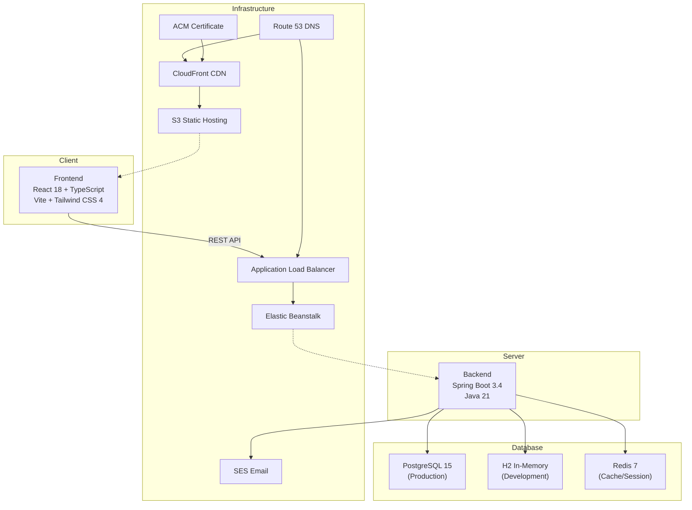

# Tech Stack

## 아키텍처 개요



---

## Frontend

### Core

| 기술 | 버전 | 용도 |
|------|------|------|
| React | 18.3.1 | UI 라이브러리 |
| TypeScript | 5.x | 타입 안전성 |
| Vite | 6.3.5 | 빌드 도구 |
| Tailwind CSS | 4.1.12 | 유틸리티 CSS |
| React Router DOM | 7.12.0 | 클라이언트 라우팅 |

### 상태 관리

| 기술 | 용도 |
|------|------|
| React Context | Auth, Theme, DnD 상태 관리 |
| useState/useReducer | 로컬 컴포넌트 상태 |

> Zustand, Redux 등 외부 상태관리 라이브러리 미사용

### UI 컴포넌트

| 기술 | 버전 | 용도 |
|------|------|------|
| Radix UI | 다수 | 접근성 기반 헤드리스 컴포넌트 (50+) |
| shadcn/ui | - | Radix 기반 스타일드 컴포넌트 |
| Lucide React | 0.487.0 | 아이콘 라이브러리 |
| @mui/material | 7.3.5 | Material UI (레거시) |

### 드래그 앤 드롭

| 기술 | 버전 | 용도 |
|------|------|------|
| @dnd-kit/core | 6.3.1 | DnD 코어 |
| @dnd-kit/sortable | 10.0.0 | 정렬 기능 |
| @dnd-kit/modifiers | 9.0.0 | 드래그 모디파이어 |
| @dnd-kit/utilities | 3.2.2 | 유틸리티 |

### 애니메이션

| 기술 | 버전 | 용도 |
|------|------|------|
| Framer Motion | 12.26.1 | 고급 애니메이션 |
| Motion | 12.23.24 | 애니메이션 라이브러리 |
| tw-animate-css | 1.3.8 | Tailwind 애니메이션 |

### 3D 그래픽 (랜딩 페이지)

| 기술 | 버전 | 용도 |
|------|------|------|
| Three.js | 0.182.0 | 3D 라이브러리 |
| @react-three/fiber | 8.17.10 | React Three.js 렌더러 |
| @react-three/drei | 9.117.3 | R3F 헬퍼 |

### 데이터 & 시각화

| 기술 | 버전 | 용도 |
|------|------|------|
| Recharts | 2.15.2 | 차트 라이브러리 |
| date-fns | 3.6.0 | 날짜 유틸리티 |

### 폼 & 검증

| 기술 | 버전 | 용도 |
|------|------|------|
| React Hook Form | 7.55.0 | 폼 상태 관리 |
| Zod | - | 스키마 검증 (타입 참조) |

### 인증

| 기술 | 버전 | 용도 |
|------|------|------|
| @react-oauth/google | 0.13.4 | Google OAuth |
| Fetch API (네이티브) | - | HTTP 클라이언트 |

### UI 유틸리티

| 기술 | 버전 | 용도 |
|------|------|------|
| clsx | 2.1.1 | 조건부 클래스명 |
| tailwind-merge | 3.2.0 | Tailwind 클래스 병합 |
| class-variance-authority | 0.7.1 | 컴포넌트 변형 관리 |
| cmdk | 1.1.1 | 커맨드 메뉴 |
| embla-carousel-react | 8.6.0 | 캐러셀 |
| react-day-picker | 8.10.1 | 날짜 선택기 |
| sonner | 2.0.3 | 토스트 알림 |
| next-themes | 0.4.6 | 테마 관리 |

### 스타일링

| 기술 | 버전 | 용도 |
|------|------|------|
| @emotion/react | 11.14.0 | CSS-in-JS |
| @emotion/styled | 11.14.1 | 스타일드 컴포넌트 |

---

## Backend

### Core

| 기술 | 버전 | 용도 |
|------|------|------|
| Spring Boot | 3.4.1 | 웹 프레임워크 |
| Java | 21 LTS | 런타임 |
| Gradle | - | 빌드 시스템 |

### Spring Boot Starters

| 스타터 | 용도 |
|--------|------|
| spring-boot-starter-web | REST API |
| spring-boot-starter-data-jpa | ORM (JPA/Hibernate) |
| spring-boot-starter-security | 인증/인가 |
| spring-boot-starter-validation | 데이터 검증 |
| spring-boot-starter-mail | 이메일 발송 |
| spring-boot-starter-thymeleaf | 이메일 템플릿 |
| spring-boot-starter-actuator | 헬스 모니터링 |
| spring-boot-starter-data-redis | Redis 연동 |
| spring-boot-starter-cache | 캐시 프레임워크 |

### 인증 & 보안

| 기술 | 버전 | 용도 |
|------|------|------|
| jjwt | 0.12.6 | JWT 생성/검증 |
| BCrypt | (Spring Security) | 비밀번호 해싱 |
| Google API Client | 2.2.0 | Google OAuth2 |
| Bucket4j | 8.0.1 | Rate Limiting |

### 데이터베이스

| 기술 | 환경 | 용도 |
|------|------|------|
| PostgreSQL | Prod/Dev | 주 데이터베이스 |
| H2 | Local | 인메모리 DB (개발) |
| Redis | Prod | 캐시/세션 |

### 데이터베이스 마이그레이션

| 도구 | 용도 |
|------|------|
| Flyway | 스키마 마이그레이션 (V1~V6) |
| JPA ddl-auto: update | Local 환경 자동 스키마 |

> Local 환경은 H2 + ddl-auto:update, Dev/Prod는 Flyway 마이그레이션 사용

### 유틸리티

| 기술 | 용도 |
|------|------|
| Lombok | 보일러플레이트 코드 감소 |
| Jackson | JSON 직렬화/역직렬화 |
| Hibernate | ORM 구현체 |

### API 설정

```yaml
# JSON 변환
jackson:
  property-naming-strategy: SNAKE_CASE
  default-property-inclusion: non_null

# JPA
jpa:
  hibernate.ddl-auto: update (dev) / validate (prod)
  properties.hibernate:
    format_sql: true
    default_batch_fetch_size: 100

# JWT
jwt:
  access-expiration: 3600000    # 1시간
  refresh-expiration: 604800000 # 7일
```

---

## Infrastructure (AWS)

### 서비스 구성

| 서비스 | 용도 | 설정 |
|--------|------|------|
| **VPC** | 네트워크 격리 | 퍼블릭/프라이빗 서브넷 |
| **S3** | 프론트엔드 정적 파일 호스팅 | - |
| **CloudFront** | CDN | HTTPS, 커스텀 도메인 |
| **Elastic Beanstalk** | 백엔드 배포 | Java 21, AL2023 |
| **RDS** | PostgreSQL 데이터베이스 | Dev: Standard, Prod: Aurora Serverless v2 |
| **ElastiCache** | Redis 캐시 | Prod만 |
| **ALB** | 로드 밸런서 | EB 자동 생성 |
| **ACM** | SSL 인증서 | 자동 갱신 |
| **Route 53** | DNS | A 레코드, ALIAS |
| **SES** | 이메일 발송 | 인증/알림 이메일 |

### IaC (Terraform)

```
infrastructure/terraform/
├── modules/
│   ├── vpc/                   # VPC 네트워크 모듈
│   ├── security-groups/       # 보안 그룹 모듈
│   ├── elastic-beanstalk/     # EB 환경 모듈
│   ├── rds/                   # RDS Aurora 모듈
│   ├── rds-simple/            # RDS Simple 모듈
│   ├── elasticache/           # ElastiCache Redis 모듈
│   ├── s3-cloudfront/         # S3+CF 모듈
│   ├── acm-certificate/       # SSL 인증서 모듈
│   └── route53/               # DNS 모듈
└── environments/
    ├── dev/                   # 개발 환경
    └── prod/                  # 프로덕션 환경
```

### CI/CD (GitHub Actions)

```
.github/workflows/
├── deploy-backend-dev.yml    # develop 브랜치 → Backend Dev 배포
├── deploy-backend-prod.yml   # main 브랜치 → Backend Prod 배포
├── deploy-frontend-dev.yml   # develop 브랜치 → Frontend Dev 배포
└── deploy-frontend-prod.yml  # main 브랜치 → Frontend Prod 배포
```

---

## 개발 환경 프로필

| 프로필 | DB | Cache | 용도 |
|--------|-----|-------|------|
| local | H2 (In-Memory) | Simple (In-Memory) | 로컬 개발 |
| dev | PostgreSQL | Simple (In-Memory) | 개발 서버 |
| prod | PostgreSQL | Redis | 프로덕션 |

### 로컬 개발 도구

```bash
# Docker (PostgreSQL, Redis)
docker-compose up -d

# Frontend
cd frontend && npm run dev    # Vite dev server (port 5173)

# Backend
cd backend && ./gradlew bootRun --args='--spring.profiles.active=local'  # port 8080
```

### Docker

**Backend Dockerfile** (Multi-stage build):
```
Stage 1: Gradle Build (eclipse-temurin:21-jdk)
Stage 2: Runtime (eclipse-temurin:21-jre)
- Timezone: Asia/Seoul
- Port: 8080
```

**docker-compose.yml**: PostgreSQL 15 + Redis 7 (로컬 개발)

---

## 환경 변수

### Frontend (.env)

| 변수 | 설명 | 기본값 |
|------|------|--------|
| VITE_API_BASE_URL | API 서버 URL | http://localhost:8080/api/v1 |
| VITE_GOOGLE_CLIENT_ID | Google OAuth Client ID | - |

### Backend

| 변수 | 설명 | 기본값 |
|------|------|--------|
| JWT_SECRET | JWT 서명 키 | default-dev-key |
| GOOGLE_CLIENT_ID | Google OAuth ID | - |
| DATABASE_URL | PostgreSQL URL | jdbc:postgresql://localhost:5432/kanban_dev |
| DB_USERNAME | DB 사용자 | - |
| DB_PASSWORD | DB 비밀번호 | - |
| REDIS_HOST | Redis 호스트 | localhost |
| REDIS_PORT | Redis 포트 | 6379 |
| REDIS_PASSWORD | Redis 비밀번호 | - |
| MAIL_USERNAME | SMTP 사용자 | - |
| MAIL_PASSWORD | SMTP 비밀번호 | - |
| FRONTEND_URL | 프론트엔드 Origin (CORS) | http://localhost:5173 |
| CACHE_TYPE | 캐시 타입 | redis |

---

## 의존성 요약

### Frontend: 70+ npm 패키지

**주요 카테고리:**
- Core: React 18, TypeScript, Vite 6, Tailwind 4
- Routing: React Router 7
- UI: Radix UI (15+ 컴포넌트), shadcn/ui, MUI (레거시)
- DnD: @dnd-kit 4개 패키지
- Animation: Framer Motion, Three.js (랜딩)
- Data: Recharts, date-fns
- Auth: Google OAuth
- Forms: React Hook Form

### Backend: Spring Boot 3.4 + 10+ starters

**주요 카테고리:**
- Web: spring-boot-starter-web
- Data: JPA, Redis, Cache
- Security: Spring Security, JWT, Google OAuth
- Communication: Mail, Thymeleaf
- Monitoring: Actuator
- Database: PostgreSQL, H2
- Utility: Lombok, Jackson, Bucket4j
