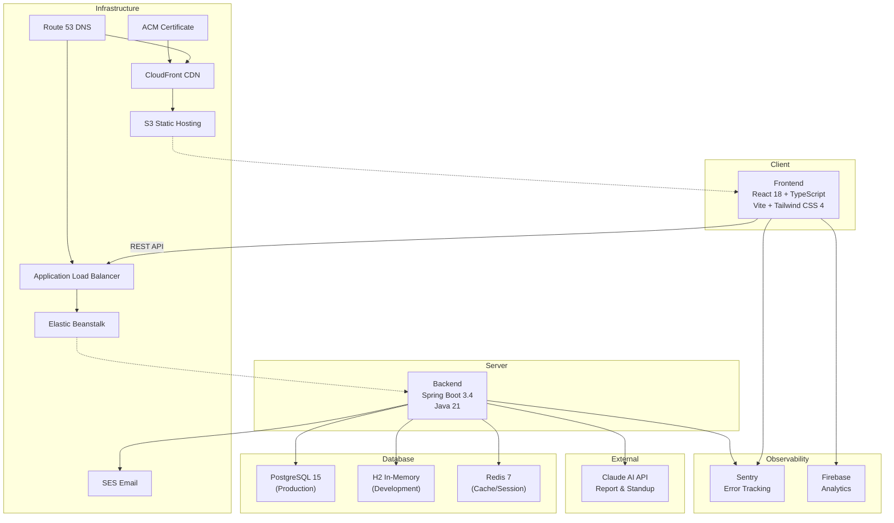

# Tech Stack

## 아키텍처 개요



---

## Frontend

### Core

| 기술 | 버전 | 용도 |
|------|------|------|
| React | 18.3.1 | UI 라이브러리 |
| TypeScript | 5.x | 타입 안전성 |
| Vite | 6.3.5 | 빌드 도구 |
| Tailwind CSS | 4.1.12 | 유틸리티 CSS |
| React Router DOM | 7.12.0 | 클라이언트 라우팅 |

### 상태 관리

| 기술 | 용도 |
|------|------|
| React Context | Auth, Theme, DnD 상태 관리 |
| useState/useReducer | 로컬 컴포넌트 상태 |

> Zustand, Redux 등 외부 상태관리 라이브러리 미사용

### UI 컴포넌트

| 기술 | 버전 | 용도 |
|------|------|------|
| Radix UI | 다수 | 접근성 기반 헤드리스 컴포넌트 (50+) |
| shadcn/ui | - | Radix 기반 스타일드 컴포넌트 |
| Lucide React | 0.487.0 | 아이콘 라이브러리 |
| @mui/material | 7.3.5 | Material UI (레거시) |

### 드래그 앤 드롭

| 기술 | 버전 | 용도 |
|------|------|------|
| @dnd-kit/core | 6.3.1 | DnD 코어 |
| @dnd-kit/sortable | 10.0.0 | 정렬 기능 |
| @dnd-kit/modifiers | 9.0.0 | 드래그 모디파이어 |
| @dnd-kit/utilities | 3.2.2 | 유틸리티 |

### 애니메이션

| 기술 | 버전 | 용도 |
|------|------|------|
| Framer Motion | 12.26.1 | 고급 애니메이션 |
| Motion | 12.23.24 | 애니메이션 라이브러리 |
| tw-animate-css | 1.3.8 | Tailwind 애니메이션 |

### 3D 그래픽 (랜딩 페이지)

| 기술 | 버전 | 용도 |
|------|------|------|
| Three.js | 0.182.0 | 3D 라이브러리 |
| @react-three/fiber | 8.17.10 | React Three.js 렌더러 |
| @react-three/drei | 9.117.3 | R3F 헬퍼 |

### 데이터 & 시각화

| 기술 | 버전 | 용도 |
|------|------|------|
| Recharts | 2.15.2 | 차트 라이브러리 |
| date-fns | 3.6.0 | 날짜 유틸리티 |

### 폼 & 검증

| 기술 | 버전 | 용도 |
|------|------|------|
| React Hook Form | 7.55.0 | 폼 상태 관리 |
| Zod | - | 스키마 검증 (타입 참조) |

### 인증

| 기술 | 버전 | 용도 |
|------|------|------|
| @react-oauth/google | 0.13.4 | Google OAuth |
| Fetch API (네이티브) | - | HTTP 클라이언트 |

### Observability

| 기술 | 버전 | 용도 |
|------|------|------|
| @sentry/react | ^8.0.0 | 에러 추적 및 모니터링 |
| firebase | ^10.8.0 | 사용자 행동 분석 (Analytics) |

### 다국어 지원 (i18n) (v1.5.0 업데이트)

| 기술 | 버전 | 용도 |
|------|------|------|
| i18next | - | 다국어 프레임워크 |
| react-i18next | - | React i18n 바인딩 |
| i18next-browser-languagedetector | - | 브라우저 언어 자동 감지 |

**지원 언어 (10개):**

| 코드 | 언어 | date-fns 로케일 |
|------|------|-----------------|
| ko | 한국어 | ko-KR |
| en | English | en-US |
| ja | 日本語 | ja-JP |
| zh | 中文(简体) | zh-CN |
| zh-TW | 中文(繁體) | zh-TW |
| hi | हिन्दी | hi |
| vi | Tiếng Việt | vi |
| es | Español | es |
| pt-BR | Português (Brasil) | pt-BR |
| th | ไทย | th |

> v1.2.0까지 2개(ko, en) 지원에서 v1.5.0에서 10개 언어로 확장. 8개 신규 locale 파일 추가. 브라우저 언어 자동 감지 및 date-fns 로케일 연동 강화.

**로케일 파일 구조:**
```
frontend/src/app/i18n/
├── index.ts          # i18n 초기화, 로케일 매핑
└── locales/
    ├── ko.json       # 한국어
    ├── en.json       # English
    ├── ja.json       # 日本語 (v1.5.0 신규)
    ├── zh.json       # 中文简体 (v1.5.0 신규)
    ├── zh-TW.json    # 中文繁體 (v1.5.0 신규)
    ├── hi.json       # हिन्दी (v1.5.0 신규)
    ├── vi.json       # Tiếng Việt (v1.5.0 신규)
    ├── es.json       # Español (v1.5.0 신규)
    ├── pt-BR.json    # Português BR (v1.5.0 신규)
    └── th.json       # ไทย (v1.5.0 신규)
```

### UI 유틸리티

| 기술 | 버전 | 용도 |
|------|------|------|
| clsx | 2.1.1 | 조건부 클래스명 |
| tailwind-merge | 3.2.0 | Tailwind 클래스 병합 |
| class-variance-authority | 0.7.1 | 컴포넌트 변형 관리 |
| cmdk | 1.1.1 | 커맨드 메뉴 |
| embla-carousel-react | 8.6.0 | 캐러셀 |
| react-day-picker | 8.10.1 | 날짜 선택기 |
| sonner | 2.0.3 | 토스트 알림 |
| next-themes | 0.4.6 | 테마 관리 |

### 스타일링

| 기술 | 버전 | 용도 |
|------|------|------|
| @emotion/react | 11.14.0 | CSS-in-JS |
| @emotion/styled | 11.14.1 | 스타일드 컴포넌트 |

---

## Backend

### Core

| 기술 | 버전 | 용도 |
|------|------|------|
| Spring Boot | 3.4.1 | 웹 프레임워크 |
| Java | 21 LTS | 런타임 |
| Gradle | - | 빌드 시스템 |

### Spring Boot Starters

| 스타터 | 용도 |
|--------|------|
| spring-boot-starter-web | REST API |
| spring-boot-starter-data-jpa | ORM (JPA/Hibernate) |
| spring-boot-starter-security | 인증/인가 |
| spring-boot-starter-validation | 데이터 검증 |
| spring-boot-starter-mail | 이메일 발송 |
| spring-boot-starter-thymeleaf | 이메일 템플릿 |
| spring-boot-starter-actuator | 헬스 모니터링 |
| spring-boot-starter-data-redis | Redis 연동 |
| spring-boot-starter-cache | 캐시 프레임워크 |

### 인증 & 보안

| 기술 | 버전 | 용도 |
|------|------|------|
| jjwt | 0.12.6 | JWT 생성/검증 |
| BCrypt | (Spring Security) | 비밀번호 해싱 |
| Google API Client | 2.2.0 | Google OAuth2 |
| Bucket4j | 8.0.1 | Rate Limiting |

### AI 통합 (v1.5.0 신규)

| 기술 | 용도 |
|------|------|
| Claude AI API | AI 리포트 생성 및 스탠드업 요약 |
| RestTemplate (Custom) | Claude API HTTP 클라이언트 |

**AI 설정 (application.yml):**

```yaml
ai:
  claude:
    api-key: ${CLAUDE_API_KEY:}
    model:
      team: ${CLAUDE_MODEL_TEAM:claude-sonnet-4-20250514}
      personal: ${CLAUDE_MODEL_PERSONAL:claude-haiku-4-5-20251001}
      standup: ${CLAUDE_MODEL_STANDUP:claude-haiku-4-5-20251001}
```

**AIConfig.java:**
- Custom `RestTemplate` with 10s connect timeout / 60s read timeout
- Prompt caching via `cache_control: ephemeral`
- Model selection by report type:
  - Team reports: Claude Sonnet (higher quality)
  - Personal reports: Claude Haiku (faster)
  - Standup summaries: Claude Haiku (faster)

### DailyStandupScheduler (v1.5.0 신규)

| 항목 | 설명 |
|------|------|
| Cron | `@Scheduled(cron = "0 * * * * *")` - 매분 실행 |
| 타임존 | UTC 기준 시간 매칭 |
| 알림 | Slack Block Kit 페이로드 생성 |
| 중복 방지 | 2분 쿨다운 (동일 보드 재발송 방지) |
| 다국어 | ko, en 지원 |

### Observability

| 도구 | 버전 | 용도 |
|------|------|------|
| Sentry (Backend) | 7.3.0 | Spring Boot 에러 추적 |
| Sentry (Frontend) | ^8.0.0 | React 에러 추적 |
| Firebase Analytics | ^10.8.0 | 사용자 행동 분석 |
| Spring Actuator | - | 헬스 모니터링 |

**Backend Sentry 설정 (application.yml):**

```yaml
sentry:
  dsn: ${SENTRY_DSN:}
  environment: ${SENTRY_ENVIRONMENT:local}
  release: ${app.version:0.0.1}
  traces-sample-rate: ${SENTRY_TRACES_SAMPLE_RATE:0.1}
  exception-resolver-order: -2147483647
  send-default-pii: false
  attach-stacktrace: true
  enable-tracing: true
  logging:
    minimum-event-level: error
    minimum-breadcrumb-level: info
```

> `io.sentry:sentry-spring-boot-starter-jakarta:7.3.0` 사용

### 데이터베이스

| 기술 | 환경 | 용도 |
|------|------|------|
| PostgreSQL | Prod/Dev | 주 데이터베이스 |
| H2 | Local | 인메모리 DB (개발) |
| Redis | Prod | 캐시/세션 |

### 데이터베이스 마이그레이션

| 도구 | 용도 |
|------|------|
| Flyway | 스키마 마이그레이션 (V1~V16) |
| JPA ddl-auto: update | Local 환경 자동 스키마 |

> Local 환경은 H2 + ddl-auto:update, Dev/Prod는 Flyway 마이그레이션 사용

**마이그레이션 히스토리 (V7~V16):**

| 버전 | 설명 |
|------|------|
| V7 | Announcements 테이블 |
| V8 | System config 테이블 |
| V9 | Nullable created_by (유저 삭제 대응) |
| V10 | users 테이블에 last_active_at 추가 |
| V11 | Inquiries + attachments + replies 테이블 |
| V12 | 문의 사항 유저 답변 지원 |
| V13 | has_new_reply 플래그 추가 |
| V14 | member_slack_webhooks 테이블 |
| V15 | drop_priority_from_features (Feature priority 제거) (v1.5.0 신규) |
| V16 | create_weekly_reports + daily_standup_configs (v1.5.0 신규) |

### 도메인 패키지

```
backend/src/main/java/com/kanban/domain/
├── board/              # 보드
├── task/               # 태스크
├── user/               # 유저
├── schedule/           # 스케줄
├── subscription/       # 구독/결제
├── activitylog/        # 활동 로그
├── integration/        # (v1.2.0 신규)
│   └── slack/          # Slack webhook 연동 (네이티브 RestTemplate, SDK 미사용)
├── announcement/       # (v1.2.0 신규) 시스템 공지사항
├── inquiry/            # (v1.2.0 신규) 유저 문의/지원 티켓 (15 files)
├── system/             # (v1.2.0 신규) 시스템 설정/유지보수
├── report/             # (v1.5.0 신규) AI 리포트 생성
│   ├── controller/     # ReportController
│   ├── service/        # ReportService, ReportAIService
│   ├── repository/     # WeeklyReportRepository
│   ├── entity/         # WeeklyReport
│   └── dto/            # ReportRequest, ReportResponse DTOs
└── standup/            # (v1.5.0 신규) 데일리 스탠드업
    ├── controller/     # StandupController
    ├── service/        # StandupService
    ├── scheduler/      # DailyStandupScheduler
    ├── repository/     # DailyStandupConfigRepository
    ├── entity/         # DailyStandupConfig
    └── dto/            # StandupConfig DTOs
```

### 글로벌 인프라 (v1.2.0 신규)

| 파일 | 용도 |
|------|------|
| `global/filter/ActivityTrackingFilter.java` | 유저 활동 추적 필터 |
| `global/filter/MaintenanceFilter.java` | 유지보수 모드 필터 |
| `global/scheduler/ActivityLogCleanupScheduler.java` | 활동 로그 정리 스케줄러 |

### 글로벌 설정 (v1.5.0 신규)

| 파일 | 용도 |
|------|------|
| `global/config/AIConfig.java` | Claude AI RestTemplate 설정 (10s connect / 60s read timeout) |

### API 통합 (v1.2.0 아키텍처 변경)

Facade Service 패턴을 적용하여 API 호출 횟수를 대폭 감소:

| 기능 | 변경 전 | 변경 후 | Facade |
|------|---------|---------|--------|
| 보드 진입 | 13 API calls | 1 (`GET /boards/{id}/full`) | `BoardFacadeService` |
| 주간 스케줄 | 7 API calls | 1 (`GET /schedules/weekly`) | `ScheduleFacadeService` |
| 일일 스케줄+체크리스트 | 2 API calls | 1 (`GET /schedules/daily-full`) | `ScheduleFacadeService` |

### 에러 코드 (v1.5.0 추가)

| 코드 | 설명 |
|------|------|
| AD002 | Admin validation 오류 |
| AD003 | Admin validation 오류 |
| SK004 | Slack Premium 기능 제한 |
| AR001 | AI Report 생성 실패 |
| AR002 | AI Report 요청 유효성 오류 |
| AR003 | AI Report 권한 부족 |
| AR004 | AI Report 조회 실패 |

### 유틸리티

| 기술 | 용도 |
|------|------|
| Lombok | 보일러플레이트 코드 감소 |
| Jackson | JSON 직렬화/역직렬화 |
| Hibernate | ORM 구현체 |

### API 설정

```yaml
# JSON 변환
jackson:
  property-naming-strategy: SNAKE_CASE
  default-property-inclusion: non_null

# JPA
jpa:
  hibernate.ddl-auto: update (dev) / validate (prod)
  properties.hibernate:
    format_sql: true
    default_batch_fetch_size: 100

# JWT
jwt:
  access-expiration: 3600000    # 1시간
  refresh-expiration: 604800000 # 7일
```

---

## Infrastructure (AWS)

### 서비스 구성

| 서비스 | 용도 | 설정 |
|--------|------|------|
| **VPC** | 네트워크 격리 | 퍼블릭/프라이빗 서브넷 |
| **S3** | 프론트엔드 정적 파일 호스팅 | - |
| **CloudFront** | CDN | HTTPS, 커스텀 도메인 |
| **Elastic Beanstalk** | 백엔드 배포 | Java 21, AL2023 |
| **RDS** | PostgreSQL 데이터베이스 | Dev: Standard, Prod: Aurora Serverless v2 |
| **ElastiCache** | Redis 캐시 | Prod만 |
| **ALB** | 로드 밸런서 | EB 자동 생성 |
| **ACM** | SSL 인증서 | 자동 갱신 |
| **Route 53** | DNS | A 레코드, ALIAS |
| **SES** | 이메일 발송 | 인증/알림 이메일 |

### IaC (Terraform)

```
infrastructure/terraform/
├── modules/
│   ├── vpc/                   # VPC 네트워크 모듈
│   ├── security-groups/       # 보안 그룹 모듈
│   ├── elastic-beanstalk/     # EB 환경 모듈 (v1.5.0: CLAUDE_API_KEY 환경변수 추가)
│   ├── rds/                   # RDS Aurora 모듈
│   ├── rds-simple/            # RDS Simple 모듈
│   ├── elasticache/           # ElastiCache Redis 모듈
│   ├── s3-cloudfront/         # S3+CF 모듈
│   ├── acm-certificate/       # SSL 인증서 모듈
│   └── route53/               # DNS 모듈
└── environments/
    ├── dev/                   # 개발 환경 (v1.5.0: claude_api_key 변수 추가)
    └── prod/                  # 프로덕션 환경 (v1.5.0: claude_api_key 변수 추가)
```

### CI/CD (GitHub Actions)

```
.github/workflows/
├── deploy-backend-dev.yml    # develop 브랜치 → Backend Dev 배포
├── deploy-backend-prod.yml   # main 브랜치 → Backend Prod 배포
├── deploy-frontend-dev.yml   # develop 브랜치 → Frontend Dev 배포
├── deploy-frontend-prod.yml  # main 브랜치 → Frontend Prod 배포
└── terraform.yml             # Terraform 인프라 배포 (v1.5.0: TF_VAR_claude_api_key 시크릿 추가)
```

---

## 개발 환경 프로필

| 프로필 | DB | Cache | 용도 |
|--------|-----|-------|------|
| local | H2 (In-Memory) | Simple (In-Memory) | 로컬 개발 |
| dev | PostgreSQL | Simple (In-Memory) | 개발 서버 |
| prod | PostgreSQL | Redis | 프로덕션 |

### 로컬 개발 도구

```bash
# Docker (PostgreSQL, Redis)
docker-compose up -d

# Frontend
cd frontend && npm run dev    # Vite dev server (port 5173)

# Backend
cd backend && ./gradlew bootRun --args='--spring.profiles.active=local'  # port 8080
```

### Docker

**Backend Dockerfile** (Multi-stage build):
```
Stage 1: Gradle Build (eclipse-temurin:21-jdk)
Stage 2: Runtime (eclipse-temurin:21-jre)
- Timezone: Asia/Seoul
- Port: 8080
```

**docker-compose.yml**: PostgreSQL 15 + Redis 7 (로컬 개발)

---

## 환경 변수

### Frontend (.env)

| 변수 | 설명 | 기본값 |
|------|------|--------|
| VITE_API_BASE_URL | API 서버 URL | http://localhost:8080/api/v1 |
| VITE_GOOGLE_CLIENT_ID | Google OAuth Client ID | - |

### Backend

| 변수 | 설명 | 기본값 |
|------|------|--------|
| JWT_SECRET | JWT 서명 키 | default-dev-key |
| GOOGLE_CLIENT_ID | Google OAuth ID | - |
| DATABASE_URL | PostgreSQL URL | jdbc:postgresql://localhost:5432/kanban_dev |
| DB_USERNAME | DB 사용자 | - |
| DB_PASSWORD | DB 비밀번호 | - |
| REDIS_HOST | Redis 호스트 | localhost |
| REDIS_PORT | Redis 포트 | 6379 |
| REDIS_PASSWORD | Redis 비밀번호 | - |
| MAIL_USERNAME | SMTP 사용자 | - |
| MAIL_PASSWORD | SMTP 비밀번호 | - |
| FRONTEND_URL | 프론트엔드 Origin (CORS) | http://localhost:5173 |
| CACHE_TYPE | 캐시 타입 | redis |
| SENTRY_DSN | Sentry DSN (에러 추적) | (빈 값) |
| SENTRY_ENVIRONMENT | Sentry 환경 이름 | local |
| SENTRY_TRACES_SAMPLE_RATE | Sentry 트레이스 샘플링 비율 | 0.1 |
| CLAUDE_API_KEY | Claude AI API 키 (v1.5.0 신규) | (빈 값) |
| CLAUDE_MODEL_TEAM | Claude 팀 리포트 모델 (v1.5.0 신규) | claude-sonnet-4-20250514 |
| CLAUDE_MODEL_PERSONAL | Claude 개인 리포트 모델 (v1.5.0 신규) | claude-haiku-4-5-20251001 |
| CLAUDE_MODEL_STANDUP | Claude 스탠드업 요약 모델 (v1.5.0 신규) | claude-haiku-4-5-20251001 |

---

## 비즈니스 설정

### 구독/트라이얼

| 항목 | 값 | 비고 |
|------|-----|------|
| 트라이얼 기간 | 3일 | v1.5.0에서 7일 → 3일로 변경 |

---

## 의존성 요약

### Frontend: 70+ npm 패키지

**주요 카테고리:**
- Core: React 18, TypeScript, Vite 6, Tailwind 4
- Routing: React Router 7
- UI: Radix UI (15+ 컴포넌트), shadcn/ui, MUI (레거시)
- DnD: @dnd-kit 4개 패키지
- Animation: Framer Motion, Three.js (랜딩)
- Data: Recharts, date-fns
- Auth: Google OAuth
- Forms: React Hook Form
- Observability: Sentry, Firebase Analytics
- i18n: i18next, react-i18next (10개 언어)

### Backend: Spring Boot 3.4 + 10+ starters

**주요 카테고리:**
- Web: spring-boot-starter-web
- Data: JPA, Redis, Cache
- Security: Spring Security, JWT, Google OAuth
- Communication: Mail, Thymeleaf
- Monitoring: Actuator, Sentry
- Database: PostgreSQL, H2
- Migration: Flyway (V1~V16)
- Utility: Lombok, Jackson, Bucket4j
- Integration: Slack webhook (네이티브 RestTemplate)
- AI: Claude AI API (RestTemplate, Sonnet/Haiku 모델 분리) (v1.5.0 신규)

---

## 변경 이력

### v1.5.0 (2026-02-08)

**AI Integration:**
- Claude AI API 연동 (리포트 생성, 스탠드업 요약)
- `AIConfig.java`: Custom RestTemplate (10s connect / 60s read timeout)
- Prompt caching (`cache_control: ephemeral`)
- 리포트 타입별 모델 분리 (Team: Sonnet, Personal/Standup: Haiku)

**DailyStandupScheduler:**
- `@Scheduled(cron = "0 * * * * *")` 매분 실행
- UTC 타임존 기반 시간 매칭
- Slack Block Kit 페이로드 생성
- 2분 쿨다운 중복 방지
- 다국어 지원 (ko, en)

**i18n 확장:**
- 지원 언어 2개 → 10개 (ko, en, ja, zh, zh-TW, hi, vi, es, pt-BR, th)
- 8개 신규 locale 파일 추가
- date-fns 로케일 통합 강화
- 브라우저 언어 자동 감지 개선

**Infrastructure:**
- Elastic Beanstalk: `CLAUDE_API_KEY` 환경변수 추가
- Terraform 모듈 업데이트 (EB 모듈, dev/prod 환경)
- GitHub Actions `terraform.yml`: `TF_VAR_claude_api_key` 시크릿 추가

**신규 환경 변수:**
- `CLAUDE_API_KEY` - Claude AI API 키
- `CLAUDE_MODEL_TEAM` - 팀 리포트 모델 (기본: claude-sonnet-4-20250514)
- `CLAUDE_MODEL_PERSONAL` - 개인 리포트 모델 (기본: claude-haiku-4-5-20251001)
- `CLAUDE_MODEL_STANDUP` - 스탠드업 요약 모델 (기본: claude-haiku-4-5-20251001)

**Flyway 마이그레이션:**
- V15: `drop_priority_from_features` (Feature priority 컬럼 제거)
- V16: `create_weekly_reports` + `daily_standup_configs` 테이블 생성
- 마이그레이션 범위: V1~V14 → V1~V16

**신규 도메인 패키지:**
- `domain/report/` - AI 리포트 생성 (Controller, Service, AIService, Repository, Entity, DTOs)
- `domain/standup/` - 데일리 스탠드업 스케줄링 (Controller, Service, Scheduler, Repository, Entity, DTOs)

**에러 코드 추가:**
- AD002, AD003 (Admin validation)
- SK004 (Slack Premium 기능 제한)
- AR001~AR004 (AI Report 오류)

**비즈니스 변경:**
- 트라이얼 기간: 7일 → 3일

### v1.2.0 (2026-02-07)

- Slack webhook 네이티브 통합
- Observability: Sentry + Firebase Analytics
- Admin 시스템 (공지사항, 문의, 시스템 설정)
- Facade Service 패턴 (API 호출 최적화)
- Flyway V7~V14 마이그레이션

### v1.1.0 (2026-02-05)

- Docker 기반 배포 환경 구성
- AWS 인프라 Terraform 모듈화

### v1.0.0 (2026-02-02)

- 초기 Tech Stack 문서 작성
