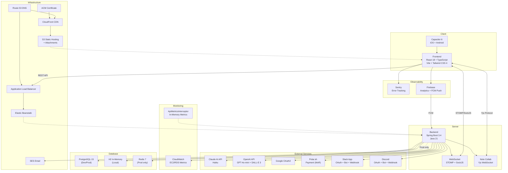

# Tech Stack

## 아키텍처 개요



---

## Frontend

### Core

| 기술 | 버전 | 용도 |
|------|------|------|
| React | 18.3.1 | UI 라이브러리 |
| TypeScript | ^5.5.0 | 타입 안전성 |
| Vite | 6.3.5 | 빌드 도구 |
| Tailwind CSS | 4.1.12 | 유틸리티 CSS |
| React Router DOM | ^7.12.0 | 클라이언트 라우팅 |

### 상태 관리

| 기술 | 용도 |
|------|------|
| React Context | Auth, Theme, DnD, Analytics 상태 관리 |
| useState/useReducer | 로컬 컴포넌트 상태 |

> Zustand, Redux 등 외부 상태관리 라이브러리 미사용

### UI 컴포넌트

| 기술 | 버전 | 용도 |
|------|------|------|
| Radix UI | 다수 (26개 프리미티브) | 접근성 기반 헤드리스 컴포넌트 |
| shadcn/ui | - | Radix 기반 스타일드 컴포넌트 |
| Lucide React | 0.487.0 | 아이콘 라이브러리 |
| @mui/material | 7.3.5 | Material UI (일부 컴포넌트) |

### 리치 텍스트 에디터

| 기술 | 버전 | 용도 |
|------|------|------|
| @blocknote/core | ^0.28.0 | 블록 기반 에디터 코어 |
| @blocknote/react | ^0.28.0 | React 바인딩 |
| @blocknote/shadcn | ^0.28.0 | shadcn 테마 통합 |

> 7개 커스텀 블록 타입: Callout, Toggle, Divider, ColumnLayout, Embed, Mention, TableOfContents

### 화이트보드 (v1.7.0 신규)

| 기술 | 버전 | 용도 |
|------|------|------|
| @excalidraw/excalidraw | ^0.18.0 | 노트 화이트보드/드로잉 (BOARD 타입) |

> Lazy-loaded (~1.5MB). Yjs 협업: `Y.Map('excalidraw-elements')` (BlockNote `Y.XmlFragment('document-store')`와 분리)

### 실시간 협업

| 기술 | 버전 | 용도 |
|------|------|------|
| Yjs | ^13.6.29 | CRDT 실시간 협업 |
| y-protocols | ^1.0.7 | Yjs 동기화 프로토콜 |

**Yjs 데이터 구조:**
- 노트 (DOCUMENT): `Y.XmlFragment('document-store')` — BlockNote 에디터 콘텐츠
- 화이트보드 (BOARD): `Y.Map('excalidraw-elements')` — Excalidraw 씬 데이터
- 커서/선택 공유: `awareness` (CollabPresence)

### WebSocket

| 기술 | 버전 | 용도 |
|------|------|------|
| @stomp/stompjs | ^7.3.0 | STOMP 프로토콜 클라이언트 |
| sockjs-client | (내장) | SockJS 폴백 전송 |

**WebSocket 아키텍처:**
- `WebSocketManager` 싱글턴: 연결 관리, 자동 재연결
- `useBoardWebSocket` 훅: 보드별 구독/이벤트 핸들링
- STOMP 브로커: `/topic/board/{boardId}` (보드 이벤트), `/topic/board/{boardId}/user/{userId}` (개인 알림)
- JWT 인증: STOMP CONNECT 시 Authorization 헤더로 전달
- 27개 이벤트 타입: Feature/Task/Block/Comment/Checklist/Board/Member/Notification/Presence

### 드래그 앤 드롭

| 기술 | 버전 | 용도 |
|------|------|------|
| @dnd-kit/core | ^6.3.1 | DnD 코어 |
| @dnd-kit/sortable | ^10.0.0 | 정렬 기능 |
| @dnd-kit/modifiers | ^9.0.0 | 드래그 모디파이어 |
| @dnd-kit/utilities | ^3.2.2 | 유틸리티 |
| react-dnd | ^16.0.1 | 보조 DnD (일부 컴포넌트) |
| react-dnd-html5-backend | ^16.0.1 | HTML5 DnD 백엔드 |

### 애니메이션

| 기술 | 버전 | 용도 |
|------|------|------|
| Framer Motion | ^12.26.1 | 고급 애니메이션 |
| Motion | 12.23.24 | 애니메이션 라이브러리 |
| tw-animate-css | 1.3.8 | Tailwind 애니메이션 |

### 3D 그래픽 (랜딩 페이지)

| 기술 | 버전 | 용도 |
|------|------|------|
| Three.js | ^0.182.0 | 3D 라이브러리 |
| @react-three/fiber | ^8.17.10 | React Three.js 렌더러 |
| @react-three/drei | ^9.117.3 | R3F 헬퍼 |

### 데이터 & 시각화

| 기술 | 버전 | 용도 |
|------|------|------|
| Recharts | ^2.15.2 | 차트 라이브러리 (모니터링, 통계 차트 포함) |
| date-fns | 3.6.0 | 날짜 유틸리티 |
| date-holidays | ^3.26.8 | 공휴일 데이터 |

### 폼 & 검증

| 기술 | 버전 | 용도 |
|------|------|------|
| React Hook Form | 7.55.0 | 폼 상태 관리 |
| Zod | - | 스키마 검증 (타입 참조) |

### 인증

| 기술 | 버전 | 용도 |
|------|------|------|
| @react-oauth/google | ^0.13.4 | Google OAuth (Web) |
| @codetrix-studio/capacitor-google-auth | ^3.4.0-rc.4 | Google OAuth (Native) |

### 결제

| 기술 | 버전 | 용도 |
|------|------|------|
| Polar.sh | - | 결제 프로세서 (Merchant of Record) |

> v1.6.0까지 Toss Payments 사용. v1.7.0에서 Polar.sh로 전환.

### Observability

| 기술 | 버전 | 용도 |
|------|------|------|
| @sentry/react | ^8.0.0 | 에러 추적 및 모니터링 |
| firebase | ^10.8.0 | 사용자 행동 분석 (Analytics) + FCM 푸시 알림 |

### 다국어 지원 (i18n)

| 기술 | 버전 | 용도 |
|------|------|------|
| i18next | ^25.8.4 | 다국어 프레임워크 |
| react-i18next | ^16.5.4 | React i18n 바인딩 |
| i18next-browser-languagedetector | ^8.2.0 | 브라우저 언어 자동 감지 |

**지원 언어 (10개):**

| 코드 | 언어 | date-fns 로케일 |
|------|------|-----------------|
| ko | 한국어 | ko-KR |
| en | English | en-US |
| ja | 日本語 | ja-JP |
| zh | 中文(简体) | zh-CN |
| zh-TW | 中文(繁體) | zh-TW |
| hi | हिन्दी | hi |
| vi | Tiếng Việt | vi |
| es | Español | es |
| pt-BR | Português (Brasil) | pt-BR |
| th | ไทย | th |

### 모바일 네이티브 (v1.7.0 신규)

| 기술 | 버전 | 용도 |
|------|------|------|
| @capacitor/core | ^6.2.1 | Capacitor 코어 |
| @capacitor/ios | ^6.2.1 | iOS 런타임 |
| @capacitor/android | ^6.2.1 | Android 런타임 |
| @capacitor/cli | ^6.2.1 | Capacitor CLI |
| @capacitor/push-notifications | ^6.0.5 | 푸시 알림 |
| @capacitor/filesystem | ^6.0.4 | 파일 시스템 접근 |
| @capacitor/preferences | ^6.0.4 | 로컬 저장소 |
| @capacitor/keyboard | ^6.0.4 | 키보드 제어 |
| @capacitor/app | ^6.0.3 | 앱 생명주기 |
| @capacitor/status-bar | ^6.0.3 | 상태 바 제어 |
| @capacitor/browser | ^6.0.6 | 인앱 브라우저 |
| @capacitor/haptics | ^6.0.3 | 햅틱 피드백 |
| @capacitor/splash-screen | ^6.0.4 | 스플래시 스크린 |
| @capacitor-community/media | ^6.0.0 | 미디어 라이브러리 |
| @ebarooni/capacitor-calendar | ^6.7.2 | 캘린더 연동 |

### UI 유틸리티

| 기술 | 버전 | 용도 |
|------|------|------|
| clsx | 2.1.1 | 조건부 클래스명 |
| tailwind-merge | 3.2.0 | Tailwind 클래스 병합 |
| class-variance-authority | 0.7.1 | 컴포넌트 변형 관리 |
| cmdk | 1.1.1 | 커맨드 메뉴 |
| embla-carousel-react | 8.6.0 | 캐러셀 |
| react-day-picker | 8.10.1 | 날짜 선택기 |
| sonner | 2.0.3 | 토스트 알림 |
| next-themes | 0.4.6 | 테마 관리 |
| canvas-confetti | ^1.9.4 | 축하 애니메이션 |
| react-colorful | ^5.6.1 | 색상 선택기 |
| react-markdown | ^10.1.0 | Markdown 렌더링 |
| react-resizable-panels | 2.1.7 | 리사이즈 패널 |
| dompurify | ^3.3.1 | HTML 새니타이징 |
| input-otp | 1.4.2 | OTP 입력 |
| vaul | 1.1.2 | 드로어 (모바일) |

### 미디어

| 기술 | 버전 | 용도 |
|------|------|------|
| plyr | ^3.8.4 | 미디어 플레이어 |
| plyr-react | ^6.0.0 | React 미디어 플레이어 |

### 스타일링

| 기술 | 버전 | 용도 |
|------|------|------|
| @emotion/react | 11.14.0 | CSS-in-JS (MUI 의존) |
| @emotion/styled | 11.14.1 | 스타일드 컴포넌트 (MUI 의존) |

### 빌드 도구

| 기술 | 버전 | 용도 |
|------|------|------|
| @tailwindcss/vite | 4.1.12 | Tailwind Vite 플러그인 |
| @vitejs/plugin-react | 4.7.0 | React Vite 플러그인 |
| vite-plugin-pwa | ^1.2.0 | PWA 지원 |

---

## Backend

### Core

| 기술 | 버전 | 용도 |
|------|------|------|
| Spring Boot | 3.4.1 | 웹 프레임워크 |
| Java | 21 LTS | 런타임 |
| Gradle | 9.2.1 | 빌드 시스템 |

### Spring Boot Starters

| 스타터 | 용도 |
|--------|------|
| spring-boot-starter-web | REST API |
| spring-boot-starter-data-jpa | ORM (JPA/Hibernate) |
| spring-boot-starter-security | 인증/인가 |
| spring-boot-starter-validation | 데이터 검증 |
| spring-boot-starter-mail | 이메일 발송 |
| spring-boot-starter-thymeleaf | 이메일 템플릿 |
| spring-boot-starter-actuator | 헬스 모니터링 (Micrometer 메트릭 포함) |
| spring-boot-starter-data-redis | Redis 연동 |
| spring-boot-starter-cache | 캐시 프레임워크 |
| spring-boot-starter-websocket | STOMP WebSocket |

### 인증 & 보안

| 기술 | 버전 | 용도 |
|------|------|------|
| jjwt | 0.12.6 | JWT 생성/검증 |
| BCrypt | (Spring Security) | 비밀번호 해싱 |
| Google API Client | 2.2.0 | Google OAuth2 |
| Bucket4j | 8.0.1 | Rate Limiting |

### WebSocket

| 기술 | 용도 |
|------|------|
| STOMP (Simple Text Oriented Messaging Protocol) | 메시지 프로토콜 |
| SockJS | WebSocket 폴백 전송 |
| SimpleBroker | 인메모리 메시지 브로커 (local/dev) |
| Redis Pub/Sub | 멀티 인스턴스 브로드캐스트 (prod) |

**WebSocket 설정 (WebSocketConfig.java):**
- 엔드포인트: `/ws` (SockJS fallback)
- 브로커 경로: `/topic`, `/queue`
- 앱 프리픽스: `/app`
- CORS: bridgespots.com, milkyway.pe.kr, localhost:5173/5174/3000

**WebSocket 인증 (WebSocketAuthInterceptor.java):**
- STOMP CONNECT: JWT 토큰 검증 (Authorization 또는 token 헤더)
- STOMP SUBSCRIBE: 보드 티어 검증 (STANDARD 차단, Premium+만 허용)
- 5분 TTL 캐시로 티어 검증 최적화

**이벤트 시스템 (WebSocketEventService.java):**
- `sendBoardEvent()`: `/topic/board/{boardId}` 보드 전체 브로드캐스트
- `sendUserEvent()`: `/topic/board/{boardId}/user/{userId}` 개인 알림
- 27개 BoardEventType: Feature(4), Task(4), Block(4), Comment(4), Checklist(4), Board(1), Member(3), Notification(1), Presence(2)

**노트 실시간 협업 (NoteCollabWebSocketConfig + NoteCollabHandler):**
- 엔드포인트: Yjs 전용 WebSocket
- 프로토콜: y-protocols (sync + awareness)
- 데이터 분리: DOCUMENT → `Y.XmlFragment`, BOARD → `Y.Map`

**Redis WebSocket Bridge (v1.7.0):**
- `RedisWebSocketBridge`: Redis Pub/Sub 기반 인스턴스 간 이벤트 전파 (prod)
- `InstanceIdHolder`: 인스턴스 식별자 관리
- `WebSocketSubscriptionListener`: 구독 이벤트 리스너

### 모니터링

| 기술 | 용도 |
|------|------|
| ApiMetricsInterceptor | API 성능 메트릭 수집 (in-memory circular buffer 100개) |
| Micrometer + Actuator | JVM, HikariCP 메트릭 |
| AWS CloudWatch SDK | EC2/RDS 인프라 메트릭 (선택적) |

**모니터링 스케줄러 (MonitoringScheduler.java):**
- `flushMetrics()`: 매 1시간 (in-memory → DB)
- `checkAlerts()`: 매 5분 (임계값 검사)
- `cleanupOldData()`: 매일 3AM UTC (7일 이전 삭제)
- `resetMonthlyAiCredits()`: 매일 자정 UTC (AI 크레딧 월간 리셋)

**모니터링 임계값 (application.yml):**
```yaml
app.monitoring.thresholds:
  cpu-percent: 80
  memory-percent: 85
  hikari-active-percent: 90
  error-rate-percent: 5
  slow-api-ms: 3000
```

**Actuator 노출:**
```yaml
management.endpoints.web.exposure.include: health,info,metrics,hikaricp
```

### AI 통합 (v1.7.0 확장)

| 기술 | 용도 |
|------|------|
| Claude AI API | AI 기능 (리포트, 스탠드업, 미팅, 다이어리, 노트, 피처 분해 등) |
| OpenAI API | AI 기능 (동일) + 이미지 생성 (DALL-E 3, 커스텀 아이콘) |
| RestTemplate (Custom) | AI API HTTP 클라이언트 |

**AI Provider 전략 (v1.7.0 신규 구조):**

```yaml
ai:
  provider: ${AI_PROVIDER:openai}   # "claude" 또는 "openai" 선택
  claude:
    api-key: ${CLAUDE_API_KEY:}
    model:
      team: ${CLAUDE_MODEL_TEAM:claude-haiku-4-5-20251001}
      personal: ${CLAUDE_MODEL_PERSONAL:claude-haiku-4-5-20251001}
      standup: ${CLAUDE_MODEL_STANDUP:claude-haiku-4-5-20251001}
      meeting: ${CLAUDE_MODEL_MEETING:claude-haiku-4-5-20251001}
      diary: ${CLAUDE_MODEL_DIARY:claude-haiku-4-5-20251001}
  openai:
    api-key: ${OPENAI_API_KEY:}
    admin-key: ${OPENAI_ADMIN_KEY:}
    model:
      team: ${OPENAI_MODEL_TEAM:gpt-4o-mini}
      personal: ${OPENAI_MODEL_PERSONAL:gpt-4o-mini}
      standup: ${OPENAI_MODEL_STANDUP:gpt-4o-mini}
      meeting: ${OPENAI_MODEL_MEETING:gpt-4o-mini}
      diary: ${OPENAI_MODEL_DIARY:gpt-4o-mini}
  credit:
    reset-cron: "0 0 0 * * *"   # 매일 자정 UTC
```

**AI Provider 구현:**
- `AIProvider` 인터페이스: 공통 AI 호출 추상화
- `ClaudeAIProvider`: Claude API 구현체
- `OpenAIProvider`: OpenAI API 구현체
- `AIConfig`: RestTemplate 설정 (10s connect / 60s read timeout)
- 환경변수 `AI_PROVIDER`로 전환 (기본값: openai)

**커스텀 아이콘 AI (OpenAI 전용):**
```yaml
app.customicon:
  vision-model: ${CUSTOMICON_VISION_MODEL:gpt-4o}
  image-model: ${CUSTOMICON_IMAGE_MODEL:dall-e-3}
  image-size: ${CUSTOMICON_IMAGE_SIZE:1024x1024}
```

**AI 크레딧 시스템:**
- `AiCreditService`: pessimistic lock 기반 크레딧 소비
- 티어별 크레딧: TRIAL=100, STANDARD=30, PREMIUM=200+(seats*50)
- 소비 순서: Monthly free → Purchased (FIFO)
- 402 `AI_CREDITS_EXHAUSTED` → FE `ai-credits-exhausted` CustomEvent → 모달
- 월간 리셋: `MonitoringScheduler.resetMonthlyAiCredits()` (cron daily midnight UTC)

### 결제 통합 (v1.7.0 변경)

| 기술 | 용도 |
|------|------|
| Polar.sh | Merchant of Record 결제 프로세서 |

**Polar.sh 설정:**
```yaml
polar:
  api-key: ${POLAR_API_KEY:}
  webhook-secret: ${POLAR_WEBHOOK_SECRET:}
  organization-id: ${POLAR_ORG_ID:}
  base-url: https://api.polar.sh
  products:
    board-monthly: ${POLAR_PRODUCT_BOARD_MONTHLY:}
    board-yearly: ${POLAR_PRODUCT_BOARD_YEARLY:}
    org-monthly: ${POLAR_PRODUCT_ORG_MONTHLY:}
    org-yearly: ${POLAR_PRODUCT_ORG_YEARLY:}
    credit-100: ${POLAR_PRODUCT_CREDIT_100:}
    credit-500: ${POLAR_PRODUCT_CREDIT_500:}
    credit-1000: ${POLAR_PRODUCT_CREDIT_1000:}
```

### 외부 통합 (v1.7.0 확장)

**Slack App (OAuth 기반):**
```yaml
slack:
  app:
    client-id: ${SLACK_CLIENT_ID:}
    client-secret: ${SLACK_CLIENT_SECRET:}
    signing-secret: ${SLACK_SIGNING_SECRET:}
    token-encryption-key: ${SLACK_TOKEN_ENCRYPTION_KEY:}
    bot-scopes: "chat:write,channels:read,groups:read,commands,reactions:read,im:write"
    user-scopes: "identity.basic,identity.email"
```

**Discord Integration (v1.7.0 신규):**
```yaml
discord:
  client-id: ${DISCORD_CLIENT_ID:}
  client-secret: ${DISCORD_CLIENT_SECRET:}
  bot-token: ${DISCORD_BOT_TOKEN:}
  redirect-uri: ${DISCORD_REDIRECT_URI:}
  bot-permissions: 2048   # Send Messages
```

- `MemberDiscordWebhook` 엔티티: 멤버별 디스코드 웹훅 설정
- `DiscordNotificationService`: 5종 알림 (Embed format, color `0x6366F1`)
- `DiscordWebhookService`: CRUD + URL 검증
- Premium 전용 (`Board.canAccessDiscord()`)

**Firebase (FCM 푸시 알림):**
```yaml
firebase:
  credentials-json: ${FIREBASE_CREDENTIALS_JSON:}
```
- `DeviceTokenController`: FCM 디바이스 토큰 관리
- `PushNotificationService`: 푸시 알림 발송

### DailyStandupScheduler

| 항목 | 설명 |
|------|------|
| Cron | `@Scheduled(cron = "0 * * * * *")` - 매분 실행 |
| 타임존 | UTC 기준 시간 매칭 |
| 알림 | Slack Block Kit / Discord Embed 페이로드 생성 |
| 중복 방지 | 2분 쿨다운 (동일 보드 재발송 방지) |
| 다국어 | ko, en 지원 |

### Observability

| 도구 | 버전 | 용도 |
|------|------|------|
| Sentry (Frontend) | ^8.0.0 | React 에러 추적 |
| Firebase Analytics | ^10.8.0 | 사용자 행동 분석 |
| Spring Actuator | - | 헬스/메트릭 모니터링 |
| ApiMetricsInterceptor | - | API 성능 메트릭 수집 |
| CloudWatch | - | EC2/RDS 인프라 메트릭 (선택적) |
| AdminMonitoringTab | - | 시스템 모니터링 대시보드 |

### 데이터베이스

| 기술 | 환경 | 용도 |
|------|------|------|
| PostgreSQL 15 | Dev/Prod | 주 데이터베이스 |
| H2 | Local | 인메모리 DB (개발) |
| Redis 7 | Prod only | 캐시 + WebSocket Pub/Sub |

> **v1.7.0 변경:** Dev 환경 Redis/ElastiCache 비활성화 (Simple Cache 사용). Prod만 ElastiCache 유지.

### 데이터베이스 마이그레이션

| 도구 | 용도 |
|------|------|
| Flyway | 스키마 마이그레이션 |
| JPA ddl-auto: update | Local 환경 자동 스키마 |

> Local 환경은 H2 + ddl-auto:update, Dev/Prod는 Flyway 마이그레이션 사용

**마이그레이션 전략 (v1.7.0 변경):**
- 레거시: V5~V94 (순차 번호)
- 신규: `V{YYYYMMDD_HHmmss}__{description}.sql` (타임스탬프 기반)
- `out-of-order: true` 활성화 (순서 무관 실행)
- `baseline-version: 86` (기존 DB 호환)
- 모든 DDL 멱등성 필수 (IF NOT EXISTS, EXCEPTION WHEN duplicate_column)

**마이그레이션 히스토리 (V5~V94, 레거시 순차 번호):**

| 버전 | 설명 |
|------|------|
| V5 | comment_attachments |
| V6 | assignee_color to board_members |
| V7 | announcements |
| V8 | system_config |
| V9 | nullable created_by (user deletion) |
| V10 | last_active_at to users |
| V11-V13 | inquiries + replies |
| V14 | member_slack_webhooks |
| V15 | drop priority from features |
| V16 | weekly_reports |
| V17 | system_role update by email |
| V18 | notifications type constraint fix |
| V19-V20 | meetings + MEETING notification |
| V21 | baseline dates to tasks |
| V22 | meeting transcript |
| V23 | activity_log constraint fix |
| V24 | CHECKLIST_MOVED activity type |
| V25 | notes (folders/documents, tags, versions) |
| V26 | comment_reactions |
| V27 | board_custom_emojis |
| V28 | display_order to board_members |
| V29 | meeting recurrence |
| V30 | monitoring_tables |
| V31 | ai_usage_logs |
| V32 | ai_credits |
| V33 | note_collab_states |
| V34 | note_sharing |
| V35 | note_comments |
| V36 | task_dependencies |
| V37 | start_date to features |
| V38 | meeting recurrence days_of_week |
| V39 | meeting recurrence week_of_month |
| V40 | board_type |
| V41 | personal_event_recurrence |
| V42 | personal_tasks |
| V43 | personal_habits |
| V44 | user_personal_ai_credits |
| V45 | migrate_personal_board_data |
| V46 | cleanup_personal_boards |
| V47 | update_personal_task_priority_defaults |
| V48 | add_personal_space_enabled |
| V49 | add_diary_voice_support |
| V50 | add_importance_to_personal_habits |
| V51 | add_background_gradient_to_boards |
| V52 | add_deleted_at to boards |
| V53 | add_personal_purchased_credits |
| V54 | add_event_type_to_personal_events |
| V55 | create_device_tokens_table |
| V56 | fix_event_type_column |
| V57 | add_end_date_to_personal_events |
| V58 | add_meeting_diarized_transcript |
| V59 | add_block_type_and_title_to_schedule_blocks |
| V60 | create_organizations |
| V61 | create_leave_management |
| V62 | rename_leave_balance_year_column |
| V63 | create_org_announcements_and_activities |
| V64 | add_organization_indexes |
| V65 | add_anniversary_settings_and_celebrations |
| V66 | make_notification_board_nullable |
| V67 | add_manager_to_organization_members |
| V68 | create_onboarding_templates |
| V69 | create_onboarding_instances |
| V70 | create_one_on_one_tables |
| V71 | create_one_on_one_action_items |
| V72 | create_attendance_tables |
| V73 | add_missing_org_indexes_and_fixes |
| V74 | add_position_title_grade_concurrent_dept |
| V75 | add_department_hierarchy |
| V76 | add_manager_id_index |
| V77 | create_member_history |
| V78 | add_organization_structure_toggles |
| V79 | add_single_org_per_user_constraint |
| V80 | create_org_announcement_comments |
| V81 | create_org_announcement_attachments |
| V82 | create_okr_tables |
| V83 | create_org_subscriptions |
| V84 | add_org_subscription_fields |
| V85 | add_org_managed_board_tier |
| V86 | create_leave_balance_adjustments |
| V88 | fix_baseline_gaps |
| V89 | drop_single_column_user_unique |
| V90 | create_org_photo_gallery |
| V91 | add_cancel_requested_at |
| V92 | add_past_due_tracking |
| V93 | add_org_ai_credits |
| V94 | add_hr_system_enabled_to_organizations |

**마이그레이션 히스토리 (타임스탬프 기반, v1.7.0 신규):**

| 버전 | 설명 |
|------|------|
| V20260309_120000 | create_member_discord_webhooks |
| V20260309_120001 | add_discord_notification_preferences |
| V20260309_152014 | add_upload_link_to_org_photo_tabs |
| V20260310_062521 | add_gallery_upload_token_to_organizations |
| V20260310_092045 | add_slack_app_installations |
| V20260310_093453 | discord_bot_integration |
| V20260310_094548 | add_slack_user_links |
| V20260310_102627 | create_board_join_requests |
| V20260310_161840 | add_auto_board_access_to_organizations |
| V20260312_092432 | fix_notes_type_check_constraint_for_board |
| V20260312_143000 | add_board_note_type |
| V20260315_042658 | add_photo_share_title_to_organizations |
| V20260315_125945 | add_organization_notes |
| V20260315_134147 | create_board_resources |
| V20260318_120105 | create_mention_groups |
| V20260320_042323 | add_milestone_block_management |

### 도메인 패키지

```
backend/src/main/java/com/kanban/domain/
├── auth/               # 인증 (JWT, Google OAuth2)
├── board/              # 보드 CRUD, 멤버, 커스텀 이모지, Today
├── block/              # 칸반 블록 (고정 + 커스텀)
├── feature/            # 피처 카드 (AI 분해)
├── task/               # 태스크 (의존성, 크로스보드)
├── checklist/          # 체크리스트 (AI)
├── comment/            # 댓글 + 첨부파일 + 리액션 + AI
├── tag/                # 태그 관리
├── weight/             # 가중치 레벨
├── milestone/          # 마일스톤
├── member/             # 보드 멤버 관리
├── invite/             # 초대 링크
├── mentiongroup/       # 멘션 그룹 (v1.7)
├── schedule/           # 일정 (타임블록, 캘린더, 리소스)
├── dailychecklist/     # 일일 체크리스트
├── meeting/            # 미팅 (AI 전사/요약, 반복, 화자분리)
├── note/               # 노트 (실시간 협업, 공유, 댓글, AI, 화이트보드)
├── notification/       # 알림 + FCM 푸시
├── activity/           # 활동 로그
├── report/             # 주간 리포트 (AI)
├── standup/            # 데일리 스탠드업
├── statistics/         # 통계/관리
├── monitoring/         # 서버 모니터링
├── integration/
│   ├── slack/          # Slack App (OAuth + Bot + Webhook)
│   └── discord/        # Discord (OAuth + Bot + Webhook) (v1.7)
├── subscription/       # 구독/결제 (Polar.sh) + AI 크레딧
├── user/               # 유저
├── admin/              # 시스템 관리
├── announcement/       # 시스템 공지사항
├── inquiry/            # 고객 문의
├── system/             # 시스템 설정/유지보수
├── customicon/         # 커스텀 아이콘 (OpenAI 이미지 생성)
├── organization/       # 조직 관리 (v1.7)
│   ├── controller/     # 조직 CRUD, 멤버, 부서, 직급/직책
│   ├── service/        # 조직 비즈니스 로직
│   ├── repository/     # JPA 레포지토리
│   ├── dto/            # DTO
│   └── leave/          # 휴가/근태 관리
├── okr/                # OKR 관리 (v1.7)
├── photo/              # 조직 사진첩 (v1.7)
├── personal/           # 개인 스페이스 (이벤트, 습관, 태스크)
├── diary/              # 다이어리 (AI, 음성)
├── common/             # 공통 도메인
└── test/               # 테스트
```

### 글로벌 인프라

**Config (22개):**

| 파일 | 용도 |
|------|------|
| `SecurityConfig.java` | Spring Security 설정 |
| `WebMvcConfig.java` | CORS, 인터셉터 설정 |
| `WebSocketConfig.java` | STOMP WebSocket 설정 |
| `NoteCollabWebSocketConfig.java` | 노트 협업 Yjs WebSocket 설정 (v1.7) |
| `RedisWebSocketConfig.java` | Redis Pub/Sub WebSocket 브릿지 설정 (v1.7) |
| `CacheConfig.java` | 캐시 설정 (Simple/Redis) |
| `JpaConfig.java` | JPA Auditing 설정 (v1.7) |
| `JacksonConfig.java` | JSON 직렬화 설정 |
| `S3Config.java` | AWS S3 클라이언트 설정 |
| `CloudWatchConfig.java` | AWS CloudWatch 메트릭 설정 |
| `AIConfig.java` | AI RestTemplate 설정 |
| `AIProvider.java` | AI Provider 인터페이스 (v1.7) |
| `ClaudeAIProvider.java` | Claude AI 구현체 (v1.7) |
| `OpenAIProvider.java` | OpenAI 구현체 (v1.7) |
| `AIResponse.java` | AI 응답 DTO (v1.7) |
| `FirebaseConfig.java` | Firebase 설정 (FCM) |
| `RestTemplateConfig.java` | RestTemplate 빈 설정 (v1.7) |
| `LocalUploadConfig.java` | 로컬 파일 업로드 설정 (v1.7) |
| `FlywayRepairConfig.java` | Flyway 자동 복구 설정 (v1.7) |
| `SchemaMigrationConfig.java` | 스키마 마이그레이션 설정 (v1.7) |
| `SchemaMigrationInitializer.java` | 레거시 패치 초기화 (v1.7) |
| `DataInitializer.java` | 초기 데이터 설정 (v1.7) |

**Filter & Interceptor:**

| 파일 | 용도 |
|------|------|
| `global/filter/ActivityTrackingFilter.java` | 유저 활동 추적 필터 |
| `global/filter/MaintenanceFilter.java` | 유지보수 모드 필터 |
| `global/interceptor/ApiMetricsInterceptor.java` | API 성능 메트릭 수집 |

**Security:**

| 파일 | 용도 |
|------|------|
| `global/security/JwtAuthenticationFilter.java` | JWT 인증 필터 |
| `global/security/JwtProvider.java` | JWT 토큰 생성/검증 |
| `global/security/RateLimitingFilter.java` | Rate Limiting 필터 |
| `global/security/UserPrincipal.java` | 인증 사용자 Principal |
| `global/security/WebSocketAuthInterceptor.java` | WebSocket JWT 인증 + 티어 검증 |

**WebSocket (5개 + dto):**

| 파일 | 용도 |
|------|------|
| `global/websocket/WebSocketEventService.java` | 보드/개인별 이벤트 브로드캐스트 |
| `global/websocket/NoteCollabHandler.java` | 노트 Yjs 협업 핸들러 (v1.7) |
| `global/websocket/RedisWebSocketBridge.java` | Redis Pub/Sub 인스턴스 간 이벤트 전파 (v1.7) |
| `global/websocket/InstanceIdHolder.java` | 인스턴스 식별자 관리 (v1.7) |
| `global/websocket/WebSocketSubscriptionListener.java` | 구독 이벤트 리스너 (v1.7) |
| `global/websocket/dto/BoardEventType.java` | 27개 이벤트 타입 enum |
| `global/websocket/dto/WebSocketEvent.java` | 이벤트 record |
| `global/websocket/dto/RedisWsMessage.java` | Redis WebSocket 메시지 DTO (v1.7) |

**Scheduler (9개):**

| 파일 | 용도 |
|------|------|
| `MonitoringScheduler.java` | 시스템 모니터링 + AI 크레딧 월간 리셋 |
| `SubscriptionScheduler.java` | 구독 상태 관리 |
| `ActivityLogCleanupScheduler.java` | 활동 로그 정리 |
| `BoardCleanupScheduler.java` | 삭제된 보드 정리 |
| `DailyStandupScheduler.java` | 스탠드업 알림 |
| `ExpiredTokenCleanupScheduler.java` | 만료 토큰 정리 |
| `PersonalTaskCleanupScheduler.java` | 개인 태스크 정리 |
| `TempFileCleanupScheduler.java` | 임시 파일 정리 |
| `AnniversaryNotificationScheduler.java` | 기념일 알림 (v1.7) |

### API 통합 (Facade Service 패턴)

| 기능 | 변경 전 | 변경 후 | Facade |
|------|---------|---------|--------|
| 보드 진입 | 13 API calls | 1 (`GET /boards/{id}/full`) | `BoardFacadeService` |
| 주간 스케줄 | 7 API calls | 1 (`GET /schedules/weekly`) | `ScheduleFacadeService` |
| 일일 스케줄+체크리스트 | 2 API calls | 1 (`GET /schedules/daily-full`) | `ScheduleFacadeService` |

### 유틸리티

| 기술 | 용도 |
|------|------|
| Lombok | 보일러플레이트 코드 감소 |
| Jackson | JSON 직렬화/역직렬화 (SNAKE_CASE) |
| Hibernate | ORM 구현체 |
| Thumbnailator | 이미지 썸네일 (400x400) |
| FFmpeg | 비디오 썸네일 |
| spring-dotenv | 환경 변수 로딩 |

### API 설정

```yaml
# JSON 변환
jackson:
  property-naming-strategy: SNAKE_CASE
  default-property-inclusion: non_null
  time-zone: UTC

# JPA
jpa:
  hibernate.ddl-auto: update (local) / update (dev) / validate (prod)
  properties.hibernate:
    format_sql: true
    default_batch_fetch_size: 100
    jdbc.time_zone: UTC

# JWT
jwt:
  access-expiration: 86400000     # 24시간
  refresh-expiration: 2592000000  # 30일

# HikariCP (Dev)
datasource.hikari:
  maximum-pool-size: 5
  minimum-idle: 2

# HikariCP (Prod)
datasource.hikari:
  maximum-pool-size: 20
  minimum-idle: 5
```

---

## Infrastructure (AWS)

### 서비스 구성

| 서비스 | 용도 | 설정 |
|--------|------|------|
| **VPC** | 네트워크 격리 | 퍼블릭/프라이빗 서브넷, NAT Gateway 비활성화 (비용 절감) |
| **S3** | 프론트엔드 정적 파일 + 첨부파일 호스팅 | Intelligent-Tiering, 임시파일 1일 자동 삭제 |
| **CloudFront** | CDN | HTTPS, 커스텀 도메인, 첨부파일 CDN (OAC) |
| **Elastic Beanstalk** | 백엔드 배포 | Java 21, AL2023, t3.small |
| **RDS** | PostgreSQL 데이터베이스 | Dev/Prod: db.t4g.micro (Phase 1 비용 최적화) |
| **ElastiCache** | Redis 캐시 + WebSocket Pub/Sub | Prod only (t4g.micro), Dev 비활성화 |
| **ALB** | 로드 밸런서 | EB 자동 생성 |
| **ACM** | SSL 인증서 | 자동 갱신 (ALB용 ap-northeast-2, CF용 us-east-1) |
| **Route 53** | DNS | A 레코드, ALIAS (primary + secondary 도메인) |
| **SES** | 이메일 발송 | 인증/알림 이메일 |
| **CloudWatch** | 인프라 모니터링 | EC2/RDS 메트릭 (선택적) |

### 환경별 인프라 비교

| 구성 | Dev | Prod |
|------|-----|------|
| VPC NAT Gateway | 비활성화 | 비활성화 (Phase 1) |
| RDS | db.t4g.micro, 20GB, 1일 백업 | db.t4g.micro, 20GB, 3일 백업 |
| ElastiCache | **비활성화** (Simple Cache) | t4g.micro, 단일 노드 |
| EB 인스턴스 | t3.small, min=1/max=2 | t3.small, min=1/max=2 |
| EB 서브넷 | Public (No NAT) | Public (Phase 1, No NAT) |
| 캐시 타입 | Simple (In-Memory) | Redis (ElastiCache) |
| WebSocket 브로커 | SimpleBroker | SimpleBroker + Redis Pub/Sub |
| 예상 비용 | ~$48/month (Redis 비활성화) | ~$75-95/month |

### IaC (Terraform)

```
infrastructure/terraform/
├── modules/
│   ├── vpc/                   # VPC 네트워크 모듈
│   ├── security-groups/       # 보안 그룹 모듈
│   ├── elastic-beanstalk/     # EB 환경 모듈
│   ├── rds/                   # RDS Aurora 모듈 (Phase 2+)
│   ├── rds-simple/            # RDS Simple 모듈 (Phase 1)
│   ├── elasticache/           # ElastiCache Redis 모듈
│   ├── s3-cloudfront/         # S3+CF 모듈
│   ├── acm-certificate/       # SSL 인증서 모듈
│   └── route53/               # DNS 모듈
└── environments/
    ├── dev/                   # 개발 환경
    └── prod/                  # 프로덕션 환경
```

### CI/CD (GitHub Actions)

```
.github/workflows/
├── ci.yml                   # PR/push → Backend 빌드+테스트, Frontend 타입체크
├── deploy-dev.yml           # CI 성공 → EB 배포 + S3 동기화 + CF 무효화
├── deploy-mobile.yml        # 수동 → Capacitor 빌드 (iOS TestFlight / Android Play Store)
└── terraform.yml            # PR on terraform paths → Plan/Apply
```

---

## 개발 환경 프로필

| 프로필 | DB | Cache | Storage | Push | 용도 |
|--------|-----|-------|---------|------|------|
| local | H2 (In-Memory) | Simple (In-Memory) | Local filesystem | 비활성화 | 로컬 개발 |
| dev | PostgreSQL (RDS) | Simple (In-Memory) | S3 + CloudFront | FCM | 개발 서버 |
| prod | PostgreSQL (RDS) | Redis (ElastiCache) | S3 + CloudFront | FCM | 프로덕션 |

### 로컬 개발 도구

```bash
# Docker (PostgreSQL, Redis)
docker-compose up -d

# Frontend
cd frontend && npm run dev    # Vite dev server (port 5173)

# Backend
cd backend && ./gradlew bootRun --args='--spring.profiles.active=local'  # port 8080
```

### Docker

**Backend Dockerfile** (Multi-stage build):
```
Stage 1: Gradle Build (eclipse-temurin:21-jdk)
Stage 2: Runtime (eclipse-temurin:21-jre)
- Timezone: Asia/Seoul
- Port: 8080
```

**docker-compose.yml**: PostgreSQL 15 + Redis 7 (로컬 개발)

---

## 환경 변수

### Frontend (.env)

| 변수 | 설명 | 기본값 |
|------|------|--------|
| VITE_API_BASE_URL | API 서버 URL | http://localhost:8080/api/v1 |
| VITE_GOOGLE_CLIENT_ID | Google OAuth Client ID | - |

### Backend

| 변수 | 설명 | 기본값 |
|------|------|--------|
| **Core** | | |
| JWT_SECRET | JWT 서명 키 | default-dev-key |
| FRONTEND_URL | 프론트엔드 Origin (CORS) | http://localhost:5173 |
| TESTPROD_FRONTEND_URL | 테스트 프론트엔드 Origin | - |
| **Database** | | |
| DATABASE_URL | PostgreSQL URL | jdbc:postgresql://localhost:5432/kanban_dev |
| DB_USERNAME | DB 사용자 | - |
| DB_PASSWORD | DB 비밀번호 | - |
| **Redis** | | |
| REDIS_HOST | Redis 호스트 | localhost |
| REDIS_PORT | Redis 포트 | 6379 |
| REDIS_PASSWORD | Redis 비밀번호 | - |
| CACHE_TYPE | 캐시 타입 | simple |
| **Auth** | | |
| GOOGLE_CLIENT_ID | Google OAuth ID | - |
| GOOGLE_CLIENT_SECRET | Google OAuth Secret | - |
| **Email** | | |
| MAIL_USERNAME | SMTP 사용자 | - |
| MAIL_PASSWORD | SMTP 비밀번호 | - |
| **AI** | | |
| AI_PROVIDER | AI 제공자 (claude/openai) | openai |
| CLAUDE_API_KEY | Claude AI API 키 | (빈 값) |
| CLAUDE_MODEL_TEAM | Claude 팀 리포트 모델 | claude-haiku-4-5-20251001 |
| CLAUDE_MODEL_PERSONAL | Claude 개인 리포트 모델 | claude-haiku-4-5-20251001 |
| CLAUDE_MODEL_STANDUP | Claude 스탠드업 요약 모델 | claude-haiku-4-5-20251001 |
| CLAUDE_MODEL_MEETING | Claude 미팅 모델 | claude-haiku-4-5-20251001 |
| CLAUDE_MODEL_DIARY | Claude 다이어리 모델 | claude-haiku-4-5-20251001 |
| OPENAI_API_KEY | OpenAI API 키 | (빈 값) |
| OPENAI_ADMIN_KEY | OpenAI Admin 키 | (빈 값) |
| OPENAI_MODEL_TEAM | OpenAI 팀 모델 | gpt-4o-mini |
| OPENAI_MODEL_PERSONAL | OpenAI 개인 모델 | gpt-4o-mini |
| OPENAI_MODEL_STANDUP | OpenAI 스탠드업 모델 | gpt-4o-mini |
| OPENAI_MODEL_MEETING | OpenAI 미팅 모델 | gpt-4o-mini |
| OPENAI_MODEL_DIARY | OpenAI 다이어리 모델 | gpt-4o-mini |
| CUSTOMICON_VISION_MODEL | 커스텀 아이콘 비전 모델 | gpt-4o |
| CUSTOMICON_IMAGE_MODEL | 커스텀 아이콘 이미지 모델 | dall-e-3 |
| **Payment** | | |
| POLAR_API_KEY | Polar.sh API 키 | (빈 값) |
| POLAR_WEBHOOK_SECRET | Polar.sh Webhook 시크릿 | (빈 값) |
| POLAR_ORG_ID | Polar.sh 조직 ID | (빈 값) |
| POLAR_PRODUCT_BOARD_MONTHLY | 보드 월간 상품 ID | (빈 값) |
| POLAR_PRODUCT_BOARD_YEARLY | 보드 연간 상품 ID | (빈 값) |
| POLAR_PRODUCT_ORG_MONTHLY | 조직 월간 상품 ID | (빈 값) |
| POLAR_PRODUCT_ORG_YEARLY | 조직 연간 상품 ID | (빈 값) |
| POLAR_PRODUCT_CREDIT_100 | AI 크레딧 100 상품 ID | (빈 값) |
| POLAR_PRODUCT_CREDIT_500 | AI 크레딧 500 상품 ID | (빈 값) |
| POLAR_PRODUCT_CREDIT_1000 | AI 크레딧 1000 상품 ID | (빈 값) |
| **Discord** | | |
| DISCORD_CLIENT_ID | Discord OAuth Client ID | (빈 값) |
| DISCORD_CLIENT_SECRET | Discord OAuth Client Secret | (빈 값) |
| DISCORD_BOT_TOKEN | Discord Bot Token | (빈 값) |
| DISCORD_REDIRECT_URI | Discord OAuth Redirect URI | (기본값) |
| **Slack** | | |
| SLACK_CLIENT_ID | Slack App Client ID | (빈 값) |
| SLACK_CLIENT_SECRET | Slack App Client Secret | (빈 값) |
| SLACK_SIGNING_SECRET | Slack App Signing Secret | (빈 값) |
| SLACK_TOKEN_ENCRYPTION_KEY | Slack Token 암호화 키 | (빈 값) |
| SLACK_REDIRECT_URI | Slack OAuth Redirect URI | (기본값) |
| SLACK_USER_REDIRECT_URI | Slack User OAuth Redirect URI | (기본값) |
| **Firebase** | | |
| FIREBASE_CREDENTIALS_JSON | Firebase 서비스 계정 JSON | (빈 값) |
| **Storage** | | |
| S3_ENABLED | S3 파일 스토리지 활성화 | false |
| S3_BUCKET | S3 버킷명 | bridge-kanban-attachments |
| CLOUDFRONT_DOMAIN | CloudFront 도메인 | (빈 값) |
| **Monitoring** | | |
| CLOUDWATCH_ENABLED | CloudWatch 메트릭 활성화 | false |
| EC2_INSTANCE_ID | CloudWatch EC2 인스턴스 ID | (빈 값) |
| RDS_INSTANCE_ID | CloudWatch RDS 인스턴스 ID | (빈 값) |
| MONITORING_SLACK_WEBHOOK_URL | 모니터링 Slack 알림 URL | (빈 값) |
| **Observability** | | |
| SENTRY_DSN | Sentry DSN (에러 추적) | (빈 값) |
| SENTRY_ENVIRONMENT | Sentry 환경 이름 | local |
| SENTRY_TRACES_SAMPLE_RATE | Sentry 트레이스 샘플링 비율 | 0.1 |
| **WebSocket** | | |
| WS_BROKER_TYPE | WebSocket 브로커 타입 | simple |

---

## 비즈니스 설정

### 구독/트라이얼

| 항목 | 값 | 비고 |
|------|-----|------|
| 트라이얼 기간 | 3일 | v1.5.0에서 7일 → 3일로 변경 |

### 파일 업로드

| 설정 | 값 |
|------|-----|
| 최대 파일 크기 | 110MB |
| 최대 비디오 크기 | 52MB |
| 최대 요청 크기 | 220MB |
| 이미지 썸네일 | Thumbnailator (서버사이드, 400x400) |
| 비디오 썸네일 | FFmpeg (서버사이드) |
| 로컬 저장 | ./uploads (local 프로필) |
| 클라우드 저장 | S3 + CloudFront (dev/prod) |

---

## 의존성 요약

### Frontend: 90+ npm 패키지

**주요 카테고리:**
- Core: React 18, TypeScript 5, Vite 6, Tailwind 4
- Routing: React Router 7
- UI: Radix UI (26개 프리미티브), shadcn/ui, MUI (일부)
- Editor: BlockNote (core, react, shadcn) v0.28.0
- Whiteboard: Excalidraw v0.18.0 (v1.7 신규)
- Collaboration: Yjs + y-protocols
- WebSocket: @stomp/stompjs v7.3.0
- DnD: @dnd-kit 4개 패키지 + react-dnd
- Animation: Framer Motion, Three.js (랜딩)
- Data: Recharts, date-fns, date-holidays
- Auth: Google OAuth (Web + Capacitor)
- Payment: Polar.sh
- Forms: React Hook Form
- Mobile: Capacitor 6 (14개 플러그인) (v1.7 신규)
- Observability: Sentry, Firebase Analytics + FCM
- i18n: i18next, react-i18next (10개 언어)
- Media: plyr, plyr-react

### Backend: Spring Boot 3.4 + 10 starters

**주요 카테고리:**
- Web: spring-boot-starter-web
- Data: JPA, Redis, Cache
- Security: Spring Security, JWT, Google OAuth, Rate Limiting (Bucket4j)
- Communication: Mail, Thymeleaf
- Monitoring: Actuator, CloudWatch SDK
- WebSocket: spring-boot-starter-websocket
- Database: PostgreSQL, H2
- Migration: Flyway (V5~V94 + 타임스탬프 기반)
- Utility: Lombok, Jackson, Thumbnailator, FFmpeg, spring-dotenv
- Integration: Slack App (OAuth), Discord (OAuth + Bot), Firebase (FCM)
- AI: Claude AI + OpenAI (Provider 패턴, 5종 모델 분리)
- Payment: Polar.sh (Merchant of Record)
- AWS: S3 SDK 2.25.0, CloudWatch SDK 2.25.0

---

## 변경 이력

### v1.7.0 (2026-03-20)

**화이트보드 (Excalidraw) 통합:**
- `@excalidraw/excalidraw` ^0.18.0 추가 (lazy-loaded, ~1.5MB)
- 노트 BOARD 타입: Excalidraw 기반 화이트보드/드로잉
- Yjs 협업: `Y.Map('excalidraw-elements')` (BlockNote `Y.XmlFragment`와 분리)
- `ExcalidrawEditor.tsx`: Excalidraw 에디터 컴포넌트

**조직(Organization) 도메인 추가:**
- 38개 엔티티: Organization, OrganizationMember, OrganizationDepartment, OrgGrade, OrgPosition, OrgTitle 등
- HR 시스템: 휴가/근태 관리, 온보딩, 1:1 미팅, 기념일 알림
- OKR 관리: 조직 목표/핵심 결과
- 조직 사진첩: 갤러리 + 탭 + 공유 링크
- 조직 공지사항: 댓글 + 첨부파일
- 조직 구독: 별도 결제 체계
- DB: V60~V94 (조직 관련 마이그레이션 35개)

**Discord 통합:**
- `domain/integration/discord/`: Discord OAuth + Bot + Webhook
- `MemberDiscordWebhook` 엔티티: 멤버별 디스코드 웹훅
- `DiscordNotificationService`: 5종 알림 (Embed format)
- Premium 전용 기능
- DB: V20260309_120000, V20260309_120001, V20260310_093453

**Slack App 확장 (OAuth 기반):**
- Slack 레거시 웹훅 → Slack App (OAuth 기반) 전환
- Bot scopes: chat:write, channels:read, groups:read, commands 등
- User scopes: identity.basic, identity.email
- Token 암호화 저장
- DB: V20260310_092045, V20260310_094548

**결제 시스템 전환 (Polar.sh):**
- Toss Payments → Polar.sh (Merchant of Record) 전환
- 보드/조직 월간/연간 상품 + AI 크레딧 상품 (100/500/1000)
- Webhook 기반 결제 확인

**AI Provider 전략 패턴:**
- `AIProvider` 인터페이스 + `ClaudeAIProvider` + `OpenAIProvider` 구현체
- 환경변수 `AI_PROVIDER`로 런타임 전환 (기본값: openai)
- 용도별 모델 분리 (team/personal/standup/meeting/diary)
- Claude 기본 모델: claude-haiku-4-5-20251001 (전 용도)
- OpenAI 기본 모델: gpt-4o-mini (전 용도)

**Capacitor 네이티브 모바일:**
- Capacitor 6.2.1 + 14개 플러그인 (iOS, Android)
- 푸시 알림, 파일시스템, 캘린더, 미디어, 햅틱 등
- CI/CD: deploy-mobile.yml (TestFlight / Play Store)

**Redis 환경 분리:**
- Dev: ElastiCache 비활성화 (Simple Cache 사용, ~$11.50/month 절감)
- Prod: ElastiCache 유지 (t4g.micro, WebSocket Pub/Sub)
- `CACHE_TYPE` 기본값 `simple` (Redis 선택적)

**인프라 비용 최적화 (Phase 1):**
- Dev/Prod 모두 NAT Gateway 비활성화
- RDS: db.t4g.micro (Phase 1, Aurora Serverless v2 업그레이드 경로 보유)
- EB: t3.small, min=1/max=2

**글로벌 설정 확장:**
- Config: 11 → 22개 (AI Provider, WebSocket, Flyway, JPA, RestTemplate 등)
- WebSocket: 3 → 5+dto (NoteCollabHandler, RedisWebSocketBridge, InstanceIdHolder 등)
- Scheduler: 8 → 9개 (AnniversaryNotificationScheduler 추가)

**Flyway 마이그레이션 전략 변경:**
- 레거시: V5~V94 (순차 번호)
- 신규: 타임스탬프 기반 (`V{YYYYMMDD_HHmmss}__description.sql`)
- `out-of-order: true` 활성화
- 모든 DDL 멱등성 필수
- 타임스탬프 마이그레이션 16개 추가

**신규 환경 변수:**
- AI: `AI_PROVIDER`, `OPENAI_API_KEY`, `OPENAI_ADMIN_KEY`, `OPENAI_MODEL_*`, `CLAUDE_MODEL_MEETING`, `CLAUDE_MODEL_DIARY`
- Payment: `POLAR_API_KEY`, `POLAR_WEBHOOK_SECRET`, `POLAR_ORG_ID`, `POLAR_PRODUCT_*`
- Discord: `DISCORD_CLIENT_ID`, `DISCORD_CLIENT_SECRET`, `DISCORD_BOT_TOKEN`, `DISCORD_REDIRECT_URI`
- Slack: `SLACK_CLIENT_ID`, `SLACK_CLIENT_SECRET`, `SLACK_SIGNING_SECRET`, `SLACK_TOKEN_ENCRYPTION_KEY`
- Firebase: `FIREBASE_CREDENTIALS_JSON`
- WebSocket: `WS_BROKER_TYPE`

### v1.6.0 (2026-02-13)

**WebSocket 실시간 동기화:**
- STOMP + SockJS 기반 실시간 통신
- `WebSocketConfig`: `/ws` 엔드포인트, SimpleBroker, CORS 설정
- `WebSocketAuthInterceptor`: JWT 인증 + 보드 티어 검증 (STANDARD 차단)
- `WebSocketEventService`: 보드/개인별 이벤트 브로드캐스트
- `BoardEventType`: 27개 이벤트 타입 enum
- Frontend: `WebSocketManager` 싱글턴, `useBoardWebSocket` 훅
- 패키지: `@stomp/stompjs` 7.3.0, `spring-boot-starter-websocket`

**서버 모니터링:**
- `domain/monitoring/`: 모니터링 도메인 (Controller 6 endpoints, Service, AlertService, Entity, Repository)
- `ApiMetricsInterceptor`: API 요청별 성능 메트릭 수집 (in-memory circular buffer)
- `MonitoringScheduler`: 3개 스케줄 태스크 (flush 1h, alert 5min, cleanup 3AM/7d)
- `CloudWatchConfig`: AWS CloudWatch 메트릭 (EC2 CPU/네트워크, RDS CPU/커넥션/메모리/IOPS)
- Frontend: `AdminMonitoringTab`, `MonitoringCharts`, `monitoringService`
- DB: `api_metric_snapshots`, `monitoring_config` 테이블 (V30)

**회의 반복 일정:**
- `Meeting` 엔티티: `recurrenceRule` (WEEKLY/BIWEEKLY), `recurrenceGroupId`, `recurrenceEndDate`
- 반복 인스턴스 자동 생성 (최대 12주)
- 수정/삭제 scope: `THIS_ONLY`, `THIS_AND_FUTURE`
- DB: V29 마이그레이션 (3개 컬럼 + 2개 인덱스)

**BlockNote 에디터 마이그레이션:**
- Tiptap → BlockNote 전면 교체
- 7개 커스텀 블록: Callout, Toggle, Divider, ColumnLayout, Embed, Mention, TableOfContents
- `blocknote-dark.css`: 다크테마 스타일
- 삭제: NoteEditorToolbar, TableBubbleMenu, CustomTableCell, CustomTableHeader, tiptap.css

### v1.5.0 (2026-02-08)

**AI Integration:**
- Claude AI API 연동 (리포트 생성, 스탠드업 요약)
- `AIConfig.java`: Custom RestTemplate (10s connect / 60s read timeout)
- 리포트 타입별 모델 분리 (Team: Sonnet, Personal/Standup: Haiku)

**i18n 확장:**
- 지원 언어 2개 → 10개

**Flyway 마이그레이션:**
- V15: Feature priority 컬럼 삭제
- V16: weekly_reports + daily_standup_configs 테이블

### v1.2.0 (2026-02-07)

- Slack webhook 네이티브 통합
- Observability: Sentry + Firebase Analytics
- Admin 시스템
- Facade Service 패턴
- Flyway V7~V14

### v1.1.0 (2026-02-05)

- Docker 기반 배포 환경 구성
- AWS 인프라 Terraform 모듈화

### v1.0.0 (2026-02-02)

- 초기 Tech Stack 문서 작성
