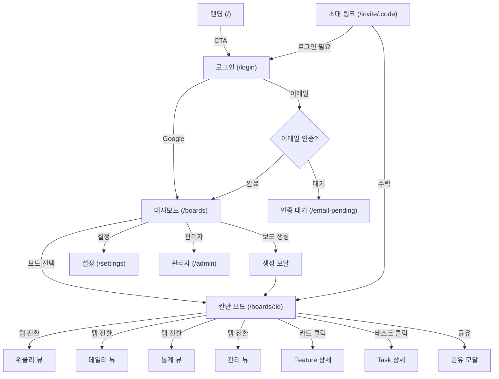

# Wireframe - 화면 구조

## 페이지별 컴포넌트 계층

### 1. 랜딩 페이지 (`/`)

```
LandingPage
├── Header (nav, logo, CTA buttons)
├── Hero Section
│   ├── QuantumScene (Three.js 3D 배경)
│   └── Hero Text + CTA
├── Features Section
│   ├── Feature Card × N
│   └── Diagrams (인터랙티브 다이어그램)
├── BridgeScene (Three.js 3D 시각화)
├── Pricing Section
│   ├── Standard Plan Card
│   └── Premium Plan Card
├── Footer
│   ├── Terms Link
│   └── Privacy Link
```

### 2. 로그인/회원가입 (`/login`, `/signup`)

```
LoginPage
├── Glass Container
│   ├── Logo
│   ├── Tab (로그인 | 회원가입)
│   ├── Form
│   │   ├── Email Input
│   │   ├── Password Input
│   │   ├── Name Input (회원가입만)
│   │   └── Submit Button
│   ├── Google OAuth Button
│   ├── Forgot Password Link
│   └── Terms Agreement (회원가입)
```

### 3. 대시보드 (`/boards`)

```
Dashboard
├── Sidebar
│   ├── Logo
│   ├── Navigation
│   │   ├── All Boards
│   │   └── Starred Boards
│   └── User Menu
├── Main Content
│   ├── Header (검색, 정렬)
│   ├── Board Grid
│   │   └── BoardCard × N
│   │       ├── Board Name
│   │       ├── Member Count
│   │       ├── Task Count
│   │       ├── Tier Badge
│   │       └── Star Toggle
│   └── CreateBoardModal (+ 버튼)
│       ├── Name Input
│       └── Description Input
```

### 4. 칸반 보드 (`/boards/:boardId`)

```
KanbanBoardPage
├── BoardHeader
│   ├── Board Name
│   ├── Member Avatars
│   ├── Milestone Selector
│   ├── Filter Button → FilterModal
│   ├── Share Button → ShareBoardModal
│   ├── Settings Button
│   └── TrialBanner (Trial 상태일 때)
├── View Tabs
│   ├── 칸반 (기본)
│   ├── 위클리 스케줄 (Premium)
│   ├── 데일리 스케줄 (Premium)
│   ├── 통계 (Premium)
│   └── 관리
├── [칸반 뷰]
│   ├── KanbanBlock (Feature) [고정]
│   │   ├── Block Header (이름, 카드 수)
│   │   ├── FeatureCard × N
│   │   │   ├── Title
│   │   │   ├── Priority Badge
│   │   │   ├── Progress Bar
│   │   │   ├── Assignee Avatar
│   │   │   ├── Tags
│   │   │   └── Due Date
│   │   └── [+ Feature] Button → AddFeatureModal
│   ├── KanbanBlock (Task) [고정]
│   │   ├── Block Header
│   │   └── DraggableCard (KanbanCard) × N
│   │       ├── Feature Color Bar
│   │       ├── Title
│   │       ├── Tags
│   │       ├── Checklist Progress
│   │       └── Assignee Avatar
│   ├── KanbanBlock (Custom) × N [드래그 가능]
│   │   ├── Block Header (이름, 색상, 편집)
│   │   └── DraggableCard × N
│   ├── KanbanBlock (Done) [고정]
│   │   ├── Block Header
│   │   └── DraggableCard × N
│   └── [+ Block] Button → AddBlockModal
├── [위클리 스케줄 뷰]
│   └── WeeklyScheduleView
│       ├── Toolbar (일/주 토글, 날짜 범위, 오늘 버튼)
│       ├── Milestone Filter
│       ├── Feature Rows (접기/펼치기)
│       │   └── Task Gantt Bars (리사이즈/이동 가능)
│       └── Date Grid
├── [데일리 스케줄 뷰]
│   └── DailyScheduleView
│       ├── Date Picker
│       ├── Member Columns
│       │   └── Time Grid (30분 단위)
│       │       └── ScheduleBlock × N (드래그/리사이즈)
│       └── ScheduleDetailPanel
├── [통계 뷰]
│   └── StatisticsView
│       ├── Summary Cards
│       ├── Charts (Recharts)
│       └── Member/Feature/Tag Breakdowns
└── [관리 뷰]
    └── ManagementView
        ├── Milestone Health
        ├── Team Productivity
        └── Delayed Items
```

### 5. 모달 컴포넌트

#### Feature 상세 모달
```
FeatureDetailModal
├── Header (제목 편집, 닫기)
├── Meta Section
│   ├── Status Badge
│   ├── Priority Selector
│   ├── Assignee Selector
│   ├── Due Date Picker
│   └── Tags
├── Description (마크다운 편집)
├── Progress Bar
├── Task List
│   ├── Task Item × N (상태, 제목, 담당자)
│   └── [+ Task] Input
└── Activity Log
```

#### Task 상세 모달
```
TaskDetailModal
├── Header (제목 편집, Feature 링크)
├── Meta Section
│   ├── Block Location
│   ├── Assignee Selector
│   ├── Start Date / Due Date
│   ├── Estimated Minutes
│   ├── Weight Level
│   └── Tags
├── Description
├── Checklist Section
│   ├── Progress Bar
│   ├── ChecklistItem × N
│   │   ├── Checkbox
│   │   ├── Title
│   │   ├── Assignee
│   │   └── Dates
│   └── [+ Item] Input
└── Activity Log
```

#### 기타 모달
```
ShareBoardModal          # 멤버 초대, 역할 관리, 초대 링크
InviteLinkModal          # 초대 링크 생성/관리
FilterModal              # 필터 (담당자, 태그, 우선순위, 블록)
AddFeatureModal          # 새 Feature 생성
AddBlockModal            # 새 커스텀 블록 생성
SubscriptionModal        # 구독 상태/관리
UpgradeModal             # Premium 업그레이드
MilestoneModal           # 마일스톤 생성/편집
WeightLevelSettingsModal # 가중치 레벨 설정
ScheduleSettingsModal    # 스케줄 설정 (근무시간 등)
ActivityLogModal         # 활동 로그 전체
AlertModal               # 확인/경고 다이얼로그
```

---

## 주요 UI 컴포넌트

### Shadcn/Radix 기반 컴포넌트 (50+)

| 카테고리 | 컴포넌트 |
|----------|----------|
| **입력** | Button, Input, Textarea, Select, Checkbox, Radio, Switch, Toggle, Slider |
| **오버레이** | Dialog, Drawer, Alert Dialog, Popover, Dropdown Menu |
| **탐색** | Tabs, Accordion, Pagination, Carousel |
| **표시** | Card, Badge, Label, Progress, Skeleton |
| **폼** | Form, Calendar, Date Picker |
| **레이아웃** | Resizable Panels, Separator |
| **피드백** | Sonner (Toast), Command Menu (cmdk) |

### 커스텀 컴포넌트

| 컴포넌트 | 설명 |
|----------|------|
| `KanbanBlock` | 칸반 블록 (고정/커스텀) |
| `KanbanCard` | 태스크 카드 |
| `FeatureCard` | 피쳐 카드 |
| `DraggableCard` | DnD 래퍼 카드 |
| `ScheduleBlock` | 데일리 스케줄 타임블록 |
| `TrialBanner` | Trial 상태 알림 배너 |
| `ErrorBoundary` | 에러 바운더리 |
| `ImageWithFallback` | 이미지 폴백 처리 |

---

## 화면 간 이동 흐름



---

## 반응형 브레이크포인트

| 브레이크포인트 | 크기 | 레이아웃 |
|---------------|------|----------|
| Mobile | < 768px | 단일 컬럼, 사이드바 숨김 |
| Tablet | 768px - 1024px | 2 컬럼 그리드 |
| Desktop | 1024px - 1440px | 전체 레이아웃 |
| Wide | > 1440px | 확장 레이아웃 |
