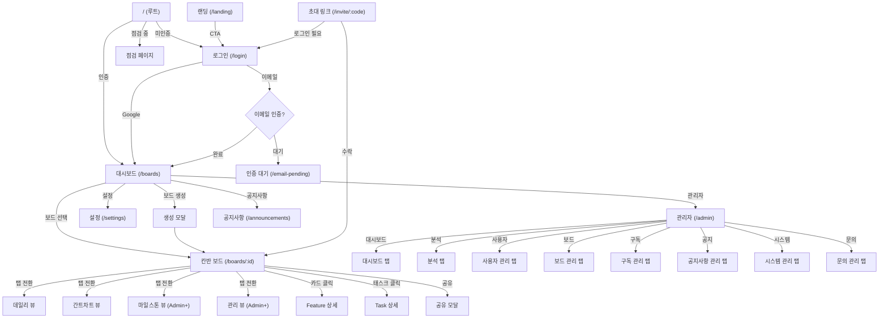

# Wireframe - 화면 구조

## 페이지별 컴포넌트 계층

### 1. 랜딩 페이지 (`/landing`)

```
LandingPage
├── Header (nav, logo, CTA buttons)
├── Hero Section
│   ├── QuantumScene (Three.js 3D 배경)
│   └── Hero Text + CTA
├── Features Section
│   ├── Feature Card × N
│   └── Diagrams (인터랙티브 다이어그램)
├── BridgeScene (Three.js 3D 시각화)
├── Pricing Section
│   ├── Standard Plan Card
│   └── Premium Plan Card
├── Footer
│   ├── Terms Link
│   └── Privacy Link
```

### 2. 로그인/회원가입 (`/login`, `/signup`)

```
LoginPage
├── Glass Container
│   ├── Logo
│   ├── Tab (로그인 | 회원가입)
│   ├── Form
│   │   ├── Email Input
│   │   ├── Password Input
│   │   ├── Name Input (회원가입만)
│   │   └── Submit Button
│   ├── Google OAuth Button
│   ├── Forgot Password Link
│   └── Terms Agreement (회원가입)
```

### 3. 대시보드 (`/boards`)

```
Dashboard
├── Sidebar
│   ├── Logo
│   ├── Navigation
│   │   ├── All Boards
│   │   └── Starred Boards
│   └── User Menu
├── Main Content
│   ├── Header (검색, 정렬)
│   ├── Board Grid
│   │   └── BoardCard × N
│   │       ├── Board Name
│   │       ├── Member Count
│   │       ├── Task Count
│   │       ├── Tier Badge
│   │       └── Star Toggle
│   └── CreateBoardModal (+ 버튼)
│       ├── Name Input
│       └── Description Input
```

### 4. 칸반 보드 (`/boards/:boardId`)

```
KanbanBoardPage
├── AnnouncementDisplay (공지사항 배너/팝업) [v1.3.0]
│   ├── Rolling Banner (자동 5초 롤링)
│   │   ├── Megaphone Icon + 배너 번호 (N/M)
│   │   ├── Prev/Next Navigation Buttons
│   │   ├── Banner Title + Content Text
│   │   ├── Dismiss Button (X)
│   │   └── Progress Bar (하단)
│   └── Popup Modal (팝업형 공지)
│       ├── Info Icon + Title
│       ├── Content (whitespace-pre-wrap)
│       ├── "오늘 하루 보지 않기" Button
│       └── "확인" Button
├── BoardHeader
│   ├── Board Name
│   ├── Member Avatars
│   ├── Milestone Selector
│   ├── Filter Button → FilterModal
│   ├── NotificationDropdown (알림 벨 + 읽지않은 수 뱃지) [v1.3.0 수정]
│   │   ├── Trigger: Bell Icon + Unread Badge
│   │   ├── SlackSettingsPanel (Slack 연동) [v1.3.0]
│   │   │   ├── [미연결 상태] "Slack으로 멘션 알림 받기" + 연결 버튼
│   │   │   ├── [연결됨 상태] 상태 표시 (연결됨/비활성) + 채널명 + 설정 버튼
│   │   │   └── [편집 모드]
│   │   │       ├── Webhook URL Input
│   │   │       ├── Channel Name Input (선택)
│   │   │       ├── 활성화 Checkbox
│   │   │       ├── 테스트 Button
│   │   │       ├── 저장 Button
│   │   │       ├── 연결 해제 Button
│   │   │       └── Webhook 설정 안내 텍스트
│   │   ├── NotificationPreferencesPanel (알림 설정) [v1.4.0]
│   │   │   ├── Toggle Header (Settings Icon + "알림 설정" + Expand/Collapse)
│   │   │   ├── Column Headers: [인앱] [Slack]
│   │   │   └── Toggle Rows × 3 (타입별 인앱/Slack 토글)
│   │   │       ├── "댓글 멘션" - @멘션으로 태그되었을 때
│   │   │       ├── "체크리스트 배정" - 체크리스트 항목에 배정되었을 때
│   │   │       └── "태스크 댓글" - 관련 태스크에 새 댓글이 달렸을 때
│   │   ├── Tabs: 알림 | 활동
│   │   ├── [알림 탭]
│   │   │   ├── NotificationItem × N
│   │   │   │   ├── Sender Avatar
│   │   │   │   ├── Title + Message
│   │   │   │   ├── Timestamp
│   │   │   │   └── Read/Unread Indicator
│   │   │   ├── Mark All Read Button
│   │   │   └── Load More (cursor 기반)
│   │   └── [활동 탭]
│   │       └── ActivityLog List
│   ├── Share Button → ShareBoardModal
│   ├── Settings Button
│   └── TrialBanner (Trial 상태일 때)
├── View Tabs
│   ├── 칸반 (기본)
│   ├── 데일리 스케줄 (Premium)
│   ├── 간트차트 (Premium)
│   ├── 마일스톤 (Premium, Admin+ 전용)
│   └── 관리 (Admin+ 전용)
├── [칸반 뷰]
│   ├── KanbanBlock (Feature) [고정]
│   │   ├── Block Header (이름, 카드 수)
│   │   ├── FeatureCard × N
│   │   │   ├── Title
│   │   │   ├── Priority Badge
│   │   │   ├── Progress Bar
│   │   │   ├── Assignee Avatar
│   │   │   ├── Tags
│   │   │   └── Due Date
│   │   └── [+ Feature] Button → AddFeatureModal
│   ├── KanbanBlock (Task) [고정]
│   │   ├── Block Header
│   │   └── DraggableCard (KanbanCard) × N
│   │       ├── Feature Color Bar
│   │       ├── Title
│   │       ├── Tags
│   │       ├── Checklist Progress
│   │       └── Assignee Avatar
│   ├── KanbanBlock (Custom) × N [드래그 가능]
│   │   ├── Block Header (이름, 색상, 편집)
│   │   └── DraggableCard × N
│   ├── KanbanBlock (Done) [고정]
│   │   ├── Block Header
│   │   └── DraggableCard × N
│   └── [+ Block] Button → AddBlockModal
├── [위클리 스케줄 뷰]
│   └── WeeklyScheduleView
│       ├── Toolbar (일/주 토글, 날짜 범위, 오늘 버튼)
│       ├── Milestone Filter
│       ├── Feature Rows (접기/펼치기)
│       │   └── Task Gantt Bars (리사이즈/이동 가능)
│       ├── Date Grid
│       └── WeeklySummaryModal (주간 요약 버튼 → 모달)
├── [데일리 스케줄 뷰] [v1.3.0 수정]
│   └── DailyScheduleView
│       ├── Sub Tabs: 타임블록 | 체크리스트 [v1.3.0]
│       ├── View Mode Toggle: 일간(day) | 주간(week)
│       ├── Date Picker (← 날짜 →)
│       ├── [일간(day) - 타임블록 탭]
│       │   ├── Daily Checklist Summary Row (체크리스트 요약)
│       │   ├── Member Columns
│       │   │   └── Time Grid (30분 단위)
│       │   │       └── ScheduleBlock × N (드래그/리사이즈)
│       │   └── ScheduleDetailPanel (우측 패널) [v1.3.0]
│       │       ├── Header ("타임블록 상세" + 닫기)
│       │       ├── Time/Block Info (시작~종료, 소요시간 또는 블록번호)
│       │       ├── Date Info
│       │       ├── Feature Section (클릭 시 상세보기)
│       │       │   ├── Feature Color Dot
│       │       │   └── Feature Title
│       │       ├── Task Section (클릭 시 상세보기)
│       │       │   └── Task Title
│       │       ├── Task Checklist Section
│       │       │   ├── Progress (N/M 완료)
│       │       │   └── ChecklistItem × N (체크 토글 가능)
│       │       │       ├── Checkbox (optimistic update)
│       │       │       ├── Title
│       │       │       └── "(현재)" Indicator
│       │       └── Delete Button (하단 고정)
│       ├── [일간(day) - 체크리스트 탭]
│       │   └── DailyChecklistView (멤버별 체크리스트 현황)
│       ├── [주간(week) 뷰] [v1.3.0]
│       │   ├── Week Range Display (← 주간 →)
│       │   ├── Member Summary Cards (색상 코딩)
│       │   │   └── Day Columns × 7
│       │   │       └── Block Count Summary
│       │   └── API: 7개 호출 → 1개 통합 호출
│       └── Settings Button → ScheduleSettingsModal
├── [통계 뷰]
│   └── StatisticsView
│       ├── Summary Cards
│       ├── Charts (Recharts)
│       └── Member/Feature/Tag Breakdowns
└── [관리 뷰]
    └── ManagementView
        ├── Milestone Health
        ├── Team Productivity
        └── Delayed Items
```

### 5. 관리자 페이지 (`/admin/*`) [v1.3.0]

```
AdminRoute (보호 래퍼) [v1.3.0]
├── 미인증 → /login 리다이렉트
├── 비관리자 → /boards 리다이렉트
└── 관리자 → AdminPage 렌더링

AdminPage
├── Header
│   ├── "보드로 돌아가기" Link (← /boards)
│   └── "Admin" Title
├── Sidebar Navigation
│   ├── 대시보드 (LayoutDashboard)
│   ├── 분석 / 리포트 (BarChart3)
│   ├── 사용자 관리 (Users)
│   ├── 보드 관리 (Folder)
│   ├── 구독 관리 (CreditCard)
│   ├── 공지사항 (Megaphone)
│   ├── 시스템 관리 (Shield)
│   └── 문의 관리 (MessageSquare)
├── [대시보드 탭] AdminDashboardTab
│   ├── Stats Grid (3 columns)
│   │   ├── 전체 사용자 (총 / 활성)
│   │   ├── 전체 보드
│   │   └── 활성 구독
│   └── 보드 티어 분포 (Progress Bar × 3: TRIAL, STANDARD, PREMIUM)
├── [분석 / 리포트 탭] AdminAnalyticsTab
│   ├── Period Selector (7/14/30/90일)
│   ├── 가입자 추이 Line Chart
│   ├── 활성 사용자 (DAU) Bar Chart
│   └── 전환율 통계
├── [사용자 관리 탭] AdminUsersTab
│   ├── Search Bar (이름/이메일)
│   ├── User Table
│   │   └── Row × N
│   │       ├── Avatar + Name
│   │       ├── Email
│   │       ├── System Role Badge
│   │       ├── Created Date
│   │       └── Click → AdminUserDetailModal
│   ├── Pagination
│   └── AdminUserDetailModal
│       ├── User Info (이름, 이메일, 프로필 이미지)
│       ├── Role Management (USER / TESTER / ADMIN 변경)
│       ├── Account Actions (계정 비활성화, 비밀번호 초기화 등)
│       └── User's Board List
├── [보드 관리 탭] AdminBoardsTab
│   ├── Search Bar + Tier Filter (FREE/STANDARD/PREMIUM/ENTERPRISE)
│   ├── Board Table
│   │   └── Row × N
│   │       ├── Board Name
│   │       ├── Tier Badge
│   │       ├── Member Count
│   │       ├── Task Count
│   │       ├── Created Date
│   │       └── Click → AdminBoardDetailModal
│   ├── Pagination
│   └── AdminBoardDetailModal
│       ├── Board Info (이름, 설명, 생성일)
│       ├── Tier Management (FREE/TRIAL/STANDARD/PREMIUM/ENTERPRISE 변경)
│       ├── Member List (역할 뱃지: Owner/Admin/Member/Viewer)
│       └── Board Delete Button
├── [구독 관리 탭] AdminSubscriptionsTab
│   ├── Subscription Table
│   │   └── Row × N
│   │       ├── Board Name
│   │       ├── Tier Badge
│   │       ├── Status Badge (ACTIVE/CANCELLED/EXPIRED/PENDING)
│   │       ├── Start Date / End Date
│   │       └── Amount
│   └── Pagination
├── [공지사항 탭] AdminAnnouncementsTab
│   ├── "+ 새 공지사항" Button
│   ├── Announcement List
│   │   └── Row × N
│   │       ├── Type Badge (BANNER / POPUP)
│   │       ├── Title
│   │       ├── Active/Inactive State
│   │       ├── Created Date
│   │       ├── Edit Button → AnnouncementFormModal
│   │       └── Delete Button
│   └── AnnouncementFormModal (생성/수정)
│       ├── Type Select (BANNER / POPUP)
│       ├── Title Input
│       ├── Content Textarea
│       ├── Priority Input
│       ├── Start/End DateTime Picker
│       ├── Active Toggle
│       └── Save Button
├── [시스템 관리 탭] AdminSystemTab
│   ├── Maintenance Status Display
│   │   ├── Current Status (점검 중 / 정상)
│   │   └── Started At / Estimated End
│   ├── Maintenance Form
│   │   ├── Message Input
│   │   ├── Estimated End DateTime Picker
│   │   ├── "점검 시작" Button
│   │   └── "점검 해제" Button
│   └── Status Refresh Button
└── [문의 관리 탭] AdminInquiriesTab
    ├── Status Filter (전체/대기중/진행중/해결됨/종료)
    ├── Inquiry List
    │   └── Row × N
    │       ├── Title
    │       ├── User Info
    │       ├── Status Badge (PENDING/IN_PROGRESS/RESOLVED/CLOSED)
    │       ├── Reply Count
    │       ├── Created Date
    │       └── Click → Detail View
    ├── Pagination
    └── Detail View (선택 시)
        ├── Status Badge + Date
        ├── Title + Content
        ├── Attachments
        ├── Reply Thread (Admin/User 구분)
        ├── Status Change Buttons
        └── Admin Reply Input + Send Button
```

### 6. 공지사항 페이지 (`/announcements`) [v1.3.0]

```
AnnouncementsPage
├── Header
│   ├── Back Button (← 이전 페이지)
│   ├── "공지사항" Title
│   └── Subtitle
├── Announcement List
│   └── AnnouncementCard × N
│       ├── Type Icon (Megaphone / AlertCircle / Info)
│       ├── Type Badge (배너 / 팝업)
│       ├── Priority Badge ("중요", priority > 0)
│       ├── Title
│       ├── Content Preview (2줄 제한)
│       ├── Date
│       └── Click → Detail Modal
└── Detail Modal
    ├── Type Badge + Date
    ├── Title
    ├── Content (whitespace-pre-wrap)
    └── "확인" Button
```

### 7. 시스템 점검 페이지 [v1.3.0]

```
MaintenancePage (전체 화면)
├── Background Effects
│   ├── Gradient Orbs (animate-pulse)
│   └── Grid Pattern
├── Animated Icon Container
│   ├── Outer Ring (SVG Progress Circle)
│   ├── Inner Icon (Settings, 8초 회전 애니메이션)
│   └── Sparkle Effects
├── Title ("시스템 점검 중")
├── Message (커스텀 또는 기본 메시지)
├── Countdown Timer (estimated_end_at 기반)
│   ├── Hours : Minutes : Seconds (카드형)
│   └── "예상 완료: M월 d일 HH:mm"
├── "지금 확인하기" Button (수동 재시도)
├── Auto-refresh Notice (30초마다 자동 확인)
└── Progress Bar (점검 진행률 %)
```

### 8. 모달 컴포넌트

#### Feature 상세 모달
```
FeatureDetailModal
├── Header (제목 편집, 닫기)
├── Meta Section
│   ├── Status Badge
│   ├── Priority Selector
│   ├── Assignee Selector
│   ├── Due Date Picker
│   └── Tags
├── Description (마크다운 편집)
├── Progress Bar
├── Task List
│   ├── Task Item × N (상태, 제목, 담당자)
│   └── [+ Task] Input
└── Activity Log
```

#### Task 상세 모달
```
TaskDetailModal
├── Header (제목 편집, Feature 링크)
├── Meta Section
│   ├── Block Location
│   ├── Assignee Selector
│   ├── Start Date / Due Date
│   ├── Estimated Minutes
│   ├── Weight Level
│   └── Tags
├── Description
├── Checklist Section
│   ├── Progress Bar
│   ├── ChecklistItem × N
│   │   ├── Checkbox
│   │   ├── Title
│   │   ├── Assignee
│   │   └── Dates
│   └── [+ Item] Input
├── CommentPanel
│   ├── Comment List
│   │   └── CommentItem × N
│   │       ├── Author Avatar + Name
│   │       ├── Content (멘션 하이라이트)
│   │       ├── Attachments (이미지 첨부파일)
│   │       │   └── Image Thumbnail × N (클릭 시 확대)
│   │       ├── Timestamp
│   │       └── Edit/Delete (본인만)
│   └── Comment Input
│       ├── Textarea (@ 멘션 지원)
│       ├── File Attach Button (이미지 5개 제한)
│       └── Send Button
└── Activity Log
```

#### InquiryModal [v1.3.0]
```
InquiryModal
├── Header (MessageSquare Icon + "문의하기" / "문의 상세", 닫기)
├── Tabs: 새 문의 | 내 문의 내역
├── [새 문의 탭]
│   ├── Title Input (200자 제한)
│   ├── Content Textarea (5000자 제한)
│   ├── File Upload Section
│   │   ├── "파일 첨부" Button (이미지 5개 제한)
│   │   └── Attached File List
│   │       └── FileItem × N (파일명 + 삭제)
│   ├── "문의 보내기" Submit Button
│   └── Success State (체크 아이콘 + 접수 완료 메시지)
├── [내 문의 내역 탭]
│   ├── InquiryHistoryView
│   │   └── InquiryCard × N
│   │       ├── Title
│   │       ├── Date + Reply Count
│   │       └── Status Badge (대기중/진행중/해결됨/종료)
│   └── Empty State ("아직 문의 내역이 없습니다")
└── [문의 상세 뷰] (내역에서 선택 시)
    ├── Back Button (← 목록으로)
    ├── Status Badge + Date
    ├── Title + Content
    ├── Attachments (다운로드 링크)
    ├── Reply Thread
    │   └── ReplyItem × N
    │       ├── Avatar + Name
    │       ├── Admin Badge (관리자인 경우)
    │       ├── Date
    │       └── Content
    └── User Reply Input (종료되지 않은 경우만)
        ├── Textarea (5000자 제한)
        └── "답변 보내기" Button
```

#### MilestoneOnboardingModal [v1.3.0]
```
MilestoneOnboardingModal
├── Header
│   ├── Flag Icon + "마일스톤으로 프로젝트를 관리하세요"
│   ├── Subtitle (Feature 마일스톤 설명)
│   └── Close Button
├── Preview Section (시각적 샘플)
│   ├── 샘플 마일스톤 카드
│   │   ├── Flag Icon + Milestone Name + Date Range
│   │   ├── Progress Bar (65%)
│   │   └── Feature List (색상 Dot + 이름 + 상태)
│   └── "미리보기" Label
├── Feature Benefits (3개)
│   ├── Target Icon: "Feature를 묶어 목표 관리"
│   ├── Calendar Icon: "일정 기반 진행률 추적"
│   └── BarChart Icon: "번다운 차트 & 병목 분석"
└── Footer
    ├── "나중에" Button
    └── "첫 마일스톤 만들기" Primary Button (→ ArrowRight)
```

#### 기타 모달
```
ShareBoardModal          # 멤버 초대, 역할 관리, 초대 링크, 담당자 색상
InviteLinkModal          # 초대 링크 생성/관리
FilterModal              # 필터 (담당자, 태그, 우선순위, 블록)
AddFeatureModal          # 새 Feature 생성
AddBlockModal            # 새 커스텀 블록 생성
SubscriptionModal        # 구독 상태/관리
UpgradeModal             # Premium 업그레이드
MilestoneModal           # 마일스톤 생성/편집
WeightLevelSettingsModal # 가중치 레벨 설정
ScheduleSettingsModal    # 스케줄 설정 (근무시간 등)
ActivityLogModal         # 활동 로그 전체
AlertModal               # 확인/경고 다이얼로그
WeeklySummaryModal       # 주간 타임블록/댓글 요약
ActionChoiceModal        # 액션 선택 (기존 항목 선택 vs 새로 만들기)
```

---

## 주요 UI 컴포넌트

### Shadcn/Radix 기반 컴포넌트 (45 컴포넌트)

| 카테고리 | 컴포넌트 |
|----------|----------|
| **입력** | Button, Input, Textarea, Select, Checkbox, Radio, Switch, Toggle, Slider |
| **오버레이** | Dialog, Drawer, Alert Dialog, Popover, Dropdown Menu |
| **탐색** | Tabs, Accordion, Pagination, Carousel |
| **표시** | Card, Badge, Label, Progress, Skeleton |
| **폼** | Form, Calendar, Date Picker |
| **레이아웃** | Resizable Panels, Separator |
| **피드백** | Sonner (Toast), Command Menu (cmdk) |

### 커스텀 컴포넌트

| 컴포넌트 | 설명 |
|----------|------|
| `KanbanBlock` | 칸반 블록 (고정/커스텀) |
| `KanbanCard` | 태스크 카드 |
| `FeatureCard` | 피쳐 카드 |
| `DraggableCard` | DnD 래퍼 카드 |
| `CommentPanel` | 태스크 댓글 패널 (멘션 지원) |
| `NotificationDropdown` | 알림/활동 드롭다운 + Slack 연동 |
| `ScheduleBlock` | 데일리 스케줄 타임블록 |
| `ScheduleDetailPanel` | 타임블록 상세 패널 (우측 슬라이드) [v1.3.0] |
| `NotificationPreferencesPanel` | 알림 타입별 인앱/Slack 토글 설정 [v1.4.0] |
| `SlackSettingsPanel` | Slack Webhook 설정 패널 [v1.3.0] |
| `AnnouncementDisplay` | 공지사항 롤링 배너 + 팝업 [v1.3.0] |
| `InquiryModal` | 문의하기 모달 (접수/내역/상세) [v1.3.0] |
| `MilestoneOnboardingModal` | 마일스톤 온보딩 안내 모달 [v1.3.0] |
| `MaintenancePage` | 시스템 점검 페이지 [v1.3.0] |
| `AdminRoute` | 관리자 전용 라우트 보호 래퍼 [v1.3.0] |
| `TrialBanner` | Trial 상태 알림 배너 |
| `ErrorBoundary` | 에러 바운더리 |
| `ImageWithFallback` | 이미지 폴백 처리 |
| `FeatureChipSelector` | Feature 칩 선택기 (Task 생성 시 Feature 선택) |

### 관리자 컴포넌트 [v1.3.0]

| 컴포넌트 | 설명 |
|----------|------|
| `AdminDashboardTab` | 관리자 대시보드 (통계 카드, 티어 분포) |
| `AdminUsersTab` | 사용자 목록 + 검색 + 페이지네이션 |
| `AdminUserDetailModal` | 사용자 상세 (역할 변경, 보드 목록) |
| `AdminBoardsTab` | 보드 목록 + 검색 + 티어 필터 |
| `AdminBoardDetailModal` | 보드 상세 (티어 변경, 멤버 목록, 삭제) |
| `AdminSubscriptionsTab` | 구독 목록 + 상태/티어 표시 |
| `AdminAnalyticsTab` | 분석 (가입 추이, DAU, 전환율 차트) |
| `AdminAnnouncementsTab` | 공지사항 CRUD (BANNER/POPUP 타입) |
| `AdminInquiriesTab` | 문의 관리 (목록, 상세, 관리자 답변) |
| `AdminSystemTab` | 시스템 설정 (점검 모드 on/off) |

---

## 화면 간 이동 흐름



---

## 반응형 브레이크포인트

| 브레이크포인트 | 크기 | 레이아웃 |
|---------------|------|----------|
| Mobile | < 768px | 단일 컬럼, 사이드바 숨김 |
| Tablet | 768px - 1024px | 2 컬럼 그리드 |
| Desktop | 1024px - 1440px | 전체 레이아웃 |
| Wide | > 1440px | 확장 레이아웃 |

---

## v1.4.0 변경 요약

### 신규 컴포넌트
- `NotificationPreferencesPanel` - 알림 타입별 인앱/Slack 토글 (NotificationDropdown 내)

### 수정된 컴포넌트
- `NotificationDropdown` - NotificationPreferencesPanel 통합 (알림 설정 접이식 패널)

---

## v1.3.0 변경 요약

### 신규 컴포넌트
- `SlackSettingsPanel` - Slack Webhook 연동 설정 (NotificationDropdown 내)
- `AnnouncementDisplay` - 시스템 공지사항 롤링 배너 + 팝업 모달
- `InquiryModal` - 사용자 문의 접수/내역/상세 시스템
- `MilestoneOnboardingModal` - 마일스톤 첫 사용 안내
- `MaintenancePage` - 시스템 점검 전체 화면
- `AdminRoute` - 관리자 전용 라우트 보호 래퍼
- `ScheduleDetailPanel` - 타임블록 상세 우측 패널
- `AdminPage` + 10개 Admin 하위 컴포넌트

### 신규 페이지
- `/admin` - 관리자 대시보드 (8개 탭)
- `/announcements` - 공지사항 목록/상세 조회

### 수정된 컴포넌트
- `DailyScheduleView` - 서브탭(타임블록/체크리스트), 주간 뷰, API 통합
- `NotificationDropdown` - SlackSettingsPanel 통합
- `KanbanBoardPage` - AnnouncementDisplay 배너 추가
